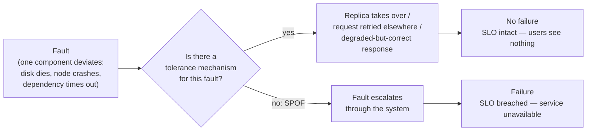

## Overview

Reliability isn't a badge a system either has or doesn't have — it's the property of *continuing to work correctly even when specific things go wrong*. That definition is useless until you fill in both blanks: "correctly" means the behavior your users actually depend on (right answers, acceptable latency, no unauthorized access, no data loss), and "things go wrong" means the concrete set of faults you've decided to survive. A system that tolerates a dead disk but not a dead datacenter is not unreliable; it's reliable *within a stated fault model*, and the engineering work is making that model explicit rather than accidental.

## Defining Reliability Precisely

Before you can build for reliability you have to answer two questions for your system specifically:

1. **What does "working correctly" mean here?** Typically some combination of: the application does what the user expected, it tolerates users making mistakes or using it in unexpected ways, its performance is good enough under the expected load and data volume, and it prevents unauthorized access and abuse. For most services this gets encoded as an **SLO** — an explicit target such as "99.9% of requests succeed with p99 latency under 300 ms, measured over a rolling 30 days."
2. **Which things going wrong are in scope?** Disk failure, node crash, availability-zone loss, a dependency returning garbage, an operator deploying a bad config. Each one you claim to tolerate is a design commitment with a cost.

The SLO matters because it converts a vague aspiration into a measurable line. Without it, "the system is down" is a matter of opinion; with it, "we breached the SLO" is a fact, and you can reason about how much unreliability budget you have left before you should stop shipping features and start fixing things.

## Fault vs. Failure

This is the core distinction, and it's worth being pedantic about:

- A **fault** is one component deviating from its spec — a hard drive malfunctioning, a machine crashing, an external service having an outage.
- A **failure** is the system *as a whole* ceasing to provide the required service to users — in other words, missing the SLO.

The confusing part is that they're the same event viewed at different levels. If a hard drive stops working, that drive has failed. If your system *is* that one drive, the system has failed too. But if your system is six drives with the data replicated across them, that same event is merely a fault from the system's point of view — something it absorbs without any user noticing.

**Fault tolerance is exactly the gap between those two words.** A system is fault-tolerant if it keeps serving users in spite of certain faults occurring. Any component whose fault escalates directly into a system-wide failure — no replica, no fallback, no way to route around it — is a **single point of failure (SPOF)**, and finding your SPOFs is largely a matter of walking each component and asking "if this deviates right now, does a user notice?"

Note that the fault happens either way. You do not prevent faults; you prevent them from *propagating*. And tolerance is always bounded to a certain number of a certain type of fault — two disks, one node out of three, one AZ out of three. It makes no sense to tolerate an unbounded number: if every node is gone, there is nothing left to serve from.

Counterintuitively, once you have fault-tolerance machinery, it's often correct to *increase* the fault rate deliberately — killing processes at random, severing network links, filling disks. This is **fault injection**, and the discipline built around it is **chaos engineering**. The reasoning is simple: many critical bugs live in error-handling paths, and error-handling paths that never run in production are error-handling paths nobody has tested. A failover you've triggered a thousand times on purpose is a failover you can trust at 3 a.m.

One exception to "prefer tolerating over preventing": security. If an attacker exfiltrates sensitive data, there is no cure to apply afterward — that fault has to be prevented, not absorbed.

## Hardware Faults and the Limits of Redundancy

Hardware is the failure mode everyone thinks of first, and for good reason — the base rates are not small:

- 2%–5% of magnetic hard drives fail per year. In a cluster with 10,000 disks, that's roughly **one disk failure per day**, every day, forever.
- 0.5%–1% of SSDs fail per year, plus uncorrectable bit errors at roughly one per drive per year even on nearly-new drives.
- Roughly 1 in 1,000 machines has a CPU core that occasionally computes the *wrong result* — sometimes crashing, sometimes just silently returning garbage.
- More than 1% of machines hit an uncorrectable RAM error per year even with ECC memory.
- Entire datacenters go dark from power outages, network misconfiguration, fire, or flood.

The historical response was **redundancy at the component level**: RAID across disks, dual power supplies, hot-swappable CPUs, batteries and diesel generators in the building. This works, and it can keep a single machine up for years — but it rests on an assumption that quietly weakens as you grow: that component faults are **independent**. In practice they're correlated. Drives from the same manufacturing batch, installed the same day, running the same workload, fail on a schedule that looks a lot less random than the datasheet suggests. Whole racks and whole datacenters go down together.

The real shift is one of scale. At ten machines, a hardware fault is an incident: something rare happened, a human replaces the part, life continues. At ten thousand machines, hardware faults are a constant background rate — part of normal operation, not an exception to it. At that point you cannot staff your way out of it, and component redundancy alone stops being enough: you need **software that tolerates whole machines disappearing**. This is why cloud systems care relatively little about the reliability of any individual instance and a great deal about spreading work across availability zones (which exist precisely to tell you which resources share a physical failure domain).

Designing for whole-machine loss buys an operational bonus that's easy to overlook: a single-server system needs planned downtime to reboot for an OS patch, while a multi-node fault-tolerant system can be patched one node at a time with no user-visible interruption — a **rolling upgrade**. The same mechanism that survives an unplanned crash also makes planned maintenance free.

Once you commit to tolerating machine loss, you inherit a new class of problem — nodes that are slow rather than dead, clocks that disagree, processes that pause and wake up believing no time has passed. Those are covered in [The Trouble with Distributed Systems](distributed-systems-partial-failures); the point here is that they are the *price* of moving fault tolerance from the hardware layer to the software layer, and at sufficient scale you pay it whether you like it or not.

## Software Faults: Correlated by Construction

Hardware faults are at least mostly independent — one disk dying tells you little about the disk next to it. Software faults are the opposite: **systematic and highly correlated**, because every node is running the same binary with the same bug. Redundancy is no defense whatsoever. Three replicas of a service with a bug are three replicas that will hit it in the same circumstances, at the same moment, on the same input.

Real examples of the shape:

- The June 30, 2012 **leap second** caused Java applications worldwide to hang simultaneously, via a Linux kernel bug — a fault triggered by a value in the *environment*, hitting every machine at once.
- A firmware bug caused certain SSD models to fail unrecoverably after **exactly 32,768 hours** of operation — drives bought together, powered on together, dying together, well inside their expected life.
- A **runaway process** exhausting a shared resource — CPU, memory, disk, file descriptors, threads — such as a client library bug generating far more requests than anyone anticipated.
- A dependency that slows down, becomes unresponsive, or starts returning *corrupted* responses rather than errors.
- **Emergent behavior** from interactions between systems that each pass their own tests in isolation.
- **Cascading failures**, where one overloaded component slows down, causing its callers to pile up retries, overloading the next component, and so on until the whole chain is down.

The common thread: these bugs lie dormant for a long time, because the software makes an assumption about its environment that is usually true — and then, one day, isn't.

There's no single fix for systematic faults, which is precisely why the mitigations are process rather than architecture: reason explicitly about the assumptions each component makes about its environment; test thoroughly, including property tests over random inputs; isolate processes so one can't take down its neighbors; let processes crash and restart cleanly rather than limping on in a corrupt state; avoid feedback loops like unbounded retry storms; and measure, monitor, and analyze behavior *in production*, because the triggering circumstances are by definition ones you didn't imagine in advance.

## Human Reliability

Here is the uncomfortable empirical result: in studies of large internet services, **operator configuration changes were the leading cause of outages**, while hardware faults figured in only 10%–25% of cases. The most common thing that breaks a production system is a person changing it.

The tempting response — label it "human error," write a stricter procedure, remind everyone to be more careful — is the wrong one, and not for reasons of politeness. "Human error" is not a cause; it's a symptom of a sociotechnical system in which people doing their best are able to make a catastrophic change easily. If a single typo in a runbook command can take down a region, the finding is not "that engineer was careless." It's "the tooling let a typo take down a region." The 2017 AWS S3 outage in `us-east-1` is the canonical case: an engineer executing an established playbook mistyped a parameter and removed far more capacity than intended. The corrective actions were not about the engineer — they were about the tool, which was changed to remove capacity more slowly and to refuse to take any subsystem below its minimum required level.

The measures that actually move the needle all work by shrinking the blast radius of an inevitable mistake:

- **Thorough testing**, including property-based testing over lots of random inputs, so the assumption a human violates gets caught by a machine first.
- **Sandboxes and isolated environments** where a change can be exercised for real without production consequences.
- **Gradual rollouts** — one node, then one AZ, then everything — so a bad change is discovered while it's still affecting 1% of traffic.
- **Fast, reliable rollback** for both code and configuration, since the time to recover matters far more than the probability of a bad push.
- **Detailed monitoring and observability**, so the effect of a change is visible in seconds and diagnosable in minutes.
- **Interfaces that make the safe path the easy path** — the destructive operation should be the one that requires extra effort, not the default.

All of that costs time and money, and organizations under pressure routinely choose features over resilience. That's a legitimate business trade-off to make consciously — but when the preventable incident then happens, the honest conclusion is about the priorities, not the person who happened to be holding the keyboard. This is the reasoning behind **blameless postmortems**: people who won't be punished will tell you exactly what happened, including the parts that make the system look bad, and that detail is the only raw material you have for preventing a recurrence.

When you investigate an incident, be suspicious of simple answers in both directions. "Bob should have been more careful" teaches nothing. Neither does "we must rewrite the backend in a safer language." The useful output is a concrete change to the sociotechnical system — a guardrail, a check, a budget, an incentive — derived from how the work actually gets done by the people who do it every day.

## Trade-offs

- **Every fault you choose to tolerate has a cost, and tolerating "everything" is not a coherent goal** — surviving one AZ loss is a design decision with a price tag; surviving the loss of all your nodes is not a design decision, it's a wish. Naming the fault model explicitly is what turns reliability from aspiration into engineering.
- **Component-level redundancy raises single-machine uptime but assumes independent faults, which correlate in practice** — same batch, same rack, same power feed, same firmware bug. Redundancy inside one failure domain protects against far less than the arithmetic suggests.
- **Moving fault tolerance from hardware to software buys machine-loss survival and rolling upgrades, at the cost of inheriting every distributed-systems problem** — partial failure, ambiguous timeouts, unsynchronized clocks. Cheaper hardware, harder correctness.
- **Redundancy does nothing for software faults, because replicas share the bug** — the mitigations are testing, isolation, crash-and-restart, and production monitoring, which are process investments that don't show up on an architecture diagram.
- **Deliberately injecting faults reduces confidence today to increase it tomorrow** — chaos experiments cost real availability now, in exchange for error-handling paths that have actually been exercised before you need them at 3 a.m.
- **Blameless postmortems trade the appearance of accountability for actual information** — punishing the person who pushed the change reliably produces incident reports that omit the details you most needed to read.

## Interview Questions

- A single hard drive fails. Under what circumstances is that a fault, and under what circumstances is it a failure? What changes between the two cases?
- Your service runs on three identical replicas. Which of these does that protect you against, and which does it not: a dead machine, an out-of-memory bug triggered by a specific request payload, a corrupted response from a downstream dependency? Explain each.
- Component redundancy kept single servers running for years. Why do large-scale systems build software-level fault tolerance on top of it instead of just buying more redundant hardware?
- Configuration changes by operators cause more outages than hardware faults. Given that, what would you change about a deployment pipeline — and why is "require a second approver on every change" a weaker answer than it sounds?
- Deliberately killing production processes at random obviously reduces availability in the short term. Make the case for why a team should do it anyway, and describe when that argument stops holding.

## References

- [Martin Kleppmann, "Designing Data-Intensive Applications", 2nd Edition (O'Reilly) — Chapter 2, "Defining Nonfunctional Requirements", section "Reliability and Fault Tolerance"](https://www.oreilly.com/library/view/designing-data-intensive-applications/9781098119058/)
- [Google SRE Book — "Embracing Risk"](https://sre.google/sre-book/embracing-risk/) — SLOs, error budgets, and why 100% reliability is the wrong target
- [Google SRE Book — "Postmortem Culture: Learning from Failure"](https://sre.google/sre-book/postmortem-culture/) — what blameless actually means in practice
- [AWS — "Summary of the Amazon S3 Service Disruption in the Northern Virginia (US-EAST-1) Region"](https://aws.amazon.com/message/41926/) — a real incident review of an operator mistyping a runbook command, and the tooling changes that followed
