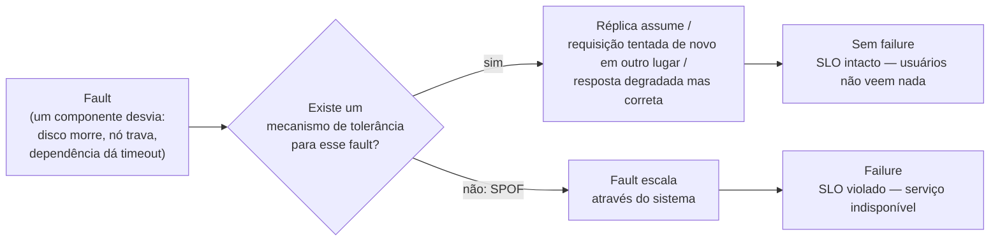

## Visão Geral

Confiabilidade não é um selo que um sistema tem ou não tem — é a propriedade de *continuar funcionando corretamente mesmo quando coisas específicas dão errado*. Essa definição é inútil até você preencher as duas lacunas: "corretamente" significa o comportamento com que seus usuários realmente contam (respostas certas, latência aceitável, sem acesso não autorizado, sem perda de dados), e "coisas dando errado" significa o conjunto concreto de faults que você decidiu sobreviver. Um sistema que tolera um disco morto mas não um datacenter morto não é pouco confiável; ele é confiável *dentro de um modelo de falhas declarado*, e o trabalho de engenharia é tornar esse modelo explícito em vez de acidental.

## Definindo Confiabilidade com Precisão

Antes de construir para confiabilidade você precisa responder duas perguntas especificamente para o seu sistema:

1. **O que "funcionar corretamente" significa aqui?** Tipicamente alguma combinação de: a aplicação faz o que o usuário esperava, ela tolera usuários cometendo erros ou usando-a de formas inesperadas, seu desempenho é bom o suficiente sob a carga e o volume de dados esperados, e ela previne acesso não autorizado e abuso. Para a maioria dos serviços isso é codificado como um **SLO** — um alvo explícito como "99,9% das requisições têm sucesso com latência p99 abaixo de 300 ms, medido em uma janela móvel de 30 dias."
2. **Quais coisas dando errado estão no escopo?** Falha de disco, crash de nó, perda de zona de disponibilidade, uma dependência retornando lixo, um operador implantando uma configuração ruim. Cada um que você reivindica tolerar é um compromisso de design com um custo.

O SLO importa porque converte uma aspiração vaga em uma linha mensurável. Sem ele, "o sistema está fora do ar" é uma questão de opinião; com ele, "violamos o SLO" é um fato, e você consegue raciocinar sobre quanto orçamento de indisponibilidade resta antes de você precisar parar de lançar features e começar a consertar coisas.

## Fault vs. Failure

Esta é a distinção central, e vale a pena ser pedante sobre ela:

- Um **fault** é um componente desviando de sua especificação — um disco rígido mal funcionando, uma máquina travando, um serviço externo tendo uma indisponibilidade.
- Uma **failure** é o sistema *como um todo* deixando de fornecer o serviço exigido aos usuários — em outras palavras, perdendo o SLO.

A parte confusa é que eles são o mesmo evento visto em níveis diferentes. Se um disco rígido para de funcionar, esse disco falhou (fault). Se o seu sistema *é* aquele único disco, o sistema também falhou (failure). Mas se seu sistema é seis discos com os dados replicados entre eles, esse mesmo evento é meramente um fault do ponto de vista do sistema — algo que ele absorve sem que nenhum usuário perceba.

**Tolerância a falhas é exatamente a lacuna entre essas duas palavras.** Um sistema é tolerante a falhas se ele continua atendendo usuários apesar de certos faults ocorrerem. Qualquer componente cujo fault escala diretamente para uma failure de todo o sistema — sem réplica, sem fallback, sem forma de contornar — é um **ponto único de falha (SPOF)**, e encontrar seus SPOFs é em grande parte uma questão de percorrer cada componente e perguntar "se isso desviar agora, um usuário percebe?"

Note que o fault acontece de qualquer forma. Você não previne faults; você previne que eles *se propaguem*. E a tolerância é sempre limitada a um certo número de um certo tipo de fault — dois discos, um nó de três, uma AZ de três. Não faz sentido tolerar um número ilimitado: se todo nó se for, não sobra nada de onde servir.

Contraintuitivamente, uma vez que você tem maquinaria de tolerância a falhas, geralmente é correto *aumentar* a taxa de faults deliberadamente — matando processos aleatoriamente, cortando links de rede, enchendo discos. Isso é **injeção de faults**, e a disciplina construída em torno disso é [chaos engineering](chaos-engineering). O raciocínio é simples: muitos bugs críticos vivem em caminhos de tratamento de erro, e caminhos de tratamento de erro que nunca rodam em produção são caminhos de tratamento de erro que ninguém testou. Um failover que você disparou mil vezes de propósito é um failover em que você pode confiar às 3 da manhã.

Uma exceção a "prefira tolerar em vez de prevenir": segurança. Se um atacante exfiltra dados sensíveis, não há cura a aplicar depois — esse fault precisa ser prevenido, não absorvido.

## Faults de Hardware e os Limites da Redundância

Hardware é o modo de falha em que todo mundo pensa primeiro, e por boa razão — as taxas base não são pequenas:

- 2%–5% dos discos rígidos magnéticos falham por ano. Em um cluster com 10.000 discos, isso é aproximadamente **uma falha de disco por dia**, todo dia, para sempre.
- 0,5%–1% dos SSDs falham por ano, mais erros de bit não corrigíveis a aproximadamente um por drive por ano mesmo em drives quase novos.
- Aproximadamente 1 em 1.000 máquinas tem um núcleo de CPU que ocasionalmente computa o resultado *errado* — às vezes travando, às vezes apenas retornando lixo silenciosamente.
- Mais de 1% das máquinas sofrem um erro de RAM não corrigível por ano mesmo com memória ECC.
- Datacenters inteiros apagam por quedas de energia, má configuração de rede, incêndio, ou inundação.

A resposta histórica foi **redundância no nível de componente**: RAID entre discos, fontes de energia duplas, CPUs hot-swappable, baterias e geradores a diesel no prédio. Isso funciona, e consegue manter uma única máquina no ar por anos — mas descansa sobre uma suposição que silenciosamente se enfraquece à medida que você cresce: que faults de componente são **independentes**. Na prática eles são correlacionados. Discos do mesmo lote de fabricação, instalados no mesmo dia, rodando a mesma carga de trabalho, falham em um cronograma que parece muito menos aleatório do que a ficha técnica sugere. Racks inteiros e datacenters inteiros caem juntos.

A verdadeira mudança é de escala. Com dez máquinas, um fault de hardware é um incidente: algo raro aconteceu, um humano troca a peça, a vida continua. Com dez mil máquinas, faults de hardware são uma taxa de fundo constante — parte da operação normal, não uma exceção a ela. Nesse ponto você não consegue contratar sua saída disso, e a redundância de componente sozinha para de ser suficiente: você precisa de **software que tolera máquinas inteiras desaparecendo**. É por isso que sistemas em nuvem se importam relativamente pouco com a confiabilidade de qualquer instância individual e muito com espalhar trabalho entre zonas de disponibilidade (que existem precisamente para dizer a você quais recursos compartilham um domínio de falha físico).

Projetar para a perda de máquina inteira compra um bônus operacional fácil de ignorar: um sistema de servidor único precisa de downtime planejado para reiniciar para um patch de SO, enquanto um sistema multi-nó tolerante a falhas pode ser corrigido um nó por vez sem interrupção visível ao usuário — um **rolling upgrade**. O mesmo mecanismo que sobrevive a um crash não planejado também torna a manutenção planejada gratuita.

Uma vez que você se compromete a tolerar perda de máquina, você herda uma nova classe de problema — nós que estão lentos em vez de mortos, relógios que discordam, processos que pausam e acordam acreditando que nenhum tempo passou. Esses são cobertos em [The Trouble with Distributed Systems](distributed-systems-partial-failures); o ponto aqui é que eles são o *preço* de mover a tolerância a falhas da camada de hardware para a camada de software, e em escala suficiente você paga isso quer goste ou não.

## Faults de Software: Correlacionados por Construção

Faults de hardware são pelo menos majoritariamente independentes — um disco morrendo diz pouco sobre o disco ao lado. Faults de software são o oposto: **sistemáticos e altamente correlacionados**, porque todo nó está rodando o mesmo binário com o mesmo bug. Redundância não é defesa alguma. Três réplicas de um serviço com um bug são três réplicas que vão atingi-lo nas mesmas circunstâncias, no mesmo momento, na mesma entrada.

Exemplos reais desse formato:

- O **segundo bissexto** de 30 de junho de 2012 fez aplicações Java travarem simultaneamente em todo o mundo, via um bug do kernel Linux — um fault disparado por um valor no *ambiente*, atingindo toda máquina de uma vez.
- Um bug de firmware fez certos modelos de SSD falharem irrecuperavelmente após **exatamente 32.768 horas** de operação — discos comprados juntos, ligados juntos, morrendo juntos, bem dentro de sua vida útil esperada.
- Um **processo desgovernado** esgotando um recurso compartilhado — CPU, memória, disco, descritores de arquivo, threads — como um bug de biblioteca cliente gerando muito mais requisições do que qualquer um antecipou.
- Uma dependência que fica lenta, torna-se não responsiva, ou começa a retornar respostas *corrompidas* em vez de erros.
- **Comportamento emergente** de interações entre sistemas que cada um passa em seus próprios testes isoladamente.
- **Falhas em cascata**, onde um componente sobrecarregado fica lento, fazendo seus chamadores acumularem retries, sobrecarregando o próximo componente, e assim por diante até toda a cadeia estar fora do ar.

O fio condutor: esses bugs ficam dormentes por muito tempo, porque o software faz uma suposição sobre seu ambiente que geralmente é verdadeira — e então, um dia, deixa de ser.

Não há uma correção única para faults sistemáticos, o que é precisamente por que as mitigações são processo em vez de arquitetura: raciocinar explicitamente sobre as suposições que cada componente faz sobre seu ambiente; testar minuciosamente, incluindo testes de propriedade sobre entradas aleatórias; isolar processos para que um não possa derrubar seus vizinhos; deixar processos travarem e reiniciarem limpo em vez de mancar em um estado corrompido; evitar loops de feedback como tempestades de retry ilimitadas; e medir, monitorar, e analisar comportamento *em produção*, porque as circunstâncias desencadeantes são por definição aquelas que você não imaginou de antemão.

## Confiabilidade Humana

Aqui está o resultado empírico desconfortável: em estudos de grandes serviços de internet, **mudanças de configuração de operador foram a principal causa de indisponibilidades**, enquanto faults de hardware apareceram em apenas 10%–25% dos casos. A coisa mais comum que quebra um sistema de produção é uma pessoa mudando-o.

A resposta tentadora — rotular como "erro humano", escrever um procedimento mais rígido, lembrar a todos de serem mais cuidadosos — é a errada, e não por razões de educação. "Erro humano" não é uma causa; é um sintoma de um sistema sociotécnico no qual pessoas fazendo o melhor que podem conseguem fazer uma mudança catastrófica facilmente. Se um único erro de digitação em um runbook consegue derrubar uma região, a constatação não é "aquele engenheiro foi descuidado". É "a ferramenta permitiu que um erro de digitação derrubasse uma região". A indisponibilidade da AWS S3 de 2017 na `us-east-1` é o caso canônico: um engenheiro executando um playbook estabelecido digitou errado um parâmetro e removeu muito mais capacidade do que pretendido. As ações corretivas não foram sobre o engenheiro — foram sobre a ferramenta, que foi alterada para remover capacidade mais devagar e para recusar levar qualquer subsistema abaixo de seu nível mínimo exigido.

As medidas que realmente movem o ponteiro funcionam encolhendo o raio de impacto de um erro inevitável:

- **Testes minuciosos**, incluindo testes baseados em propriedade sobre muitas entradas aleatórias, para que a suposição que um humano viola seja capturada por uma máquina primeiro.
- **Sandboxes e ambientes isolados** onde uma mudança pode ser exercitada de verdade sem consequências de produção.
- **Rollouts graduais** — um nó, depois uma AZ, depois tudo — para que uma mudança ruim seja descoberta enquanto ainda afeta 1% do tráfego.
- **Rollback rápido e confiável** tanto para código quanto para configuração, já que o tempo de recuperação importa muito mais do que a probabilidade de um push ruim.
- **Monitoramento e observabilidade detalhados**, para que o efeito de uma mudança seja visível em segundos e diagnosticável em minutos.
- **Interfaces que tornam o caminho seguro o caminho fácil** — a operação destrutiva deveria ser a que exige esforço extra, não a padrão.

Tudo isso custa tempo e dinheiro, e organizações sob pressão rotineiramente escolhem features em vez de resiliência. Essa é uma troca de negócio legítima de se fazer conscientemente — mas quando o incidente evitável então acontece, a conclusão honesta é sobre as prioridades, não a pessoa que por acaso estava segurando o teclado. Esse é o raciocínio por trás dos **post-mortems sem culpa**: pessoas que não serão punidas vão contar exatamente o que aconteceu, incluindo as partes que fazem o sistema parecer ruim, e esse detalhe é a única matéria-prima que você tem para prevenir uma recorrência.

Quando você investiga um incidente, desconfie de respostas simples em ambas as direções. "O Bob deveria ter sido mais cuidadoso" não ensina nada. Nem "precisamos reescrever o backend em uma linguagem mais segura". A saída útil é uma mudança concreta no sistema sociotécnico — uma proteção, uma checagem, um orçamento, um incentivo — derivada de como o trabalho realmente é feito pelas pessoas que o fazem todo dia.

## Trade-offs

- **Todo fault que você escolhe tolerar tem um custo, e tolerar "tudo" não é uma meta coerente** — sobreviver à perda de uma AZ é uma decisão de design com um preço; sobreviver à perda de todos os seus nós não é uma decisão de design, é um desejo. Nomear o modelo de falhas explicitamente é o que transforma confiabilidade de aspiração em engenharia.
- **Redundância no nível de componente eleva a disponibilidade de uma única máquina mas assume faults independentes, que se correlacionam na prática** — mesmo lote, mesmo rack, mesma alimentação de energia, mesmo bug de firmware. Redundância dentro de um domínio de falha protege muito menos do que a aritmética sugere.
- **Mover tolerância a falhas de hardware para software compra sobrevivência à perda de máquina e rolling upgrades, ao custo de herdar todo problema de sistemas distribuídos** — falha parcial, timeouts ambíguos, relógios não sincronizados. Hardware mais barato, corretude mais difícil.
- **Redundância não faz nada por faults de software, porque réplicas compartilham o bug** — as mitigações são teste, isolamento, crash-and-restart, e monitoramento de produção, que são investimentos de processo que não aparecem em um diagrama de arquitetura.
- **Injetar faults deliberadamente reduz a confiança hoje para aumentá-la amanhã** — experimentos de caos custam disponibilidade real agora, em troca de caminhos de tratamento de erro que de fato foram exercitados antes de você precisar deles às 3 da manhã.
- **Post-mortems sem culpa trocam a aparência de accountability por informação real** — punir a pessoa que fez o push da mudança confiavelmente produz relatórios de incidente que omitem os detalhes que você mais precisava ler.

## Perguntas de Entrevista

- Um único disco rígido falha. Em quais circunstâncias isso é um fault, e em quais circunstâncias isso é uma failure? O que muda entre os dois casos?
- Seu serviço roda em três réplicas idênticas. Contra qual destes isso protege você, e contra qual não protege: uma máquina morta, um bug de out-of-memory disparado por um payload de requisição específico, uma resposta corrompida de uma dependência downstream? Explique cada um.
- Redundância de componente manteve servidores únicos rodando por anos. Por que sistemas de grande escala constroem tolerância a falhas em nível de software em cima disso em vez de simplesmente comprar mais hardware redundante?
- Mudanças de configuração por operadores causam mais indisponibilidades do que faults de hardware. Dado isso, o que você mudaria em um pipeline de deployment — e por que "exigir um segundo aprovador em toda mudança" é uma resposta mais fraca do que parece?
- Matar processos de produção aleatoriamente obviamente reduz disponibilidade no curto prazo. Argumente por que uma equipe deveria fazer isso mesmo assim, e descreva quando esse argumento para de valer.

## Referências

- [Martin Kleppmann, "Designing Data-Intensive Applications", 2ª Edição (O'Reilly) — Capítulo 2, "Defining Nonfunctional Requirements", seção "Reliability and Fault Tolerance"](https://www.oreilly.com/library/view/designing-data-intensive-applications/9781098119058/)
- [Google SRE Book — "Embracing Risk"](https://sre.google/sre-book/embracing-risk/) — SLOs, orçamentos de erro, e por que 100% de confiabilidade é o alvo errado
- [Google SRE Book — "Postmortem Culture: Learning from Failure"](https://sre.google/sre-book/postmortem-culture/) — o que "sem culpa" realmente significa na prática
- [AWS — "Summary of the Amazon S3 Service Disruption in the Northern Virginia (US-EAST-1) Region"](https://aws.amazon.com/message/41926/) — uma revisão de incidente real de um operador digitando errado um comando de runbook, e as mudanças de ferramentas que se seguiram
