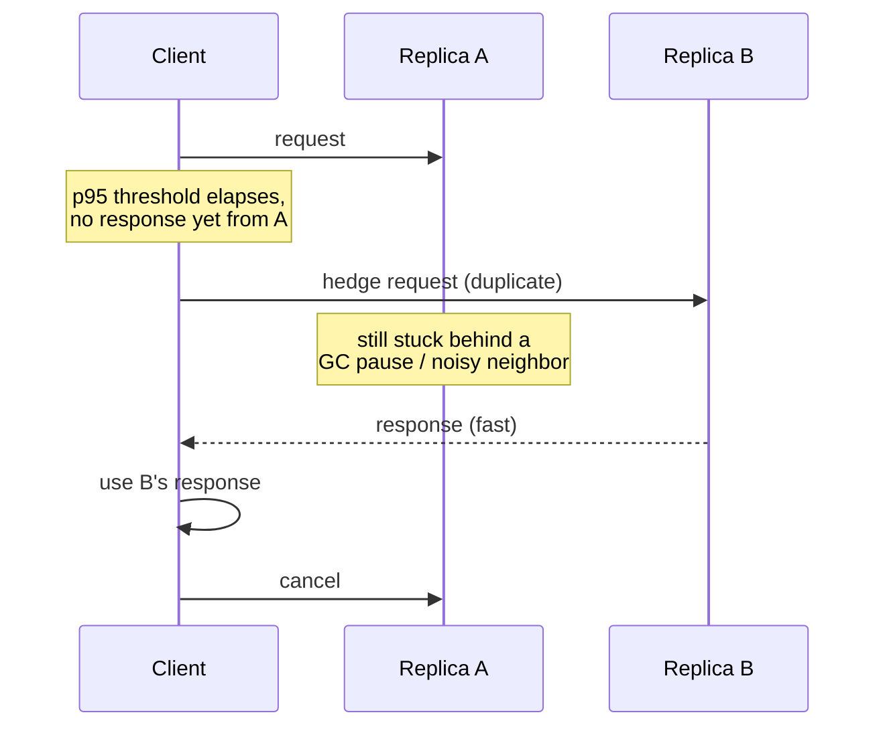

## Overview

Transient failures are a fact of life in any distributed system — a packet gets dropped, a load balancer target is mid-deploy, a server hits a GC pause, a connection pool is briefly exhausted. Retrying a failed call is therefore necessary: refusing to retry means surfacing every transient blip as a user-visible error. But retrying naively is dangerous in a way that isn't obvious until it happens to you. If a dependency has a brief outage and every client is retrying on the same fixed schedule — say, "wait 1 second and try again" — then every client's retry arrives back at the dependency at very nearly the same instant. That synchronized wave of retries is often larger than the traffic that caused the original problem, because it now includes both the normal traffic *and* everyone's backlog of failed requests trying again at once. The dependency, already weakened, gets hit with a thundering herd and stays down — or goes down harder — precisely because everyone tried to help it recover. A one-line `for (int i = 0; i < 3; i++)` retry loop is not a resilience strategy; it's a latent amplifier waiting for the right kind of correlated failure to trigger it. Building retries correctly is a real design problem, with a well-established solution: exponential backoff, randomized with jitter, bounded by a deadline and a retry budget, and — for the narrower problem of tail latency rather than outright failure — hedged requests.

## Why Naive Retries Cause Retry Storms

The failure mode has a name — a **retry storm** — and it follows a predictable life cycle. A backend gets slow or starts erroring, perhaps because it's approaching saturation. Clients calling it start timing out or receiving errors, and they retry. Those retries add load to a backend that was already struggling, pushing it further from recovery and creating more failures, which triggers more retries. The Google SRE book's chapter on cascading failures walks through the arithmetic: if 100 QPS of legitimate traffic starts failing and every client retries once, you don't have 100 QPS anymore, you have 200 QPS; if the backend still can't keep up, the next round produces 300 QPS, and so on. The system doesn't recover on its own once it tips into this state — the retries themselves are now the dominant source of load, and removing capacity (or waiting for it to "even out") doesn't help because the demand is self-reinforcing.

Fixed-delay retries make this dramatically worse through **synchronization**. If every client observed the failure at roughly the same moment (a very common case — a load balancer flips a route, a deploy rolls out, a network partition heals) and every client waits the same fixed interval before retrying, all those retries arrive back at the dependency in the same narrow time window. The dependency sees a spike shaped like a wall, not a ramp. Randomizing the retry delay is not a cosmetic nicety here — it is the mechanism that turns a synchronized wall of requests into a spread-out ramp that the recovering system can actually absorb.

## Capped Exponential Backoff

The first half of the fix is exponential backoff: each successive retry waits longer than the last, so a client that keeps failing backs off rather than hammering the dependency at a constant rate. Marc Brooker's AWS Builders' Library article on timeouts, retries, and backoff with jitter gives the canonical formula, expressed as a cap on plain exponential growth:

```
sleep = min(cap, base * 2^attempt)
```

`base` is the initial delay (tens to low hundreds of milliseconds is typical), `attempt` is the zero-indexed retry count, and `cap` bounds the delay so that after enough failed attempts you don't end up waiting minutes for a single call — a bound both on user-visible latency and on how stale a "fixed" backend would be by the time a client gets back to it. Without the cap, `base * 2^attempt` grows unboundedly and a handful of retries produces absurd wait times; with it, the delay plateaus and every subsequent retry (until you give up entirely) waits the same capped amount.

This alone does not solve the synchronization problem. If every client computes the exact same `sleep` value at the same attempt number, they are all still perfectly correlated — exponential backoff spreads out *your own* client's retries over time, but does nothing to spread different clients' retries apart from each other. That's what jitter is for.

## Jitter: Full Jitter vs. Equal Jitter

Jitter adds randomness to the computed delay so that clients who fail at the same moment don't retry at the same moment. Brooker's article (and the AWS Architecture Blog post that originated the formulas) compares several concrete strategies. The two worth knowing precisely:

**Full Jitter** discards the computed backoff value as a fixed delay and instead uses it only as an upper bound, picking the actual sleep uniformly from zero up to that bound:

```
temp = min(cap, base * 2^attempt)
sleep = random_between(0, temp)
```

**Equal Jitter** keeps half of the exponential delay as a guaranteed floor and randomizes only the remaining half:

```
temp = min(cap, base * 2^attempt)
sleep = temp / 2 + random_between(0, temp / 2)
```

A small pseudocode sketch of the full-jitter retry loop, wired up with a cap and a maximum attempt count:

```java
int attempt = 0;
long base = 100;      // ms
long cap = 20_000;     // ms
while (attempt < maxAttempts) {
    try {
        return call();
    } catch (RetriableException e) {
        long temp = Math.min(cap, base * (1L << attempt));
        long sleep = ThreadLocalRandom.current().nextLong(0, temp + 1);
        Thread.sleep(sleep);
        attempt++;
    }
}
throw new RetriesExhaustedException();
```

Why does Full Jitter tend to win? Equal Jitter guarantees every client waits at least `temp / 2`, which means it still carries some of the correlation the exponential term creates — clients that failed at the same attempt number are still clustered into the top half of the range and will collide more than a truly uniform spread would allow. Full Jitter has no floor at all: it decorrelates retries across clients far more effectively, precisely because it's willing to occasionally produce a very short wait (even close to zero) right after a failure. In Brooker's simulations of many competing clients retrying against contended state, Full Jitter did strictly less total client work (fewer retries needed before something succeeded) than Equal Jitter, at the cost of slightly higher variance in how long any single client's request took to finally complete — a trade most systems should take, since the goal of backoff is to protect the shared dependency, not to guarantee a smooth individual experience. (The same source also describes a third variant, decorrelated jitter, which grows the sampling range based on the previous sleep value rather than the attempt count; it performs comparably to Full Jitter in practice.) Whichever variant you pick, "retry with jitter" is table stakes for any retry policy that runs against a shared, potentially struggling dependency — a fixed or even exponential-but-unjittered delay is a bug, not a simplification.

## Retries Must Be Idempotent

Backoff and jitter make retries *safe for the dependency's load profile*; they say nothing about whether retrying is *safe for correctness*. Retrying is only sound when the operation is idempotent — applying it twice has the same effect as applying it once — or when the client can otherwise deduplicate. The dangerous case is the one that's easy to overlook: a request that reaches the server, is fully processed and committed, and then the *response* is lost to a network blip or client-side timeout. The client sees a failure and retries an operation the server already completed. For a `GET`, that's harmless. For "charge this card" or "append this event," a naive retry duplicates the side effect.

The standard fix is a client-supplied **idempotency key** — a unique token attached to the request that the server checks against a short-lived record of recently processed requests, returning the original result on a repeat instead of reprocessing. This turns "retry the whole operation" back into something safe, independent of what the operation actually does. See [Idempotency in Distributed Systems](idempotency) for the mechanics. A retry policy without an idempotency story is not actually complete — it has just moved the risk from "requests fail" to "requests silently duplicate," which is often worse because it's quieter.

## Deadlines and Retry Budgets

Backoff bounds the delay between attempts; it does not bound how long a caller keeps trying overall, or how much of a service's traffic is retries versus original requests. Two more controls are needed:

- **A deadline** on the whole operation, not just each attempt — a client that gives itself, say, 2 seconds total should stop retrying once that budget is spent, regardless of how many attempts it planned to make. Retrying "3 times with backoff" against a caller who has already given up 500ms ago wastes both client and server resources on an answer nobody will use.
- **A retry budget**, enforced fleet-wide rather than per-client, capping retries as a fraction of overall traffic — the Google SRE book's suggestion of "retries may not exceed 10% of the request rate" is a representative shape. This is the control that actually prevents a retry storm at scale: even with perfect per-client jitter, if every one of a million clients decides independently to retry a failed call, the aggregate retry volume can still overwhelm a struggling backend. A budget forces the system to shed load — failing fast for some fraction of callers — rather than let amplification continue unchecked. It also composes badly across layers: if service A retries calls to B, and B retries calls to C, a single slow spot in C can be amplified multiplicatively by both layers' retry policies unless each layer's budget is aware that it's not the only one retrying underneath it.

Both controls exist because "retry until it works" is not itself a stopping condition — it needs an externally imposed one, or it degrades into exactly the retry storm backoff and jitter were meant to prevent.

## Hedged Requests: Attacking Tail Latency Instead of Failure

Everything so far addresses *failure*: a call errored or timed out, and you're deciding whether and how to try again. Hedged requests solve a different problem — *tail latency* on calls that haven't failed at all, just haven't come back yet. Jeffrey Dean and Luiz André Barroso describe the technique in "The Tail at Scale" (CACM, 2013): rather than waiting indefinitely (or until a generous timeout) for a single replica to answer, the client sends the request to one replica as usual, but if the response hasn't arrived after some threshold — the paper uses the 95th-percentile expected latency for that class of request — it fires a second, identical request to a different replica. Whichever response comes back first is used, and the client cancels the other.

This works because most tail latency in a request to a replicated, largely stateless service isn't caused by that request being intrinsically expensive — it's caused by *local interference at that particular replica* at that particular moment: a GC pause, a co-located noisy neighbor, a queueing hiccup. A second replica, picked independently, is very unlikely to be suffering the same interference at the same time, so racing it against the slow one converts an unlucky tail event into a fast response almost for free. Deferring the hedge until the 95th-percentile mark means only the slowest ~5% of requests ever trigger a second request at all, which is precisely why the technique is cheap: you're paying for a duplicate only on the calls that were already going to be slow.

The paper's own measurement makes the trade concrete: in a Google benchmark reading 1,000 keys from a BigTable table spread across 100 servers, issuing a hedging request after a 10ms delay cut the 99.9th-percentile latency for retrieving the full batch from **1,800ms to 74ms**, while increasing the number of requests sent by only about **2%**. That is the shape of the trade hedging offers everywhere it's used: a small, bounded increase in load in exchange for a large, disproportionate cut to the tail — because the tail is exactly what a single slow replica was costing you.



Hedging is a latency tool, not a retry-on-failure tool, and the two combine rather than substitute for each other — a request can still fail outright and need backoff-and-jitter retry logic even after being hedged. It also carries the same correctness requirement as any retry: the operation must be idempotent or otherwise safe to issue twice, since for a brief window two replicas are genuinely both doing the work. It is not free lunch — it works by consuming spare capacity on the second replica, so it degrades if the whole fleet is uniformly loaded rather than experiencing localized, uncorrelated interference; hedging a request when *every* replica is equally saturated just adds load without a real chance of a faster answer. Dean and Barroso also describe a related but distinct technique, **tied requests**, where the client sends to two replicas up front and lets the servers themselves communicate to cancel the loser — trading a bit more up-front load for a much narrower window of duplicate work than a delayed hedge allows.

## Trade-offs

- **Jitter fixes correlated load but doesn't bound total retry volume** — Full Jitter or Equal Jitter stop retries from arriving in a synchronized wall, but if enough independent clients decide to retry at once, the aggregate volume can still overwhelm a struggling dependency; that's what a fleet-wide retry budget is for, and jitter and budgets are complementary, not substitutes.
- **Full Jitter decorrelates better but accepts more variance per client** — it occasionally sleeps almost no time at all right after a failure, which is exactly why it spreads clients apart more effectively than Equal Jitter's guaranteed floor, at the cost of a less predictable per-client wait.
- **A deadline that's too short abandons requests that would have succeeded; one that's too long lets a caller hold resources (threads, connections) waiting on a doomed call** — there's no universally correct value, only one calibrated to what the caller downstream is actually willing to wait for.
- **Retries without idempotency trade visible failures for invisible duplicates** — a request that appears to fail but actually succeeded server-side, followed by a retry, produces a double charge or a duplicate event; this is often worse than the failure it was meant to hide, because nothing signals that it happened.
- **Hedged requests trade a small, bounded amount of extra load for a large tail-latency win, but only when slowness is localized** — they work well against uncorrelated per-replica interference (GC pauses, noisy neighbors) and do little or nothing when the entire fleet is uniformly saturated, since the second replica is then just as likely to be slow.
- **Retry logic composes multiplicatively across service layers** — if service A retries into B and B retries into C, a slow spot in C can be amplified by both layers unless each layer's retry budget accounts for the fact that it isn't the only thing retrying beneath it; the fix is usually to retry at the edge closest to the user and suppress it in the middle tiers.

## Interview Questions

- Walk through exactly how a fixed-delay retry policy across many clients turns a brief backend blip into a sustained outage. What specifically does jitter change about that mechanism?
- Give the formulas for capped exponential backoff, Full Jitter, and Equal Jitter, and explain why Full Jitter usually decorrelates client retries more effectively than Equal Jitter.
- A client retries a payment API call after a timeout, and the customer is charged twice. Where did the design go wrong, and what's the fix that doesn't involve "just don't retry"?
- What is the difference between a per-attempt timeout, an overall deadline, and a retry budget? Why do you need all three, and what failure mode does each one specifically prevent?
- Explain hedged requests as described in "The Tail at Scale." Why is this a latency technique rather than a retry-on-failure technique, and under what fleet-wide condition does it stop paying off?
- Service A calls B, which calls C, and each layer independently retries three times with backoff. What can go wrong under sustained load on C, and how would you redesign the retry policy across the three layers?

## References

- [AWS Builders' Library — Marc Brooker, "Timeouts, retries, and backoff with jitter"](https://aws.amazon.com/builders-library/timeouts-retries-and-backoff-with-jitter/)
- [AWS Architecture Blog — Marc Brooker, "Exponential Backoff and Jitter"](https://aws.amazon.com/blogs/architecture/exponential-backoff-and-jitter/)
- [Jeffrey Dean and Luiz André Barroso — "The Tail at Scale", Communications of the ACM 56(2), 2013](https://www.barroso.org/publications/TheTailAtScale.pdf)
- [Google SRE Book — Chapter 22: Addressing Cascading Failures](https://sre.google/sre-book/addressing-cascading-failures/)
