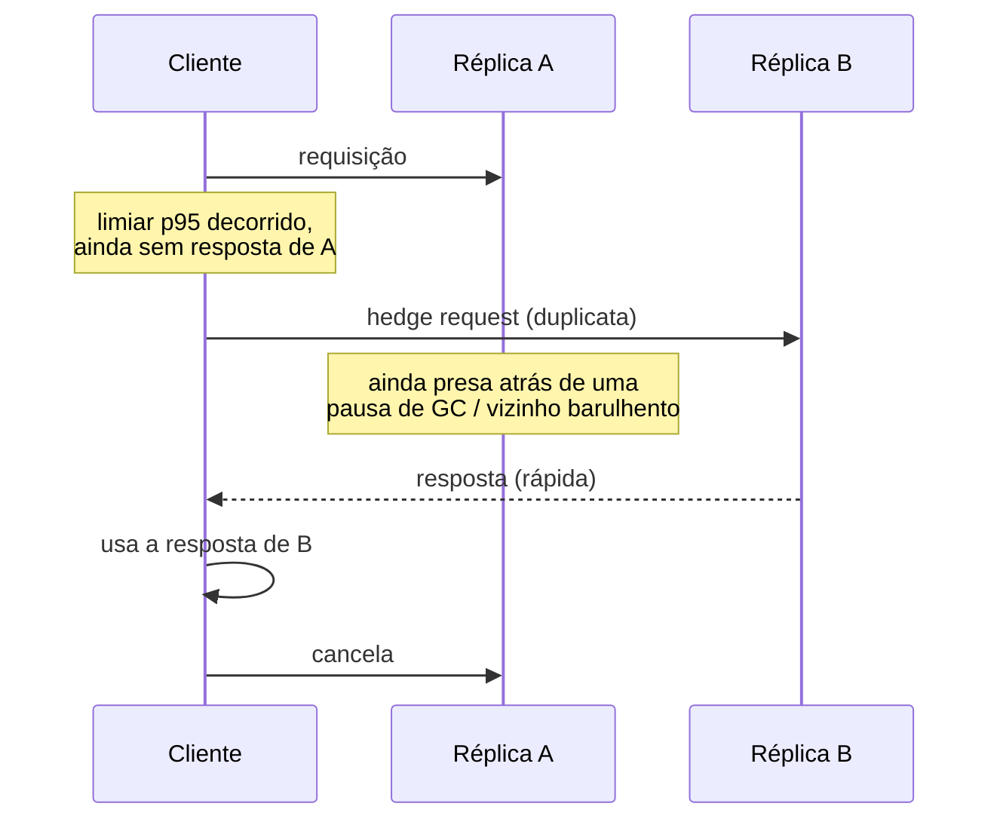

## Visão Geral

Falhas transientes são um fato da vida em qualquer sistema distribuído — um pacote é perdido, um alvo de load balancer está em meio a um deploy, um servidor sofre uma pausa de GC, um connection pool está brevemente esgotado. Tentar novamente uma chamada que falhou é, portanto, necessário: recusar-se a tentar de novo significa expor todo soluço transiente como um erro visível ao usuário. Mas tentar de novo de forma ingênua é perigoso de um jeito que não é óbvio até acontecer com você. Se uma dependência tem uma indisponibilidade breve e todo cliente está tentando de novo no mesmo cronograma fixo — digamos, "espere 1 segundo e tente de novo" — então o retry de todo cliente chega de volta na dependência quase no mesmo instante. Essa onda sincronizada de retries é frequentemente maior que o tráfego que causou o problema original, porque agora ela inclui tanto o tráfego normal *quanto* o backlog de todo mundo de requisições falhas tentando de novo ao mesmo tempo. A dependência, já enfraquecida, é atingida por uma manada estrondosa e permanece fora do ar — ou cai ainda mais forte — precisamente porque todo mundo tentou ajudá-la a se recuperar. Um loop de retry de uma linha `for (int i = 0; i < 3; i++)` não é uma estratégia de resiliência; é um amplificador latente esperando o tipo certo de falha correlacionada para dispará-lo. Construir retries corretamente é um problema de design real, com uma solução bem estabelecida: exponential backoff, randomizado com jitter, limitado por um deadline e um orçamento de retry, e — para o problema mais restrito de latência de cauda em vez de falha total — hedged requests.

## Por Que Retries Ingênuos Causam Tempestades de Retry

O modo de falha tem um nome — uma **tempestade de retry** — e ela segue um ciclo de vida previsível. Um backend fica lento ou começa a dar erro, talvez porque esteja se aproximando da saturação. Clientes chamando-o começam a dar timeout ou receber erros, e eles tentam de novo. Esses retries adicionam carga a um backend que já estava com dificuldade, empurrando-o mais para longe da recuperação e criando mais falhas, o que dispara mais retries. O capítulo do livro Google SRE sobre falhas em cascata percorre a aritmética: se 100 QPS de tráfego legítimo começa a falhar e todo cliente tenta de novo uma vez, você não tem mais 100 QPS, você tem 200 QPS; se o backend ainda não consegue acompanhar, a próxima rodada produz 300 QPS, e assim por diante. O sistema não se recupera sozinho uma vez que entra nesse estado — os próprios retries agora são a fonte dominante de carga, e remover capacidade (ou esperar que "se equilibre") não ajuda porque a demanda é autorreforçante.

Retries de atraso fixo pioram isso dramaticamente através de **sincronização**. Se todo cliente observou a falha aproximadamente no mesmo momento (um caso muito comum — um load balancer troca uma rota, um deploy é lançado, uma partição de rede se cura) e todo cliente espera o mesmo intervalo fixo antes de tentar de novo, todos esses retries chegam de volta na dependência na mesma janela estreita de tempo. A dependência vê um pico com formato de parede, não de rampa. Randomizar o atraso de retry não é um capricho cosmético aqui — é o mecanismo que transforma uma parede sincronizada de requisições em uma rampa espalhada que o sistema em recuperação consegue de fato absorver.

## Exponential Backoff Limitado

A primeira metade da correção é o exponential backoff: cada retry sucessivo espera mais tempo que o anterior, então um cliente que continua falhando recua em vez de martelar a dependência em uma taxa constante. O artigo de Marc Brooker na AWS Builders' Library sobre timeouts, retries, e backoff com jitter dá a fórmula canônica, expressa como um limite sobre crescimento exponencial puro:

```
sleep = min(cap, base * 2^attempt)
```

`base` é o atraso inicial (dezenas a poucas centenas de milissegundos é típico), `attempt` é a contagem de retry indexada em zero, e `cap` limita o atraso para que, depois de tentativas falhas suficientes, você não acabe esperando minutos por uma única chamada — um limite tanto para latência visível ao usuário quanto para o quão obsoleto um backend "consertado" estaria no momento em que um cliente chegasse de volta a ele. Sem o limite, `base * 2^attempt` cresce ilimitadamente e um punhado de retries produz tempos de espera absurdos; com ele, o atraso se estabiliza e todo retry subsequente (até você desistir de vez) espera a mesma quantia limitada.

Isso sozinho não resolve o problema de sincronização. Se todo cliente computa exatamente o mesmo valor de `sleep` no mesmo número de tentativa, eles ainda estão perfeitamente correlacionados — exponential backoff espalha os retries do *seu próprio* cliente ao longo do tempo, mas não faz nada para espalhar os retries de clientes diferentes uns dos outros. É para isso que o jitter serve.

## Jitter: Full Jitter vs. Equal Jitter

Jitter adiciona aleatoriedade ao atraso computado para que clientes que falham no mesmo momento não tentem de novo no mesmo momento. O artigo de Brooker (e o post do AWS Architecture Blog que originou as fórmulas) compara várias estratégias concretas. As duas que vale a pena conhecer com precisão:

**Full Jitter** descarta o valor de backoff computado como um atraso fixo e em vez disso o usa apenas como um limite superior, escolhendo o sleep real uniformemente entre zero e esse limite:

```
temp = min(cap, base * 2^attempt)
sleep = random_between(0, temp)
```

**Equal Jitter** mantém metade do atraso exponencial como um piso garantido e randomiza apenas a metade restante:

```
temp = min(cap, base * 2^attempt)
sleep = temp / 2 + random_between(0, temp / 2)
```

Um pequeno esboço de pseudocódigo do loop de retry com full jitter, montado com um limite e uma contagem máxima de tentativas:

```java
int attempt = 0;
long base = 100;      // ms
long cap = 20_000;     // ms
while (attempt < maxAttempts) {
    try {
        return call();
    } catch (RetriableException e) {
        long temp = Math.min(cap, base * (1L << attempt));
        long sleep = ThreadLocalRandom.current().nextLong(0, temp + 1);
        Thread.sleep(sleep);
        attempt++;
    }
}
throw new RetriesExhaustedException();
```

Por que o Full Jitter tende a vencer? Equal Jitter garante que todo cliente espere ao menos `temp / 2`, o que significa que ele ainda carrega parte da correlação que o termo exponencial cria — clientes que falharam no mesmo número de tentativa ainda ficam agrupados na metade superior do intervalo e vão colidir mais do que um espalhamento verdadeiramente uniforme permitiria. Full Jitter não tem piso algum: ele descorrelaciona retries entre clientes muito mais efetivamente, precisamente porque está disposto a ocasionalmente produzir uma espera muito curta (até perto de zero) logo após uma falha. Nas simulações de Brooker de muitos clientes concorrentes tentando de novo contra estado contestado, Full Jitter fez estritamente menos trabalho total de cliente (menos retries necessários antes que algo tivesse sucesso) do que Equal Jitter, ao custo de variância ligeiramente maior em quanto tempo a requisição de um único cliente levou para finalmente completar — uma troca que a maioria dos sistemas deveria aceitar, já que o objetivo do backoff é proteger a dependência compartilhada, não garantir uma experiência individual suave. (A mesma fonte também descreve uma terceira variante, jitter decorrelacionado, que cresce o intervalo de amostragem baseado no valor de sleep anterior em vez do número de tentativa; ela se sai comparavelmente ao Full Jitter na prática.) Qualquer variante que você escolha, "retry com jitter" é o mínimo obrigatório para qualquer política de retry que rode contra uma dependência compartilhada e potencialmente em dificuldade — um atraso fixo ou mesmo exponencial mas sem jitter é um bug, não uma simplificação.

## Retries Precisam Ser Idempotentes

Backoff e jitter tornam retries *seguros para o perfil de carga da dependência*; eles não dizem nada sobre se tentar de novo é *seguro para corretude*. Tentar de novo só é correto quando a operação é idempotente — aplicá-la duas vezes tem o mesmo efeito que aplicá-la uma vez — ou quando o cliente consegue deduplicar de outra forma. O caso perigoso é o que é fácil de ignorar: uma requisição que chega ao servidor, é totalmente processada e commitada, e então a *resposta* é perdida por um soluço de rede ou timeout do lado do cliente. O cliente vê uma falha e tenta de novo uma operação que o servidor já completou. Para um `GET`, isso é inofensivo. Para "cobrar este cartão" ou "anexar este evento", um retry ingênuo duplica o efeito colateral.

A correção padrão é uma **chave de idempotência** fornecida pelo cliente — um token único anexado à requisição que o servidor checa contra um registro de curta duração de requisições recentemente processadas, retornando o resultado original em uma repetição em vez de reprocessar. Isso transforma "tentar de novo a operação inteira" de volta em algo seguro, independentemente do que a operação de fato faz. Veja [Idempotency in Distributed Systems](idempotency) para a mecânica. Uma política de retry sem uma história de idempotência não está de fato completa — ela apenas moveu o risco de "requisições falham" para "requisições silenciosamente duplicam", o que frequentemente é pior porque é mais silencioso.

## Deadlines e Orçamentos de Retry

Backoff limita o atraso entre tentativas; ele não limita por quanto tempo um chamador continua tentando no total, ou quanto do tráfego de um serviço são retries versus requisições originais. Dois controles adicionais são necessários:

- **Um deadline** na operação inteira, não apenas em cada tentativa — um cliente que se dá, digamos, 2 segundos no total deveria parar de tentar de novo uma vez que esse orçamento seja gasto, independentemente de quantas tentativas ele planejava fazer. Tentar de novo "3 vezes com backoff" contra um chamador que já desistiu há 500ms desperdiça recursos tanto do cliente quanto do servidor em uma resposta que ninguém vai usar.
- **Um orçamento de retry**, aplicado em toda a frota em vez de por cliente, limitando retries como uma fração do tráfego geral — a sugestão do livro Google SRE de "retries não podem exceder 10% da taxa de requisições" é um formato representativo. Esse é o controle que de fato previne uma tempestade de retry em escala: mesmo com jitter perfeito por cliente, se cada um de um milhão de clientes decidir independentemente tentar de novo uma chamada que falhou, o volume agregado de retry ainda pode sobrecarregar um backend em dificuldade. Um orçamento força o sistema a descartar carga — falhando rápido para uma fração dos chamadores — em vez de deixar a amplificação continuar sem controle. Isso também compõe mal entre camadas: se o serviço A tenta de novo chamadas para B, e B tenta de novo chamadas para C, um único ponto lento em C pode ser amplificado multiplicativamente pelas políticas de retry de ambas as camadas a menos que o orçamento de cada camada saiba que não é o único tentando de novo por baixo dele.

Ambos os controles existem porque "tentar de novo até funcionar" não é em si uma condição de parada — precisa de uma imposta externamente, ou ele degrada exatamente na tempestade de retry que backoff e jitter foram feitos para prevenir.

## Hedged Requests: Atacando Latência de Cauda em Vez de Falha

Tudo até aqui trata de *falha*: uma chamada deu erro ou timeout, e você está decidindo se e como tentar de novo. Hedged requests resolvem um problema diferente — *latência de cauda* em chamadas que não falharam de jeito nenhum, apenas ainda não voltaram. Jeffrey Dean e Luiz André Barroso descrevem a técnica em "The Tail at Scale" (CACM, 2013): em vez de esperar indefinidamente (ou até um timeout generoso) por uma única réplica responder, o cliente envia a requisição para uma réplica como de costume, mas se a resposta não chegou depois de um certo limiar — o artigo usa a latência esperada do percentil 95 para aquela classe de requisição — ele dispara uma segunda requisição idêntica para uma réplica diferente. Qualquer resposta que voltar primeiro é usada, e o cliente cancela a outra.

Isso funciona porque a maior parte da latência de cauda em uma requisição para um serviço replicado, majoritariamente stateless, não é causada pela requisição ser intrinsecamente cara — é causada por *interferência local naquela réplica particular* naquele momento particular: uma pausa de GC, um vizinho barulhento colocalizado, um soluço de enfileiramento. Uma segunda réplica, escolhida independentemente, dificilmente estará sofrendo a mesma interferência ao mesmo tempo, então correr contra a lenta converte um evento de cauda azarado em uma resposta rápida quase de graça. Adiar o hedge até a marca do percentil 95 significa que apenas os ~5% mais lentos das requisições sequer disparam uma segunda requisição, o que é precisamente por que a técnica é barata: você paga por uma duplicata apenas nas chamadas que já iam ser lentas de qualquer forma.

A própria medição do artigo torna a troca concreta: em um benchmark do Google lendo 1.000 chaves de uma tabela BigTable espalhada por 100 servidores, disparar uma requisição de hedging após um atraso de 10ms cortou a latência do percentil 99,9 para recuperar o lote completo de **1.800ms para 74ms**, enquanto aumentava o número de requisições enviadas em apenas cerca de **2%**. Esse é o formato da troca que o hedging oferece onde quer que seja usado: um aumento pequeno e limitado de carga em troca de um grande corte desproporcional na cauda — porque a cauda é exatamente o que uma única réplica lenta estava custando a você.



Hedging é uma ferramenta de latência, não uma ferramenta de retry-em-falha, e as duas se combinam em vez de substituírem uma à outra — uma requisição ainda pode falhar completamente e precisar de lógica de retry com backoff-e-jitter mesmo depois de hedged. Também carrega o mesmo requisito de corretude que qualquer retry: a operação precisa ser idempotente ou de outra forma segura para ser emitida duas vezes, já que por uma breve janela duas réplicas estão genuinamente ambas fazendo o trabalho. Não é almoço grátis — funciona consumindo capacidade sobressalente na segunda réplica, então degrada se a frota inteira estiver uniformemente carregada em vez de experimentando interferência localizada e não correlacionada; fazer hedge de uma requisição quando *toda* réplica está igualmente saturada apenas adiciona carga sem uma chance real de uma resposta mais rápida. Dean e Barroso também descrevem uma técnica relacionada mas distinta, **tied requests**, onde o cliente envia para duas réplicas de antemão e deixa os próprios servidores se comunicarem para cancelar a perdedora — trocando um pouco mais de carga antecipada por uma janela muito mais estreita de trabalho duplicado do que um hedge atrasado permite.

## Trade-offs

- **Jitter corrige carga correlacionada mas não limita o volume total de retry** — Full Jitter ou Equal Jitter impedem que retries cheguem em uma parede sincronizada, mas se clientes independentes suficientes decidirem tentar de novo ao mesmo tempo, o volume agregado ainda pode sobrecarregar uma dependência em dificuldade; é para isso que serve um orçamento de retry em toda a frota, e jitter e orçamentos são complementares, não substitutos.
- **Full Jitter descorrelaciona melhor mas aceita mais variância por cliente** — ele ocasionalmente dorme quase nenhum tempo logo após uma falha, o que é exatamente por que ele espalha clientes mais efetivamente do que o piso garantido do Equal Jitter, ao custo de uma espera por cliente menos previsível.
- **Um deadline curto demais abandona requisições que teriam tido sucesso; um longo demais deixa um chamador segurando recursos (threads, conexões) esperando por uma chamada condenada** — não há um valor universalmente correto, apenas um calibrado para o que o chamador downstream está de fato disposto a esperar.
- **Retries sem idempotência trocam falhas visíveis por duplicatas invisíveis** — uma requisição que parece ter falhado mas de fato teve sucesso no lado do servidor, seguida por um retry, produz uma cobrança dupla ou um evento duplicado; isso frequentemente é pior do que a falha que pretendia esconder, porque nada sinaliza que aconteceu.
- **Hedged requests trocam uma pequena quantidade limitada de carga extra por um grande ganho de latência de cauda, mas apenas quando a lentidão é localizada** — elas funcionam bem contra interferência não correlacionada por réplica (pausas de GC, vizinhos barulhentos) e fazem pouco ou nada quando a frota inteira está uniformemente saturada, já que a segunda réplica então é igualmente provável de estar lenta.
- **Lógica de retry compõe multiplicativamente entre camadas de serviço** — se o serviço A tenta de novo em B e B tenta de novo em C, um ponto lento em C pode ser amplificado por ambas as camadas a menos que o orçamento de retry de cada camada considere que não é a única coisa tentando de novo por baixo dela; a correção geralmente é tentar de novo na borda mais próxima do usuário e suprimir nas camadas do meio.

## Perguntas de Entrevista

- Percorra exatamente como uma política de retry de atraso fixo entre muitos clientes transforma um soluço breve de backend em uma indisponibilidade sustentada. O que especificamente o jitter muda sobre esse mecanismo?
- Dê as fórmulas para exponential backoff limitado, Full Jitter, e Equal Jitter, e explique por que Full Jitter geralmente descorrelaciona retries de cliente mais efetivamente do que Equal Jitter.
- Um cliente tenta de novo uma chamada de API de pagamento depois de um timeout, e o cliente é cobrado duas vezes. Onde o design deu errado, e qual é a correção que não envolve "simplesmente não tente de novo"?
- Qual é a diferença entre um timeout por tentativa, um deadline geral, e um orçamento de retry? Por que você precisa dos três, e qual modo de falha cada um especificamente previne?
- Explique hedged requests conforme descritas em "The Tail at Scale". Por que essa é uma técnica de latência em vez de uma técnica de retry-em-falha, e sob qual condição de toda a frota ela para de compensar?
- O serviço A chama B, que chama C, e cada camada independentemente tenta de novo três vezes com backoff. O que pode dar errado sob carga sustentada em C, e como você redesenharia a política de retry entre as três camadas?

## Referências

- [AWS Builders' Library — Marc Brooker, "Timeouts, retries, and backoff with jitter"](https://aws.amazon.com/builders-library/timeouts-retries-and-backoff-with-jitter/)
- [AWS Architecture Blog — Marc Brooker, "Exponential Backoff and Jitter"](https://aws.amazon.com/blogs/architecture/exponential-backoff-and-jitter/)
- [Jeffrey Dean e Luiz André Barroso — "The Tail at Scale", Communications of the ACM 56(2), 2013](https://www.barroso.org/publications/TheTailAtScale.pdf)
- [Google SRE Book — Chapter 22: Addressing Cascading Failures](https://sre.google/sre-book/addressing-cascading-failures/)
