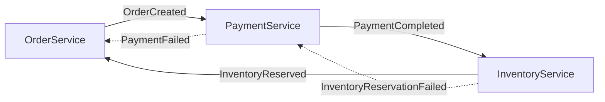
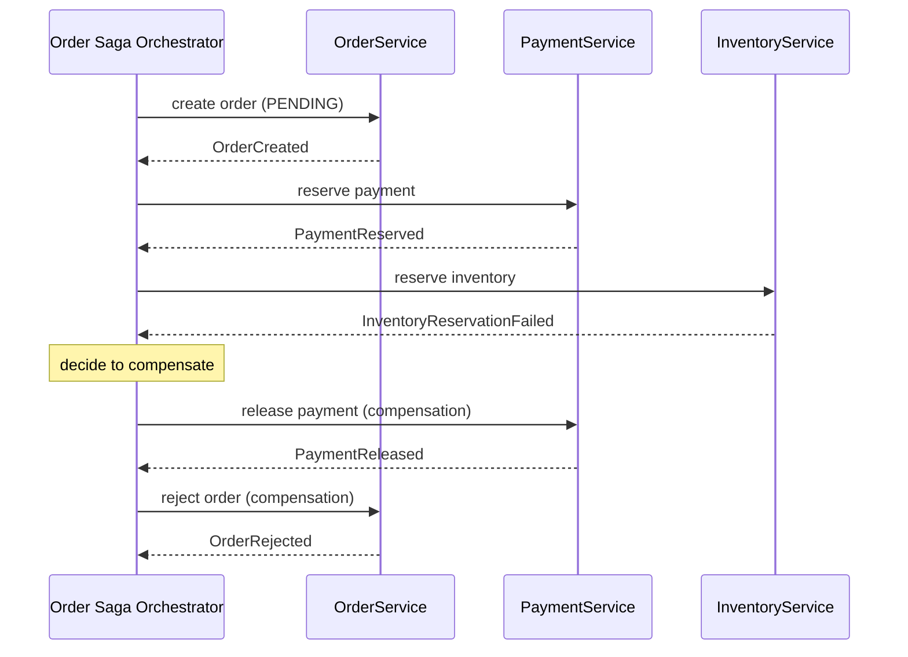

## Overview

Placing an order in an e-commerce system touches at least three services that each own their own data: `OrderService` creates the order, `PaymentService` charges the customer, and `InventoryService` reserves stock. In a monolith with one database this is a single `@Transactional` method and the platform's ACID guarantees handle the rest. Once these are separate services with separate databases, there is no single commit log to make the whole operation atomic. [Two-phase commit](distributed-transactions-and-two-phase-commit) could, in principle, hold locks across all three databases until every participant agrees to commit — but that requires a shared transaction coordinator, blocks on the slowest and least available participant, and few message brokers or third-party payment APIs support it at all. The saga pattern gives up atomicity and isolation across the whole operation and replaces them with something weaker but achievable: a sequence of local transactions, each committed independently, with an explicit **compensating transaction** defined for every step that can semantically undo it if a later step fails. This is not "2PC but eventually consistent" — it is a genuinely different consistency model, because nothing is ever rolled back in the database sense, and other transactions can observe the operation mid-flight. Understanding a saga means understanding exactly what that trade buys you and what it costs.

## Origins: Long-Lived Transactions and the Original Saga

The term comes from Hector Garcia-Molina and Kenneth Salem's 1987 paper "Sagas," written for a database problem, not microservices: **long-lived transactions (LLTs)** — think a CAD tool session or a batch update touching millions of rows — that hold locks for so long they strangle concurrency for everyone else. Their proposal was to define an LLT as a saga: a sequence of transactions `T1, T2, …, Tn`, each of which can commit independently and release its locks immediately, together with a corresponding set of compensating transactions `C1, C2, …, Cn-1`. If the saga runs to completion, the database only ever needs the guarantee that either all of `T1..Tn` complete, or, for whatever prefix did complete, the corresponding compensations run in reverse order so the net effect is as if the saga never started. Crucially, the paper's model allows other transactions to interleave with a saga's steps — the whole point was to stop holding locks for the LLT's entire lifetime. That interleaving assumption is the seed of everything a saga costs you today: giving up long-held locks and a single commit point necessarily means giving up isolation across the sequence.

Chris Richardson's *Microservices Patterns* (Manning, 2018), Chapter 4, "Managing transactions with sagas," is the practical, service-oriented restatement of the same idea: a saga is a sequence of local transactions, each performed by a single service, coordinated so that if one step fails, the previously completed steps are undone via compensating transactions rather than a database rollback.

## Orchestration vs. Choreography

A saga needs *something* to decide what happens next after each local transaction completes, and there are two structurally different ways to place that decision-making.

**Choreography** has no coordinator at all. Each participant commits its local transaction and publishes a domain event; other participants subscribe to events they care about and react by running their own local transaction and publishing their own event.



Choreography keeps services fully decoupled — no service knows the whole workflow, only "what do I do when I see this event." That is also its weakness at any real scale: the overall business process is smeared across N services' event handlers with no single place to read it, cyclic event dependencies are easy to introduce by accident, and adding a new step (say, a fraud check) means editing the event contracts of every service adjacent to it in the flow.

**Orchestration** introduces an explicit coordinator — Richardson calls it a saga orchestrator — that knows the whole sequence, sends an explicit command to each participant in turn, and interprets the reply to decide whether to proceed or start compensating.



Orchestration makes the workflow legible in one place, which matters enormously once a saga has five or more steps or conditional branches. The cost is that the orchestrator becomes a stateful, durable component in its own right — it must survive crashes and resume exactly where it left off, or the saga can be left permanently half-finished. This is precisely the gap that workflow engines such as Temporal, Camunda, and AWS Step Functions exist to fill: they durably persist the orchestrator's execution state so "which step was I on" survives process crashes without the application team having to build that persistence themselves. There is also a design risk specific to orchestration: it is easy to let business logic that belongs in the participant services leak into the orchestrator, turning it into a de facto second implementation of those services' rules.

Richardson's guidance, echoed on microservices.io's "Pattern: Saga" page, is to default to orchestration once a saga has more than a couple of participants or any conditional branching, and to reserve choreography for short, linear sequences where the decoupling is worth more than the visibility.

## Compensating Transactions Are Not Rollback

The single most important distinction a saga forces on you: a compensating transaction is a new, forward-moving local transaction that semantically undoes the effect of an already-committed transaction — it is not a database `ROLLBACK`, because the transaction it undoes has already committed and its effects (rows, events, side effects on other systems) may already be visible to the rest of the world.

```java
// Forward transaction, already committed.
void reservePayment(OrderId orderId, Money amount) {
    paymentRepository.reserve(orderId, amount);      // hold funds
    outbox.publish(new PaymentReserved(orderId, amount));
}

// Compensating transaction — a new operation, not an undo.
void releasePayment(OrderId orderId, Money amount) {
    paymentRepository.release(orderId, amount);       // release the hold
    outbox.publish(new PaymentReleased(orderId, amount));
}
```

For a monetary hold, "release the hold" is a clean semantic inverse. Many real operations are not so tidy: there is no compensating transaction that truly undoes "sent the customer a shipping confirmation email" — the best you can do is send a second email saying the order was cancelled, which is a different business event, not an inverse. Designing a saga therefore means checking, step by step, whether every action has a workable compensation, and if not, reordering the saga so that irreversible or hard-to-compensate steps run last, after everything more easily undone has already succeeded — Richardson calls this the "pessimistic view" countermeasure, discussed below, and it applies to compensation design generally, not only to isolation.

Compensations must also be idempotent and retriable for exactly the same reason forward steps must be, and — this is easy to miss — a compensating transaction is expected to (almost) always succeed. If `releasePayment` can itself fail for business reasons, the saga now needs a compensation for the compensation, and that regress has to terminate somewhere in a small set of operations that are deliberately built to be as close to infallible as the domain allows.

## What Sagas Do Not Give You: Isolation

A local ACID transaction inside one step gives you isolation *within* that step, but the saga as a whole has no isolation. Between the moment `OrderService` commits `OrderCreated` and the moment `InventoryService` commits `InventoryReserved`, the order exists in an intermediate state that any other transaction — including another saga entirely — can read. Richardson's book names the resulting anomalies explicitly, by analogy with the classic isolation-level anomalies:

- **Lost updates** — one saga's step overwrites a change made by another concurrent transaction without ever reading it.
- **Dirty reads** — a transaction (or another saga) reads a saga's in-progress, not-yet-finished state, e.g. a reporting query counting an order as "confirmed" before payment has actually cleared.
- **Fuzzy/non-repeatable reads** — two participants in the same saga, or a saga and an outside reader, see different values for the same data at different points because a step committed in between.

Because there is no isolation to fall back on, the saga's design has to build in countermeasures deliberately. Richardson describes five, drawn from both the original Garcia-Molina/Salem paper and practical service design:

- **Semantic lock** — mark the record as "pending" while a saga is mid-flight (e.g. an order's status is `PENDING_PAYMENT`, not `CONFIRMED`), so other transactions and other sagas can recognize the in-progress state and choose to wait, reject, or compensate instead of acting on it as if it were final.
- **Commutative updates** — design each step's update so that it produces the same result regardless of the order it's applied relative to its own compensation, e.g. modeling a balance change as a credit/debit delta rather than an absolute overwrite, so a forward step and its later compensation can be applied and reversed without needing to know exact ordering.
- **Pessimistic view** — reorder the saga so the step that is hardest to compensate, or whose partial visibility is most dangerous, runs as late as possible, minimizing the window during which an anomaly is possible.
- **Reread value** — before overwriting a record, reread it and confirm it has not changed since the saga last observed it (an optimistic-concurrency check), so a step doesn't blindly clobber a concurrent update it never saw.
- **Version file** — record every operation against a record so that out-of-order arrivals (e.g. a compensation arriving after a later forward step already ran) can be recognized and reconciled rather than silently corrupting state; this is the direct descendant of Garcia-Molina and Salem's original countermeasure for saga steps that interleave with unrelated transactions.

None of these recover true isolation — they are targeted mitigations for the specific anomaly a given saga is exposed to, chosen per step, not a blanket guarantee.

## Idempotency and Retries

Every step in a saga — forward or compensating — runs over an unreliable network and against services that can crash mid-request, so every step must be safe to retry. An orchestrator that calls `PaymentService.reserve()` and gets a timeout genuinely does not know whether the reservation happened; retrying without an idempotency key risks reserving the funds twice. The standard fix is the same one used throughout distributed systems: every command carries a stable idempotency key — typically `(sagaId, stepName)` — and the receiving service deduplicates on that key, either via a unique constraint on an already-processed-commands table or an upsert keyed by it. This applies with equal force to compensations: retrying `releasePayment` after a timeout must not release funds twice, or refund a customer twice.

The orchestrator itself needs the same property from the other direction — it must be able to crash and resume without losing track of which steps have already run, which is why durable-execution engines like Temporal persist each step's completion as part of the workflow's event history rather than trusting in-memory state.

## Sagas and the Transactional Outbox Pattern

Every step of a saga is, underneath, exactly the problem the [transactional outbox pattern](outbox-pattern) exists to solve: a service must update its own database *and* reliably notify the rest of the saga that the step happened, and those two things cannot be one atomic operation across a database and a message broker. In a choreographed saga this is obvious — each participant's local transaction and its outgoing domain event are precisely an outbox write. In an orchestrated saga it is less visible but still there: when `PaymentService` finishes reserving funds, it needs to atomically commit that reservation and durably arrange to tell the orchestrator it succeeded, which is again a local-write-plus-notification problem, solved the same way. The two patterns are not competitors — a saga defines the cross-service workflow and its compensation logic, while the outbox pattern is the reliability mechanism each individual step typically leans on internally to make sure "I did the work" and "I told everyone" don't fall out of sync.

## Trade-offs

- **You gain availability and service autonomy, and give up atomicity and isolation.** Each service commits to its own database independently and never blocks holding a cross-service lock, but the price is that intermediate saga states are visible to the rest of the system and must be designed for, not assumed away.
- **Compensation is a design activity, not a runtime mechanism.** Unlike a database rollback, which the storage engine gives you for free, every forward step needs a hand-written, tested compensating transaction — and some operations (an email already sent, a webhook already delivered to a third party) have no true inverse, forcing the saga's step order to be chosen around irreversibility.
- **Orchestration trades decoupling for visibility, and that trade gets better as the saga grows.** A two-step choreography can be simpler with no orchestrator at all; a ten-step saga with branching failure paths becomes unreadable and unsafe without one, which is why production workflow engines like Temporal or Camunda exist specifically to host that orchestrator durably.
- **Idempotency is not optional infrastructure, it's a correctness requirement.** Every forward and compensating step must tolerate at-least-once delivery and retries; skipping this is the most common source of real bugs in saga implementations — double charges, double refunds, or a compensation that never resolves because it assumed exactly-once execution.
- **A saga can get stuck in a state 2PC would never allow.** If a compensating transaction itself fails repeatedly (the refund API is down, the warehouse system rejects the release), the saga has no built-in "abort everything" escape hatch the way a coordinator-blocked 2PC transaction does — it needs monitoring, alerting, and often a manual-intervention or dead-letter path as a last resort.

## Interview Questions

- Why can't you just use two-phase commit across `OrderService`, `PaymentService`, and `InventoryService` instead of a saga — what specifically breaks?
- Explain the difference between a compensating transaction and a database rollback. Give an example of a step that has no clean compensation and describe how you'd handle it.
- Walk through a concrete anomaly a saga can expose because it lacks isolation, and name a countermeasure from Richardson's book that would mitigate it.
- When would you choose choreography over orchestration for a saga, and what specifically gets worse as you add more participants to a choreographed saga?
- A saga's orchestrator calls a participant's API, the call times out, and the orchestrator retries. What has to be true on the participant's side for that retry to be safe, for both forward steps and compensations?
- What happens in your design if a compensating transaction itself fails repeatedly — walk through what the saga does next.

## References

- [Hector Garcia-Molina and Kenneth Salem, "Sagas" (ACM SIGMOD Record, Vol. 16, No. 3, 1987)](https://dl.acm.org/doi/10.1145/38714.38742) — the original paper, written for long-lived database transactions, that introduced the sequence-of-transactions-plus-compensations model.
- Chris Richardson, [*Microservices Patterns*](https://www.manning.com/books/microservices-patterns) (Manning, 2018) — Chapter 4, "Managing transactions with sagas": orchestration vs. choreography, compensating transactions, and the isolation countermeasures (semantic lock, commutative updates, pessimistic view, reread value, version file).
- [Chris Richardson — "Pattern: Saga" (microservices.io)](https://microservices.io/patterns/data/saga.html)
- [Emily Fortuna, "Compensating Actions: Part of a Complete Breakfast (with Sagas)" (Temporal blog, 2023)](https://temporal.io/blog/compensating-actions-part-of-a-complete-breakfast-with-sagas) — a durable-execution engine's practical treatment of registering and running compensations.
