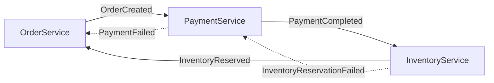
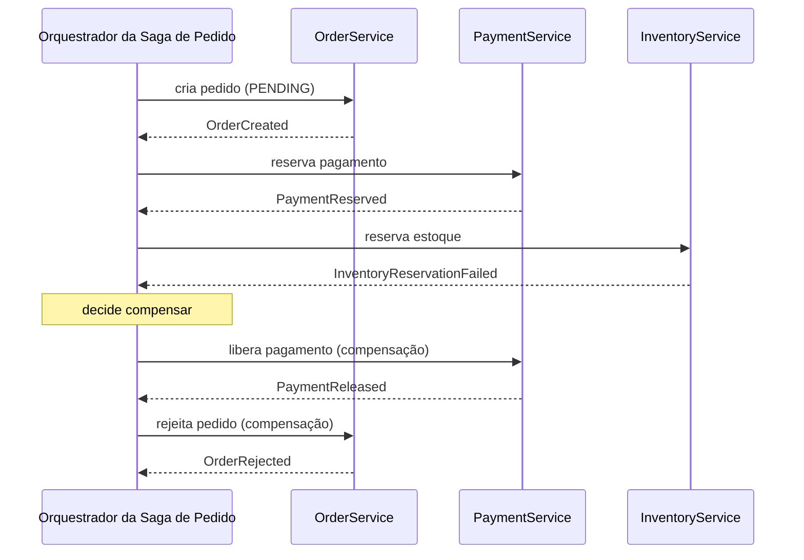

## Visão Geral

Fazer um pedido em um sistema de e-commerce toca pelo menos três serviços que cada um possui seus próprios dados: `OrderService` cria o pedido, `PaymentService` cobra o cliente, e `InventoryService` reserva o estoque. Em um monólito com um banco de dados isso é um único método `@Transactional` e as garantias ACID da plataforma cuidam do resto. Uma vez que esses são serviços separados com bancos de dados separados, não há um único log de commit para tornar a operação inteira atômica. [Two-phase commit](distributed-transactions-and-two-phase-commit) poderia, em princípio, manter locks através de todos os três bancos de dados até que todo participante concorde em confirmar — mas isso requer um coordenador de transação compartilhado, bloqueia no participante mais lento e menos disponível, e poucos brokers de mensagens ou APIs de pagamento de terceiros o suportam. O padrão saga abre mão de atomicidade e isolamento em toda a operação e os substitui por algo mais fraco mas alcançável: uma sequência de transações locais, cada uma confirmada independentemente, com uma **transação compensatória** explícita definida para cada passo que pode semanticamente desfazê-lo se um passo posterior falhar. Isso não é "2PC mas eventualmente consistente" — é um modelo de consistência genuinamente diferente, porque nada é jamais desfeito no sentido de banco de dados, e outras transações podem observar a operação em andamento. Entender uma saga significa entender exatamente o que essa troca compra e o que custa.

## Origens: Transações de Longa Duração e a Saga Original

O termo vem do artigo de 1987 de Hector Garcia-Molina e Kenneth Salem, "Sagas," escrito para um problema de banco de dados, não microsserviços: **transações de longa duração (LLTs)** — pense em uma sessão de ferramenta CAD ou uma atualização em lote tocando milhões de linhas — que mantêm locks por tanto tempo que estrangulam a concorrência para todos os outros. A proposta deles foi definir uma LLT como uma saga: uma sequência de transações `T1, T2, …, Tn`, cada uma podendo confirmar independentemente e liberar seus locks imediatamente, junto com um conjunto correspondente de transações compensatórias `C1, C2, …, Cn-1`. Se a saga rodar até a conclusão, o banco de dados só precisa da garantia de que ou todas de `T1..Tn` completam, ou, para qualquer prefixo que completou, as compensações correspondentes rodam em ordem reversa para que o efeito líquido seja como se a saga nunca tivesse começado. Crucialmente, o modelo do artigo permite que outras transações se intercalem com os passos de uma saga — todo o ponto era parar de manter locks por toda a vida da LLT. Essa suposição de intercalação é a semente de tudo o que uma saga custa hoje: abrir mão de locks longos e um único ponto de commit necessariamente significa abrir mão de isolamento ao longo da sequência.

*Microservices Patterns* de Chris Richardson (Manning, 2018), Capítulo 4, "Managing transactions with sagas," é a reformulação prática, orientada a serviços, da mesma ideia: uma saga é uma sequência de transações locais, cada uma realizada por um único serviço, coordenadas de forma que se um passo falhar, os passos previamente completados sejam desfeitos via transações compensatórias em vez de um rollback de banco de dados.

## Orquestração vs. Coreografia

Uma saga precisa de *algo* para decidir o que acontece depois que cada transação local completa, e há duas formas estruturalmente diferentes de posicionar essa tomada de decisão.

**Coreografia** não tem coordenador algum. Cada participante confirma sua transação local e publica um evento de domínio; outros participantes se inscrevem em eventos que lhes importam e reagem rodando sua própria transação local e publicando seu próprio evento.



Coreografia mantém os serviços completamente desacoplados — nenhum serviço conhece o workflow inteiro, apenas "o que eu faço quando vejo este evento". Essa também é sua fraqueza em qualquer escala real: o processo de negócio geral fica espalhado entre os handlers de evento de N serviços sem um único lugar para lê-lo, dependências cíclicas de evento são fáceis de introduzir por acidente, e adicionar um novo passo (digamos, uma verificação de fraude) significa editar os contratos de evento de todo serviço adjacente a ele no fluxo.

**Orquestração** introduz um coordenador explícito — Richardson o chama de orquestrador de saga — que conhece a sequência inteira, envia um comando explícito para cada participante por vez, e interpreta a resposta para decidir se prossegue ou inicia compensação.



Orquestração torna o workflow legível em um lugar, o que importa enormemente uma vez que uma saga tem cinco ou mais passos ou ramos condicionais. O custo é que o orquestrador se torna um componente com estado, durável, por direito próprio — precisa sobreviver a crashes e retomar exatamente de onde parou, ou a saga pode ficar permanentemente pela metade. Essa é precisamente a lacuna que motores de workflow como Temporal, Camunda e AWS Step Functions existem para preencher: eles persistem duravelmente o estado de execução do orquestrador para que "em qual passo eu estava" sobreviva a crashes de processo sem que a equipe de aplicação tenha que construir essa persistência ela mesma. Há também um risco de design específico da orquestração: é fácil deixar lógica de negócio que pertence aos serviços participantes vazar para o orquestrador, transformando-o em uma segunda implementação de fato das regras desses serviços.

A orientação de Richardson, ecoada na página "Pattern: Saga" do microservices.io, é usar orquestração como padrão uma vez que uma saga tem mais de alguns participantes ou qualquer ramificação condicional, e reservar coreografia para sequências curtas e lineares onde o desacoplamento vale mais que a visibilidade.

## Transações Compensatórias Não São Rollback

A distinção mais importante que uma saga te força: uma transação compensatória é uma nova transação local, avançando para frente, que semanticamente desfaz o efeito de uma transação já confirmada — não é um `ROLLBACK` de banco de dados, porque a transação que ela desfaz já foi confirmada e seus efeitos (linhas, eventos, efeitos colaterais em outros sistemas) podem já estar visíveis para o resto do mundo.

```java
// Transação de avanço, já confirmada.
void reservePayment(OrderId orderId, Money amount) {
    paymentRepository.reserve(orderId, amount);      // segura fundos
    outbox.publish(new PaymentReserved(orderId, amount));
}

// Transação compensatória — uma nova operação, não um desfazer.
void releasePayment(OrderId orderId, Money amount) {
    paymentRepository.release(orderId, amount);       // libera a retenção
    outbox.publish(new PaymentReleased(orderId, amount));
}
```

Para uma retenção monetária, "liberar a retenção" é um inverso semântico limpo. Muitas operações reais não são tão arrumadas: não há transação compensatória que verdadeiramente desfaça "enviou ao cliente um e-mail de confirmação de envio" — o melhor que você pode fazer é enviar um segundo e-mail dizendo que o pedido foi cancelado, que é um evento de negócio diferente, não um inverso. Projetar uma saga, portanto, significa verificar, passo a passo, se toda ação tem uma compensação viável, e se não, reordenar a saga para que passos irreversíveis ou difíceis de compensar rodem por último, depois que tudo mais facilmente desfeito já tiver sucedido — Richardson chama isso de contramedida da "visão pessimista", discutida abaixo, e se aplica ao design de compensação em geral, não apenas ao isolamento.

Compensações também precisam ser idempotentes e retentáveis pela mesma razão que os passos de avanço precisam ser, e — isso é fácil de perder — uma transação compensatória é esperada para (quase) sempre ter sucesso. Se `releasePayment` pode ela mesma falhar por razões de negócio, a saga agora precisa de uma compensação para a compensação, e essa regressão tem que terminar em algum lugar em um pequeno conjunto de operações deliberadamente construídas para serem tão próximas de infalíveis quanto o domínio permite.

## O Que Sagas Não Te Dão: Isolamento

Uma transação ACID local dentro de um passo te dá isolamento *dentro* daquele passo, mas a saga como um todo não tem isolamento. Entre o momento em que `OrderService` confirma `OrderCreated` e o momento em que `InventoryService` confirma `InventoryReserved`, o pedido existe em um estado intermediário que qualquer outra transação — incluindo outra saga completamente — pode ler. O livro de Richardson nomeia as anomalias resultantes explicitamente, por analogia com as anomalias clássicas de nível de isolamento:

- **Atualizações perdidas** — o passo de uma saga sobrescreve uma mudança feita por outra transação concorrente sem nunca lê-la.
- **Leituras sujas** — uma transação (ou outra saga) lê o estado em andamento, ainda não finalizado de uma saga, ex.: uma consulta de relatório contando um pedido como "confirmado" antes do pagamento realmente ter sido processado.
- **Leituras difusas/não repetíveis** — dois participantes na mesma saga, ou uma saga e um leitor externo, veem valores diferentes para os mesmos dados em pontos diferentes porque um passo confirmou no meio.

Como não há isolamento para recorrer, o design da saga precisa incorporar contramedidas deliberadamente. Richardson descreve cinco, extraídas tanto do artigo original de Garcia-Molina/Salem quanto do design prático de serviços:

- **Lock semântico** — marcar o registro como "pendente" enquanto uma saga está em andamento (ex.: o status de um pedido é `PENDING_PAYMENT`, não `CONFIRMED`), para que outras transações e outras sagas possam reconhecer o estado em progresso e escolher esperar, rejeitar, ou compensar em vez de agir sobre ele como se fosse final.
- **Atualizações comutativas** — projetar a atualização de cada passo para que produza o mesmo resultado independentemente da ordem em que é aplicada em relação à sua própria compensação, ex.: modelar uma mudança de saldo como um delta de crédito/débito em vez de uma sobrescrita absoluta, para que um passo de avanço e sua compensação posterior possam ser aplicados e revertidos sem precisar saber a ordenação exata.
- **Visão pessimista** — reordenar a saga para que o passo mais difícil de compensar, ou cuja visibilidade parcial é mais perigosa, rode o mais tarde possível, minimizando a janela durante a qual uma anomalia é possível.
- **Reler valor** — antes de sobrescrever um registro, relê-lo e confirmar que não mudou desde que a saga o observou pela última vez (uma verificação de concorrência otimista), para que um passo não simplesmente atropele uma atualização concorrente que nunca viu.
- **Arquivo de versão** — registrar toda operação contra um registro para que chegadas fora de ordem (ex.: uma compensação chegando depois que um passo de avanço posterior já rodou) possam ser reconhecidas e reconciliadas em vez de silenciosamente corromper o estado; este é o descendente direto da contramedida original de Garcia-Molina e Salem para passos de saga que se intercalam com transações não relacionadas.

Nenhuma dessas recupera isolamento verdadeiro — são mitigações direcionadas para a anomalia específica à qual uma dada saga está exposta, escolhidas por passo, não uma garantia geral.

## Idempotência e Novas Tentativas

Todo passo em uma saga — avanço ou compensação — roda sobre uma rede não confiável e contra serviços que podem travar no meio de uma requisição, então todo passo precisa ser seguro para tentar de novo. Um orquestrador que chama `PaymentService.reserve()` e recebe um timeout genuinamente não sabe se a reserva aconteceu; tentar de novo sem uma chave de idempotência arrisca reservar os fundos duas vezes. A correção padrão é a mesma usada em todo sistema distribuído: todo comando carrega uma chave de idempotência estável — tipicamente `(sagaId, stepName)` — e o serviço receptor deduplica nessa chave, seja via uma restrição única em uma tabela de comandos-já-processados ou um upsert chaveado por ela. Isso se aplica com igual força a compensações: tentar de novo `releasePayment` após um timeout não deve liberar fundos duas vezes, ou reembolsar um cliente duas vezes.

O próprio orquestrador precisa da mesma propriedade pela outra direção — precisa conseguir travar e retomar sem perder o rastro de quais passos já rodaram, o que é por que motores de execução durável como o Temporal persistem a conclusão de cada passo como parte do histórico de eventos do workflow em vez de confiar em estado em memória.

## Sagas e o Padrão Outbox Transacional

Todo passo de uma saga é, por baixo, exatamente o problema que [o padrão outbox transacional](outbox-pattern) existe para resolver: um serviço precisa atualizar seu próprio banco de dados *e* notificar de forma confiável o resto da saga que o passo aconteceu, e essas duas coisas não podem ser uma operação atômica através de um banco de dados e um broker de mensagens. Em uma saga coreografada isso é óbvio — a transação local de cada participante e seu evento de domínio de saída são precisamente uma escrita outbox. Em uma saga orquestrada é menos visível mas ainda está lá: quando `PaymentService` termina de reservar fundos, precisa atomicamente confirmar essa reserva e arranjar de forma durável para dizer ao orquestrador que teve sucesso, que é novamente um problema de escrita-local-mais-notificação, resolvido da mesma forma. Os dois padrões não são competidores — uma saga define o workflow entre serviços e sua lógica de compensação, enquanto o padrão outbox é o mecanismo de confiabilidade em que cada passo individual tipicamente se apoia internamente para garantir que "eu fiz o trabalho" e "eu contei a todos" não saiam de sincronia.

## Trade-offs

- **Você ganha disponibilidade e autonomia de serviço, e abre mão de atomicidade e isolamento.** Cada serviço confirma em seu próprio banco de dados independentemente e nunca bloqueia mantendo um lock entre serviços, mas o preço é que estados intermediários da saga são visíveis para o resto do sistema e precisam ser projetados para isso, não assumidos como inexistentes.
- **Compensação é uma atividade de design, não um mecanismo de runtime.** Ao contrário de um rollback de banco de dados, que o motor de armazenamento te dá de graça, todo passo de avanço precisa de uma transação compensatória escrita à mão e testada — e algumas operações (um e-mail já enviado, um webhook já entregue a um terceiro) não têm inverso verdadeiro, forçando a ordem dos passos da saga a ser escolhida em torno da irreversibilidade.
- **Orquestração troca desacoplamento por visibilidade, e essa troca fica melhor conforme a saga cresce.** Uma coreografia de dois passos pode ser mais simples sem orquestrador algum; uma saga de dez passos com caminhos de falha ramificados se torna ilegível e insegura sem um, o que é por que motores de workflow de produção como Temporal ou Camunda existem especificamente para hospedar esse orquestrador de forma durável.
- **Idempotência não é infraestrutura opcional, é um requisito de correção.** Todo passo de avanço e compensação precisa tolerar entrega pelo menos-uma-vez e novas tentativas; pular isso é a fonte mais comum de bugs reais em implementações de saga — cobranças duplas, reembolsos duplos, ou uma compensação que nunca resolve porque assumiu execução exatamente-uma-vez.
- **Uma saga pode ficar presa em um estado que 2PC nunca permitiria.** Se uma transação compensatória ela mesma falha repetidamente (a API de reembolso está fora do ar, o sistema do armazém rejeita a liberação), a saga não tem uma válvula de escape embutida de "abortar tudo" da forma que uma transação 2PC bloqueada por coordenador tem — precisa de monitoramento, alertas, e frequentemente um caminho de intervenção manual ou dead-letter como último recurso.

## Perguntas de Entrevista

- Por que você não pode simplesmente usar two-phase commit entre `OrderService`, `PaymentService` e `InventoryService` em vez de uma saga — o que especificamente quebra?
- Explique a diferença entre uma transação compensatória e um rollback de banco de dados. Dê um exemplo de um passo que não tem compensação limpa e descreva como você o trataria.
- Percorra uma anomalia concreta que uma saga pode expor por não ter isolamento, e nomeie uma contramedida do livro de Richardson que a mitigaria.
- Quando você escolheria coreografia sobre orquestração para uma saga, e o que especificamente piora conforme você adiciona mais participantes a uma saga coreografada?
- O orquestrador de uma saga chama a API de um participante, a chamada expira, e o orquestrador tenta de novo. O que precisa ser verdade do lado do participante para que essa nova tentativa seja segura, tanto para passos de avanço quanto compensações?
- O que acontece no seu design se uma transação compensatória ela mesma falha repetidamente — percorra o que a saga faz a seguir.

## Referências

- [Hector Garcia-Molina e Kenneth Salem, "Sagas" (ACM SIGMOD Record, Vol. 16, No. 3, 1987)](https://dl.acm.org/doi/10.1145/38714.38742) — o artigo original, escrito para transações de banco de dados de longa duração, que introduziu o modelo sequência-de-transações-mais-compensações.
- Chris Richardson, [*Microservices Patterns*](https://www.manning.com/books/microservices-patterns) (Manning, 2018) — Capítulo 4, "Managing transactions with sagas": orquestração vs. coreografia, transações compensatórias, e as contramedidas de isolamento (lock semântico, atualizações comutativas, visão pessimista, reler valor, arquivo de versão).
- [Chris Richardson — "Pattern: Saga" (microservices.io)](https://microservices.io/patterns/data/saga.html)
- [Emily Fortuna, "Compensating Actions: Part of a Complete Breakfast (with Sagas)" (Temporal blog, 2023)](https://temporal.io/blog/compensating-actions-part-of-a-complete-breakfast-with-sagas) — o tratamento prático de um motor de execução durável para registrar e rodar compensações.
</content>
