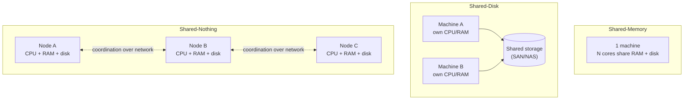

## Overview

"Is this system scalable?" is not a question that has an answer. **Scalability** is a system's ability to cope with increased load, and load is not one-dimensional — a system that comfortably absorbs 10x the read traffic may collapse under 2x the write fan-out, so the only useful form of the question is "scalable along which dimension, to what load, at what cost?" And scalability is only half of what keeps a system alive: the majority of software cost is not initial development but ongoing maintenance — fixing bugs, keeping it running, adapting it to requirements nobody anticipated. **Maintainability** is the discipline of designing for that, and it decomposes into three properties you can optimize separately: operability, simplicity, and evolvability.

## Understanding Load: Pick the Right Parameter

Before you can ask "what happens if load doubles?", you need a number that actually describes the current load. Usually that's a throughput metric — requests per second, gigabytes of new data per day, checkouts per hour — or the peak of a variable quantity, like simultaneously connected users. But the raw request rate is often the *least* interesting thing about a workload. What determines whether the architecture holds are the statistical characteristics of the load:

```
ratio of reads to writes
cache hit rate
number of data items per user (followers, documents, devices)
distribution of that number — average vs. p99 vs. the one outlier account
size distribution of individual requests
```

The canonical illustration is a social network's home timeline. At 5,800 posts per second, the posting rate is not the problem — a single machine can accept 5,800 writes/sec. The problem is the **fan-out factor**: if each post has to be delivered into the materialized timeline of every follower, and the average user has 200 followers, that's over a million timeline writes per second. And the *average* isn't even the hard part — the distribution is. Most users have a handful of followers; a celebrity has a hundred million. A post from that one account is a single request that generates a hundred million writes, which is why real systems handle celebrity posts on a separate path (store them once, merge them in at read time) rather than fanning them out at all.

That's the shape of the lesson: **the load parameter that matters is the one that drives your specific bottleneck**, and finding it usually means understanding the access pattern, not counting HTTP requests. Two systems with identical data throughput — 100,000 requests/sec of 1 kB each, versus 3 requests/minute of 2 GB each — both move 100 MB/second and look nothing alike.

Once you have the parameter, there are exactly two ways to interrogate growth:

- Hold resources fixed and increase load — how does performance degrade?
- Hold performance fixed and increase load — how much extra hardware does it cost?

If doubling resources handles double the load at unchanged performance, you have **linear scalability**, which is the good case. Cost growing faster than linearly is the common case: with more data, a single write may simply involve more work than it did before, even though the request itself is the same size. "Performance stays unchanged" is measured at the tail, not the mean — see [Describing Performance](describing-performance-latency-and-percentiles) for why p99 response time under load is the number that actually tracks user experience, and why averages hide exactly the degradation you're looking for.

## Shared-Memory, Shared-Disk, Shared-Nothing

There are three broad architectural answers to "add more hardware," and they differ in what the machines share.

**Shared-memory** is a single machine with more of everything — more cores, more RAM, more disk. Every thread in the process addresses the same RAM, so parallelism is nearly free and there is no distributed-systems complexity at all. The catch is cost curvature and internal contention: a machine with twice the hardware of a lower-spec one typically costs substantially more than twice as much, and because of internal bottlenecks it usually can't handle twice the load anyway.

**Shared-disk** uses several machines with independent CPUs and RAM, all reading and writing one shared storage array over a fast network (NAS or SAN). It removes the single-machine ceiling on compute while keeping one copy of the data, which is why it was the traditional shape for on-premises data warehousing. But every machine contends for the same storage, and the locking needed to keep them coherent is what caps its scalability.

**Shared-nothing** gives each node its own CPUs, RAM, and disks, with all coordination done in software over a conventional network. It has the potential to scale linearly, can be built from whatever hardware has the best price/performance, resizes with demand, and can span datacenters for fault tolerance. The price is explicit sharding and the full complexity of distributed systems. This is the dominant modern approach, and it's the same thing as horizontal scaling — [Horizontal vs. Vertical Scaling](horizontal-vs-vertical-scaling) covers the scale-out mechanics, the statelessness prerequisite, and autoscaling in depth.

One modern wrinkle worth naming: cloud-native databases that separate storage from compute (multiple compute nodes over one storage service) structurally resemble shared-disk, but they avoid its historical scalability wall by exposing a purpose-built API for the database's access patterns instead of a generic filesystem or block-device abstraction. The old contention argument doesn't automatically apply to them.



## Principles for Scalability

There is no generic, one-size-fits-all scalable architecture — no magic scaling sauce. Architectures that operate at large scale are built around a specific set of load assumptions, and those assumptions are load-bearing: an architecture appropriate for one level of load is unlikely to cope with 10 times that load. On a fast-growing service you should expect to rethink the architecture at roughly every order of magnitude, which is also the reason it is rarely worth planning more than one order of magnitude ahead. Beyond that horizon, the product's requirements will have changed enough to invalidate the design anyway.

That makes premature scaling genuinely expensive, not merely wasted. For a young product with few users, the overriding goal is staying simple and flexible enough to change the product as you learn what customers need. In the best case, speculative scalability work is effort spent on load that never arrives; in the worst case it locks you into an inflexible design that makes the product harder to evolve — you pay twice, once to build it and again every time you fight it.

Two principles do generalize:

- **Break the system into components that can operate largely independently.** This is the shared idea underneath microservices, sharding, stream processing, and shared-nothing architectures. The hard part is not the principle but the placement: knowing which things belong together and which belong apart.
- **Don't make it more complicated than necessary.** If a single-machine database does the job, it beats a distributed setup. Autoscaling is elegant, but if your load is predictable, a manually scaled system has fewer operational surprises. A system with 5 services is simpler than one with 50. Good architectures are usually a pragmatic mixture, not a doctrine.

## Maintainability: Three Properties, Not One Feeling

Software doesn't wear out or suffer material fatigue, but requirements change, platforms and dependencies move underneath it, and bugs surface. Most of the lifetime cost of a system lands here — investigating failures, adapting to new platforms, repaying technical debt, adding features. Every system valuable enough to survive eventually becomes somebody's legacy system, often maintained by people who never met the engineers who designed it, which makes maintenance as much a people problem as a technical one. Designing for maintainability means designing for those people. It splits into three properties that can be improved independently.

### Operability: Making Life Easy for Operations

Good operations can often work around the limitations of bad or incomplete software; good software cannot run reliably with bad operations. Operability is about making the *routine* tasks easy, so the operations team's attention is available for the non-routine ones. Concretely, a system with good operability:

- Exposes its key metrics to monitoring, and enough internal detail to observability tooling that you can ask questions you didn't anticipate at deploy time.
- Avoids depending on any individual machine, so a box can be drained and patched while the system keeps serving.
- Documents an operational model simple enough to reason about: "if I do X, Y will happen."
- Ships good defaults but lets an administrator override them.
- Self-heals where that's safe, while still allowing manual control of system state.
- Behaves *predictably*, which is the property all the others serve.

Automation is the obvious lever and it is double-edged. In a fleet of thousands of machines manual maintenance is untenable, so automation is essential — but the cases automation can't handle are precisely the rare, complex failures, so more automation demands a *more* skilled operations team, not a less skilled one. And an automated system that misbehaves is often harder to debug than a manual procedure that misbehaves. The sweet spot is specific to your system and your organization; "more automation" is not monotonically better.

### Simplicity: Managing Complexity

Complexity slows down everyone who touches the system and raises the odds that any given change introduces a bug, because hidden assumptions and unexpected interactions are easier to overlook in a codebase nobody fully holds in their head — the big ball of mud. Simplicity is not a cosmetic concern; it is the input to every other maintainability property.

It's also slippery. There's no objective standard: one system hides a complex implementation behind a simple interface, another has a simple implementation that leaks internal detail to its callers — which is "simpler" depends on who's asking. The **essential vs. accidental** split (complexity inherent to the problem domain versus complexity that exists only because of our tooling) is a useful lens, but not a clean one, since the boundary moves as tooling improves.

The strongest tool available is **abstraction**. A good abstraction hides a large amount of implementation detail behind a clean façade *and* serves a wide range of uses, so improvements to it benefit everything built on top. High-level languages abstract away machine code, registers, and syscalls; SQL abstracts away on-disk data structures, concurrent access from other clients, and crash recovery. Concretely, in application code this is the difference between a `PricingService` with fourteen `if (country == ...)` branches accumulated over three years of promotions, and one `PricingRule` interface with fourteen small implementations plus a resolver: the same essential complexity — the fourteen rules are the business — but the accidental complexity of holding them all in one function while trying to add a fifteenth is gone.

### Evolvability: Making Change Easy

Requirements will not stay fixed. New facts arrive, unanticipated use cases emerge, priorities shift, regulation changes, and growth itself forces architectural change. **Evolvability** — the book's chosen term over "extensibility" or "modifiability," to name agility at the level of a whole data system rather than a single codebase — is how cheaply the system can absorb that.

The useful test is concrete: pick a genuinely new requirement plausible six months out — "the same product must now be sold in a second currency with its own tax rules," or "compliance requires the last three years of every user's data on request" — and ask how many components have to change, whether any of the changes are coordinated deploys across teams, and how you'd back out. Loosely coupled, simple systems answer that well, which is why evolvability is downstream of simplicity and good abstractions rather than a separate discipline.

The other major drag on change is **irreversibility**. Migrating from one database to another is a categorically different risk if you can't switch back — the decision has to be right the first time, so it takes longer, involves more people, and gets deferred. Every mechanism that makes a change reversible (dual writes with a read switch, feature flags, shadow traffic, keeping the old path warm for a week) buys flexibility by converting a one-way door into a two-way one. Minimizing irreversibility is one of the highest-leverage things you can do for evolvability.

## Trade-offs

- **Naming a specific load parameter makes scalability discussable, but the wrong parameter optimizes the wrong thing** — a team that tracks requests/sec on a system whose real constraint is per-item fan-out will scale the web tier repeatedly and never touch the bottleneck.
- **Shared-nothing scales furthest but imports the full cost of distributed systems** — explicit sharding, partial failures, and coordination protocols are not optional extras, they are the mechanism; shared-memory remains the right answer whenever one machine still fits.
- **Planning for 10x load is prudent; planning for 100x is usually waste** — architectures are built around load assumptions that expire, and a design hardened for load that never arrives is harder to change when the real requirement shows up.
- **More automation improves operability up to a point, then inverts it** — the residue automation can't handle is the rare, complex failures, so heavy automation raises the skill floor for the operations team and makes incidents harder to debug, not easier.
- **Abstraction reduces complexity for callers by concentrating it somewhere else** — a leaky or wrong abstraction is worse than none, because it costs you the implementation detail *and* the accurate mental model of what's underneath.
- **Simplicity and evolvability usually align, but simplicity and short-term delivery speed often don't** — the special case bolted onto a working function ships this week; the abstraction that would have absorbed it cleanly pays off only on the fourth special case.

## Interview Questions

- A team says their service "scales fine — we're at 10,000 requests/sec and CPU is at 30%." What have they not told you, and what would you ask to find the actual bottleneck?
- Why is a celebrity account with 100 million followers an architectural problem rather than just a bigger version of a normal account's problem?
- Cloud databases that separate storage from compute look like shared-disk architectures. Why don't they inherit shared-disk's classic scalability limits?
- A startup with 500 users wants to build a sharded, multi-region architecture now "so we never have to migrate later." What's the argument against, beyond the cost of the work itself?
- Operability, simplicity, and evolvability are described as separately optimizable. Give a change that improves one and measurably degrades another.

## References

- [Martin Kleppmann, "Designing Data-Intensive Applications", 2nd Edition (O'Reilly) — Chapter 2, "Defining Nonfunctional Requirements", sections "Scalability" and "Maintainability"](https://www.oreilly.com/library/view/designing-data-intensive-applications/9781098119058/)
- [Michael Stonebraker — "The Case for Shared Nothing" (HPTS, 1985)](https://dsf.berkeley.edu/papers/hpts85-nothing.pdf)
- [Frederick P. Brooks Jr. — "No Silver Bullet: Essence and Accidents of Software Engineering" (IEEE Computer, 1987)](https://ieeexplore.ieee.org/document/1663532)
- [Google SRE Book — Monitoring Distributed Systems](https://sre.google/sre-book/monitoring-distributed-systems/)
