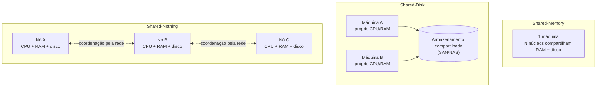

## Visão Geral

"Este sistema é escalável?" não é uma pergunta que tem uma resposta. **Escalabilidade** é a capacidade de um sistema de lidar com carga aumentada, e carga não é unidimensional — um sistema que absorve confortavelmente 10x o tráfego de leitura pode desmoronar sob 2x o fan-out de escrita, então a única forma útil da pergunta é "escalável ao longo de qual dimensão, para qual carga, a que custo?" E escalabilidade é apenas metade do que mantém um sistema vivo: a maioria do custo de software não é o desenvolvimento inicial mas a manutenção contínua — corrigir bugs, mantê-lo rodando, adaptá-lo a requisitos que ninguém antecipou. **Manutenibilidade** é a disciplina de projetar para isso, e se decompõe em três propriedades que você pode otimizar separadamente: operabilidade, simplicidade, e evolutibilidade.

## Entendendo Carga: Escolha o Parâmetro Certo

Antes de você poder perguntar "o que acontece se a carga dobrar?", você precisa de um número que de fato descreva a carga atual. Geralmente isso é uma métrica de throughput — requisições por segundo, gigabytes de novos dados por dia, checkouts por hora — ou o pico de uma quantidade variável, como usuários conectados simultaneamente. Mas a taxa bruta de requisições frequentemente é a coisa *menos* interessante sobre uma carga de trabalho. O que determina se a arquitetura aguenta são as características estatísticas da carga:

```
proporção de leituras para escritas
taxa de acerto do cache
número de itens de dado por usuário (seguidores, documentos, dispositivos)
distribuição desse número — média vs. p99 vs. a conta outlier única
distribuição de tamanho de requisições individuais
```

A ilustração canônica é a timeline doméstica de uma rede social. A 5.800 posts por segundo, a taxa de postagem não é o problema — uma única máquina consegue aceitar 5.800 escritas/seg. O problema é o **fator de fan-out**: se todo post precisa ser entregue na timeline materializada de todo seguidor, e o usuário médio tem 200 seguidores, isso é mais de um milhão de escritas de timeline por segundo. E a *média* nem é a parte difícil — a distribuição é. A maioria dos usuários tem um punhado de seguidores; uma celebridade tem cem milhões. Um post daquela única conta é uma única requisição que gera cem milhões de escritas, motivo pelo qual sistemas reais tratam posts de celebridades em um caminho separado (armazená-los uma vez, mesclá-los no momento de leitura) em vez de fazer fan-out deles de jeito nenhum.

Essa é a forma da lição: **o parâmetro de carga que importa é aquele que impulsiona seu gargalo específico**, e encontrá-lo geralmente significa entender o padrão de acesso, não contar requisições HTTP. Dois sistemas com throughput de dados idêntico — 100.000 requisições/seg de 1 kB cada, versus 3 requisições/minuto de 2 GB cada — ambos movem 100 MB/segundo e não se parecem em nada.

Uma vez que você tenha o parâmetro, existem exatamente duas formas de interrogar crescimento:

- Manter recursos fixos e aumentar carga — como o desempenho degrada?
- Manter desempenho fixo e aumentar carga — quanto hardware extra isso custa?

Se dobrar recursos trata o dobro da carga com desempenho inalterado, você tem **escalabilidade linear**, que é o bom caso. Custo crescendo mais rápido que linearmente é o caso comum: com mais dados, uma única escrita pode simplesmente envolver mais trabalho do que envolvia antes, mesmo que a própria requisição tenha o mesmo tamanho. "Desempenho permanece inalterado" é medido na cauda, não na média — veja [Describing Performance](describing-performance-latency-and-percentiles) para entender por que o tempo de resposta p99 sob carga é o número que de fato acompanha a experiência do usuário, e por que médias escondem exatamente a degradação que você está procurando.

## Shared-Memory, Shared-Disk, Shared-Nothing

Existem três respostas arquiteturais amplas para "adicionar mais hardware", e elas diferem no que as máquinas compartilham.

**Shared-memory** é uma única máquina com mais de tudo — mais núcleos, mais RAM, mais disco. Toda thread no processo endereça a mesma RAM, então paralelismo é quase gratuito e não há complexidade de sistemas distribuídos alguma. A pegadinha é a curvatura de custo e a contenção interna: uma máquina com o dobro do hardware de uma de especificação mais baixa tipicamente custa substancialmente mais que o dobro, e por causa de gargalos internos geralmente não consegue lidar com o dobro da carga de qualquer forma.

**Shared-disk** usa várias máquinas com CPUs e RAM independentes, todas lendo e escrevendo em um array de armazenamento compartilhado sobre uma rede rápida (NAS ou SAN). Ele remove o teto de máquina única sobre computação enquanto mantém uma cópia dos dados, motivo pelo qual era o formato tradicional para data warehousing on-premises. Mas toda máquina disputa o mesmo armazenamento, e o locking necessário para mantê-las coerentes é o que limita sua escalabilidade.

**Shared-nothing** dá a cada nó suas próprias CPUs, RAM, e discos, com toda coordenação feita em software sobre uma rede convencional. Tem o potencial de escalar linearmente, pode ser construído com o hardware de melhor custo/benefício, se redimensiona com a demanda, e pode se espalhar por datacenters para tolerância a falhas. O preço é sharding explícito e toda a complexidade de sistemas distribuídos. Esta é a abordagem moderna dominante, e é a mesma coisa que escalonamento horizontal — [Horizontal vs. Vertical Scaling](horizontal-vs-vertical-scaling) cobre a mecânica de scale-out, o pré-requisito de statelessness, e autoscaling em profundidade.

Uma nuance moderna que vale a pena nomear: bancos de dados nativos de nuvem que separam armazenamento de computação (múltiplos nós de computação sobre um serviço de armazenamento único) estruturalmente se parecem com shared-disk, mas evitam sua parede histórica de escalabilidade ao expor uma API feita sob medida para os padrões de acesso do banco de dados em vez de uma abstração genérica de sistema de arquivos ou dispositivo de bloco. O argumento antigo de contenção não se aplica automaticamente a eles.



## Princípios para Escalabilidade

Não existe uma arquitetura escalável genérica, tamanho-único — nenhum molho mágico de escalonamento. Arquiteturas que operam em grande escala são construídas em torno de um conjunto específico de suposições de carga, e essas suposições sustentam a estrutura: uma arquitetura apropriada para um nível de carga é improvável que aguente 10 vezes essa carga. Em um serviço em crescimento rápido você deve esperar repensar a arquitetura a aproximadamente cada ordem de grandeza, que também é o motivo pelo qual raramente vale a pena planejar mais de uma ordem de grandeza à frente. Além desse horizonte, os requisitos do produto terão mudado o suficiente para invalidar o design de qualquer forma.

Isso torna o escalonamento prematuro genuinamente caro, não meramente desperdiçado. Para um produto jovem com poucos usuários, o objetivo predominante é permanecer simples e flexível o suficiente para mudar o produto à medida que você aprende o que os clientes precisam. No melhor caso, trabalho especulativo de escalabilidade é esforço gasto em carga que nunca chega; no pior caso ele te tranca em um design inflexível que torna o produto mais difícil de evoluir — você paga duas vezes, uma para construí-lo e de novo toda vez que você briga com ele.

Dois princípios de fato generalizam:

- **Divida o sistema em componentes que podem operar amplamente de forma independente.** Essa é a ideia compartilhada por baixo de microsserviços, sharding, processamento de streaming, e arquiteturas shared-nothing. A parte difícil não é o princípio mas o posicionamento: saber quais coisas pertencem juntas e quais pertencem separadas.
- **Não torne mais complicado do que necessário.** Se um banco de dados de máquina única faz o trabalho, ele vence uma configuração distribuída. Autoscaling é elegante, mas se sua carga é previsível, um sistema escalado manualmente tem menos surpresas operacionais. Um sistema com 5 serviços é mais simples que um com 50. Boas arquiteturas geralmente são uma mistura pragmática, não uma doutrina.

## Manutenibilidade: Três Propriedades, Não Um Sentimento

Software não se desgasta nem sofre fadiga material, mas requisitos mudam, plataformas e dependências se movem por baixo, e bugs surgem. A maior parte do custo de vida de um sistema pousa aqui — investigar falhas, adaptar a novas plataformas, pagar dívida técnica, adicionar features. Todo sistema valioso o suficiente para sobreviver eventualmente se torna o sistema legado de alguém, frequentemente mantido por pessoas que nunca conheceram os engenheiros que o projetaram, o que torna manutenção tanto um problema de pessoas quanto técnico. Projetar para manutenibilidade significa projetar para essas pessoas. Ela se divide em três propriedades que podem ser melhoradas independentemente.

### Operabilidade: Facilitando a Vida das Operações

Boas operações frequentemente conseguem contornar as limitações de software ruim ou incompleto; bom software não consegue rodar de forma confiável com operações ruins. Operabilidade é sobre tornar as tarefas *rotineiras* fáceis, para que a atenção da equipe de operações fique disponível para as não rotineiras. Concretamente, um sistema com boa operabilidade:

- Expõe suas métricas-chave para monitoramento, e detalhe interno suficiente para ferramentas de observabilidade para que você consiga fazer perguntas que não antecipou no momento do deploy.
- Evita depender de qualquer máquina individual, para que uma caixa possa ser drenada e corrigida enquanto o sistema continua atendendo.
- Documenta um modelo operacional simples o suficiente para raciocinar sobre: "se eu fizer X, Y vai acontecer."
- Vem com bons padrões mas deixa um administrador sobrescrevê-los.
- Se autocura onde isso é seguro, enquanto ainda permite controle manual do estado do sistema.
- Se comporta de forma *previsível*, que é a propriedade que todas as outras servem.

Automação é a alavanca óbvia e é de dois gumes. Em uma frota de milhares de máquinas manutenção manual é insustentável, então automação é essencial — mas os casos que a automação não consegue lidar são precisamente as falhas raras e complexas, então mais automação exige uma equipe de operações *mais* qualificada, não menos qualificada. E um sistema automatizado que se comporta mal frequentemente é mais difícil de debugar do que um procedimento manual que se comporta mal. O ponto ideal é específico ao seu sistema e sua organização; "mais automação" não é monotonicamente melhor.

### Simplicidade: Gerenciando Complexidade

Complexidade desacelera todo mundo que toca no sistema e eleva as chances de que qualquer mudança dada introduza um bug, porque suposições ocultas e interações inesperadas são mais fáceis de ignorar em uma base de código que ninguém segura por completo na cabeça — a bola de lama gigante. Simplicidade não é uma preocupação cosmética; é o insumo para toda outra propriedade de manutenibilidade.

Também é escorregadia. Não há um padrão objetivo: um sistema esconde uma implementação complexa atrás de uma interface simples, outro tem uma implementação simples que vaza detalhe interno para seus chamadores — qual é "mais simples" depende de quem está perguntando. A divisão **essencial vs. acidental** (complexidade inerente ao domínio do problema versus complexidade que existe apenas por causa de nossa ferramentaria) é uma lente útil, mas não limpa, já que a fronteira se move à medida que a ferramentaria melhora.

A ferramenta mais forte disponível é a **abstração**. Uma boa abstração esconde uma grande quantidade de detalhe de implementação atrás de uma fachada limpa *e* serve uma ampla gama de usos, então melhorias nela beneficiam tudo construído em cima. Linguagens de alto nível abstraem código de máquina, registradores, e syscalls; SQL abstrai estruturas de dados em disco, acesso concorrente de outros clientes, e recuperação de crash. Concretamente, em código de aplicação essa é a diferença entre um `PricingService` com quatorze branches `if (country == ...)` acumulados ao longo de três anos de promoções, e uma interface `PricingRule` com quatorze pequenas implementações mais um resolvedor: a mesma complexidade essencial — as quatorze regras são o negócio — mas a complexidade acidental de mantê-las todas em uma função enquanto tenta adicionar uma décima quinta desapareceu.

### Evolutibilidade: Facilitando a Mudança

Requisitos não vão permanecer fixos. Novos fatos chegam, casos de uso não antecipados emergem, prioridades mudam, regulação muda, e crescimento em si força mudança arquitetural. **Evolutibilidade** — o termo escolhido pelo livro em vez de "extensibilidade" ou "modificabilidade", para nomear agilidade no nível de um sistema de dados inteiro em vez de uma única base de código — é o quão barato o sistema consegue absorver isso.

O teste útil é concreto: escolha um requisito genuinamente novo plausível daqui a seis meses — "o mesmo produto agora precisa ser vendido em uma segunda moeda com suas próprias regras tributárias", ou "compliance exige os últimos três anos de dados de todo usuário sob requisição" — e pergunte quantos componentes precisam mudar, se alguma das mudanças são deploys coordenados entre equipes, e como você reverteria. Sistemas fracamente acoplados e simples respondem isso bem, motivo pelo qual evolutibilidade é decorrente de simplicidade e boas abstrações em vez de uma disciplina separada.

O outro grande freio à mudança é a **irreversibilidade**. Migrar de um banco de dados para outro é um risco categoricamente diferente se você não conseguir voltar atrás — a decisão precisa estar certa da primeira vez, então leva mais tempo, envolve mais pessoas, e é adiada. Todo mecanismo que torna uma mudança reversível (escritas duplas com uma chave de leitura, feature flags, tráfego sombra, manter o caminho antigo aquecido por uma semana) compra flexibilidade ao converter uma porta de mão única em uma de mão dupla. Minimizar irreversibilidade é uma das coisas de maior alavancagem que você pode fazer pela evolutibilidade.

## Trade-offs

- **Nomear um parâmetro de carga específico torna escalabilidade discutível, mas o parâmetro errado otimiza a coisa errada** — uma equipe que rastreia requisições/seg em um sistema cuja restrição real é fan-out por item vai escalar a camada web repetidamente e nunca tocar no gargalo.
- **Shared-nothing escala mais longe mas importa o custo total de sistemas distribuídos** — sharding explícito, falhas parciais, e protocolos de coordenação não são extras opcionais, são o mecanismo; shared-memory permanece a resposta certa sempre que uma máquina ainda cabe.
- **Planejar para 10x de carga é prudente; planejar para 100x geralmente é desperdício** — arquiteturas são construídas em torno de suposições de carga que expiram, e um design endurecido para carga que nunca chega é mais difícil de mudar quando o requisito real aparece.
- **Mais automação melhora operabilidade até um ponto, depois inverte** — o resíduo que a automação não consegue tratar são as falhas raras e complexas, então automação pesada eleva o piso de habilidade exigido da equipe de operações e torna incidentes mais difíceis de debugar, não mais fáceis.
- **Abstração reduz complexidade para chamadores concentrando-a em outro lugar** — uma abstração vazada ou errada é pior do que nenhuma, porque custa a você o detalhe de implementação *e* o modelo mental preciso do que está por baixo.
- **Simplicidade e evolutibilidade geralmente se alinham, mas simplicidade e velocidade de entrega de curto prazo frequentemente não** — o caso especial parafusado em uma função funcionando é lançado nesta semana; a abstração que teria absorvido isso de forma limpa só se paga no quarto caso especial.

## Perguntas de Entrevista

- Uma equipe diz que seu serviço "escala bem — estamos a 10.000 requisições/seg e a CPU está a 30%." O que eles não te contaram, e o que você perguntaria para encontrar o gargalo real?
- Por que uma conta de celebridade com 100 milhões de seguidores é um problema arquitetural em vez de apenas uma versão maior do problema de uma conta normal?
- Bancos de dados em nuvem que separam armazenamento de computação parecem arquiteturas shared-disk. Por que eles não herdam os limites clássicos de escalabilidade do shared-disk?
- Uma startup com 500 usuários quer construir uma arquitetura particionada e multi-região agora "para nunca precisarmos migrar depois." Qual é o argumento contra, além do custo do trabalho em si?
- Operabilidade, simplicidade, e evolutibilidade são descritas como separadamente otimizáveis. Dê uma mudança que melhora uma e mensuravelmente degrada outra.

## Referências

- [Martin Kleppmann, "Designing Data-Intensive Applications", 2ª Edição (O'Reilly) — Capítulo 2, "Defining Nonfunctional Requirements", seções "Scalability" e "Maintainability"](https://www.oreilly.com/library/view/designing-data-intensive-applications/9781098119058/)
- [Michael Stonebraker — "The Case for Shared Nothing" (HPTS, 1985)](https://dsf.berkeley.edu/papers/hpts85-nothing.pdf)
- [Frederick P. Brooks Jr. — "No Silver Bullet: Essence and Accidents of Software Engineering" (IEEE Computer, 1987)](https://ieeexplore.ieee.org/document/1663532)
- [Google SRE Book — Monitoring Distributed Systems](https://sre.google/sre-book/monitoring-distributed-systems/)
