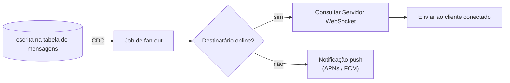
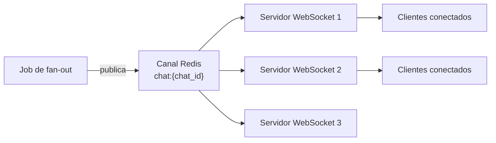

## Visão Geral

O [design de alto nível para um sistema de chat estilo Slack](designing-a-large-scale-chat-system) cobre o caminho feliz para quatro features em nível de quadro branco, mas uma entrevista de nível sênior continua empurrando: o que acontece a um bilhão de usuários, quando o próprio servidor de chat se torna um gargalo, quando uma mensagem chega fora de ordem, ou quando a conexão WebSocket de um usuário fica pulando entre nós? Este conceito percorre quatro deep dives que tipicamente seguem o design de alto nível em uma entrevista de system design: ordenação de mensagens, fan-out de WebSocket em escala, churn de conexão WebSocket, e pressão no armazenamento de backend.

## Por Que Ordenação de Mensagens É Difícil em Escala

Duas mensagens enviadas com poucos instantes de diferença — "festa às 17h, você consegue vir?" seguida de "sim, combinado" — mudam completamente de significado se entregues fora de ordem. Três opções existem para garantir ordenação por chat:

1. **Timestamps do lado do cliente.** Frágil: relógios de cliente são descentralizados e não sincronizados, então ordenar por timestamp do cliente pode silenciosamente desordenar mensagens sempre que os relógios de dois dispositivos perdem sincronia entre si.
2. **Número de sequência do lado do servidor por chat.** Funciona, mas exige um contador consistente entre todo nó tratando aquele chat — coordenar esse contador entre múltiplos data centers adiciona complexidade de infraestrutura real e se torna um gargalo em escala.
3. **Ingestão ordenada baseada em Kafka por chat (recomendado).** Particione um tópico Kafka por `chat_id`. Toda mensagem para um dado chat sempre cai na mesma partição, e o Kafka garante ordem *dentro de* uma partição. À medida que o volume de chat cresce, adicione mais partições; a própria replicação e rastreamento de offset do Kafka trata recuperação de falha (um consumidor que trava reentrega a partir do seu último offset commitado sem perda de mensagem) — veja [Message Brokers: Queues vs. Log-Based Streaming](message-brokers-queues-vs-logs) para entender por que um broker baseado em log, não uma fila simples, é o que fornece essa garantia.

## Ingestão Ordenada Baseada em Kafka Por Chat

Com o Kafka introduzido, o servidor de chat escreve toda mensagem aceita em um tópico Kafka particionado por `chat_id` em vez de (ou além de) tratar o fan-out ele mesmo de forma síncrona:

```
Servidor de Chat --> Tópico Kafka (particionado por chat_id) --> Grupo de consumidores --> DB + fan-out
```

Toda partição é consumida por exatamente um consumidor dentro de um grupo de consumidores, então todas as mensagens para um chat são processadas na ordem em que foram produzidas, por um único consumidor, sem coordenação entre nós para a ordenação daquele chat.

## Jobs de Fan-out Orientados por CDC (Removendo o Servidor de Chat Como Gargalo)

Em vez de fazer o próprio servidor de chat decidir "esse destinatário está online, offline — para onde eu envio isso?" para toda mensagem (tornando-o um caminho quente único tanto para escritas quanto para lógica de entrega), essa responsabilidade pode ser movida para um **job de fan-out** separado, disparado por [Change Data Capture](change-data-capture) na escrita da tabela de mensagens. No momento em que uma linha de mensagem commita, o CDC (por exemplo, Debezium lendo o write-ahead log do banco de dados) emite um evento de mudança que um worker de fan-out consome independentemente:



Isso desacopla "persistir a mensagem" de "descobrir a entrega", então o caminho de escrita do servidor de chat permanece rápido e a lógica de fan-out pode escalar (ou falhar) independentemente como seu próprio microsserviço.

## Escalando Fan-out de WebSocket com Redis Pub/Sub

Bilhões de usuários significam bilhões de dispositivos mantendo conexões WebSocket abertas, potencialmente espalhadas por muitas instâncias de servidor WebSocket. Se o job de fan-out precisasse saber *qual instância de servidor específica* segura a conexão de um dado usuário, isso é um acoplamento apertado que não escala. Em vez disso, use uma **camada de pub/sub (por exemplo, Redis Pub/Sub)** com um canal por `chat_id`:



Todo servidor WebSocket dinamicamente se inscreve nos canais dos chats aos quais seus clientes atualmente conectados pertencem. O job de fan-out publica uma vez por evento de chat; o Redis trata a entrega dessa única publicação para todo servidor inscrito, em vez de o job de fan-out precisar rastrear mapeamentos individuais de servidor-para-conexão.

## Churn de WebSocket: Subscrições Arrendadas com TTL

Usuários trocam de dispositivo, perdem conectividade, e reconectam — frequentemente a um nó de servidor WebSocket *diferente*. Isso é **churn de WebSocket**. Duas formas de tratar as subscrições de canal de um servidor WebSocket à medida que clientes se movem:

- **Inscrever-se em tudo, indefinidamente** — simples mas desperdiçador: a maioria dos canais em que um servidor se inscreve pode não ter cliente conectado atualmente para aquele chat, especialmente uma vez que um cliente se moveu para outro nó.
- **Arrendar a subscrição com um TTL (recomendado)** — a subscrição de canal de um servidor WebSocket expira depois de uma janela curta (por exemplo, 10 segundos) e é renovada apenas enquanto ele ainda tem uma conexão ao vivo interessada naquele canal. Se um cliente se moveu para outro lugar, a subscrição obsoleta expira em vez de continuar recebendo (e potencialmente entregar em duplicidade) mensagens para uma conexão que não existe mais ali.

Subscrições arrendadas previnem que conexões obsoletas se acumulem silenciosamente e reduzem o risco da mesma mensagem ser enviada a mais de uma conexão que já não existe mais.

## Particionando e Replicando o Armazenamento de Chat

Em escala de bilhões de usuários, uma única instância de banco de dados não consegue absorver a carga de escrita ou leitura. Duas alavancas:

- **Particionamento horizontal (sharding).** Particione a tabela `message` por `chat_id` (escritas e leituras para uma conversa permanecem co-localizadas) e a tabela `inbox` por `recipient_user_id` (buscas de entrega offline são por destinatário, não por chat). Veja [Consistent Hashing](consistent-hashing) para entender como a atribuição de shard é tipicamente computada de modo que adicionar/remover shards não exija reembaralhar a maior parte dos dados.
- **Réplicas de leitura entre regiões ("escreva localmente, leia globalmente").** Como o sistema já escolheu disponibilidade em vez de consistência estrita, um pequeno atraso antes de uma réplica se atualizar é aceitável — veja [Read/Write Splitting and CQRS-Lite](read-write-splitting-and-cqrs-lite). Escritas vão para um primário local; leituras podem ser servidas da geo-réplica mais próxima.

## Escolhendo NoSQL Para Dados de Chat Intensivos em Escrita

Mensagens de chat são uma carga de trabalho intensiva em escrita, com formato key-value (buscar por `chat_id` ou `message_id`, raramente unido entre muitas tabelas), o que favorece um armazenamento NoSQL otimizado para throughput de escrita sobre um banco de dados relacional — a menos que um padrão de consulta específico genuinamente exija joins multi-tabela, caso em que relacional ainda é a escolha certa para aquele dado específico (veja [Polyglot Persistence](polyglot-persistence)). A regra de bolso da entrevista: escolha o motor de armazenamento por padrão de acesso, não um motor para o sistema inteiro.

## Cacheando Dados Quentes (Membership de Chat, Sessões de Dispositivo, Mensagens Recentes)

Alguns dados mudam raramente mas são lidos constantemente: membership de chat (quem está em um grupo), sessões de dispositivo, e a fatia de mensagem mais recente para um chat. Este é exatamente o perfil para uma camada cache-aside — veja [Caching Strategies and CDNs](caching-strategies-and-cdns). A regra de bolso da entrevista: cachear aproximadamente 10% dos dados mais quentes pode eliminar 80% das chamadas ao banco de dados, e cachear 10-20% pode empurrar isso para 97-99%, porque padrões de acesso para esse tipo de dado são fortemente enviesados em direção a um pequeno conjunto quente. Um stream de CDC pode popular o cache proativamente antes de um job de fan-out precisar dos dados, em vez do job de fan-out popular o cache reativamente em um miss.

## Deduplicação do Lado do Cliente via IDs de Mensagem Monotônicos

Como sessões se movem entre dispositivos e redes são não confiáveis, a mesma mensagem pode ocasionalmente ser reenviada a um cliente que já a recebeu (por exemplo, uma condição de corrida de reconexão). Em vez de resolver isso puramente do lado do servidor, o cliente rastreia o maior `message_id` que já processou para um chat (IDs de mensagem são cunhados pelo servidor de chat e são monotonicamente comparáveis, mesmo que não sejam inteiros estritamente sequenciais); qualquer mensagem recebida com um ID que o cliente já viu ou substituiu é seguramente ignorada. Isso empurra uma checagem barata de idempotência para a borda em vez de exigir controle de deduplicação do lado do servidor por dispositivo.

## Trade-offs

- **Ordenação baseada em Kafka adiciona uma plataforma de streaming inteira à arquitetura apenas para garantir ordenação para o que pode ser uma pequena fração de mensagens "mesmo chat, quase simultâneas".** É a escolha certa na escala que este design mira, mas é overhead operacional significativo (rebalanceamento de partição, monitoramento de lag de consumidor) que um sistema menor não deveria pagar prematuramente.
- **Fan-out orientado por CDC desacopla o caminho de escrita da entrega, mas introduz lag de replicação como uma nova fonte de latência** — uma mensagem é "escrita" antes de ser "fanned out", então um cliente poderia, em princípio, ver sua própria mensagem ecoada de volta antes que outro observador a receba, e essa ordenação precisa ser tratada no nível da UI.
- **Subscrições WebSocket arrendadas trocam um pequeno overhead constante de renovação (um heartbeat a cada ~10 segundos) por evitar duplicação de mensagem de conexão obsoleta** — seguro barato contra um modo de falha muito pior (usuários vendo a mesma mensagem duas vezes, ou uma conexão "fantasma" absorvendo mensagens destinadas a ninguém).
- **NoSQL-first para armazenamento de mensagens otimiza o caso comum (escritas/leituras de partição única) ao custo de joins multi-tabela caros ou não suportados** — se uma feature futura (por exemplo, busca full-text entre todos os chats a que um usuário pertence) precisar desse tipo de consulta, ela provavelmente precisa de um índice/armazenamento separado, não uma mudança de schema no armazenamento primário.

## Perguntas de Entrevista

- Por que particionar um tópico Kafka por `chat_id` garante ordenação, e o que acontece com essa garantia se você em vez disso particionar por uma chave aleatória?
- Qual é o modo de falha se o pipeline de CDC ficar atrasado em relação ao banco de dados primário por vários segundos durante um pico de fan-out?
- Por que uma subscrição pub/sub arrendada (TTL) é preferível a uma indefinida especificamente para servidores WebSocket?
- Se um `message_id` é um UUID (não um inteiro estritamente incremental), como um cliente ainda consegue usá-lo para detectar "eu já vi esta mensagem"?
- Sob quais condições você escolheria um banco de dados relacional em vez de NoSQL para parte deste sistema, mesmo que o sistema geral favoreça throughput de escrita?

## Referências

- Apache Kafka Documentation, ["Topics, Partitions, and Ordering Guarantees"](https://kafka.apache.org/documentation/#intro_topics)
- Redis Documentation, ["Pub/Sub"](https://redis.io/docs/latest/develop/interact/pubsub/)
- Debezium Documentation, ["Change Data Capture Tutorial"](https://debezium.io/documentation/reference/stable/tutorial.html)
- Discord Engineering, ["How Discord Stores Billions of Messages"](https://discord.com/blog/how-discord-stores-billions-of-messages)
- IGotAnOffer: Engineering, [System design mock interviews (YouTube)](https://www.youtube.com/@IGotAnOffer-Engineering)
