## Overview

Autocomplete — typeahead, search-as-you-type, incremental search — looks like a string algorithm problem and is mostly an infrastructure problem. A user typing `dinner` fires six independent requests, one per keystroke, and every one of them must come back with five ranked suggestions before the next character lands, or the suggestion list visibly stutters. The algorithmic core is a **trie**, but a plain trie is far too slow at this latency budget; what makes the system work is a trie that has been *precomputed*, *annotated*, *snapshotted*, *sharded*, and *cached* by a pipeline that runs nowhere near the request path.

## Requirements

**Functional:**

- Match on the **prefix only** — `tw` matches `twitter`, not `retweet`. Substring and fuzzy matching are a different (and much more expensive) problem.
- Return the **top 5** suggestions for a prefix.
- Rank by **popularity**, derived from historical query frequency.
- No spell check, no autocorrect; lowercase ASCII only in the base design.

**Non-functional:**

- **Sub-100ms response time.** Anything slower and the suggestion list lags behind the user's typing, which reads as broken rather than slow.
- **Fast retrieval, not just fast storage** — the read path has to be O(1)-ish per request, because there's no room in the budget for a scan or a sort.
- **Scalable to high QPS.** With 10M DAU, 10 searches per user per day, and ~20 characters per query, that's `10M × 10 × 20 / 86,400 ≈ 24,000 QPS` sustained, and roughly **48,000 QPS at peak**. Note where the 20× multiplier comes from: it is not the number of searches, it is the number of *keystrokes*. Autocomplete is a read-heavy system by construction.
- **Highly available.** Suggestions are an enhancement, not the search itself — a partially degraded autocomplete should return stale results, never an error page.

Storage growth is modest by comparison: assuming 20 bytes per query string and that 20% of daily queries are new, that's `10M × 10 × 20B × 20% ≈ 0.4 GB` of new data per day. The pressure in this system is entirely on read latency and request volume, not on disk.

## The Core Data Structure: A Trie With Top-K Cached at Each Node

A trie (prefix tree, from *retrieval*) stores strings by path rather than by value: the root is the empty string, each edge is a character, and each node represents the prefix formed by the path from the root. Marking terminal nodes with a frequency gives you a ranked dictionary.

The naive top-k algorithm on such a trie is:

1. Walk down to the prefix node — `O(p)` where `p` is the prefix length.
2. Traverse the entire subtree below it to collect every valid query — `O(c)` where `c` is the number of descendants.
3. Sort those candidates by frequency and take the top `k` — `O(c log c)`.

Total: `O(p) + O(c) + O(c log c)`. This is fine for `tr`, and catastrophic for `a` — the subtree under a single-character prefix is essentially the whole trie, and a single keystroke would traverse and sort millions of nodes. Step 2 is the killer, and it is worst precisely on the prefixes users type most often (short ones).

The fix is to **precompute the answer at every node**. Instead of storing only a character and a frequency, each node stores the top 5 queries in its own subtree, already ranked:

```
node "be"  → [best: 35, bet: 29, bee: 20, be: 15, beer: 10]
node "bee" → [bee: 20, beer: 10, beef: 8]
node "bes" → [best: 35, bestbuy: 12, bestseller: 6]
```

Now the query algorithm is:

1. Walk to the prefix node — bounded to `O(1)` by capping prefix length at, say, 50 characters, since nobody types a 500-character prefix.
2. Return the stored list — `O(1)`.

The whole lookup is `O(1)` with no traversal and no sort at request time. This is a straight space-for-time trade: every node now carries `k` full query strings plus their counts, which multiplies the trie's memory footprint several times over. At a 100ms budget on a read-heavy path, that trade is obviously correct — memory is cheap and re-buyable, latency on the critical path is not.

Worked example with the frequency table `tree: 10, try: 29, true: 35, toy: 14, wish: 25, win: 50` and `k = 2`: the node at prefix `tr` stores `[true: 35, try: 29]`. A user typing `tr` gets both suggestions from that single node read — the system never visits `tree`, never sorts anything, and never touches a database.

## The Data Gathering Service

The frequencies annotating the trie come from search logs, not from a live counter. The pipeline is a textbook [batch job](batch-processing-in-distributed-systems):

- **Analytics logs** — append-only, unindexed raw records of every search: `(query, timestamp)`. Cheap to write, useless to query directly.
- **Aggregators** — jobs that roll the raw log up into `(query, week_start, frequency)` tuples. The raw log is enormous and in the wrong shape; aggregation is what turns "5 billion rows of events" into "a few million rows of counts."
- **Aggregated data table** — the compact, queryable frequency table the trie is built from.
- **Workers** — servers running on a schedule that read the aggregated table, construct the trie (including the top-k list at every node), and write it to **Trie DB**.
- **Trie Cache** — a distributed in-memory cache holding the current trie snapshot, which is what the query service actually reads.

At this volume, **sampling** is a legitimate tool: logging 1 in every N search requests cuts the ingestion and processing cost by a factor of N, and for a ranking signal built on aggregate popularity, a uniform sample preserves the ordering that matters. You are computing a leaderboard, not an audit trail.

```mermaid
flowchart LR
    Users["Search traffic<br/>(~48k QPS peak)"] --> Logs["Analytics Logs<br/>append-only (query, ts)"]
    Logs --> Agg["Aggregators<br/>weekly batch rollup"]
    Agg --> AggData[("Aggregated Data<br/>(query, week, frequency)")]
    AggData --> Workers["Workers<br/>build trie + top-k per node"]
    Workers --> TrieDB[("Trie DB<br/>serialized snapshot")]
    TrieDB -->|snapshot load| Cache[("Trie Cache<br/>distributed, in-memory")]
    Cache --> API["API Servers<br/>O(1) prefix lookup"]
    API --> Client["Client<br/>5 suggestions"]
```



Trie DB has two reasonable shapes. A **document store** holds the serialized trie as a blob — natural, since the whole structure is rebuilt and replaced atomically anyway. A **key-value store** flattens it: each prefix becomes a key, each node's top-k list becomes the value, so `"be" → [best, bet, bee, be, beer]`. The key-value form is trivially shardable and needs no tree walk at all on the read side — the "trie" exists only as a naming convention over the keyspace.

## Why the Trie Is Rebuilt Offline, Not Updated Live

The obvious design updates the trie on every search. It does not survive contact with the numbers.

Billions of queries per day means billions of writes into the exact structure that 48,000 reads per second depend on — and each write is not one node update but a walk back up to the root, because every ancestor caches a top-k list that may now be wrong. Changing `beer: 10` to `beer: 30` forces `bee`, `be`, `b`, and the root to re-evaluate their cached lists. A single popular query can dirty a path of contended nodes on the hottest read path in the system.

More importantly, it buys almost nothing. The top 5 suggestions for `fa` do not meaningfully change between Tuesday and Wednesday — the head of a query distribution is extremely stable. Paying continuous write contention on the read path to keep a ranking that barely moves is a bad trade. Instead, workers rebuild the entire trie on a schedule (weekly is a reasonable default; a real-time product like a social feed would run it far more often), and the new trie **atomically replaces** the old one. Readers see a consistent snapshot at all times and never observe a half-built structure.

Direct node updates aren't forbidden — they're just reserved for small tries where the ancestor cascade is cheap, and for the **deletion** path, which cannot wait a week. Hateful, violent, or otherwise unacceptable suggestions are stripped by a **filter layer sitting in front of the Trie Cache**, so a rule change takes effect on the next request; the underlying rows are removed from the aggregated data asynchronously so the next scheduled build produces a clean trie. Filtering at read time and purging at build time is what lets policy move faster than the pipeline.

The honest cost of this design is that it cannot do trending. A news event that spikes a novel query at 3pm won't appear until the next build — and even if you triggered a build immediately, constructing the trie takes too long to matter. Real-time trending needs a different substrate: stream processing over the query firehose (Kafka, Spark Streaming, Flink) feeding a separate recency-weighted ranking layer that is merged with the batch trie at serve time.

## Sharding a Trie Too Large for One Machine

Once the annotated trie outgrows a single server's memory, it has to be split. The naive split is by **first character**: `a`–`m` on server 1, `n`–`z` on server 2; with 26 letters you get up to 26 shards, and second-level sharding (`aa`–`ag`, `ah`–`an`, …) takes you further.

This distributes the *keyspace* evenly and the *load* terribly. There are vastly more English queries starting with `c` or `s` than with `x` or `z`, so the `c` shard melts while the `x` shard idles. The fix is to shard on the data you already have: run the historical frequency distribution — the same aggregated data used to build the trie — and assign ranges so that each shard receives comparable traffic. A **shard map manager** holds this prefix-range → server lookup and is consulted on every request. If `s` alone carries as much volume as `u` through `z` combined, then `s` gets its own shard and `u`–`z` share one.

The shard map is a small, slowly-changing lookup that every API server reads constantly — cache it aggressively in each server's memory and refresh it out-of-band, exactly as you would any routing table sitting in front of a fleet. Requests reach those API servers through a load balancer; see [Load Balancing Strategies](load-balancing-strategies) for how that layer distributes traffic across them.

## Caching Hot Prefixes

The Trie Cache is not an optimization bolted on at the end — it is the primary read path. API servers read from cache, and Trie DB exists mainly to repopulate the cache after a node is restarted, evicted, or goes out of memory. On a miss, the server loads from Trie DB and writes back to the cache so subsequent requests for that prefix hit warm.

Cache hit rates here are unusually good, because query prefixes follow a steep power law: a small set of short prefixes accounts for an enormous fraction of all lookups, and — critically — every long query *passes through* those short prefixes on its way to being typed. Every user searching for `dinner`, `dinosaur`, or `dining table` hits the node for `di` first. The hottest keys are also the smallest set, which is the ideal shape for a cache. See [Caching Strategies and CDNs](caching-strategies-and-cdns) for eviction policy and write-back mechanics.

Geography compounds this: if top queries differ by country, build a separate trie per country and push each to a CDN edge close to its users, so the read is served near the user rather than from a central region.

## Pushing Work to the Browser

The cheapest 48,000 QPS is the one you never receive. Two client-side techniques cut real request volume substantially:

**Debouncing.** A per-keystroke request is the naive reading of "search-as-you-type." Waiting ~50ms after the last keystroke before firing — and canceling the in-flight request when a new character arrives — collapses a fast typist's burst of six requests into one or two, without the user perceiving any difference. Fast typists, the users generating the most requests, are exactly the ones debouncing helps most.

**Browser caching.** Autocomplete results are stable for hours, so they're safe to cache in the browser. Google serves them with `Cache-Control: private, max-age=3600`: `private` keeps a personalized response out of shared proxies and CDNs, and `max-age=3600` makes it good for an hour locally. A user who backspaces from `dinner` to `din` and types forward again gets the intermediate prefixes straight from the browser cache, generating zero traffic. Requests themselves go out as AJAX/`fetch` calls, so no page navigation is involved.

Between the two, a meaningful fraction of the theoretical keystroke volume never crosses the network — which is why the back-of-the-envelope QPS number is an upper bound on the load, not a target to provision for blindly.

## Trade-offs

- **Caching top-k at every node buys O(1) reads at a large memory cost** — every node carries `k` full query strings and their counts instead of a single integer, multiplying the trie's footprint. Correct trade for a read-heavy path with a 100ms budget; wrong if the structure is write-heavy or memory-constrained.
- **Offline rebuilds give clean atomic snapshots but make the system blind to trending queries** — a suggestion cannot appear until the next build cycle, so breaking-news terms are structurally invisible. Real-time trending requires a separate stream-processing path merged in at serve time, not a faster batch job.
- **Sharding by first character is trivial to implement and produces badly skewed load** — letter frequency in English is nowhere near uniform. A frequency-derived shard map balances traffic but adds a lookup service that every request depends on and that must be kept in sync with the data it describes.
- **Sampling the query log cuts ingestion cost proportionally and loses the tail** — for a popularity leaderboard, a uniform sample preserves the ranking of the head, which is all the top-5 needs. It does mean rare-but-real queries may never accumulate enough sampled counts to surface.
- **Browser caching removes network round trips and delays correction of bad suggestions** — a suggestion filtered out server-side can still appear in a user's browser until their cached copy expires, so the TTL is a policy decision about staleness tolerance, not just a performance knob.
- **Filtering at read time keeps policy fast but pays a cost on every request** — the filter layer sits in front of the cache on the hot path, so its rule evaluation is inside the latency budget for all 48,000 QPS, not just the requests that would actually be filtered.

## Interview Questions

- Why does the naive "traverse the subtree and sort" algorithm perform worst on exactly the prefixes users type most often?
- Updating a single node's frequency requires updating all of its ancestors. Why, and what does that imply about doing it on the live read path?
- The system handles ~48,000 peak QPS but only ~2,400 actual searches per second. Where does the 20× multiplier come from, and how does that shape the architecture?
- Sharding by first letter distributes prefixes evenly but not load. What data do you already have that would produce a better shard map, and what new dependency does using it introduce?
- The trie is rebuilt weekly, but an offensive suggestion has to disappear within minutes. How do you reconcile those two timescales?

## References

- [Alex Xu, "System Design Interview – An Insider's Guide, Volume 1" (ByteByteGo, 2020) — Chapter 13, "Design A Search Autocomplete System"](https://bytebytego.com)
- [Prefixy Team, "How We Built Prefixy: A Scalable Prefix Search Service for Powering Autocomplete"](https://medium.com/@prefixyteam/how-we-built-prefixy-a-scalable-prefix-search-service-for-powering-autocomplete-c20f98e2eff1)
- [Elasticsearch Reference — Suggesters (completion suggester for search-as-you-type)](https://www.elastic.co/docs/reference/elasticsearch/rest-apis/search-suggesters)
- [MDN Web Docs — `Cache-Control` header (`private`, `max-age`)](https://developer.mozilla.org/en-US/docs/Web/HTTP/Reference/Headers/Cache-Control)
