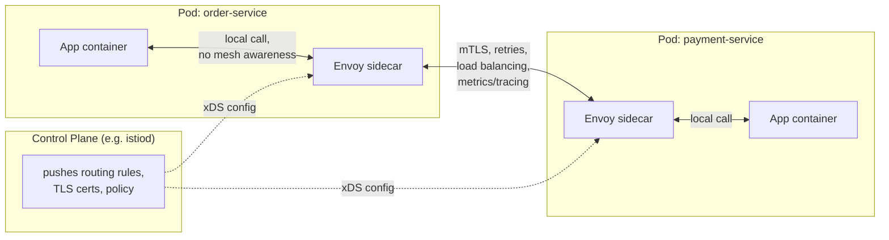

## Overview

Once a fleet grows to dozens or hundreds of services all calling each other, a set of concerns shows up in every one of those calls regardless of what the call is actually about: does this request get retried if it times out? Is the connection to the callee encrypted and mutually authenticated? Which of the callee's healthy instances does this request land on? How long did it take, and did it succeed? None of that is domain logic — it's the same handful of questions asked on every service-to-service hop in the system. There are two ways to answer them. One is to reimplement retries, timeouts, circuit breaking, mTLS, load balancing, and per-call metrics inside every service, in every language and framework the fleet uses — which means N services times M languages worth of resilience libraries to write, keep consistent, and patch when a CVE lands in one of them. The other is to pull all of it out of application code entirely, into infrastructure that every call passes through transparently, so a service's code just makes a plain network call and the surrounding concerns are handled by something it doesn't even know is there.

A **service mesh** is that infrastructure, applied specifically to **east-west traffic** — the service-to-service calls that happen *inside* the system, as opposed to **north-south traffic**, the client-to-system calls that enter and leave at the edge. That north-south role is what an [API gateway](api-gateway) exists for: a single front door for external traffic. A service mesh is the analogous idea turned inward, applied to every internal hop between services that never talk to an outside client at all.

## The Sidecar Pattern: A Proxy Per Instance

The mechanism a service mesh uses to intercept traffic is the **sidecar pattern**: a proxy process is deployed alongside every service instance — in Kubernetes terms, as a second container in the same pod as the application container, sharing its network namespace. [Envoy](https://www.envoyproxy.io/docs/envoy/latest/intro/what_is_envoy) is by far the dominant proxy used this way; Istio, Consul Connect, and AWS App Mesh all run Envoy as their data-plane sidecar. Kubernetes itself formalizes the pattern as a first-class pod concept — a sidecar container that starts before the main container, runs for the pod's entire lifetime, and shares its network and storage.

Once the sidecar is in place, the pod's networking is rewritten (typically via `iptables` rules injected at pod startup, or increasingly an eBPF-based equivalent) so that every inbound and outbound connection for the application container is transparently routed through the sidecar first. The application still just opens a socket to `payments-service:8080` and calls it — it has no client library that knows about the mesh, no explicit proxy configuration, no awareness that anything is intercepting the call. The sidecar terminates the outbound connection, does whatever the mesh's policy says (find a healthy instance, wrap it in mTLS, start a timeout, emit a trace span), and forwards it to the peer instance's *own* sidecar, which does the inbound half of the same policy before handing the request to the peer's application container. A call between two meshed services is therefore always instance → local sidecar → remote sidecar → instance, never instance-to-instance directly.

The cost of this transparency is a real one worth stating plainly here and returning to later: every east-west call now makes two extra local hops (app→sidecar, sidecar→sidecar, sidecar→app is really app→local-proxy→network→remote-proxy→app), and every instance carries a second running process.

## Data Plane vs. Control Plane

A sidecar sitting next to one instance doesn't decide its own policy — something has to tell every sidecar in the fleet what routing rules, retry budgets, and certificates to use, and update all of them together when that policy changes. This is the split Istio's architecture documentation describes explicitly: the mesh is "logically split into a data plane and a control plane." The **data plane** is the set of all sidecar proxies actually sitting in the request path, handling every byte of traffic. The **control plane** — `istiod` in Istio's case — is the piece that never touches application traffic directly; instead it watches the platform's service registry (Kubernetes', typically), compiles the mesh's configured routing rules and security policy into the proxy-specific config format each sidecar understands, issues and rotates the TLS certificates each sidecar needs for mTLS, and pushes all of that down to every sidecar over a streaming API (Envoy's xDS protocol).

The payoff of this split is operational, not architectural elegance for its own sake: an operator changes one `VirtualService` or `PeerAuthentication` resource, and every one of the hundreds of sidecars in the fleet picks up the new routing rule or mTLS requirement within seconds, without touching a single application deployment. Compare that to the alternative — a retry policy hardcoded in a resilience library — where changing it means a code change, a rebuild, and a redeploy of every service that embedded it. The control plane turns a fleet-wide policy change into a config push instead of a fleet-wide release.

## What Moves Out of Application Code

Concretely, a service mesh takes over several things that would otherwise be reimplemented per-service:

- **Mutual TLS between services.** The mesh can issue a short-lived certificate to every workload identity and require both sides of a connection to present one, so every east-west call is encrypted and each party's identity is cryptographically verified — with the control plane handling issuance and rotation so no application ever holds a long-lived private key or touches a certificate lifecycle.
- **Retries, timeouts, and circuit breaking.** The same resilience patterns covered in [circuit-breakers-and-bulkheads](circuit-breakers-and-bulkheads) — capping in-flight requests to a failing dependency, tripping a breaker after a run of failures, applying a request timeout budget — become sidecar configuration instead of application code, applied consistently regardless of whether the caller is written in Java, Go, or Python.
- **L7 load balancing between service instances.** The sidecar sees every outbound call at the HTTP/gRPC layer and can apply the same load-balancing algorithm (round robin, least-request, consistent-hash for session affinity) and the same outlier-detection logic (ejecting an instance that's returning errors) across the entire fleet, instead of each client library shipping its own — often inconsistent — balancing logic.
- **Request-level metrics and distributed tracing.** Because every call already passes through a sidecar, the sidecar can emit a standard set of metrics (latency, status code, request volume) and propagate or originate trace spans for every hop, for free, without the application needing to instrument the call itself. This dovetails directly with [distributed-tracing-and-observability](distributed-tracing-and-observability): the mesh doesn't replace application-level tracing (it doesn't know about the business logic happening *inside* a service), but it guarantees a baseline, consistent span for every network hop between services, which is often the hardest part of stitching a trace together across a polyglot fleet.

## Service Mesh vs. API Gateway

The two are easy to conflate because both are proxies doing cross-cutting network work, but they sit on opposite sides of the same boundary and solve adjacent, not identical, problems. The [API gateway](api-gateway) is north-south: one (horizontally scaled, but logically singular) entry point that terminates traffic arriving from outside the system — external clients, mobile apps, third parties — and does edge concerns like client authentication, request aggregation, and coarse-grained rate limiting before anything reaches an internal service. A service mesh is east-west: it has no single instance at all — its data plane is *every* sidecar next to *every* service instance in the fleet — and it governs traffic that never leaves the system's internal network: order-service calling payment-service calling inventory-service.

In practice the two coexist rather than compete. A request typically crosses the gateway exactly once, on the way in, and then fans out into any number of east-west hops inside the mesh as that one request triggers calls between internal services. The gateway doesn't know or care whether the services behind it run a mesh; the mesh doesn't terminate external client connections or do the gateway's job of deciding which service owns a URL path. A system with dozens of internal services and any amount of external API surface often runs both, each solving the half of the traffic problem the other doesn't touch.

## The Cost: Latency, Resource Overhead, and Operational Complexity

None of this is free, and treating it as a costless upgrade is the most common mistake in adopting one. William Morgan — Linkerd's co-creator, and the person who coined the term "service mesh" — wrote the widely cited explainer that frames the value proposition in terms of reliability, observability, and security primitives moved down to the platform layer; that framing is worth reading precisely because it's honest that the value is only realized once a fleet is large and polyglot enough that reimplementing those primitives per-service has become the actual bottleneck, not before.

The concrete costs:

- **An added network hop, twice, per call.** Every east-west request now goes app→local-sidecar→network→remote-sidecar→app instead of a direct connection. Each proxy hop adds latency — typically single-digit milliseconds with Envoy under normal load, but it is not zero, and it is paid on every call in the system, not just the slow ones. For latency-sensitive paths this can matter more than the mesh's dashboards will initially make obvious.
- **A second container per instance, multiplied by fleet size.** Every pod now runs an Envoy process alongside the application, with its own memory and CPU footprint. That overhead is modest per-instance but is paid once per replica — at a few hundred services with several replicas each, the sidecars collectively can add up to a nontrivial fraction of total cluster capacity, and it's capacity spent on infrastructure rather than application work.
- **Operational complexity in running the control plane itself.** Learning Istio's (or Linkerd's, or Consul's) configuration model, debugging why one sidecar didn't pick up a policy change, understanding xDS propagation delay, and keeping the control plane itself highly available are all new operational surface area that didn't exist before — on top of, not instead of, the complexity the mesh removes from application code. A small number of services, or services that are all in one language and can share one well-maintained resilience library, may never reach the point where the mesh's centralization pays for itself.

## Trade-offs

- **Consistency across a polyglot fleet vs. real per-call latency.** The mesh guarantees every service gets the same retry, mTLS, and load-balancing behavior regardless of language, but it does so by inserting a proxy hop into every single call, which is a cost paid unconditionally, not just when something would otherwise have gone wrong.
- **Centralized policy changes vs. a new piece of critical infrastructure to run.** One config push can update mTLS or routing rules fleet-wide without touching application code, but the control plane that makes that possible is now itself a dependency every meshed call indirectly relies on, and it has to be operated, upgraded, and debugged.
- **Uniform observability vs. incomplete observability.** The mesh gives every hop a standard latency/status/trace baseline for free, but it only sees the network boundary between services — it has no visibility into what a service does internally, so mesh-level tracing has to be combined with application-level instrumentation, not substituted for it.
- **Sidecar transparency vs. debuggability.** Because the application has no idea a proxy is involved, a networking problem that's actually a sidecar misconfiguration (a missing mTLS policy, a stale xDS push) can look, from inside the application, exactly like an unexplained connection failure — the abstraction that makes the mesh transparent in the common case also makes it a new place failures can hide.
- **Adoption threshold.** The value scales with fleet size and language diversity — a two-service system in one language gets almost none of the benefit and all of the operational cost; the crossover point where the mesh pays for itself is a judgment call, not a default "yes."

## Interview Questions

- Walk through exactly what happens, hop by hop, when service A calls service B in a meshed system with sidecars — where does encryption happen, and where does load balancing happen?
- What's the difference between the data plane and the control plane in a service mesh, and why does that split matter operationally when a policy needs to change fleet-wide?
- How is a service mesh different from an API gateway, given that both are proxies doing cross-cutting work? Could a system need both, and if so, where does a single request cross each one?
- What are the concrete costs of adopting a service mesh, and at what point in a fleet's growth do those costs typically start being outweighed by the benefits?
- If mTLS between two services is being handled by the mesh, does that mean the application no longer needs to think about authorization at all? Why or why not?
- A request between two meshed services is failing intermittently, but the application logs on both sides show nothing wrong. What are the mesh-specific things you'd check before assuming it's an application bug?

## References

- [Istio — Architecture (Data Plane and Control Plane)](https://istio.io/latest/docs/ops/deployment/architecture/)
- [Envoy Proxy — What is Envoy?](https://www.envoyproxy.io/docs/envoy/latest/intro/what_is_envoy)
- [Kubernetes Documentation — Sidecar Containers](https://kubernetes.io/docs/concepts/workloads/pods/sidecar-containers/)
- William Morgan, "Service Mesh: A Critical Component of the Cloud Native Stack" (originally published on the Buoyant blog, republished by CNCF, 2017)
