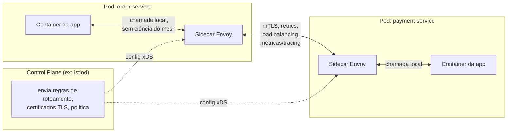

## Visão Geral

Quando uma frota cresce para dezenas ou centenas de serviços chamando uns aos outros, um conjunto de preocupações aparece em cada uma dessas chamadas, independentemente do que a chamada realmente trata: essa requisição é reenviada se der timeout? A conexão com o destinatário está criptografada e mutuamente autenticada? Em qual das instâncias saudáveis do destinatário essa requisição vai parar? Quanto tempo levou, e teve sucesso? Nada disso é lógica de domínio — são as mesmas perguntas feitas em cada salto serviço-a-serviço no sistema. Há duas formas de respondê-las. Uma é reimplementar retries, timeouts, circuit breaking, mTLS, load balancing e métricas por chamada dentro de cada serviço, em cada linguagem e framework que a frota usa — o que significa N serviços vezes M linguagens de bibliotecas de resiliência para escrever, manter consistentes e corrigir quando um CVE aparece em uma delas. A outra é tirar tudo isso do código da aplicação por completo, colocando-o em infraestrutura pela qual cada chamada passa de forma transparente, de modo que o código de um serviço apenas faz uma chamada de rede simples e as preocupações ao redor são tratadas por algo que ele nem sabe que existe.

Um **service mesh** é essa infraestrutura, aplicada especificamente a **tráfego east-west** — as chamadas serviço-a-serviço que acontecem *dentro* do sistema, em oposição a **tráfego north-south**, as chamadas cliente-para-sistema que entram e saem pela borda. Esse papel north-south é para o que um [API gateway](api-gateway) existe: uma única porta de entrada para tráfego externo. Um service mesh é a ideia análoga voltada para dentro, aplicada a cada salto interno entre serviços que nunca conversam com um cliente externo.

## O Padrão Sidecar: Um Proxy Por Instância

O mecanismo que um service mesh usa para interceptar tráfego é o **padrão sidecar**: um processo proxy é implantado junto a cada instância de serviço — em termos do Kubernetes, como um segundo container no mesmo pod que o container da aplicação, compartilhando seu namespace de rede. O [Envoy](https://www.envoyproxy.io/docs/envoy/latest/intro/what_is_envoy) é de longe o proxy dominante usado dessa forma; Istio, Consul Connect e AWS App Mesh todos rodam Envoy como seu sidecar de data plane. O próprio Kubernetes formaliza o padrão como um conceito de pod de primeira classe — um container sidecar que inicia antes do container principal, roda durante todo o ciclo de vida do pod, e compartilha sua rede e armazenamento.

Uma vez que o sidecar está no lugar, a rede do pod é reescrita (tipicamente via regras de `iptables` injetadas na inicialização do pod, ou cada vez mais um equivalente baseado em eBPF) de forma que cada conexão de entrada e saída do container da aplicação seja roteada transparentemente pelo sidecar primeiro. A aplicação ainda apenas abre um socket para `payments-service:8080` e o chama — ela não tem biblioteca cliente que saiba sobre o mesh, nenhuma configuração explícita de proxy, nenhuma consciência de que algo está interceptando a chamada. O sidecar termina a conexão de saída, faz o que quer que a política do mesh determine (encontrar uma instância saudável, envolvê-la em mTLS, iniciar um timeout, emitir um span de trace) e a encaminha para o próprio sidecar da instância par, que faz a metade de entrada da mesma política antes de entregar a requisição ao container da aplicação par. Uma chamada entre dois serviços com mesh é, portanto, sempre instância → sidecar local → sidecar remoto → instância, nunca instância-para-instância diretamente.

O custo dessa transparência é real e vale a pena declarar claramente aqui e retomar depois: cada chamada east-west agora faz dois saltos locais extras (app→sidecar, sidecar→sidecar, sidecar→app é na verdade app→proxy-local→rede→proxy-remoto→app), e cada instância carrega um segundo processo em execução.

## Data Plane vs. Control Plane

Um sidecar ao lado de uma instância não decide sua própria política — algo precisa dizer a cada sidecar da frota quais regras de roteamento, orçamentos de retry e certificados usar, e atualizar todos juntos quando essa política mudar. Essa é a divisão que a documentação de arquitetura do Istio descreve explicitamente: o mesh é "logicamente dividido em um data plane e um control plane." O **data plane** é o conjunto de todos os proxies sidecar que realmente estão no caminho da requisição, tratando cada byte de tráfego. O **control plane** — `istiod` no caso do Istio — é a peça que nunca toca no tráfego da aplicação diretamente; em vez disso, ele observa o registro de serviços da plataforma (do Kubernetes, tipicamente), compila as regras de roteamento configuradas do mesh e a política de segurança no formato de configuração específico do proxy que cada sidecar entende, emite e rotaciona os certificados TLS que cada sidecar precisa para mTLS, e empurra tudo isso para cada sidecar através de uma API de streaming (o protocolo xDS do Envoy).

O ganho dessa divisão é operacional, não elegância arquitetural por si só: um operador muda um recurso `VirtualService` ou `PeerAuthentication`, e cada um dos centenas de sidecars na frota adota a nova regra de roteamento ou requisito de mTLS em segundos, sem tocar em um único deploy de aplicação. Compare isso com a alternativa — uma política de retry hardcoded em uma biblioteca de resiliência — onde mudá-la significa uma mudança de código, um rebuild e um redeploy de cada serviço que a incorporou. O control plane transforma uma mudança de política em toda a frota em um push de configuração em vez de um release em toda a frota.

## O Que Sai do Código da Aplicação

Concretamente, um service mesh assume várias coisas que de outra forma seriam reimplementadas por serviço:

- **TLS mútuo entre serviços.** O mesh pode emitir um certificado de curta duração para cada identidade de workload e exigir que ambos os lados de uma conexão apresentem um, de modo que cada chamada east-west seja criptografada e a identidade de cada parte seja verificada criptograficamente — com o control plane cuidando da emissão e rotação para que nenhuma aplicação jamais guarde uma chave privada de longa duração ou lide com o ciclo de vida de um certificado.
- **Retries, timeouts e circuit breaking.** Os mesmos padrões de resiliência cobertos em [circuit-breakers-and-bulkheads](circuit-breakers-and-bulkheads) — limitar requisições em voo para uma dependência falhando, disparar um breaker após uma sequência de falhas, aplicar um orçamento de timeout de requisição — se tornam configuração de sidecar em vez de código de aplicação, aplicada consistentemente independentemente de o chamador estar escrito em Java, Go ou Python.
- **Load balancing L7 entre instâncias de serviço.** O sidecar vê cada chamada de saída na camada HTTP/gRPC e pode aplicar o mesmo algoritmo de load balancing (round robin, least-request, hash consistente para afinidade de sessão) e a mesma lógica de detecção de outliers (ejetar uma instância que está retornando erros) por toda a frota, em vez de cada biblioteca cliente enviar sua própria lógica de balanceamento — muitas vezes inconsistente.
- **Métricas por requisição e tracing distribuído.** Como cada chamada já passa por um sidecar, o sidecar pode emitir um conjunto padrão de métricas (latência, status code, volume de requisições) e propagar ou originar spans de trace para cada salto, de graça, sem que a aplicação precise instrumentar a chamada ela mesma. Isso se encaixa diretamente com [distributed-tracing-and-observability](distributed-tracing-and-observability): o mesh não substitui o tracing no nível da aplicação (ele não sabe sobre a lógica de negócio acontecendo *dentro* de um serviço), mas garante um span base consistente para cada salto de rede entre serviços, que costuma ser a parte mais difícil de costurar um trace por uma frota poliglota.

## Service Mesh vs. API Gateway

Os dois são fáceis de confundir porque ambos são proxies fazendo trabalho de rede transversal, mas ficam em lados opostos da mesma fronteira e resolvem problemas adjacentes, não idênticos. O [API gateway](api-gateway) é north-south: um ponto de entrada (escalado horizontalmente, mas logicamente singular) que termina o tráfego chegando de fora do sistema — clientes externos, apps mobile, terceiros — e faz preocupações de borda como autenticação de cliente, agregação de requisições e rate limiting grosseiro antes que qualquer coisa chegue a um serviço interno. Um service mesh é east-west: ele não tem instância única nenhuma — seu data plane é *todo* sidecar ao lado de *toda* instância de serviço na frota — e governa tráfego que nunca sai da rede interna do sistema: order-service chamando payment-service chamando inventory-service.

Na prática os dois coexistem em vez de competir. Uma requisição tipicamente cruza o gateway exatamente uma vez, na entrada, e então se ramifica em qualquer número de saltos east-west dentro do mesh conforme aquela única requisição dispara chamadas entre serviços internos. O gateway não sabe nem se importa se os serviços por trás dele rodam um mesh; o mesh não termina conexões de clientes externos nem faz o trabalho do gateway de decidir qual serviço é dono de um caminho de URL. Um sistema com dezenas de serviços internos e qualquer quantidade de superfície de API externa frequentemente roda ambos, cada um resolvendo a metade do problema de tráfego que o outro não toca.

## O Custo: Latência, Overhead de Recursos e Complexidade Operacional

Nada disso é grátis, e tratar como um upgrade sem custo é o erro mais comum ao adotar um. William Morgan — co-criador do Linkerd, e a pessoa que cunhou o termo "service mesh" — escreveu o explicador amplamente citado que enquadra a proposta de valor em termos de confiabilidade, observabilidade e primitivas de segurança movidas para baixo, para a camada de plataforma; esse enquadramento vale a pena ler precisamente porque é honesto sobre o fato de que o valor só se realiza quando uma frota é grande e poliglota o suficiente para que reimplementar essas primitivas por serviço tenha se tornado o gargalo real, não antes.

Os custos concretos:

- **Um salto de rede adicionado, duas vezes, por chamada.** Cada requisição east-west agora vai app→sidecar-local→rede→sidecar-remoto→app em vez de uma conexão direta. Cada salto de proxy adiciona latência — tipicamente milissegundos de um único dígito com Envoy sob carga normal, mas não é zero, e é pago em cada chamada do sistema, não apenas nas lentas. Para caminhos sensíveis a latência isso pode importar mais do que os dashboards do mesh inicialmente deixam óbvio.
- **Um segundo container por instância, multiplicado pelo tamanho da frota.** Cada pod agora roda um processo Envoy junto com a aplicação, com sua própria pegada de memória e CPU. Esse overhead é modesto por instância mas é pago uma vez por réplica — com algumas centenas de serviços com várias réplicas cada, os sidecars coletivamente podem somar uma fração não trivial da capacidade total do cluster, e é capacidade gasta em infraestrutura em vez de trabalho de aplicação.
- **Complexidade operacional em rodar o próprio control plane.** Aprender o modelo de configuração do Istio (ou do Linkerd, ou do Consul), depurar por que um sidecar não pegou uma mudança de política, entender o atraso de propagação do xDS, e manter o próprio control plane altamente disponível são todas novas superfícies operacionais que não existiam antes — além de, não em vez de, a complexidade que o mesh remove do código de aplicação. Um pequeno número de serviços, ou serviços que estão todos em uma linguagem e podem compartilhar uma biblioteca de resiliência bem mantida, pode nunca chegar ao ponto onde a centralização do mesh se paga.

## Trade-offs

- **Consistência em uma frota poliglota vs. latência real por chamada.** O mesh garante que cada serviço tenha o mesmo comportamento de retry, mTLS e load balancing independentemente da linguagem, mas faz isso inserindo um salto de proxy em cada chamada, o que é um custo pago incondicionalmente, não apenas quando algo daria errado.
- **Mudanças de política centralizadas vs. uma nova peça de infraestrutura crítica para rodar.** Um único push de configuração pode atualizar mTLS ou regras de roteamento em toda a frota sem tocar no código de aplicação, mas o control plane que torna isso possível agora é ele mesmo uma dependência da qual toda chamada com mesh indiretamente depende, e precisa ser operado, atualizado e depurado.
- **Observabilidade uniforme vs. observabilidade incompleta.** O mesh dá a cada salto uma linha de base padrão de latência/status/trace de graça, mas só vê a fronteira de rede entre serviços — não tem visibilidade sobre o que um serviço faz internamente, então o tracing no nível do mesh tem que ser combinado com instrumentação no nível da aplicação, não substituí-la.
- **Transparência do sidecar vs. depurabilidade.** Como a aplicação não tem ideia de que um proxy está envolvido, um problema de rede que na verdade é uma má configuração de sidecar (uma política de mTLS ausente, um push xDS obsoleto) pode parecer, de dentro da aplicação, exatamente como uma falha de conexão inexplicada — a abstração que torna o mesh transparente no caso comum também o torna um novo lugar onde falhas podem se esconder.
- **Limiar de adoção.** O valor escala com o tamanho da frota e a diversidade de linguagens — um sistema de dois serviços em uma linguagem obtém quase nenhum do benefício e todo o custo operacional; o ponto de inflexão onde o mesh se paga é uma decisão de julgamento, não um "sim" padrão.

## Perguntas de Entrevista

- Percorra exatamente o que acontece, salto a salto, quando o serviço A chama o serviço B em um sistema com mesh usando sidecars — onde acontece a criptografia, e onde acontece o load balancing?
- Qual é a diferença entre o data plane e o control plane em um service mesh, e por que essa divisão importa operacionalmente quando uma política precisa mudar em toda a frota?
- Como um service mesh é diferente de um API gateway, dado que ambos são proxies fazendo trabalho transversal? Um sistema poderia precisar de ambos, e se sim, onde uma única requisição cruza cada um?
- Quais são os custos concretos de adotar um service mesh, e em que ponto do crescimento de uma frota esses custos tipicamente começam a ser superados pelos benefícios?
- Se o mTLS entre dois serviços está sendo tratado pelo mesh, isso significa que a aplicação não precisa mais pensar em autorização de forma alguma? Por que sim ou por que não?
- Uma requisição entre dois serviços com mesh está falhando intermitentemente, mas os logs da aplicação em ambos os lados não mostram nada de errado. O que você verificaria especificamente do mesh antes de assumir que é um bug de aplicação?

## Referências

- [Istio — Architecture (Data Plane and Control Plane)](https://istio.io/latest/docs/ops/deployment/architecture/)
- [Envoy Proxy — What is Envoy?](https://www.envoyproxy.io/docs/envoy/latest/intro/what_is_envoy)
- [Kubernetes Documentation — Sidecar Containers](https://kubernetes.io/docs/concepts/workloads/pods/sidecar-containers/)
- William Morgan, "Service Mesh: A Critical Component of the Cloud Native Stack" (originalmente publicado no blog da Buoyant, republicado pela CNCF, 2017)
