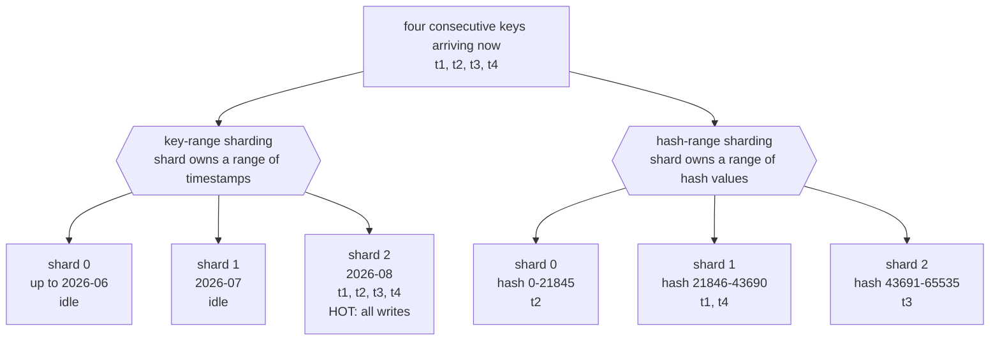
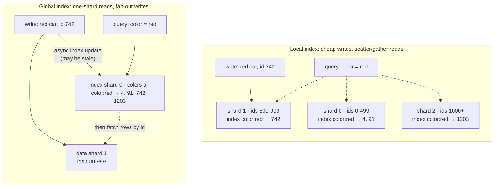

## Overview

Sharding splits one logical dataset across many machines so that both storage capacity and write throughput scale horizontally — ten nodes should hold ten times the data and absorb ten times the writes. The bill comes due on every operation that spans more than one shard: joins, transactions, and secondary-index queries all get genuinely harder, and some of them get slower by an order of magnitude. Choosing a partitioning scheme doesn't avoid that cost; it decides *which* operations pay it. This concept is the map of those choices: key-range versus hash partitioning, how shards get rebalanced as the cluster changes, how a client finds the right shard, and what happens to secondary indexes once the data underneath them is split apart.

## Why Shard at All

The primary reason is scalability, but be precise about which kind. If **read** throughput is the problem, sharding is the wrong tool — read replicas solve that without partitioning anything. Sharding is the answer when the *data volume* or the *write* throughput exceeds what one node can handle, because those are the two things replication cannot spread out: every replica stores the full dataset and applies every write.

Sharding is also heavyweight, and a single machine can do an enormous amount today. The complexity it adds is not just operational:

- You must pick a **partition key**, and all records sharing that key land on the same shard. Access is fast when you know the partition key and turns into a search across every shard when you don't.
- The sharding scheme itself is hard to change afterwards. Choosing wrong is a migration, not a config flag.
- A write that needs to touch related records on several shards now requires a distributed transaction, which is available in some databases but substantially slower than a single-node transaction and often becomes the system's bottleneck.

There's a smaller, less obvious use of the same machinery: some systems shard *within* a single machine, running one single-threaded process per CPU core to exploit parallelism or NUMA locality. Redis, VoltDB, and FoundationDB all do this — same partitioning idea, no network involved.

### Multitenancy: A Separate Motivation Entirely

The second reason to shard has nothing to do with running out of capacity. In a multitenant SaaS product, each customer's dataset is self-contained by definition, which makes "one shard per tenant" (or one shard per group of small tenants) an isolation mechanism:

- **Resource isolation** — one tenant running an expensive query is less likely to degrade everyone else.
- **Permission isolation** — a bug in access-control logic is less likely to leak data across tenants when their data physically lives in separate places.
- **Cell-based architecture** — extend the idea past storage: put the services *and* the storage for a set of tenants into a self-contained cell, so a fault stays inside that cell.
- **Per-tenant backup and restore** — restore one customer to yesterday's state without touching anyone else's data.
- **Regulatory compliance** — GDPR/CCPA export and deletion requests become operations on a shard rather than a scavenger hunt across a shared table.
- **Data residency** — pin a tenant's shard to a specific region because their jurisdiction requires it.
- **Gradual schema rollout** — migrate one tenant at a time and catch problems before they reach everyone.

The catches are real. Per-tenant sharding assumes each tenant fits on one node; the moment one doesn't, you're back to sharding for scale *inside* that tenant. Thousands of tiny tenants make per-tenant shards pure overhead, so you group them — and then you need a way to move a tenant out of a shared shard when it grows. And any feature that spans tenants becomes a cross-shard join.

## Sharding by Key Range

Assign each shard a contiguous range of partition keys, from a minimum to a maximum — the print encyclopedia model, where volume 1 holds A–B and volume 12 holds T–Z. Ranges are deliberately *not* evenly spaced, because the data isn't: one volume per two letters would make some volumes enormous. Boundaries have to adapt to the actual key distribution, either chosen by an administrator (Vitess does this for MySQL) or maintained automatically (Bigtable, HBase, CockroachDB, FoundationDB, MongoDB's ranged sharding; YugabyteDB offers both).

The payoff is that keys are stored in sorted order inside each shard, so **range scans are cheap and local**. Store sensor readings keyed by timestamp and "give me every reading in July" is one sequential scan on one shard. You can also treat the key as a concatenated index and pull a set of related records in a single query.

The matching downside is the one that bites people in production: writes clustered on nearby keys all land on the same shard. Take that same sensor database keyed by timestamp. Shards correspond to time ranges — say one per month — so *every* write from *every* sensor goes to the shard that owns "this month" while the other shards sit idle. You have bought a cluster and are running it as a single node.

The fix is to change what the key sorts by first: prefix each timestamp with the sensor ID, so ordering is sensor ID and then timestamp. With many sensors active, writes spread out. The price is paid on reads — fetching a time range across many sensors is now a separate range query per sensor.

This is worth watching for whenever the partition key is monotonically increasing. Auto-increment primary keys and timestamp-prefixed IDs from a [Distributed ID Generation](distributed-id-generation) scheme both sort by "recency," which under key-range sharding means the newest shard takes 100% of the insert traffic — the ID scheme and the sharding scheme have to be designed together.

### Rebalancing Key-Range Shards

An empty database has no key ranges to divide, so systems like HBase and MongoDB let you configure an initial set of shards (**pre-splitting**), which requires you to already have a guess about the key distribution. After that, growth happens by **splitting** a shard into two contiguous subranges that can be placed on different nodes; deleting a lot of data may require **merging** adjacent small shards back together. Structurally it's the same operation a B-tree performs at its top level.

Automatic systems trigger a split when a shard exceeds a size threshold (HBase defaults to 10 GB) or, in some systems, when its write throughput stays above a limit — so a hot shard can be split for load reasons even when it isn't big. The nice property of this scheme is that the number of shards adapts to the data volume instead of being fixed up front.

The nasty property: splitting is expensive. All of the shard's data has to be rewritten into new files, much like a compaction. And the shard that needs splitting is usually the one already under heavy load, so the split itself adds load exactly where there is least headroom.

## Sharding by Hash of Key

If you don't care about key adjacency — tenant IDs, user IDs, anything you'll only ever look up by exact key — hash the partition key first. A good hash function turns skewed input into a uniform distribution over, say, `[0, 2^32)`, so even consecutive timestamps scatter. It need not be cryptographically strong: MongoDB uses MD5, Cassandra and ScyllaDB use Murmur3. It *must* be stable across processes, which disqualifies Java's `Object.hashCode()` and Ruby's `Object#hash` — the same key can hash differently in different JVMs, which is a spectacular way to lose data.

Mapping the hash to a shard is where the interesting choices are, and [Consistent Hashing](consistent-hashing) covers that mechanism in depth — why `hash(key) % N` remaps nearly every key the moment `N` changes, the hash ring, and virtual nodes. Two production variants worth naming here:

- **Fixed number of shards.** Create far more shards than nodes (1,000 shards across 10 nodes) and store key `k` in shard `hash(k) % 1000`, tracking separately which shard lives on which node. Adding a node moves *whole shards*, never splits them, which is much cheaper. Used by Citus, Riak, Elasticsearch, and Couchbase. The limits: you can never have more nodes than shards, and if your original estimate was wrong, resharding means rewriting everything.
- **Hash-range sharding.** Each shard owns a contiguous *range of hash values* rather than a fixed slot, so shards can still be split when they get too big — the number of shards adapts to the data. DynamoDB and YugabyteDB use this; it's an option in MongoDB. Cassandra and ScyllaDB use a variant with randomly placed range boundaries and many ranges per node (16 by default in Cassandra, 256 in ScyllaDB) so imbalances average out.

What you trade away is exactly what key-range sharding was good at: **range queries over the partition key now have to hit every shard**, because adjacent keys are deliberately scattered. The standard mitigation is a compound key — make only the *first* column the partition key and sort by the rest within the shard. Then a scan over the later columns, for a fixed partition key, is still a single local scan. This is precisely why DynamoDB splits a primary key into a partition key and a sort key.

Read the same picture backwards for the query cost: "all readings in July" is one shard on the left and all three shards on the right.

## Hot Keys, and Why Uniform Hashing Doesn't Save You

Hashing distributes *keys* uniformly. It says nothing about *load*. If one partition key is far more popular than the rest — a celebrity account, a viral post, the row every request reads — that key lives on exactly one shard no matter how good the hash function is, and that shard is your bottleneck.

Range-based schemes (over keys or over hashes) at least give you an escape hatch: because shard boundaries are adjustable, you can isolate a single hot key into a shard of its own, potentially on dedicated hardware.

At the application level, the classic trick is **key splitting**: append two random digits to the hot key, turning it into 100 keys that spread across shards. Understand exactly what this buys and what it costs:

- It splits the **write** load 100 ways. It does *not* reduce read load — a read must now query all 100 keys and merge the results, so the total read volume is unchanged and the read path is more complex and slower.
- It only makes sense for the handful of genuinely hot keys, so you need bookkeeping: a registry of which keys are currently split, and a process for promoting a normal key into a split one (and demoting it later).
- Heat moves. A post that's viral today is cold in a week. Some keys are write-hot, others read-hot, and those want different mitigations.

Large cloud services automate parts of this — Amazon calls it *heat management* or *adaptive capacity* — but the application-level trade-off doesn't disappear, it just moves behind an API.

## Rebalancing: Automatic Versus Manual

Every scheme above eventually needs shards moved between nodes. The question that determines how your 3 a.m. looks is whether that happens by itself.

Fully automatic rebalancing is convenient and enables real autoscaling — DynamoDB advertises adding and removing capacity within minutes of a load change. But rebalancing is an inherently expensive operation: it reroutes requests and moves large volumes of data over the network while the system must keep serving writes. If a cluster is already near its maximum write throughput, a shard split may not even be able to keep up with the incoming write rate.

The genuinely scary failure is automatic rebalancing combined with automatic failure detection. One node gets overloaded and slow to respond. The others conclude it is dead and rebalance load away from it — which means moving its data, over the same network, while everything is already stressed. That extra load pushes another node over the line, it starts responding slowly, and now it is suspected dead too. A cascading failure caused entirely by the recovery mechanism, triggered by a node that was never actually down.

That is the argument for a human in the loop. It is slower and it is toil, but a person can look at the load signals and say "that node isn't dead, it's overloaded — don't move 2 TB right now." Manual control also lets you rebalance *preemptively* ahead of a known event (Cyber Monday, a World Cup ticket release) rather than reactively during it. Several systems split the difference: Couchbase and Riak compute a suggested shard assignment automatically but require an administrator to commit it.

## Request Routing

Once shards move around, a client needs to answer: which IP and port owns this key right now? This is service discovery with one crucial difference — application instances are stateless, so a load balancer can send a request anywhere, whereas a request for a sharded key can only be served by a replica of the shard that owns it.

There are three shapes:

1. **Any node, then forward.** Clients hit a round-robin load balancer; if the node that receives the request owns the shard it handles it, otherwise it forwards to the right node and relays the reply.
2. **A routing tier.** A shard-aware load balancer that holds no data and only forwards. MongoDB's `mongos` daemons work this way.
3. **A shard-aware client.** The client itself knows the mapping and connects directly, with no hop in between.

All three run into the same three problems: who decides which shard lives where (a single coordinator is simplest, but must be fault-tolerant without allowing split brain, where two coordinators publish contradictory assignments); how the routing component learns about changes; and what to do with in-flight requests to the old owner during a shard's cutover window.

The common answer is a **coordination service** holding the authoritative shard map, using a consensus algorithm for fault tolerance and split-brain protection. Nodes register themselves in ZooKeeper or etcd, the routing tier subscribes, and ownership changes are pushed out. HBase and SolrCloud use ZooKeeper; Kubernetes uses etcd; MongoDB uses its own config servers; Kafka, YugabyteDB, TiDB, and ScyllaDB have built-in Raft implementations for exactly this. Riak takes the cheaper route and gossips cluster state between nodes, accepting that different parts of the cluster may briefly disagree about who owns a shard — tolerable specifically because a leaderless database makes weak consistency guarantees anyway.

Node IP addresses themselves change far more slowly than shard assignments, so plain DNS is usually good enough for that layer.

## Sharding and Secondary Indexes

Everything so far assumed the client knows the partition key. Secondary indexes break that assumption — "find all cars that are red" doesn't tell you which shard to ask. This is the hardest part of sharding, and there are exactly two answers.

**Local secondary indexes** (also called *document-partitioned*) keep each shard's index alongside that shard's data, covering only its own records. Writes are cheap: adding a red car touches exactly one shard, which updates its own `color:red` postings list. Reads are the problem. Unless you already know the partition key, the query must go to *every* shard and the results must be merged — a scatter/gather that is prone to tail latency amplification, since the query is only as fast as the slowest shard. Worse, it caps scalability in a specific way: adding shards lets you store more data but does nothing for query throughput, because every shard still processes every query. Despite that, local indexes are the common choice — MongoDB, Riak, Cassandra, Elasticsearch, SolrCloud, and VoltDB all use them.

**Global secondary indexes** (*term-partitioned*) invert the trade. The index covers all shards and is itself sharded, but by the *indexed value* rather than the primary key: colors a–r on index shard 0, s–z on index shard 1. Now `color = red` reads one postings list from one shard. The costs land on the write path and on complex queries:

- A single record write may need to update several index shards at once (every indexed field could hash to a different shard), so keeping the index in sync with the data requires either a distributed transaction or accepting staleness. DynamoDB chooses the latter — writes propagate to global secondary indexes asynchronously, so a GSI read may return stale data.
- Multi-condition queries (`color = red AND make = ford`) hit postings lists on different shards and must intersect them. Fine when the lists are short, slow when they're long enough that shipping them over the network dominates.
- Even a single-condition query only gets *IDs* from one shard; fetching the actual rows still fans out to whichever data shards hold them.

CockroachDB, TiDB, and YugabyteDB use global secondary indexes; DynamoDB supports both local and global. The rule of thumb is that global indexes pay off when read throughput substantially exceeds write throughput and postings lists stay short.

## Trade-offs

- **Key-range sharding gives you cheap range scans and, in the same breath, hot spots** — because the property that makes adjacent keys land together is also the property that puts every "write happening right now" on one shard when the key sorts by time or by a monotonic ID. Prefixing the key with something high-cardinality fixes the write skew and makes the cross-entity range query expensive instead.
- **Hash sharding evens out load by destroying the ordering you may have wanted** — range queries over the partition key must now hit every shard. A compound key (partition key first, sort key after) recovers local range scans *within* one partition key, but not across them.
- **Uniform key distribution is not uniform load** — a single celebrity key overwhelms one shard under any scheme. Splitting it with a random suffix divides the write load by the number of suffixes and divides the read load by nothing, while adding permanent bookkeeping about which keys are currently special.
- **Automatic rebalancing removes toil and adds a failure mode you can't easily reason about** — combined with automatic failure detection, it can move terabytes off a node that was merely slow, adding load during an incident and cascading. Manual or suggest-and-confirm rebalancing is slower but keeps a human between a flawed load signal and a massive data movement.
- **Local secondary indexes make writes cheap and cap read scalability** — every index query touches every shard, so adding shards grows your storage and not your query throughput, and p99 latency is set by the slowest shard in the fan-out.
- **Global secondary indexes make reads cheap and push the cost onto write consistency** — one write may need to update several index shards, so you choose between a distributed transaction on the write path or an index that is eventually consistent and can return stale results.

## Interview Questions

- Your read latency is fine but write throughput has hit a wall on a single Postgres primary. Why do read replicas not help, and what specifically do you have to decide before sharding?
- A time-series table is sharded by key range on `timestamp` and one shard is absorbing all writes. Give two different fixes and explain what each one makes worse.
- Why does hashing the partition key eliminate range-scan hot spots but not celebrity-key hot spots?
- Automatic rebalancing plus automatic failure detection can produce a cascading failure. Walk through the sequence, and explain what a human in the loop would catch that the automation doesn't.
- You need to support "find all orders with status = pending" on a dataset sharded by `customer_id`. Compare a local and a global secondary index for this query, and say which write-path guarantee you'd have to give up for the global one.

## References

- [Martin Kleppmann, "Designing Data-Intensive Applications", 2nd Edition (O'Reilly) — Chapter 7, "Sharding"](https://www.oreilly.com/library/view/designing-data-intensive-applications/9781098119058/)
- [MongoDB Manual — Shard Keys: ranged vs. hashed sharding](https://www.mongodb.com/docs/manual/core/sharding-shard-key/)
- [AWS — Using Global Secondary Indexes in DynamoDB](https://docs.aws.amazon.com/amazondynamodb/latest/developerguide/GSI.html)
- [Vitess Docs — Resharding](https://vitess.io/docs/user-guides/configuration-advanced/resharding/)
