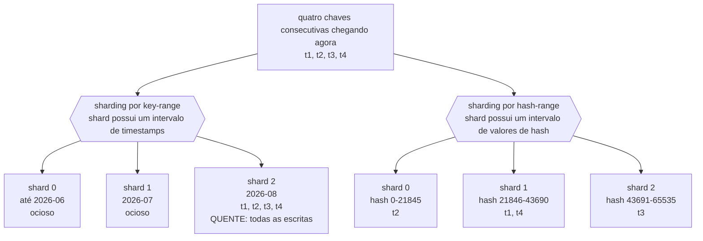
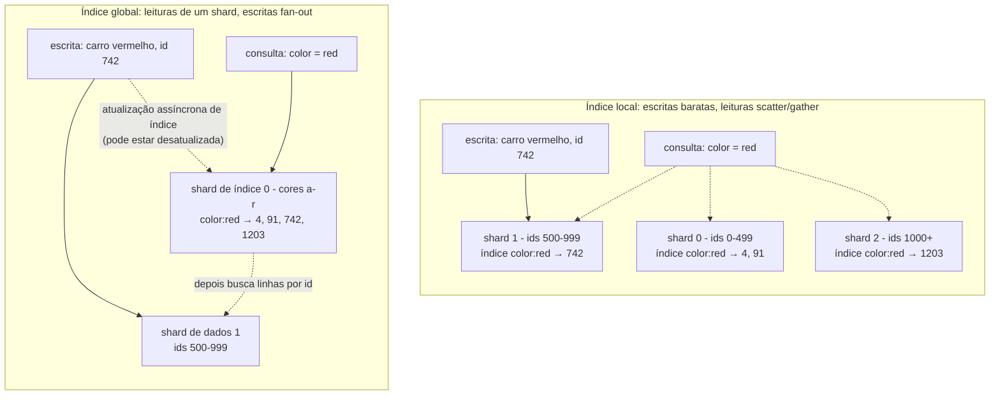

## Visão Geral

Sharding divide um dataset lógico único entre muitas máquinas para que tanto capacidade de armazenamento quanto throughput de escrita escalem horizontalmente — dez nós deveriam manter dez vezes os dados e absorver dez vezes as escritas. A conta chega em toda operação que abrange mais de um shard: joins, transações, e consultas de índice secundário todas ficam genuinamente mais difíceis, e algumas ficam mais lentas por uma ordem de grandeza. Escolher um esquema de particionamento não evita esse custo; decide *quais* operações o pagam. Este conceito é o mapa dessas escolhas: particionamento por key-range versus hash, como shards são rebalanceados conforme o cluster muda, como um cliente encontra o shard certo, e o que acontece com índices secundários uma vez que os dados por baixo deles são divididos.

## Por Que Fazer Sharding

A razão principal é escalabilidade, mas seja preciso sobre qual tipo. Se throughput de **leitura** é o problema, sharding é a ferramenta errada — réplicas de leitura resolvem isso sem particionar nada. Sharding é a resposta quando o *volume de dados* ou o throughput de *escrita* excede o que um nó consegue lidar, porque essas são as duas coisas que replicação não consegue espalhar: toda réplica armazena o dataset completo e aplica toda escrita.

Sharding também é pesado, e uma única máquina consegue fazer uma quantidade enorme hoje. A complexidade que adiciona não é apenas operacional:

- Você precisa escolher uma **chave de partição**, e todos os registros compartilhando essa chave caem no mesmo shard. Acesso é rápido quando você conhece a chave de partição e vira uma busca através de todo shard quando não conhece.
- O próprio esquema de sharding é difícil de mudar depois. Escolher errado é uma migração, não um flag de configuração.
- Uma escrita que precisa tocar registros relacionados em vários shards agora requer uma transação distribuída, que está disponível em alguns bancos de dados mas é substancialmente mais lenta que uma transação de nó único e frequentemente se torna o gargalo do sistema.

Há um uso menor e menos óbvio da mesma maquinaria: alguns sistemas fazem sharding *dentro* de uma única máquina, rodando um processo single-threaded por núcleo de CPU para explorar paralelismo ou localidade NUMA. Redis, VoltDB, e FoundationDB todos fazem isso — mesma ideia de particionamento, sem rede envolvida.

### Multitenancy: Uma Motivação Completamente Separada

A segunda razão para fazer sharding não tem nada a ver com ficar sem capacidade. Em um produto SaaS multitenant, o dataset de cada cliente é autocontido por definição, o que torna "um shard por tenant" (ou um shard por grupo de tenants pequenos) um mecanismo de isolamento:

- **Isolamento de recursos** — um tenant rodando uma consulta cara é menos provável de degradar todos os outros.
- **Isolamento de permissão** — um bug em lógica de controle de acesso é menos provável de vazar dados entre tenants quando seus dados fisicamente vivem em lugares separados.
- **Arquitetura baseada em células** — estenda a ideia além do armazenamento: coloque os serviços *e* o armazenamento para um conjunto de tenants em uma célula autocontida, para que uma falha permaneça dentro dessa célula.
- **Backup e restore por tenant** — restaure um cliente para o estado de ontem sem tocar nos dados de ninguém mais.
- **Compliance regulatório** — requisições de exportação e exclusão de GDPR/CCPA se tornam operações em um shard em vez de uma caça ao tesouro através de uma tabela compartilhada.
- **Residência de dados** — fixe o shard de um tenant a uma região específica porque sua jurisdição exige isso.
- **Rollout gradual de esquema** — migre um tenant por vez e capture problemas antes que alcancem todo mundo.

As pegadinhas são reais. Sharding por tenant assume que cada tenant cabe em um nó; no momento em que um não cabe, você está de volta a fazer sharding por escala *dentro* daquele tenant. Milhares de tenants minúsculos tornam shards por tenant overhead puro, então você os agrupa — e então precisa de uma forma de mover um tenant para fora de um shard compartilhado quando ele cresce. E qualquer funcionalidade que abrange tenants se torna um join entre shards.

## Sharding por Key Range

Atribua a cada shard um intervalo contíguo de chaves de partição, de um mínimo a um máximo — o modelo de enciclopédia impressa, onde o volume 1 tem A–B e o volume 12 tem T–Z. Intervalos deliberadamente *não* são igualmente espaçados, porque os dados não são: um volume a cada duas letras tornaria alguns volumes enormes. Limites precisam se adaptar à distribuição real de chaves, seja escolhidos por um administrador (o Vitess faz isso para MySQL), seja mantidos automaticamente (Bigtable, HBase, CockroachDB, FoundationDB, sharding em intervalo do MongoDB; YugabyteDB oferece ambos).

O benefício é que chaves são armazenadas em ordem dentro de cada shard, então **varreduras de intervalo são baratas e locais**. Armazene leituras de sensor chaveadas por timestamp e "me dê toda leitura em julho" é uma varredura sequencial em um shard. Você também pode tratar a chave como um índice concatenado e puxar um conjunto de registros relacionados em uma única consulta.

A desvantagem correspondente é a que morde as pessoas em produção: escritas agrupadas em chaves próximas todas caem no mesmo shard. Pegue esse mesmo banco de dados de sensores chaveado por timestamp. Shards correspondem a intervalos de tempo — digamos um por mês — então *toda* escrita de *todo* sensor vai para o shard que possui "este mês" enquanto os outros shards ficam ociosos. Você comprou um cluster e está rodando ele como um único nó.

A correção é mudar primeiro pelo que a chave ordena: prefixe cada timestamp com o ID do sensor, então a ordenação é ID do sensor e depois timestamp. Com muitos sensores ativos, escritas se espalham. O preço é pago em leituras — buscar um intervalo de tempo através de muitos sensores agora é uma consulta de intervalo separada por sensor.

Isso vale a pena observar sempre que a chave de partição é monotonicamente crescente. Chaves primárias autoincrement e IDs prefixados por timestamp de um esquema [Distributed ID Generation](distributed-id-generation) ambos ordenam por "recência," que sob sharding por key-range significa que o shard mais novo pega 100% do tráfego de insert — o esquema de ID e o esquema de sharding precisam ser projetados juntos.

### Rebalanceando Shards de Key-Range

Um banco de dados vazio não tem intervalos de chave para dividir, então sistemas como HBase e MongoDB deixam você configurar um conjunto inicial de shards (**pre-splitting**), o que requer que você já tenha um chute sobre a distribuição de chaves. Depois disso, o crescimento acontece dividindo (**splitting**) um shard em dois subintervalos contíguos que podem ser colocados em nós diferentes; excluir muitos dados pode exigir reunir (**merging**) shards pequenos adjacentes de volta em um só. Estruturalmente é a mesma operação que uma B-tree realiza em seu nível superior.

Sistemas automáticos disparam um split quando um shard excede um limiar de tamanho (HBase usa 10 GB por padrão) ou, em alguns sistemas, quando seu throughput de escrita permanece acima de um limite — então um shard quente pode ser dividido por razões de carga mesmo quando não é grande. A propriedade boa desse esquema é que o número de shards se adapta ao volume de dados em vez de ser fixado de antemão.

A propriedade ruim: split é caro. Todos os dados do shard precisam ser reescritos em novos arquivos, muito parecido com uma compactação. E o shard que precisa de split geralmente é o que já está sob carga pesada, então o próprio split adiciona carga exatamente onde há menos folga.

## Sharding por Hash da Chave

Se você não se importa com adjacência de chave — IDs de tenant, IDs de usuário, qualquer coisa que você só vai buscar por chave exata — hasheie a chave de partição primeiro. Uma boa função de hash transforma entrada desigual em uma distribuição uniforme sobre, digamos, `[0, 2^32)`, então até timestamps consecutivos se espalham. Não precisa ser criptograficamente forte: MongoDB usa MD5, Cassandra e ScyllaDB usam Murmur3. *Precisa* ser estável através de processos, o que desqualifica o `Object.hashCode()` do Java e o `Object#hash` do Ruby — a mesma chave pode hashear diferentemente em JVMs diferentes, que é uma forma espetacular de perder dados.

Mapear o hash para um shard é onde as escolhas interessantes estão, e [Consistent Hashing](consistent-hashing) cobre esse mecanismo em profundidade — por que `hash(key) % N` remapeia quase toda chave no momento em que `N` muda, o anel de hash, e nós virtuais. Duas variantes de produção que vale a pena nomear aqui:

- **Número fixo de shards.** Crie muito mais shards que nós (1.000 shards em 10 nós) e armazene a chave `k` no shard `hash(k) % 1000`, rastreando separadamente qual shard vive em qual nó. Adicionar um nó move *shards inteiros*, nunca os divide, o que é muito mais barato. Usado por Citus, Riak, Elasticsearch, e Couchbase. Os limites: você nunca pode ter mais nós que shards, e se sua estimativa original estava errada, resharding significa reescrever tudo.
- **Sharding por hash-range.** Cada shard possui um *intervalo contíguo de valores de hash* em vez de um slot fixo, então shards ainda podem ser divididos quando ficam grandes demais — o número de shards se adapta aos dados. DynamoDB e YugabyteDB usam isso; é uma opção no MongoDB. Cassandra e ScyllaDB usam uma variante com limites de intervalo posicionados aleatoriamente e muitos intervalos por nó (16 por padrão no Cassandra, 256 no ScyllaDB) para que desequilíbrios se compensem.

O que você abre mão é exatamente aquilo em que sharding por key-range era bom: **consultas de intervalo sobre a chave de partição agora precisam atingir todo shard**, porque chaves adjacentes são deliberadamente espalhadas. A mitigação padrão é uma chave composta — faça apenas a *primeira* coluna a chave de partição e ordene pelo resto dentro do shard. Então uma varredura sobre as colunas posteriores, para uma chave de partição fixa, ainda é uma única varredura local. Isso é precisamente por que o DynamoDB divide uma chave primária em uma chave de partição e uma chave de ordenação.

Leia a mesma imagem ao contrário para o custo de consulta: "todas as leituras em julho" é um shard à esquerda e todos os três shards à direita.

## Chaves Quentes, e Por Que Hashing Uniforme Não Te Salva

Hashing distribui *chaves* uniformemente. Não diz nada sobre *carga*. Se uma chave de partição é muito mais popular que o resto — uma conta de celebridade, um post viral, a linha que toda requisição lê — essa chave vive em exatamente um shard não importa quão boa seja a função de hash, e esse shard é seu gargalo.

Esquemas baseados em intervalo (sobre chaves ou sobre hashes) pelo menos te dão uma válvula de escape: porque limites de shard são ajustáveis, você pode isolar uma única chave quente em um shard próprio, potencialmente em hardware dedicado.

No nível de aplicação, o truque clássico é **key splitting**: anexe dois dígitos aleatórios à chave quente, transformando-a em 100 chaves que se espalham entre shards. Entenda exatamente o que isso compra e o que custa:

- Divide a carga de **escrita** em 100 vias. *Não* reduz carga de leitura — uma leitura agora precisa consultar todas as 100 chaves e mesclar os resultados, então o volume total de leitura é inalterado e o caminho de leitura é mais complexo e mais lento.
- Só faz sentido para o punhado de chaves genuinamente quentes, então você precisa de contabilidade: um registro de quais chaves estão atualmente divididas, e um processo para promover uma chave normal a uma dividida (e rebaixá-la depois).
- Calor se move. Um post que é viral hoje está frio em uma semana. Algumas chaves são escrita-quentes, outras leitura-quentes, e essas querem mitigações diferentes.

Grandes serviços em nuvem automatizam partes disso — a Amazon chama de *heat management* ou *adaptive capacity* — mas o trade-off em nível de aplicação não desaparece, apenas se move para trás de uma API.

## Rebalanceamento: Automático Versus Manual

Todo esquema acima eventualmente precisa de shards movidos entre nós. A pergunta que determina como serão suas 3 da manhã é se isso acontece por si só.

Rebalanceamento totalmente automático é conveniente e permite autoscaling real — o DynamoDB anuncia adicionar e remover capacidade dentro de minutos de uma mudança de carga. Mas rebalanceamento é uma operação inerentemente cara: reroteia requisições e move grandes volumes de dados pela rede enquanto o sistema precisa continuar servindo escritas. Se um cluster já está perto de seu throughput máximo de escrita, um split de shard pode nem conseguir acompanhar a taxa de escrita recebida.

A falha genuinamente assustadora é rebalanceamento automático combinado com detecção automática de falha. Um nó fica sobrecarregado e lento para responder. Os outros concluem que está morto e rebalanceiam carga para longe dele — o que significa mover seus dados, pela mesma rede, enquanto tudo já está estressado. Essa carga extra empurra outro nó além do limite, ele começa a responder lentamente, e agora ele também é suspeito de estar morto. Uma falha em cascata causada inteiramente pelo mecanismo de recuperação, disparada por um nó que nunca esteve realmente fora do ar.

Esse é o argumento para um humano no loop. É mais lento e é trabalho braçal, mas uma pessoa pode olhar para os sinais de carga e dizer "aquele nó não está morto, está sobrecarregado — não mova 2 TB agora." Controle manual também permite rebalancear *preventivamente* antes de um evento conhecido (Cyber Monday, um lançamento de ingressos da Copa do Mundo) em vez de reativamente durante ele. Vários sistemas dividem a diferença: Couchbase e Riak computam uma atribuição de shard sugerida automaticamente mas exigem que um administrador a confirme.

## Roteamento de Requisições

Uma vez que shards se movem, um cliente precisa responder: qual IP e porta possui esta chave agora? Isso é descoberta de serviço com uma diferença crucial — instâncias de aplicação são sem estado, então um load balancer pode enviar uma requisição para qualquer lugar, enquanto uma requisição para uma chave shardeada só pode ser servida por uma réplica do shard que a possui.

Há três formas:

1. **Qualquer nó, depois encaminha.** Clientes atingem um load balancer round-robin; se o nó que recebe a requisição possui o shard ele a trata, caso contrário encaminha para o nó certo e retransmite a resposta.
2. **Uma camada de roteamento.** Um load balancer consciente de shard que não mantém dados e só encaminha. Os daemons `mongos` do MongoDB funcionam assim.
3. **Um cliente consciente de shard.** O próprio cliente conhece o mapeamento e conecta diretamente, sem salto intermediário.

Todos os três esbarram nos mesmos três problemas: quem decide qual shard vive onde (um único coordenador é mais simples, mas precisa ser tolerante a falhas sem permitir split brain, onde dois coordenadores publicam atribuições contraditórias); como o componente de roteamento aprende sobre mudanças; e o que fazer com requisições em voo para o antigo dono durante a janela de transição de um shard.

A resposta comum é um **serviço de coordenação** mantendo o mapa de shard autoritativo, usando um algoritmo de consenso para tolerância a falhas e proteção contra split-brain. Nós se registram no ZooKeeper ou etcd, a camada de roteamento se inscreve, e mudanças de posse são enviadas. HBase e SolrCloud usam ZooKeeper; Kubernetes usa etcd; MongoDB usa seus próprios config servers; Kafka, YugabyteDB, TiDB, e ScyllaDB têm implementações Raft embutidas para exatamente isso. Riak toma a rota mais barata e fofoca (gossip) o estado do cluster entre nós, aceitando que partes diferentes do cluster podem brevemente discordar sobre quem possui um shard — tolerável especificamente porque um banco de dados sem líder já faz garantias fracas de consistência de qualquer forma.

Endereços IP de nó mudam muito mais devagar que atribuições de shard, então DNS simples geralmente é bom o suficiente para essa camada.

## Sharding e Índices Secundários

Tudo até agora assumiu que o cliente conhece a chave de partição. Índices secundários quebram essa suposição — "encontre todos os carros que são vermelhos" não te diz qual shard perguntar. Esta é a parte mais difícil de sharding, e há exatamente duas respostas.

**Índices secundários locais** (também chamados de *particionados-por-documento*) mantêm o índice de cada shard junto com os dados daquele shard, cobrindo apenas seus próprios registros. Escritas são baratas: adicionar um carro vermelho toca exatamente um shard, que atualiza sua própria lista de postings `color:red`. Leituras são o problema. A menos que você já conheça a chave de partição, a consulta precisa ir para *todo* shard e os resultados precisam ser mesclados — um scatter/gather propenso a amplificação de latência de cauda, já que a consulta só é tão rápida quanto o shard mais lento. Pior, limita escalabilidade de uma forma específica: adicionar shards permite armazenar mais dados mas não faz nada pelo throughput de consulta, porque todo shard ainda processa toda consulta. Apesar disso, índices locais são a escolha comum — MongoDB, Riak, Cassandra, Elasticsearch, SolrCloud, e VoltDB todos os usam.

**Índices secundários globais** (*particionados-por-termo*) invertem a troca. O índice cobre todos os shards e é ele mesmo shardeado, mas pelo *valor indexado* em vez da chave primária: cores a–r no shard de índice 0, s–z no shard de índice 1. Agora `color = red` lê uma lista de postings de um shard. Os custos caem no caminho de escrita e em consultas complexas:

- Uma única escrita de registro pode precisar atualizar vários shards de índice de uma vez (todo campo indexado poderia hashear para um shard diferente), então manter o índice sincronizado com os dados requer ou uma transação distribuída ou aceitar desatualização. O DynamoDB escolhe a segunda — escritas se propagam para índices secundários globais assincronamente, então uma leitura de GSI pode retornar dados desatualizados.
- Consultas com múltiplas condições (`color = red AND make = ford`) atingem listas de postings em shards diferentes e precisam intersectá-las. Bom quando as listas são curtas, lento quando são longas o suficiente para que enviá-las pela rede domine.
- Mesmo uma consulta de condição única só recebe *IDs* de um shard; buscar as linhas reais ainda se espalha para quaisquer shards de dados que as mantêm.

CockroachDB, TiDB, e YugabyteDB usam índices secundários globais; DynamoDB suporta ambos local e global. A regra de ouro é que índices globais compensam quando throughput de leitura excede substancialmente throughput de escrita e listas de postings permanecem curtas.

## Trade-offs

- **Sharding por key-range dá varreduras de intervalo baratas e, no mesmo fôlego, hot spots** — porque a propriedade que faz chaves adjacentes caírem juntas também é a propriedade que coloca toda "escrita acontecendo agora" em um shard quando a chave ordena por tempo ou por um ID monotônico. Prefixar a chave com algo de alta cardinalidade corrige o write skew e torna a consulta de intervalo entre entidades cara em vez disso.
- **Sharding por hash equilibra a carga destruindo a ordenação que você pode ter querido** — consultas de intervalo sobre a chave de partição agora precisam atingir todo shard. Uma chave composta (chave de partição primeiro, chave de ordenação depois) recupera varreduras de intervalo locais *dentro* de uma chave de partição, mas não através delas.
- **Distribuição uniforme de chave não é carga uniforme** — uma única chave celebridade sobrecarrega um shard sob qualquer esquema. Dividi-la com um sufixo aleatório divide a carga de escrita pelo número de sufixos e não divide a carga de leitura em nada, enquanto adiciona contabilidade permanente sobre quais chaves estão atualmente especiais.
- **Rebalanceamento automático remove trabalho braçal e adiciona um modo de falha que você não consegue facilmente raciocinar sobre** — combinado com detecção automática de falha, pode mover terabytes de um nó que estava apenas lento, adicionando carga durante um incidente e causando cascata. Rebalanceamento manual ou sugerir-e-confirmar é mais lento mas mantém um humano entre um sinal de carga falho e uma movimentação massiva de dados.
- **Índices secundários locais tornam escritas baratas e limitam escalabilidade de leitura** — toda consulta de índice toca todo shard, então adicionar shards cresce seu armazenamento e não seu throughput de consulta, e a latência p99 é definida pelo shard mais lento no fan-out.
- **Índices secundários globais tornam leituras baratas e empurram o custo para consistência de escrita** — uma escrita pode precisar atualizar vários shards de índice, então você escolhe entre uma transação distribuída no caminho de escrita ou um índice que é eventualmente consistente e pode retornar resultados desatualizados.

## Perguntas de Entrevista

- Sua latência de leitura está boa mas throughput de escrita atingiu um limite em um primary Postgres único. Por que réplicas de leitura não ajudam, e o que especificamente você precisa decidir antes de fazer sharding?
- Uma tabela de série temporal é shardeada por key range em `timestamp` e um shard está absorvendo todas as escritas. Dê duas correções diferentes e explique o que cada uma piora.
- Por que hashear a chave de partição elimina hot spots de varredura de intervalo mas não hot spots de chave celebridade?
- Rebalanceamento automático mais detecção automática de falha pode produzir uma falha em cascata. Percorra a sequência, e explique o que um humano no loop capturaria que a automação não captura.
- Você precisa suportar "encontre todos os pedidos com status = pending" em um dataset shardeado por `customer_id`. Compare um índice secundário local e um global para essa consulta, e diga qual garantia de caminho de escrita você teria que abrir mão para o global.

## Referências

- [Martin Kleppmann, "Designing Data-Intensive Applications", 2ª Edição (O'Reilly) — Capítulo 7, "Sharding"](https://www.oreilly.com/library/view/designing-data-intensive-applications/9781098119058/)
- [MongoDB Manual — Shard Keys: ranged vs. hashed sharding](https://www.mongodb.com/docs/manual/core/sharding-shard-key/)
- [AWS — Using Global Secondary Indexes in DynamoDB](https://docs.aws.amazon.com/amazondynamodb/latest/developerguide/GSI.html)
- [Vitess Docs — Resharding](https://vitess.io/docs/user-guides/configuration-advanced/resharding/)
