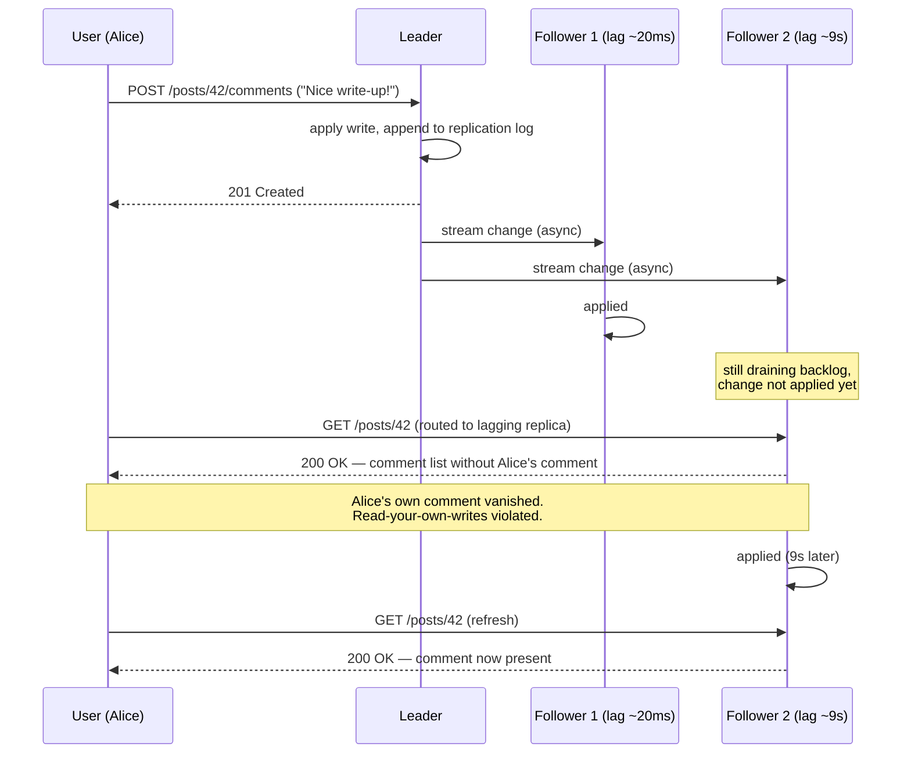

## Overview

Once you keep more than one copy of your data, you have to answer a question that has no free answer: when two clients write to different copies at the same time, which write wins? **Single-leader replication** — also called primary-backup, active/passive, or leader-based replication — sidesteps the question entirely by never letting it arise. One replica is designated the leader and is the only node that accepts writes; every other replica is a follower that applies the leader's changes in the same order. Because there is exactly one place where write order is decided, there are no write conflicts to resolve, which is why this is the built-in model in PostgreSQL, MySQL, Oracle Data Guard, SQL Server Always On, MongoDB, DynamoDB, and Kafka. The price is that the leader is a single point of coordination: every write depends on it being reachable, and losing it means an inherently risky failover.

## The Basic Topology

The mechanism is three rules:

1. **All writes go to the leader.** A client that wants to change data sends the request to the leader, which applies it to its own local storage first.
2. **The leader streams its changes to followers.** Every local write is also emitted as an entry in a *replication log* (or change stream). Each follower consumes that log and applies the writes locally, **in the same order the leader processed them**. Same starting state plus same operations in same order means same ending state — this is state machine replication.
3. **Reads can go anywhere.** Clients may read from the leader or from any follower. Followers are read-only from the client's point of view.

If the database is sharded, this applies *per shard*: each shard has exactly one leader, and different shards can have their leaders on different nodes, spreading write load across the cluster even though each individual key has a single write path.

Note that consensus-based systems are not an exception to this model — Raft, and therefore CockroachDB, TiDB, etcd, and RabbitMQ quorum queues, is *also* single-leader replication. What consensus adds is a safe, automatic answer to "who is the leader now," which is exactly the part plain leader-based replication leaves to you.

## Synchronous, Asynchronous, and Semi-Synchronous

The single most consequential configuration knob is whether the leader waits for followers before telling the client "committed."

- **Synchronous** — the leader waits for the follower to confirm it has received (and durably stored) the write before acknowledging the client. The upside is real: if the leader dies one millisecond later, that write still exists on at least one other node. The downside is equally real: if the synchronous follower is slow, GC-paused, or unreachable, the leader **cannot commit anything**. It must block all writes until the follower comes back.
- **Asynchronous** — the leader sends the change and acknowledges the client immediately, without waiting. Writes are fast and the leader keeps working even if every follower has fallen behind or died. But a write acknowledged to the client is not guaranteed durable: if the leader's disk dies before the change reaches anyone, the write is gone despite the success response the client already received.
- **Semi-synchronous** — the practical middle ground, and what "synchronous replication" almost always means in production. *One* follower is synchronous; the rest are asynchronous. You are guaranteed the write exists on two nodes (leader plus one), while a single node outage doesn't stall the cluster — if the synchronous follower goes away, one of the async followers is promoted into the synchronous slot. Some systems generalize this to a quorum (e.g., a majority of five replicas synchronous, the rest async).

Making *all* followers synchronous is not a viable configuration. With N synchronous followers, any single one of them being down halts every write in the system, so availability gets strictly worse with each replica you add — the opposite of what you added replicas for.

The concrete scenario worth holding in your head: you run a leader plus five async read replicas across three regions, and a user submits a payment. The leader writes locally, returns `200 OK` in 4 ms, and the leader's host is terminated 20 ms later before any follower received the change. The user has a confirmation page; the database has no record. Semi-synchronous replication would have made that same request take maybe 8 ms instead of 4 ms, and the payment would have survived. That extra 4 ms is the entire trade: **latency on every write, in exchange for durability during a rare failure**. It is the same latency-versus-consistency choice PACELC describes in the [CAP Theorem](cap-theorem) concept, made concrete at the level of a single config flag.

## Setting Up New Followers

You periodically need a new follower — to add read capacity, or to replace a node that died. You cannot just `cp` the data directory: clients are writing continuously, so a plain file copy reads different parts of the database at different points in time and produces a state that never actually existed. Locking the database to make the copy consistent would work, but sacrifices exactly the availability you're building replicas for.

The standard procedure avoids both problems:

1. **Take a consistent snapshot of the leader without locking it.** Most databases have this because backups need it anyway (PostgreSQL's `pg_basebackup`; Percona XtraBackup for MySQL).
2. **Copy the snapshot to the new node.**
3. **Ask the leader for everything since the snapshot.** This is the step that makes the whole thing work, and it requires the snapshot to be tagged with an **exact position in the replication log**. PostgreSQL calls this the log sequence number (LSN); MySQL uses binlog coordinates or global transaction identifiers (GTIDs). The follower says "send me everything after LSN X" and replays the backlog.
4. **Catch up.** Once the backlog is drained, the follower switches to consuming the live change stream.

A useful consequence: since snapshot plus log position plus log stream is all you need, you can archive both to object storage and bootstrap new followers from there instead of hammering the leader. WAL-G does this for PostgreSQL, MySQL, and SQL Server; Litestream does the equivalent for SQLite. It's the same set of artifacts used for point-in-time recovery, which is why backup and replication are the same machinery wearing different hats.

## Handling Node Outages

### Follower Failure: Catch-Up Recovery

This case is the easy one, and it's easy for the same reason step 3 above works. Each follower records how far it has read in the leader's log. After a crash or a network blip, it reconnects, says "my last applied position was X," and replays from there. No coordination, no elections, no data loss.

The problems are operational rather than conceptual. A follower that has been offline for hours under high write throughput has an enormous backlog, and draining it loads *both* the recovering follower and the leader that must ship the backlog — a recovery can therefore degrade the healthy part of the cluster. And the leader can only discard log segments once every follower has acknowledged them, which forces a choice when a follower stays down: retain the log and risk filling the leader's disk, or discard it and force that follower to be rebuilt from a fresh snapshot when it returns.

### Leader Failure: Failover, and Why It's Dangerous

When the leader dies, someone has to promote a follower, redirect clients to it, and repoint the remaining followers at the new leader. That's failover, and every step of it is a hazard.

**Detecting the failure is a guess.** There is no way to distinguish a crashed leader from a slow one, so systems use a timeout — no heartbeat for, say, 30 seconds means dead. Set the timeout too long and every real leader crash means minutes of write downtime. Set it too short and an ordinary load spike or network glitch triggers a spurious failover, which piles a leader election on top of a cluster that is already struggling. There is no universally correct value.

**Failover with asynchronous replication silently loses writes.** The promoted follower may not have received the old leader's most recent writes. When the old leader eventually rejoins, its unreplicated writes conflict with whatever the new leader has accepted since, and the near-universal resolution is to **discard them** — meaning writes the client was told had committed were never durable. This is not theoretical: in a well-documented GitHub incident, a stale MySQL follower was promoted, and because its autoincrement counter lagged the old leader's, it reissued primary keys that had already been assigned. Those keys were also referenced in a Redis store, so the reuse cross-wired records and disclosed private data to the wrong users. Losing writes is bad; losing writes when *other* systems hold references to them is how you get a security incident.

**Two nodes can both believe they're the leader.** If the old leader isn't actually dead — just partitioned, or stuck in a long GC pause — it comes back still convinced it holds leadership, and now both nodes accept writes. This is **split brain**, and in a system with no conflict resolution (which is precisely what single-leader replication is), it corrupts data. The mitigation is **fencing**: force the deposed leader to step down, typically by having every acquisition of leadership carry a monotonically increasing token so that storage rejects writes stamped with a stale one. Naive "shoot the other node" mechanisms are notoriously easy to get wrong — a badly designed one can shut down *both* nodes, and by the time split brain is detected at all, corruption may already have happened.

Because of all this, correct automatic failover is a consensus problem, not a scripting problem, and it's usually delegated rather than hand-rolled: the leadership decision is outsourced to a coordination service — see [Consensus and Coordination Services](consensus-and-coordination-services) for how quorum-based election, leases, and fencing tokens actually work. Plenty of experienced teams go further and configure failover to be *manual*, accepting minutes of downtime in exchange for a human confirming the old leader is truly gone. The one rule that always holds: **promote the most up-to-date follower** — the synchronous one if you have semi-synchronous replication, otherwise the follower with the highest log position. Losing a fraction of a second of writes may be survivable; promoting a replica that's days behind is not.

## Implementation of Replication Logs

"The leader sends its changes to followers" hides three genuinely different designs.

**Statement-based replication** logs the actual write statements — every `INSERT`, `UPDATE`, `DELETE` — and each follower re-executes the SQL as if a client had sent it. It's extremely compact, and it breaks in ways that are hard to detect:

- Nondeterministic functions like `NOW()` or `RAND()` produce different values on every replica.
- Statements depending on existing data (`UPDATE ... WHERE <condition>`, autoincrement columns) must execute in exactly the same order everywhere, which constrains concurrent transactions.
- Triggers, stored procedures, and UDFs can produce different side effects per replica unless they are perfectly deterministic.

You can patch around these (substitute a fixed value for `NOW()` at log time), and some systems make it safe by construction — VoltDB requires transactions to be deterministic. MySQL used statement-based replication before 5.1 and now falls back to row-based automatically whenever it detects nondeterminism.

**Write-ahead log (WAL) shipping** reuses the log the storage engine already writes for crash recovery: the leader sends its WAL over the network in addition to writing it to disk, and the follower reconstructs byte-identical files. PostgreSQL streaming replication and Oracle work this way. It's efficient and requires no separate log, but the WAL describes changes at the level of *which bytes changed in which disk blocks* — so replication is tightly coupled to the storage engine's on-disk format. The operational consequence is bigger than it sounds: because leader and follower must run compatible storage formats, you generally **cannot run different database versions on leader and followers**, which rules out the zero-downtime upgrade trick of upgrading all followers first and then failing over to one of them. With WAL shipping, major version upgrades typically mean downtime.

**Logical (row-based) replication** decouples the replication log from storage internals by using a separate, higher-level format: a sequence of records describing row-level changes (full column values for an insert, enough to identify the row plus new values for an update, primary key for a delete), terminated by a commit record per transaction. MySQL's binlog in row mode is exactly this; PostgreSQL implements logical replication by decoding the physical WAL into row-level insert/update/delete events. Two things fall out of that decoupling, and they're why this is the modern default. First, the format can stay backward compatible, so leader and follower *can* run different versions — enabling rolling upgrades with minimal downtime. Second, a logical log is parseable by anything, not just the database itself, which is the foundation of **change data capture**: streaming row changes into a data warehouse, a search index, or a cache invalidation pipeline. Debezium exists because logical logs exist.

## Replication Lag and Its Three Anomalies

Read scaling is the other main reason to replicate: most online workloads are read-heavy, so you add followers and spread reads across them. But this only works with *asynchronous* replication — synchronously replicating to a large fleet would make the whole system unavailable whenever any one of them hiccups, and the more replicas you add the likelier that becomes.

So the read-scaling architecture necessarily means reading from replicas that may be behind. Normally the **replication lag** is well under a second and nobody notices. Under load, network trouble, or during a follower's catch-up recovery, it can stretch to seconds or minutes — and there is no upper bound, which is the honest content of the phrase *eventual consistency*. (Note that this is not a NoSQL phenomenon: an asynchronously replicated PostgreSQL follower is eventually consistent in exactly the same sense.) At that point three specific, user-visible anomalies appear.



### Reading Your Own Writes

The anomaly in the diagram: Alice comments on a post, the write goes to the leader, the subsequent page load is routed to a lagging follower, and her comment isn't there. To Alice this is indistinguishable from the application having dropped her data — so she writes it again, and now you have a duplicate too.

**Read-after-write consistency** (read-your-writes) guarantees a user always sees their *own* updates. It says nothing about other users' updates. Ways to get it:

- **Route reads of user-editable data to the leader.** Simple rule that works when you can tell which data a user might have modified without querying it — e.g., always read a user's own profile from the leader, everyone else's from a follower.
- **Route by recency.** If most data is user-editable, the above negates read scaling. Instead, track when the user last wrote and send *all* their reads to the leader for the next minute; and/or monitor per-follower lag and route around any follower more than a threshold behind.
- **Track the write position.** The client remembers the log position (LSN/GTID) or timestamp of its most recent write and passes it with subsequent reads; the router only uses a replica that has applied at least that position, otherwise it waits or picks another. This is the most precise option and the one that generalizes best.
- **Watch out for cross-device and cross-region cases.** If Alice writes on her phone and reads on her laptop, client-side position tracking fails — that metadata has to be centralized. And if replicas span regions, leader reads must be routed to the leader's region, and all of a user's devices must be pinned to the same region for any of this to hold.

### Monotonic Reads

Bob loads a page and sees Alice's new comment (served by a fresh follower). He hits refresh, gets routed to a laggier follower, and the comment is *gone*. He has watched time run backward — which is more alarming than never having seen the comment at all.

**Monotonic reads** guarantee that a user who reads repeatedly never sees older data after having seen newer data. It's stronger than eventual consistency and weaker than strong consistency. The standard implementation is sticky routing: send each user's reads to the same replica, chosen by hashing the user ID rather than at random. The caveat is failure handling — when that replica dies, the user must be rerouted, and the new replica may itself be behind the position they'd already observed.

### Consistent Prefix Reads

The third anomaly breaks causality. Two writes are causally ordered — a question is asked, then answered — but they land in different shards with different replication lag, and an observer reading both shards sees the answer arrive before the question:

```
Mrs. Cake:  "About 10 seconds usually, Mr. Poons."
Mr. Poons:  "How far into the future can you see, Mrs. Cake?"
```

**Consistent prefix reads** guarantee that if writes happen in a certain order, every reader sees them in that order. Within a single shard this is free — the log imposes one order and every follower applies it. The anomaly is specific to **sharded** databases, where shards replicate independently and there is no global write ordering, so a reader can see one part of the database at a newer state than another. The pragmatic fix is to co-locate causally related writes in the same shard (same conversation, same partition key); when that isn't feasible, you need explicit causality tracking, which is substantially more machinery.

The meta-point across all three: replication lag anomalies are *fixable in application code*, but every fix above is fiddly and easy to get subtly wrong. If your workload can afford it, the simplest programming model remains a database that offers strong consistency and transactions — the NewSQL systems (Spanner, CockroachDB, TiDB) exist precisely so you can treat a distributed database more like a single node. What you must not do is pretend replication is synchronous when it isn't.

## Trade-offs

- **Eliminating write conflicts costs you a write bottleneck** — with exactly one node ordering writes, there is nothing to reconcile, but write throughput is capped by one machine and every write must reach the leader's region. Adding followers scales reads and durability; it does nothing for write capacity.
- **Synchronous replication buys durability with latency and availability** — waiting for a follower means an acknowledged write survives the leader's death, but a slow or unreachable synchronous follower blocks every write. Semi-synchronous (one sync follower, the rest async) is the usual compromise: two-node durability without a full-cluster stall on any single node outage.
- **Automatic failover trades manual downtime for automated risk** — timeouts guess at whether the leader is dead, promotion under async replication discards unreplicated writes, and a partitioned old leader that returns creates split brain. Many teams deliberately choose manual failover, accepting minutes of downtime for the certainty that a human confirmed the old leader was gone.
- **WAL shipping is efficient but couples replication to on-disk format** — reusing the storage engine's log costs nothing extra to produce, but leader and followers must run compatible versions, which forecloses the upgrade-followers-then-fail-over path to zero-downtime version upgrades. Logical replication pays a small cost to produce a second log and gets rolling upgrades and change data capture in return.
- **Read scaling and read consistency pull in opposite directions** — you can only add many followers if replication is asynchronous, and asynchronous replication is exactly what produces read-your-own-writes, monotonic read, and consistent prefix violations. Every mitigation (leader reads for recent writers, sticky replicas, position-tracked reads) claws back some consistency by giving up some of the read scaling you added followers for.
- **Eventual consistency is a guarantee with no bound on "eventually"** — lag is typically sub-second and invisible, but during catch-up recovery or capacity saturation it can reach minutes with nothing in the protocol preventing it. Design and test against "what if lag is 10 minutes," not against the normal case.

## Interview Questions

- Single-leader replication is often described as avoiding write conflicts. What exactly is it about routing all writes through one node that makes conflict resolution unnecessary, and what does that buy you compared to a system that must resolve conflicts?
- A team enables synchronous replication to all five followers "for safety." Why does availability get *worse* with each follower they add, and what configuration gives them most of the durability benefit without that behavior?
- During failover under asynchronous replication, the old leader rejoins with writes the new leader never received. Why is discarding them the standard resolution, and what makes that especially dangerous when another system (a cache, a search index, an event log) holds references to those rows?
- Your database uses WAL shipping for replication. Explain why that makes a zero-downtime major-version upgrade difficult, and what would change if it used logical replication instead.
- A user comments on a post and the comment doesn't appear on refresh; a different user sees a comment appear and then disappear on refresh. Name each anomaly, explain why they need different fixes, and describe why one of those fixes partly defeats the reason you added read replicas in the first place.

## References

- [Martin Kleppmann, "Designing Data-Intensive Applications", 2nd Edition (O'Reilly) — Chapter 6, "Replication", section "Single-Leader Replication"](https://www.oreilly.com/library/view/designing-data-intensive-applications/9781098119058/)
- [PostgreSQL Documentation — Log-Shipping Standby Servers and Streaming Replication](https://www.postgresql.org/docs/current/warm-standby.html)
- [PostgreSQL Documentation — Logical Replication](https://www.postgresql.org/docs/current/logical-replication.html)
- [MySQL 8.4 Reference Manual — Replication Formats (statement-based vs. row-based)](https://dev.mysql.com/doc/refman/8.4/en/replication-formats.html)
