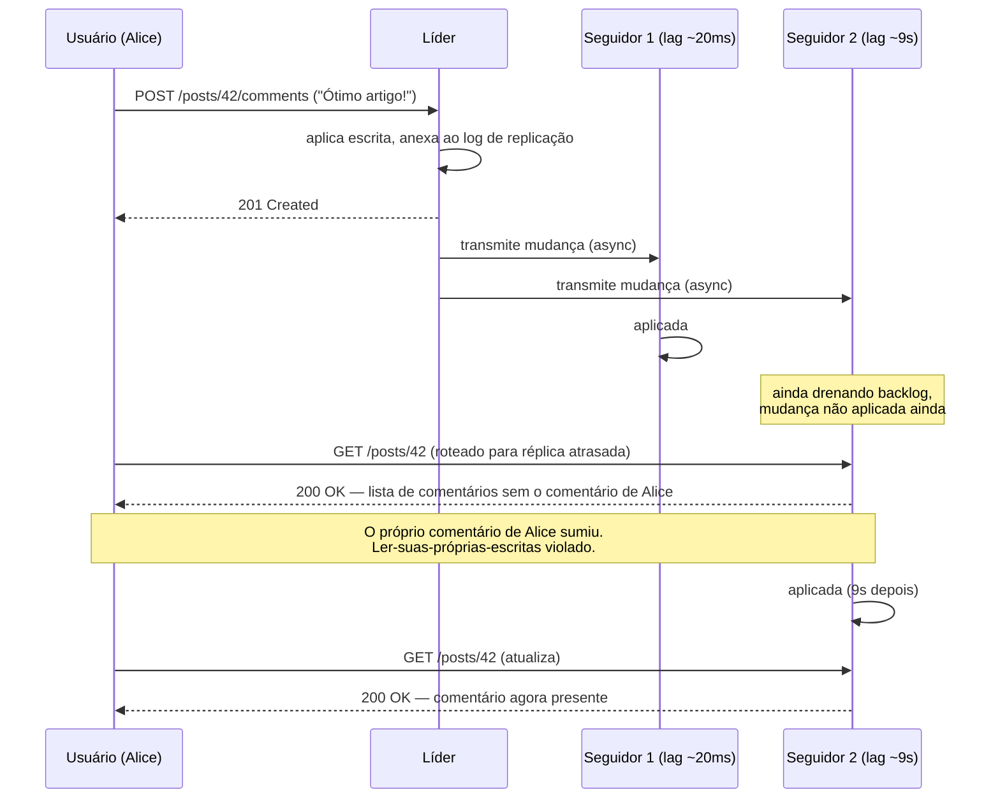

## Visão Geral

Uma vez que você mantém mais de uma cópia dos seus dados, precisa responder uma pergunta que não tem resposta gratuita: quando dois clientes escrevem em cópias diferentes ao mesmo tempo, qual escrita vence? **Replicação de líder único** — também chamada de primary-backup, ativo/passivo, ou replicação baseada em líder — contorna a pergunta inteiramente ao nunca deixá-la surgir. Uma réplica é designada líder e é o único nó que aceita escritas; toda outra réplica é um seguidor que aplica as mudanças do líder na mesma ordem. Como há exatamente um lugar onde a ordem de escrita é decidida, não há conflitos de escrita para resolver, o que é por que este é o modelo embutido no PostgreSQL, MySQL, Oracle Data Guard, SQL Server Always On, MongoDB, DynamoDB, e Kafka. O preço é que o líder é um ponto único de coordenação: toda escrita depende dele estar alcançável, e perdê-lo significa um failover inerentemente arriscado.

## A Topologia Básica

O mecanismo é três regras:

1. **Toda escrita vai para o líder.** Um cliente que quer mudar dados envia a requisição para o líder, que a aplica em seu próprio armazenamento local primeiro.
2. **O líder transmite suas mudanças para seguidores.** Toda escrita local também é emitida como uma entrada em um *log de replicação* (ou stream de mudanças). Cada seguidor consome esse log e aplica as escritas localmente, **na mesma ordem em que o líder as processou**. Mesmo estado inicial mais mesmas operações na mesma ordem significa mesmo estado final — isso é replicação de máquina de estados.
3. **Leituras podem ir a qualquer lugar.** Clientes podem ler do líder ou de qualquer seguidor. Seguidores são somente-leitura do ponto de vista do cliente.

Se o banco de dados é shardeado, isso se aplica *por shard*: cada shard tem exatamente um líder, e shards diferentes podem ter seus líderes em nós diferentes, espalhando carga de escrita pelo cluster mesmo que cada chave individual tenha um único caminho de escrita.

Note que sistemas baseados em consenso não são uma exceção a esse modelo — Raft, e portanto CockroachDB, TiDB, etcd, e filas de quórum do RabbitMQ, *também* são replicação de líder único. O que consenso adiciona é uma resposta segura e automática para "quem é o líder agora", que é exatamente a parte que a replicação simples baseada em líder deixa para você.

## Síncrona, Assíncrona, e Semi-Síncrona

O ajuste de configuração mais consequente é se o líder espera pelos seguidores antes de dizer ao cliente "confirmado."

- **Síncrona** — o líder espera o seguidor confirmar que recebeu (e armazenou duravelmente) a escrita antes de confirmar ao cliente. A vantagem é real: se o líder morrer um milissegundo depois, essa escrita ainda existe em pelo menos outro nó. A desvantagem é igualmente real: se o seguidor síncrono está lento, pausado por GC, ou inalcançável, o líder **não pode confirmar nada**. Precisa bloquear todas as escritas até o seguidor voltar.
- **Assíncrona** — o líder envia a mudança e confirma ao cliente imediatamente, sem esperar. Escritas são rápidas e o líder continua trabalhando mesmo que todo seguidor tenha ficado para trás ou morrido. Mas uma escrita confirmada ao cliente não é garantida durável: se o disco do líder morre antes da mudança alcançar alguém, a escrita se perde apesar da resposta de sucesso que o cliente já recebeu.
- **Semi-síncrona** — o meio-termo prático, e o que "replicação síncrona" quase sempre significa em produção. *Um* seguidor é síncrono; o resto é assíncrono. Você tem garantia de que a escrita existe em dois nós (líder mais um), enquanto uma única indisponibilidade de nó não paralisa o cluster — se o seguidor síncrono se vai, um dos seguidores assíncronos é promovido ao slot síncrono. Alguns sistemas generalizam isso para um quórum (ex.: uma maioria de cinco réplicas síncronas, o resto assíncrono).

Tornar *todos* os seguidores síncronos não é uma configuração viável. Com N seguidores síncronos, qualquer um deles fora do ar paralisa toda escrita no sistema, então disponibilidade fica estritamente pior a cada réplica que você adiciona — o oposto do porquê você adicionou réplicas.

O cenário concreto que vale a pena manter em mente: você roda um líder mais cinco réplicas de leitura assíncronas em três regiões, e um usuário submete um pagamento. O líder escreve localmente, retorna `200 OK` em 4 ms, e o host do líder é terminado 20 ms depois antes de qualquer seguidor receber a mudança. O usuário tem uma página de confirmação; o banco de dados não tem registro. Replicação semi-síncrona teria feito essa mesma requisição levar talvez 8 ms em vez de 4 ms, e o pagamento teria sobrevivido. Esses 4 ms extras são a troca inteira: **latência em toda escrita, em troca de durabilidade durante uma falha rara**. É a mesma escolha latência-versus-consistência que o PACELC descreve no conceito [CAP Theorem](cap-theorem), tornada concreta no nível de um único flag de configuração.

## Configurando Novos Seguidores

Você periodicamente precisa de um novo seguidor — para adicionar capacidade de leitura, ou substituir um nó que morreu. Você não pode simplesmente `cp` o diretório de dados: clientes estão escrevendo continuamente, então uma cópia de arquivo simples lê partes diferentes do banco de dados em pontos diferentes no tempo e produz um estado que nunca realmente existiu. Travar o banco de dados para tornar a cópia consistente funcionaria, mas sacrifica exatamente a disponibilidade pela qual você está construindo réplicas.

O procedimento padrão evita ambos os problemas:

1. **Tire um snapshot consistente do líder sem travá-lo.** A maioria dos bancos de dados tem isso porque backups precisam disso de qualquer forma (`pg_basebackup` do PostgreSQL; Percona XtraBackup para MySQL).
2. **Copie o snapshot para o novo nó.**
3. **Peça ao líder tudo desde o snapshot.** Este é o passo que faz tudo funcionar, e requer que o snapshot seja marcado com uma **posição exata no log de replicação**. O PostgreSQL chama isso de log sequence number (LSN); o MySQL usa coordenadas de binlog ou identificadores globais de transação (GTIDs). O seguidor diz "envie-me tudo depois do LSN X" e reproduz o backlog.
4. **Colocar em dia.** Uma vez que o backlog é drenado, o seguidor muda para consumir o stream de mudanças ao vivo.

Uma consequência útil: já que snapshot mais posição de log mais stream de log é tudo que você precisa, você pode arquivar ambos em object storage e inicializar novos seguidores a partir daí em vez de sobrecarregar o líder. WAL-G faz isso para PostgreSQL, MySQL, e SQL Server; Litestream faz o equivalente para SQLite. É o mesmo conjunto de artefatos usado para recuperação point-in-time, o que é por que backup e replicação são a mesma maquinaria vestindo chapéus diferentes.

## Lidando com Indisponibilidades de Nó

### Falha de Seguidor: Recuperação por Catch-Up

Este caso é o fácil, e é fácil pela mesma razão que o passo 3 acima funciona. Cada seguidor registra até onde leu no log do líder. Depois de um crash ou instabilidade de rede, ele reconecta, diz "minha última posição aplicada foi X," e reproduz a partir daí. Sem coordenação, sem eleições, sem perda de dados.

Os problemas são operacionais em vez de conceituais. Um seguidor que ficou fora do ar por horas sob alto throughput de escrita tem um backlog enorme, e drená-lo carrega *tanto* o seguidor se recuperando quanto o líder que precisa enviar o backlog — uma recuperação pode, portanto, degradar a parte saudável do cluster. E o líder só pode descartar segmentos de log uma vez que todo seguidor os confirmou, o que força uma escolha quando um seguidor permanece fora do ar: reter o log e arriscar encher o disco do líder, ou descartá-lo e forçar aquele seguidor a ser reconstruído a partir de um snapshot novo quando voltar.

### Falha de Líder: Failover, e Por Que É Perigoso

Quando o líder morre, alguém precisa promover um seguidor, redirecionar clientes para ele, e reapontar os seguidores restantes para o novo líder. Isso é failover, e todo passo dele é um perigo.

**Detectar a falha é um chute.** Não há como distinguir um líder travado de um lento, então sistemas usam um timeout — sem heartbeat por, digamos, 30 segundos significa morto. Defina o timeout longo demais e todo crash real de líder significa minutos de indisponibilidade de escrita. Defina-o curto demais e um pico de carga comum ou instabilidade de rede dispara um failover espúrio, o que empilha uma eleição de líder em cima de um cluster que já está lutando. Não há um valor universalmente correto.

**Failover com replicação assíncrona silenciosamente perde escritas.** O seguidor promovido pode não ter recebido as escritas mais recentes do antigo líder. Quando o antigo líder eventualmente se rejunta, suas escritas não replicadas conflitam com o que o novo líder aceitou desde então, e a resolução quase universal é **descartá-las** — significando que escritas que o cliente foi informado terem sido confirmadas nunca foram duráveis. Isso não é teórico: em um incidente bem documentado do GitHub, um seguidor MySQL desatualizado foi promovido, e como seu contador autoincrement estava atrasado em relação ao antigo líder, ele reemitiu chaves primárias que já tinham sido atribuídas. Essas chaves também eram referenciadas em um store Redis, então o reuso cruzou registros e divulgou dados privados para os usuários errados. Perder escritas é ruim; perder escritas quando *outros* sistemas mantêm referências a elas é como você tem um incidente de segurança.

**Dois nós podem ambos acreditar que são o líder.** Se o antigo líder não estiver realmente morto — apenas particionado, ou preso em uma longa pausa de GC — ele volta ainda convencido de que mantém a liderança, e agora ambos os nós aceitam escritas. Isso é **split brain**, e em um sistema sem resolução de conflitos (que é precisamente o que replicação de líder único é), corrompe dados. A mitigação é **fencing**: forçar o líder deposto a se retirar, tipicamente fazendo com que toda aquisição de liderança carregue um token monotonicamente crescente para que o armazenamento rejeite escritas marcadas com um desatualizado. Mecanismos ingênuos de "atire no outro nó" são notoriamente fáceis de errar — um mal projetado pode desligar *ambos* os nós, e quando split brain é sequer detectado, corrupção pode já ter acontecido.

Por causa de tudo isso, failover automático correto é um problema de consenso, não um problema de scripting, e geralmente é delegado em vez de feito à mão: a decisão de liderança é terceirizada para um serviço de coordenação — veja [Consensus and Coordination Services](consensus-and-coordination-services) para como eleição baseada em quórum, leases, e tokens de fencing realmente funcionam. Várias equipes experientes vão além e configuram failover para ser *manual*, aceitando minutos de indisponibilidade em troca de um humano confirmar que o antigo líder realmente se foi. A única regra que sempre vale: **promova o seguidor mais atualizado** — o síncrono se você tem replicação semi-síncrona, caso contrário o seguidor com a posição de log mais alta. Perder uma fração de segundo de escritas pode ser sobrevivível; promover uma réplica que está dias atrasada não é.

## Implementação de Logs de Replicação

"O líder envia suas mudanças para seguidores" esconde três designs genuinamente diferentes.

**Replicação baseada em statement** registra as instruções de escrita reais — todo `INSERT`, `UPDATE`, `DELETE` — e cada seguidor reexecuta o SQL como se um cliente o tivesse enviado. É extremamente compacto, e quebra de formas difíceis de detectar:

- Funções não determinísticas como `NOW()` ou `RAND()` produzem valores diferentes em cada réplica.
- Instruções dependendo de dados existentes (`UPDATE ... WHERE <condição>`, colunas autoincrement) precisam executar exatamente na mesma ordem em todo lugar, o que restringe transações concorrentes.
- Triggers, stored procedures, e UDFs podem produzir efeitos colaterais diferentes por réplica a menos que sejam perfeitamente determinísticos.

Você pode contornar isso (substituir um valor fixo por `NOW()` no momento do log), e alguns sistemas o tornam seguro por construção — o VoltDB exige que transações sejam determinísticas. O MySQL usava replicação baseada em statement antes da 5.1 e agora recorre a baseada em linha automaticamente sempre que detecta não-determinismo.

**Envio de write-ahead log (WAL)** reutiliza o log que o motor de armazenamento já escreve para recuperação de crash: o líder envia seu WAL pela rede além de escrevê-lo em disco, e o seguidor reconstrói arquivos byte-idênticos. A replicação por streaming do PostgreSQL e o Oracle funcionam assim. É eficiente e não requer um log separado, mas o WAL descreve mudanças no nível de *quais bytes mudaram em quais blocos de disco* — então a replicação é fortemente acoplada ao formato em disco do motor de armazenamento. A consequência operacional é maior do que parece: como líder e seguidor precisam rodar formatos de armazenamento compatíveis, geralmente você **não pode rodar versões diferentes de banco de dados no líder e nos seguidores**, o que exclui o truque de upgrade sem downtime de atualizar todos os seguidores primeiro e depois fazer failover para um deles. Com envio de WAL, upgrades de versão maior tipicamente significam downtime.

**Replicação lógica (baseada em linha)** desacopla o log de replicação dos internos de armazenamento usando um formato separado, de nível mais alto: uma sequência de registros descrevendo mudanças em nível de linha (valores completos de coluna para um insert, o suficiente para identificar a linha mais novos valores para um update, chave primária para um delete), terminado por um registro de commit por transação. O binlog do MySQL em modo de linha é exatamente isso; o PostgreSQL implementa replicação lógica decodificando o WAL físico em eventos de insert/update/delete em nível de linha. Duas coisas resultam desse desacoplamento, e são por que este é o padrão moderno. Primeiro, o formato pode permanecer retrocompatível, então líder e seguidor *podem* rodar versões diferentes — permitindo rolling upgrades com downtime mínimo. Segundo, um log lógico é analisável por qualquer coisa, não apenas pelo próprio banco de dados, que é a fundação para **change data capture**: transmitir mudanças de linha para um data warehouse, um índice de busca, ou um pipeline de invalidação de cache. O Debezium existe porque logs lógicos existem.

## Lag de Replicação e Suas Três Anomalias

Escala de leitura é a outra razão principal para replicar: a maioria das cargas de trabalho online são intensivas em leitura, então você adiciona seguidores e espalha leituras entre eles. Mas isso só funciona com replicação *assíncrona* — replicar sincronamente para uma frota grande tornaria o sistema inteiro indisponível sempre que qualquer um deles engasgasse, e quanto mais réplicas você adiciona mais provável isso se torna.

Então a arquitetura de escala de leitura necessariamente significa ler de réplicas que podem estar atrasadas. Normalmente o **lag de replicação** é bem abaixo de um segundo e ninguém percebe. Sob carga, problemas de rede, ou durante a recuperação por catch-up de um seguidor, pode se estender a segundos ou minutos — e não há limite superior, que é o conteúdo honesto da frase *consistência eventual*. (Note que isso não é um fenômeno NoSQL: um seguidor PostgreSQL replicado assincronamente é eventualmente consistente exatamente no mesmo sentido.) Nesse ponto três anomalias específicas, visíveis para o usuário, aparecem.



### Lendo Suas Próprias Escritas

A anomalia no diagrama: Alice comenta em um post, a escrita vai para o líder, o carregamento de página subsequente é roteado para um seguidor atrasado, e seu comentário não está lá. Para Alice isso é indistinguível da aplicação ter perdido seus dados — então ela escreve de novo, e agora você também tem uma duplicata.

**Consistência read-after-write** (ler-suas-escritas) garante que um usuário sempre veja suas *próprias* atualizações. Não diz nada sobre atualizações de outros usuários. Formas de obtê-la:

- **Rotear leituras de dados editáveis pelo usuário para o líder.** Regra simples que funciona quando você consegue dizer quais dados um usuário pode ter modificado sem consultá-los — ex.: sempre ler o próprio perfil de um usuário do líder, o de todos os outros de um seguidor.
- **Rotear por recência.** Se a maioria dos dados é editável pelo usuário, o acima nega a escala de leitura. Em vez disso, rastreie quando o usuário escreveu por último e envie *todas* as leituras dele para o líder pelo próximo minuto; e/ou monitore o lag por seguidor e roteie ao redor de qualquer seguidor mais atrasado que um limite.
- **Rastrear a posição de escrita.** O cliente lembra a posição de log (LSN/GTID) ou timestamp de sua escrita mais recente e a passa com leituras subsequentes; o roteador só usa uma réplica que aplicou pelo menos essa posição, caso contrário espera ou escolhe outra. Esta é a opção mais precisa e a que melhor generaliza.
- **Cuidado com casos entre dispositivos e entre regiões.** Se Alice escreve no celular e lê no laptop, rastreamento de posição do lado do cliente falha — esse metadado precisa ser centralizado. E se réplicas abrangem regiões, leituras do líder precisam ser roteadas para a região do líder, e todos os dispositivos de um usuário precisam ser fixados na mesma região para qualquer coisa disso funcionar.

### Leituras Monotônicas

Bob carrega uma página e vê o novo comentário de Alice (servido por um seguidor fresco). Ele atualiza, é roteado para um seguidor mais atrasado, e o comentário *sumiu*. Ele viu o tempo correr para trás — que é mais alarmante do que nunca ter visto o comentário.

**Leituras monotônicas** garantem que um usuário que lê repetidamente nunca vê dados mais antigos depois de ter visto dados mais novos. É mais forte que consistência eventual e mais fraco que consistência forte. A implementação padrão é roteamento fixo (sticky): enviar as leituras de cada usuário para a mesma réplica, escolhida hasheando o ID do usuário em vez de aleatoriamente. A ressalva é tratamento de falha — quando aquela réplica morre, o usuário precisa ser reroteado, e a nova réplica pode ela mesma estar atrasada em relação à posição que já tinha observado.

### Leituras de Prefixo Consistente

A terceira anomalia quebra causalidade. Duas escritas são causalmente ordenadas — uma pergunta é feita, depois respondida — mas caem em shards diferentes com lag de replicação diferente, e um observador lendo ambos os shards vê a resposta chegar antes da pergunta:

```
Sra. Cake:  "Cerca de 10 segundos normalmente, Sr. Poons."
Sr. Poons:  "Quão longe no futuro você consegue ver, Sra. Cake?"
```

**Leituras de prefixo consistente** garantem que se escritas acontecem em uma certa ordem, todo leitor as vê nessa ordem. Dentro de um único shard isso é grátis — o log impõe uma ordem e todo seguidor a aplica. A anomalia é específica de bancos de dados **shardeados**, onde shards replicam independentemente e não há ordenação global de escrita, então um leitor pode ver uma parte do banco de dados em um estado mais novo que outra. A correção pragmática é co-localizar escritas causalmente relacionadas no mesmo shard (mesma conversa, mesma chave de partição); quando isso não é viável, você precisa de rastreamento explícito de causalidade, que é substancialmente mais maquinaria.

O meta-ponto através dos três: anomalias de lag de replicação são *corrigíveis em código de aplicação*, mas toda correção acima é complicada e fácil de errar sutilmente. Se sua carga de trabalho pode pagar por isso, o modelo de programação mais simples continua sendo um banco de dados que oferece consistência forte e transações — os sistemas NewSQL (Spanner, CockroachDB, TiDB) existem precisamente para que você possa tratar um banco de dados distribuído mais como um único nó. O que você não deve fazer é fingir que replicação é síncrona quando não é.

## Trade-offs

- **Eliminar conflitos de escrita custa um gargalo de escrita** — com exatamente um nó ordenando escritas, não há nada para reconciliar, mas throughput de escrita é limitado por uma máquina e toda escrita precisa alcançar a região do líder. Adicionar seguidores escala leituras e durabilidade; não faz nada pela capacidade de escrita.
- **Replicação síncrona compra durabilidade com latência e disponibilidade** — esperar por um seguidor significa que uma escrita confirmada sobrevive à morte do líder, mas um seguidor síncrono lento ou inalcançável bloqueia toda escrita. Semi-síncrona (um seguidor síncrono, o resto assíncrono) é o compromisso usual: durabilidade de dois nós sem uma parada de cluster inteiro por qualquer única indisponibilidade de nó.
- **Failover automático troca downtime manual por risco automatizado** — timeouts chutam se o líder está morto, promoção sob replicação assíncrona descarta escritas não replicadas, e um antigo líder particionado que retorna cria split brain. Muitas equipes deliberadamente escolhem failover manual, aceitando minutos de indisponibilidade pela certeza de que um humano confirmou que o antigo líder se foi.
- **Envio de WAL é eficiente mas acopla replicação ao formato em disco** — reutilizar o log do motor de armazenamento não custa nada extra para produzir, mas líder e seguidores precisam rodar versões compatíveis, o que impede o caminho de atualizar-seguidores-depois-fazer-failover para upgrades de versão sem downtime. Replicação lógica paga um pequeno custo para produzir um segundo log e recebe rolling upgrades e change data capture em troca.
- **Escala de leitura e consistência de leitura puxam em direções opostas** — você só pode adicionar muitos seguidores se a replicação for assíncrona, e replicação assíncrona é exatamente o que produz violações de ler-suas-próprias-escritas, leitura monotônica, e prefixo consistente. Toda mitigação (leituras do líder para escritores recentes, réplicas fixas, leituras rastreadas por posição) recupera alguma consistência abrindo mão de parte da escala de leitura pela qual você adicionou seguidores.
- **Consistência eventual é uma garantia sem limite em "eventualmente"** — o lag é tipicamente abaixo de um segundo e invisível, mas durante recuperação por catch-up ou saturação de capacidade pode alcançar minutos sem nada no protocolo o impedindo. Projete e teste contra "e se o lag for 10 minutos", não contra o caso normal.

## Perguntas de Entrevista

- Replicação de líder único é frequentemente descrita como evitando conflitos de escrita. O que exatamente sobre rotear todas as escritas através de um nó torna resolução de conflitos desnecessária, e o que isso compra comparado a um sistema que precisa resolver conflitos?
- Uma equipe habilita replicação síncrona para todos os cinco seguidores "por segurança." Por que a disponibilidade fica *pior* a cada seguidor que adicionam, e qual configuração dá a eles a maior parte do benefício de durabilidade sem esse comportamento?
- Durante failover sob replicação assíncrona, o antigo líder se rejunta com escritas que o novo líder nunca recebeu. Por que descartá-las é a resolução padrão, e o que torna isso especialmente perigoso quando outro sistema (um cache, um índice de busca, um log de eventos) mantém referências a essas linhas?
- Seu banco de dados usa envio de WAL para replicação. Explique por que isso torna um upgrade de versão maior sem downtime difícil, e o que mudaria se usasse replicação lógica em vez disso.
- Um usuário comenta em um post e o comentário não aparece ao atualizar; um usuário diferente vê um comentário aparecer e depois desaparecer ao atualizar. Nomeie cada anomalia, explique por que precisam de correções diferentes, e descreva por que uma dessas correções parcialmente anula a razão pela qual você adicionou réplicas de leitura em primeiro lugar.

## Referências

- [Martin Kleppmann, "Designing Data-Intensive Applications", 2ª Edição (O'Reilly) — Capítulo 6, "Replication", seção "Single-Leader Replication"](https://www.oreilly.com/library/view/designing-data-intensive-applications/9781098119058/)
- [PostgreSQL Documentation — Log-Shipping Standby Servers and Streaming Replication](https://www.postgresql.org/docs/current/warm-standby.html)
- [PostgreSQL Documentation — Logical Replication](https://www.postgresql.org/docs/current/logical-replication.html)
- [MySQL 8.4 Reference Manual — Replication Formats (statement-based vs. row-based)](https://dev.mysql.com/doc/refman/8.4/en/replication-formats.html)
