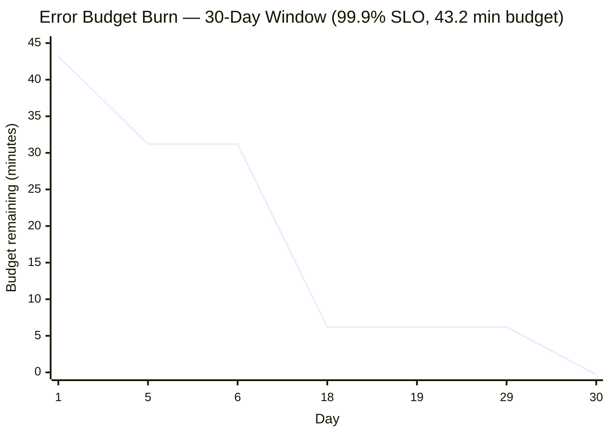

## Overview

"Make the system more reliable" is not an engineering requirement, because it has no stopping point — nobody can tell you when it's done. "Make the system 100% reliable" has a stopping point, but it's the wrong one: 100% availability is not achievable for any system with a network, a disk, or a dependency, and it isn't actually what users want, because they cannot perceive the difference between 99.99% and 100% while the last fraction of a percent typically costs far more to buy than it's worth to anyone. What's missing in both framings is a number that's specific enough to be measured, loose enough to be achievable, and tight enough that everyone agrees what "broken" means before it happens. Google's Site Reliability Engineering model supplies exactly that number, built from three layered concepts — the **SLI**, a measurement; the **SLO**, a target for that measurement; and the **error budget**, the arithmetic gap between the target and perfection — that together convert reliability from an unstated assumption everyone disagrees about into a deliberate, negotiated, and continuously monitored contract between the people who ship features and the people who keep the lights on.

## SLI: What You Actually Measure

A **service level indicator** is, in the SRE book's phrasing, a carefully defined quantitative measure of some aspect of the level of service that is provided. It is not a vague notion of "how well things are going" — it's a specific ratio or measurement with a precise numerator and denominator, computed the same way every time. The canonical form for most SLIs is:

```
availability = good events / valid events
```

where "good" and "valid" are defined explicitly enough that two engineers computing the SLI independently get the same number. A **request-based availability SLI** might count as valid every request that reached the service's load balancer, and as good every one of those that returned within a latency threshold and without a 5xx status. A **latency SLI** is the fraction of valid requests served under some threshold (this is where percentiles from request latency work reappears — see the prerequisite on describing performance). Error rate, throughput, durability (for storage), and freshness (for pipelines) all follow the same shape: pick the user-visible behavior that matters, define precisely what counts, and compute a ratio.

The discipline that matters most here is measuring **as close to the user's actual experience as possible**. An SLI computed from server-side logs misses requests that never made it past a broken load balancer or an expired DNS record — the server never saw them, so they never entered the denominator, and the SLI looks artificially healthy during exactly the outage you care about. Client-side or edge-measured SLIs are harder to instrument but tell the truth; a load balancer's own request log is a reasonable middle ground for most services.

## SLO: The Target and the Window

A **service level objective** is a target value or range for an SLI, measured over a defined time window. "99.9% availability" is not an SLO by itself — it's incomplete until you attach the window: 99.9% over 30 rolling days is a different, looser commitment than 99.9% over a single day, because a short, brutal outage that would blow a daily budget is a rounding error against a month.

Choosing the target is itself an engineering exercise, not an aspiration. The right method is empirical: look at what level of reliability users have actually tolerated without complaint, what the current baseline is, and what it costs incrementally to move the number — then pick a target that reflects real user needs rather than a round number pulled from a slide deck. A backend service called only by other backend services inside the same request path can often tolerate looser SLOs than the user-facing edge that aggregates them, because [tail latency amplification](describing-performance-latency-and-percentiles) means the edge's user-visible reliability is bounded by the reliability of everything behind it — an SLO for an internal dependency has to be set with that fan-out in mind, not in isolation.

The SRE model also has a specific reason to under-promise: **SLOs should be measurably stricter than any SLA**, so that the internal target gets breached — and gets fixed — before the contractual one does. A 99.9% SLA with a 99.95% internal SLO gives the team a warning shot before a customer is owed a credit.

## SLA: The Target With Consequences

A **service level agreement** is an SLO with consequences attached, and those consequences are usually business or contractual — service credits, refunds, a right to terminate the contract — negotiated with a customer rather than derived from operational data alone. The important relationship is the one just stated: the SLA should be a laxer version of the internal SLO, not the same number. If they were identical, the team would learn about a reliability problem for the first time from a customer invoking the penalty clause, which is the worst possible channel for that information. The gap between SLO and SLA is a deliberately engineered early-warning margin.

## The Error Budget

Once an SLO exists, its complement is a concrete, spendable quantity: the **error budget**. If the SLO is 99.9% availability over a 30-day window, the error budget is the remaining 0.1% — not an abstract shortfall, but an allowance of *how much unreliability is acceptable* before anyone needs to change what they're doing.

Turn the percentage into minutes and the abstraction becomes tangible:

```
Window:      30 days = 30 × 24 × 60 = 43,200 minutes
SLO:         99.9% availability
Allowed downtime = 43,200 minutes × (1 − 0.999)
                  = 43,200 minutes × 0.001
                  = 43.2 minutes
```

A 99.9% monthly SLO buys the service exactly **43.2 minutes** of downtime (or equivalent bad-event weight, for a non-binary SLI) to spend over 30 days, on nothing in particular — a botched deploy, a dependency outage, an aggressive new feature that trades a bit of reliability for a lot of latency improvement. Tighten the target by one nine, to 99.99%, and the budget collapses to 4.32 minutes over the same window; loosen it to 99% and the budget balloons to 432 minutes (7.2 hours). Small movements in the target produce large, nonlinear movements in the budget, which is exactly why the target has to be chosen deliberately rather than picked because it sounds impressive.

A simple table makes the month-long consumption pattern concrete for a service with a 99.9%/43.2-minute budget:

| Day | Event | Minutes spent | Budget remaining |
|---|---|---|---|
| 1–4 | Normal operation | 0 | 43.2 min |
| 5 | Bad deploy, rolled back | 12 min | 31.2 min |
| 6–17 | Normal operation | 0 | 31.2 min |
| 18 | Upstream dependency outage | 25 min | 6.2 min |
| 19–29 | Normal operation, feature freeze in effect | 0 | 6.2 min |
| 30 | Minor blip during a canary | 6.5 min | −0.3 min (budget exhausted) |



Once the budget hits zero, the SRE book's deal is explicit and applies regardless of who caused the last outage: feature launches and risky rollouts pause, and the team's priority shifts to reliability work — fixing root causes, adding tests, hardening the rollout pipeline — until the budget replenishes as the window rolls forward. This is not a punishment; it's a pre-agreed circuit breaker that both sides signed up for before there was an incident to argue about.

## The Error Budget as a Negotiation Tool Between Dev and Ops

The structural tension the SRE model is designed to resolve is old and well known: a product organization is rewarded for shipping features fast, which means taking risk — deploying more often, rolling out experimental changes, cutting corners on defense in depth — while an operations or SRE organization is rewarded for the system staying up, which means resisting exactly that risk. Left unmeasured, this is a permanent argument fought with anecdotes and gut feel, where "just be more careful" is the only lever anyone can pull.

The error budget replaces the argument with a shared number both sides read the same way. As long as budget remains, product owns the decision to spend it — they can ship the risky feature, run the aggressive experiment, deploy on a Friday — because the cost of being wrong is already bounded by the SLO and already agreed to in advance. Once the budget is gone, the decision inverts automatically and objectively: no launches, full stop, until reliability work earns the budget back. Nobody has to be the villain who says no to a launch; the number says no. This is what makes the model self-enforcing rather than a negotiated truce that has to be re-fought at every release — the SLO is set once, deliberately, and then the error budget's arithmetic does the arbitration continuously.

It also reframes what "improve reliability" means inside an organization. A team is never asked to be "as reliable as possible" — that demand is unbounded and trades off against every other priority indefinitely. It's asked to hit a specific, previously agreed number, and once it does, further reliability investment is explicitly *not* the priority; shipping is. An error budget that never gets spent is itself a signal — either the SLO is set too loose for what users need, or the team is over-investing in reliability at the expense of velocity it could safely spend.

## Burn Rate and Multi-Window Alerting

The error budget by itself answers "how much is left," not "how urgent is the situation right now" — that's what **burn rate** measures: how fast the budget is being consumed relative to the rate that would exhaust it exactly at the end of the window. A burn rate of 1 means the service is failing at precisely the rate the SLO allows, spending the whole 30-day budget over 30 days. A burn rate of 10 against that same 99.9% SLO means the current error rate would exhaust the entire 30-day budget in 3 days; a burn rate of 100 means the same 43.2-minute budget disappears in about 7 hours, and a severe burn rate of, say, 720 would burn a 30-day budget in about an hour.

This is why a mature alerting strategy does not simply page when the SLO threshold itself is crossed after the fact — by the time a 30-day average has visibly slipped, the damage is largely already done and the alert is closer to a postmortem entry than a warning. Instead, the Google SRE Workbook's Chapter 5, "Alerting on SLOs," describes **multiwindow, multi-burn-rate alerting**: evaluate burn rate over several time windows simultaneously (for example a short window like 5 minutes alongside a longer one like 1 hour, plus separate pairs for slower burns), and require the burn rate to be elevated across *both* the short and long window before paging. The short window makes the alert responsive to a real, ongoing problem; the long window guards against paging on a brief, self-correcting blip, and requiring both to agree also gives the alert a fast, legitimate reset once the underlying issue is actually fixed. A fast-burn condition — "at this rate, we exhaust the whole 30-day budget in 2 hours" — pages immediately at high severity; a slow-burn condition — heading toward exhaustion in a week — can wait for a ticket during business hours. The severity of the page is driven by how fast the budget is disappearing, not by whether a single static threshold line was crossed.

## Trade-offs

- **Stricter SLOs buy safety margin against SLAs but shrink the error budget nonlinearly** — going from 99.9% to 99.99% divides the allowed downtime by 10, which divides the team's freedom to take risks by roughly the same factor; the target has to be chosen against actual user tolerance, not chosen to look impressive.
- **A precise SLI is expensive to compute correctly and cheap to compute wrong** — measuring from the client edge captures the user's true experience but is harder to instrument reliably; measuring from server logs is easy but blind to everything that never reached the server, which is exactly the failure mode you most need visibility into.
- **The error budget only arbitrates fairly if both sides trust the SLI it's built on** — a gameable or noisy SLI turns the whole negotiation adversarial again, because either side can dispute whether the budget was really spent.
- **Multi-window burn-rate alerting reduces both false pages and missed incidents, at the cost of a materially more complex alerting configuration** — a single static threshold is one rule to reason about; multiwindow, multi-burn-rate alerting is several correlated rules per SLO, multiplied across every service that has one.
- **Freezing launches when the budget is spent enforces discipline but can itself become a gameable incentive** — a team under launch pressure has a motive to redefine the SLI, widen the window, or dispute an outage's classification rather than accept the freeze, so the definitions need enough organizational weight that they aren't quietly renegotiated under pressure.

## Interview Questions

- Your service has a 99.9% availability SLO over 30 days and the error budget is exhausted on day 12. What happens next according to the SRE model, and what would make that consequence credible rather than theoretical inside your organization?
- Why should an internal SLO always be stricter than the external SLA covering the same service, rather than identical to it?
- A server-side SLI reports 99.95% availability while users report a 20-minute outage that never showed up in the metric. What's the most likely measurement mistake, and how would you fix the SLI?
- Explain burn rate in your own words, and describe why paging only when the SLO threshold itself is crossed is a worse alerting strategy than paging on burn rate.
- Design multiwindow burn-rate alert conditions for a 99.9% monthly SLO: what short and long window pairs would you page on immediately, and which would you route to a ticket instead of an on-call page?
- A team's error budget is never spent, month after month. Is that good news? What two very different explanations should you investigate before concluding it is?

## References

- [Chris Jones, John Wilkes, and Niall Murphy with Cody Smith — Google SRE Book, Chapter 4, "Service Level Objectives"](https://sre.google/sre-book/service-level-objectives/)
- [Steven Thurgood and David Ferguson with Alex Hidalgo and Betsy Beyer — Google SRE Workbook, Chapter 2, "Implementing SLOs"](https://sre.google/workbook/implementing-slos/)
- [Steven Thurgood with Jess Frame, Anthony Lenton, Carmela Quinito, Anton Tolchanov, and Nejc Trdin — Google SRE Workbook, Chapter 5, "Alerting on SLOs"](https://sre.google/workbook/alerting-on-slos/)
