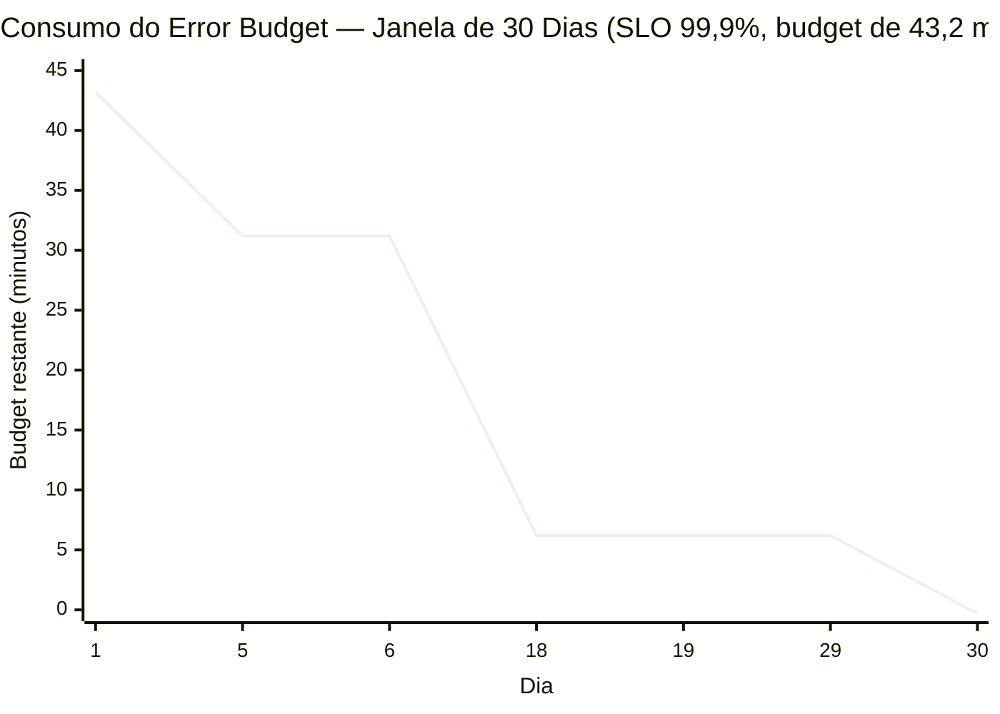

## Visão Geral

"Torne o sistema mais confiável" não é um requisito de engenharia, porque não tem ponto de parada — ninguém consegue dizer quando está pronto. "Torne o sistema 100% confiável" tem um ponto de parada, mas é o errado: 100% de disponibilidade não é alcançável para nenhum sistema com rede, disco ou dependência, e não é de fato o que os usuários querem, porque eles não conseguem perceber a diferença entre 99,99% e 100%, enquanto a última fração de porcentagem tipicamente custa muito mais para comprar do que vale para alguém. O que falta em ambos os enquadramentos é um número específico o suficiente para ser medido, flexível o suficiente para ser alcançável, e rígido o suficiente para que todos concordem sobre o que "quebrado" significa antes que aconteça. O modelo de Site Reliability Engineering do Google fornece exatamente esse número, construído a partir de três conceitos em camadas — o **SLI**, uma medição; o **SLO**, uma meta para essa medição; e o **error budget**, a diferença aritmética entre a meta e a perfeição — que juntos convertem confiabilidade de uma suposição não declarada sobre a qual todos discordam em um contrato deliberado, negociado e continuamente monitorado entre as pessoas que lançam funcionalidades e as pessoas que mantêm as luzes acesas.

## SLI: O Que Você Realmente Mede

Um **service level indicator** é, nas palavras do livro de SRE, uma medida quantitativa cuidadosamente definida de algum aspecto do nível de serviço fornecido. Não é uma noção vaga de "como as coisas estão indo" — é uma razão ou medição específica com um numerador e denominador precisos, calculada da mesma forma sempre. A forma canônica para a maioria dos SLIs é:

```
disponibilidade = eventos bons / eventos válidos
```

onde "bom" e "válido" são definidos explicitamente o suficiente para que dois engenheiros calculando o SLI independentemente cheguem ao mesmo número. Um **SLI de disponibilidade baseado em requisição** pode contar como válida toda requisição que chegou ao load balancer do serviço, e como boa cada uma dessas que retornou dentro de um limiar de latência e sem um status 5xx. Um **SLI de latência** é a fração de requisições válidas servidas abaixo de algum limiar (é aqui que percentis do trabalho sobre latência de requisições reaparecem — veja o pré-requisito sobre descrever performance). Taxa de erro, throughput, durabilidade (para armazenamento) e frescor (para pipelines) todos seguem a mesma forma: escolha o comportamento visível ao usuário que importa, defina precisamente o que conta, e calcule uma razão.

A disciplina que mais importa aqui é medir **o mais próximo possível da experiência real do usuário**. Um SLI calculado a partir de logs do lado do servidor perde requisições que nunca passaram por um load balancer quebrado ou um registro DNS expirado — o servidor nunca as viu, então elas nunca entraram no denominador, e o SLI parece artificialmente saudável durante exatamente a interrupção que importa. SLIs medidos no lado do cliente ou na borda são mais difíceis de instrumentar mas dizem a verdade; o próprio log de requisições de um load balancer é um meio-termo razoável para a maioria dos serviços.

## SLO: A Meta e a Janela

Um **service level objective** é um valor ou faixa alvo para um SLI, medido sobre uma janela de tempo definida. "99,9% de disponibilidade" não é um SLO por si só — está incompleto até você anexar a janela: 99,9% ao longo de 30 dias corridos é um compromisso diferente, mais frouxo, do que 99,9% em um único dia, porque uma interrupção curta e brutal que estouraria o budget diário é um erro de arredondamento contra um mês.

Escolher a meta é em si um exercício de engenharia, não uma aspiração. O método correto é empírico: olhar para qual nível de confiabilidade os usuários realmente toleraram sem reclamar, qual é a linha de base atual, e quanto custa incrementalmente mover o número — então escolher uma meta que reflita necessidades reais dos usuários em vez de um número redondo tirado de um slide. Um serviço de backend chamado apenas por outros serviços de backend dentro do mesmo caminho de requisição pode frequentemente tolerar SLOs mais frouxos que a borda voltada ao usuário que os agrega, porque a [amplificação de latência de cauda](describing-performance-latency-and-percentiles) significa que a confiabilidade visível ao usuário na borda é limitada pela confiabilidade de tudo por trás dela — um SLO para uma dependência interna tem que ser definido com esse fan-out em mente, não isoladamente.

O modelo de SRE também tem uma razão específica para prometer menos do que pode entregar: **SLOs devem ser mensuravelmente mais rígidos que qualquer SLA**, de modo que a meta interna seja violada — e corrigida — antes da contratual. Um SLA de 99,9% com um SLO interno de 99,95% dá à equipe um tiro de aviso antes que um cliente tenha direito a um crédito.

## SLA: A Meta Com Consequências

Um **service level agreement** é um SLO com consequências anexadas, e essas consequências costumam ser de negócio ou contratuais — créditos de serviço, reembolsos, direito de rescindir o contrato — negociadas com um cliente em vez de derivadas apenas de dados operacionais. A relação importante é a que acabou de ser declarada: o SLA deveria ser uma versão mais frouxa do SLO interno, não o mesmo número. Se fossem idênticos, a equipe descobriria um problema de confiabilidade pela primeira vez através de um cliente invocando a cláusula de penalidade, que é o pior canal possível para essa informação. A lacuna entre SLO e SLA é uma margem de alerta antecipado deliberadamente projetada.

## O Error Budget

Uma vez que um SLO existe, seu complemento é uma quantidade concreta e gastável: o **error budget**. Se o SLO é 99,9% de disponibilidade sobre uma janela de 30 dias, o error budget é o restante 0,1% — não um déficit abstrato, mas uma permissão de *quanta não-confiabilidade é aceitável* antes que alguém precise mudar o que está fazendo.

Transforme a porcentagem em minutos e a abstração se torna tangível:

```
Janela:      30 dias = 30 × 24 × 60 = 43.200 minutos
SLO:         99,9% de disponibilidade
Downtime permitido = 43.200 minutos × (1 − 0,999)
                  = 43.200 minutos × 0,001
                  = 43,2 minutos
```

Um SLO mensal de 99,9% compra ao serviço exatamente **43,2 minutos** de downtime (ou peso equivalente de eventos ruins, para um SLI não binário) para gastar ao longo de 30 dias, em nada em particular — um deploy malfeito, uma interrupção de dependência, uma funcionalidade nova agressiva que troca um pouco de confiabilidade por uma grande melhoria de latência. Aperte a meta em um nove, para 99,99%, e o budget cai para 4,32 minutos na mesma janela; afrouxe para 99% e o budget dispara para 432 minutos (7,2 horas). Pequenos movimentos na meta produzem movimentos grandes e não lineares no budget, que é exatamente por que a meta tem que ser escolhida deliberadamente em vez de escolhida por soar impressionante.

Uma tabela simples torna o padrão de consumo ao longo do mês concreto para um serviço com um budget de 99,9%/43,2 minutos:

| Dia | Evento | Minutos gastos | Budget restante |
|---|---|---|---|
| 1–4 | Operação normal | 0 | 43,2 min |
| 5 | Deploy ruim, revertido | 12 min | 31,2 min |
| 6–17 | Operação normal | 0 | 31,2 min |
| 18 | Interrupção de dependência upstream | 25 min | 6,2 min |
| 19–29 | Operação normal, congelamento de features em vigor | 0 | 6,2 min |
| 30 | Pequeno soluço durante um canary | 6,5 min | −0,3 min (budget esgotado) |



Uma vez que o budget chega a zero, o acordo do livro de SRE é explícito e se aplica independentemente de quem causou a última interrupção: lançamentos de funcionalidades e rollouts arriscados são pausados, e a prioridade da equipe muda para trabalho de confiabilidade — corrigir causas raiz, adicionar testes, endurecer o pipeline de rollout — até que o budget se reponha conforme a janela avança. Isso não é uma punição; é um circuit breaker pré-acordado que ambos os lados assinaram antes de haver um incidente para discutir.

## O Error Budget Como Ferramenta de Negociação Entre Dev e Ops

A tensão estrutural que o modelo de SRE foi projetado para resolver é antiga e bem conhecida: uma organização de produto é recompensada por lançar funcionalidades rápido, o que significa assumir risco — implantar com mais frequência, lançar mudanças experimentais, cortar cantos em defesa em profundidade — enquanto uma organização de operações ou SRE é recompensada por o sistema continuar no ar, o que significa resistir exatamente a esse risco. Não medida, essa é uma discussão permanente travada com anedotas e instinto, onde "apenas tenha mais cuidado" é a única alavanca que alguém pode puxar.

O error budget substitui a discussão por um número compartilhado que ambos os lados leem da mesma forma. Enquanto houver budget restante, o produto detém a decisão de gastá-lo — eles podem lançar a funcionalidade arriscada, rodar o experimento agressivo, implantar em uma sexta-feira — porque o custo de estar errado já está limitado pelo SLO e já foi acordado com antecedência. Uma vez que o budget acaba, a decisão se inverte automática e objetivamente: nenhum lançamento, ponto final, até que o trabalho de confiabilidade recupere o budget. Ninguém precisa ser o vilão que diz não a um lançamento — o número diz não. Isso é o que torna o modelo autoaplicável em vez de uma trégua negociada que precisa ser refeita a cada release — o SLO é definido uma vez, deliberadamente, e então a aritmética do error budget faz a arbitragem continuamente.

Também reformula o que "melhorar confiabilidade" significa dentro de uma organização. Uma equipe nunca é solicitada a ser "o mais confiável possível" — essa demanda é ilimitada e compete com toda outra prioridade indefinidamente. Ela é solicitada a atingir um número específico, previamente acordado, e uma vez que atinge, investimento adicional em confiabilidade explicitamente *não* é a prioridade; lançar é. Um error budget que nunca é gasto é em si um sinal — ou o SLO está definido frouxo demais para o que os usuários precisam, ou a equipe está superinvestindo em confiabilidade às custas de velocidade que poderia gastar com segurança.

## Burn Rate e Alertas Multi-Janela

O error budget por si só responde "quanto sobrou," não "quão urgente é a situação agora" — é isso que o **burn rate** mede: quão rápido o budget está sendo consumido em relação à taxa que o esgotaria exatamente no fim da janela. Um burn rate de 1 significa que o serviço está falhando precisamente na taxa que o SLO permite, gastando todo o budget de 30 dias ao longo de 30 dias. Um burn rate de 10 contra esse mesmo SLO de 99,9% significa que a taxa de erro atual esgotaria todo o budget de 30 dias em 3 dias; um burn rate de 100 significa que o mesmo budget de 43,2 minutos desaparece em cerca de 7 horas, e um burn rate severo de, digamos, 720 queimaria um budget de 30 dias em cerca de uma hora.

É por isso que uma estratégia de alertas madura não simplesmente aciona quando o limiar do SLO em si é cruzado depois do fato — quando uma média de 30 dias visivelmente escorregou, o dano em grande parte já foi feito e o alerta está mais próximo de uma entrada de post-mortem do que de um aviso. Em vez disso, o Capítulo 5 do Google SRE Workbook, "Alerting on SLOs," descreve **alertas multi-janela e multi-burn-rate**: avaliar o burn rate ao longo de várias janelas de tempo simultaneamente (por exemplo, uma janela curta como 5 minutos junto com uma mais longa como 1 hora, mais pares separados para queimas mais lentas), e exigir que o burn rate esteja elevado tanto na janela curta quanto na longa antes de acionar. A janela curta torna o alerta responsivo a um problema real e em andamento; a janela longa protege contra acionar em um soluço breve e autocorretivo, e exigir que ambas concordem também dá ao alerta um reset rápido e legítimo assim que o problema subjacente é de fato corrigido. Uma condição de queima rápida — "nessa taxa, esgotamos todo o budget de 30 dias em 2 horas" — aciona imediatamente em alta severidade; uma condição de queima lenta — caminhando para o esgotamento em uma semana — pode esperar por um ticket durante o horário comercial. A severidade do alerta é conduzida por quão rápido o budget está desaparecendo, não por se uma única linha de limiar estático foi cruzada.

## Trade-offs

- **SLOs mais rígidos compram margem de segurança contra SLAs mas encolhem o error budget de forma não linear** — ir de 99,9% para 99,99% divide o downtime permitido por 10, o que divide a liberdade da equipe de assumir riscos por aproximadamente o mesmo fator; a meta tem que ser escolhida contra a tolerância real do usuário, não escolhida para parecer impressionante.
- **Um SLI preciso é caro de calcular corretamente e barato de calcular errado** — medir a partir da borda do cliente captura a verdadeira experiência do usuário mas é mais difícil de instrumentar de forma confiável; medir a partir de logs do servidor é fácil mas cego a tudo que nunca chegou ao servidor, que é exatamente o modo de falha para o qual você mais precisa de visibilidade.
- **O error budget só arbitra de forma justa se ambos os lados confiam no SLI sobre o qual ele é construído** — um SLI manipulável ou ruidoso torna toda a negociação adversarial de novo, porque qualquer um dos lados pode disputar se o budget foi realmente gasto.
- **Alertas multi-janela com burn rate reduzem tanto alertas falsos quanto incidentes perdidos, ao custo de uma configuração de alerta materialmente mais complexa** — um único limiar estático é uma regra para raciocinar; alertas multi-janela e multi-burn-rate são várias regras correlacionadas por SLO, multiplicadas por cada serviço que tem um.
- **Congelar lançamentos quando o budget é gasto impõe disciplina mas pode se tornar em si um incentivo manipulável** — uma equipe sob pressão de lançamento tem motivo para redefinir o SLI, alargar a janela, ou disputar a classificação de uma interrupção em vez de aceitar o congelamento, então as definições precisam ter peso organizacional suficiente para que não sejam renegociadas silenciosamente sob pressão.

## Perguntas de Entrevista

- Seu serviço tem um SLO de 99,9% de disponibilidade ao longo de 30 dias e o error budget se esgota no dia 12. O que acontece a seguir segundo o modelo de SRE, e o que tornaria essa consequência crível em vez de teórica dentro da sua organização?
- Por que um SLO interno deveria sempre ser mais rígido que o SLA externo cobrindo o mesmo serviço, em vez de idêntico?
- Um SLI do lado do servidor reporta 99,95% de disponibilidade enquanto usuários reportam uma interrupção de 20 minutos que nunca apareceu na métrica. Qual é o erro de medição mais provável, e como você corrigiria o SLI?
- Explique burn rate com suas próprias palavras, e descreva por que acionar um alerta apenas quando o próprio limiar do SLO é cruzado é uma estratégia de alertas pior do que acionar com base em burn rate.
- Projete condições de alerta de burn rate multi-janela para um SLO mensal de 99,9%: quais pares de janela curta e longa você acionaria imediatamente, e quais você encaminharia para um ticket em vez de um alerta de plantão?
- O error budget de uma equipe nunca é gasto, mês após mês. Isso é boa notícia? Quais duas explicações muito diferentes você deveria investigar antes de concluir que é?

## Referências

- [Chris Jones, John Wilkes, e Niall Murphy com Cody Smith — Google SRE Book, Capítulo 4, "Service Level Objectives"](https://sre.google/sre-book/service-level-objectives/)
- [Steven Thurgood e David Ferguson com Alex Hidalgo e Betsy Beyer — Google SRE Workbook, Capítulo 2, "Implementing SLOs"](https://sre.google/workbook/implementing-slos/)
- [Steven Thurgood com Jess Frame, Anthony Lenton, Carmela Quinito, Anton Tolchanov, e Nejc Trdin — Google SRE Workbook, Capítulo 5, "Alerting on SLOs"](https://sre.google/workbook/alerting-on-slos/)
