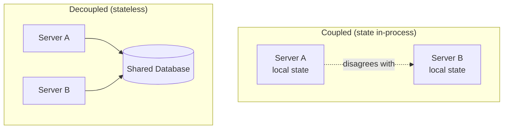

## Overview

The very first version of almost any backend looks like one server holding both the logic and the data it operates on — in memory, or on the local disk. This works, and it's the fastest thing to build, but it creates a single, silent coupling that limits everything downstream: **if the server dies, the data dies with it, and if you want a second server, you now have two disagreeing copies of the truth.** The fix — separating the server (compute) from where its data lives (storage) — is not just "add a database." It's the foundational move that every other scaling and resilience technique in this collection quietly assumes has already happened.

## The Coupled Starting Point

A server holding its own state looks something like this conceptually:

```
server:
  files: { "1": "/local/disk/movie.mp4", "2": "/local/disk/photo.png" }
  # data lives in the server's own memory/disk
```

This has two failure modes. First, **no durability**: if the process crashes or the machine is replaced, the data is gone — there was never a second copy anywhere. Second, **no scalability**: adding a second identical server to handle more load produces two independent copies of `files`, and a write to one is invisible to the other. A request that happens to land on server B has no idea what was just written to server A. This isn't a bug to patch — it's the direct consequence of state living inside the thing you're trying to replicate.

## Decoupling: Server Becomes Stateless

The fix is to move the data out of the server entirely, into a separate store the server talks to over the network:

```
server:  (no local state — just logic)
database: { "1": "/bucket/movie.mp4", "2": "/bucket/photo.png" }
```

Now the server is **stateless**: every request it handles is served by reading from and writing to the shared database, and the server itself holds nothing between requests that would be lost if it restarted. This single change is what makes horizontal scaling possible at all (see Horizontal vs. Vertical Scaling) — since any stateless instance can now correctly answer any request, a load balancer can freely send traffic to whichever instance is available (see Load Balancing Strategies) without worrying that the "wrong" instance doesn't have the data the request needs. It's also what makes a server disposable: it can crash, be redeployed, or be scaled down, and no data is lost, because the data was never there to begin with.



## Separation of Concerns

This split is a direct instance of a much older principle: the server is concerned with *serving* the user, and the database is concerned with *storing* the data — each can change, fail, or scale independently of the other, as long as the contract (the API/query interface) between them holds. The server doesn't need to know how the database persists rows to disk or replicates them; the database doesn't need to know how many server instances exist or where they're deployed. Each piece is free to evolve — swap the database engine, add server instances, change server code — without the other needing to change, because neither depends on the other's internals, only on the interface between them.

## What Still Counts as "State" in a Server

Not all in-memory data is a problem — a server can cache a value it re-derives on every restart without harm. The dangerous kind of state is anything that would be *lost or become wrong* if a request landed on a different instance than the one that created it: an in-process session, a partially-received multi-step upload tracked only in local memory, a websocket connection tied to one process. These are exactly the cases that force compromises like sticky sessions (see Load Balancing Strategies) when they can't be fully externalized — a sticky session is, in effect, an admission that some piece of state didn't get decoupled from the server, and the load balancer is compensating for it by always routing that client back to the one instance that still holds it.

## Trade-offs

- **Decoupling adds a network hop and a new failure mode, in exchange for durability and horizontal scalability** — every request that used to be served from local memory now depends on the database being reachable, which is a real cost, not a free win.
- **A fully stateless server is easy to scale and easy to replace, but pushes all consistency problems into the shared store** — the server no longer has to worry about two copies of data disagreeing, but the database absolutely does, which is the seed of nearly every distributed-systems problem covered elsewhere in this collection (see CAP Theorem).
- **Not externalizing state is sometimes a legitimate, deliberate trade** — a single-instance service with genuinely ephemeral local state can be simpler and faster than externalizing everything, as long as it's an explicit choice and not an accident that surfaces the first time someone adds a second instance.

## Interview Questions

- Concretely, what breaks when you add a second instance of a server that keeps its data in local memory or on local disk?
- Why is "the server is stateless" a prerequisite for horizontal scaling rather than just a nice property to have?
- What is a sticky session, in terms of this concept — what does it imply about whether state was actually decoupled?
- Give an example of in-memory server state that's safe to keep local, and explain what makes it different from state that isn't.
- How does separating server and database into independent concerns change what happens when one of them fails?

## References

- Martin Fowler — [Software Architecture Guide](https://martinfowler.com/architecture/) (on separation of concerns as an architectural principle)
- Martin Kleppmann, *Designing Data-Intensive Applications*, 2nd Edition (O'Reilly) — Chapter 1, "Reliable, Scalable, and Maintainable Applications"
- [The Twelve-Factor App — VI. Processes](https://12factor.net/processes) (execute the app as one or more stateless processes)
- [AWS Well-Architected Framework — Reliability Pillar](https://docs.aws.amazon.com/wellarchitected/latest/reliability-pillar/welcome.html)
