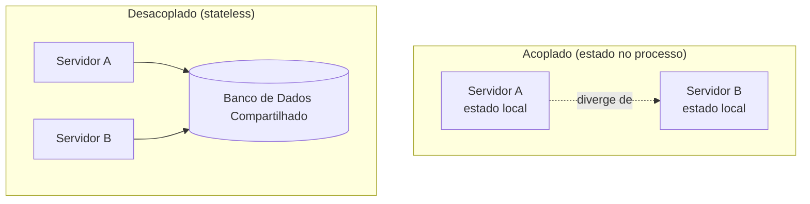

## Visão Geral

A primeiríssima versão de quase qualquer backend se parece com um único servidor guardando tanto a lógica quanto os dados sobre os quais ele opera — em memória, ou no disco local. Isso funciona, e é a coisa mais rápida de construir, mas cria um acoplamento único e silencioso que limita tudo que vem depois: **se o servidor morre, os dados morrem junto, e se você quer um segundo servidor, agora tem duas cópias divergentes da verdade.** A correção — separar o servidor (computação) de onde seus dados vivem (armazenamento) — não é apenas "adicionar um banco de dados." É o movimento fundamental que toda outra técnica de escalabilidade e resiliência nesta coleção silenciosamente assume que já aconteceu.

## O Ponto de Partida Acoplado

Um servidor guardando seu próprio estado se parece com algo assim conceitualmente:

```
server:
  files: { "1": "/local/disk/movie.mp4", "2": "/local/disk/photo.png" }
  # dados vivem na memória/disco do próprio servidor
```

Isso tem dois modos de falha. Primeiro, **nenhuma durabilidade**: se o processo cai ou a máquina é substituída, os dados se vão — nunca houve uma segunda cópia em lugar nenhum. Segundo, **nenhuma escalabilidade**: adicionar um segundo servidor idêntico para lidar com mais carga produz duas cópias independentes de `files`, e uma escrita em uma é invisível para a outra. Uma requisição que por acaso caia no servidor B não tem ideia do que acabou de ser escrito no servidor A. Isso não é um bug para corrigir — é a consequência direta de o estado viver dentro da coisa que você está tentando replicar.

## Desacoplando: O Servidor se Torna Stateless

A correção é mover os dados para fora do servidor por completo, para um armazenamento separado com o qual o servidor conversa pela rede:

```
server:  (sem estado local — apenas lógica)
database: { "1": "/bucket/movie.mp4", "2": "/bucket/photo.png" }
```

Agora o servidor é **stateless**: cada requisição que ele atende é servida lendo e escrevendo no banco de dados compartilhado, e o próprio servidor não guarda nada entre requisições que seria perdido se ele reiniciasse. Essa única mudança é o que torna a escalabilidade horizontal possível (veja Horizontal vs. Vertical Scaling) — já que qualquer instância stateless agora pode responder corretamente a qualquer requisição, um load balancer pode livremente enviar tráfego para qualquer instância disponível (veja Load Balancing Strategies) sem se preocupar que a instância "errada" não tenha os dados que a requisição precisa. Também é o que torna um servidor descartável: ele pode cair, ser reimplantado, ou ser reduzido em escala, e nenhum dado é perdido, porque os dados nunca estiveram lá para começar.



## Separação de Preocupações

Essa divisão é uma instância direta de um princípio muito mais antigo: o servidor se preocupa em *atender* o usuário, e o banco de dados se preocupa em *armazenar* os dados — cada um pode mudar, falhar ou escalar independentemente do outro, contanto que o contrato (a interface de API/consulta) entre eles se mantenha. O servidor não precisa saber como o banco de dados persiste linhas em disco ou as replica; o banco de dados não precisa saber quantas instâncias de servidor existem ou onde estão implantadas. Cada peça é livre para evoluir — trocar o motor do banco de dados, adicionar instâncias de servidor, mudar o código do servidor — sem que a outra precise mudar, porque nenhuma depende dos detalhes internos da outra, apenas da interface entre elas.

## O Que Ainda Conta Como "Estado" em um Servidor

Nem todo dado em memória é um problema — um servidor pode cachear um valor que ele re-deriva a cada reinício sem prejuízo. O tipo perigoso de estado é qualquer coisa que seria *perdida ou se tornaria errada* se uma requisição caísse em uma instância diferente daquela que a criou: uma sessão no processo, um upload multi-etapas parcialmente recebido rastreado apenas em memória local, uma conexão websocket amarrada a um processo. Esses são exatamente os casos que forçam soluções de compromisso como sessões pegajosas (sticky sessions) (veja Load Balancing Strategies) quando não podem ser totalmente externalizados — uma sticky session é, na prática, uma admissão de que algum pedaço de estado não foi desacoplado do servidor, e o load balancer está compensando isso sempre roteando aquele cliente de volta para a única instância que ainda o guarda.

## Trade-offs

- **Desacoplar adiciona um salto de rede e um novo modo de falha, em troca de durabilidade e escalabilidade horizontal** — cada requisição que costumava ser servida da memória local agora depende do banco de dados estar acessível, o que é um custo real, não uma vitória de graça.
- **Um servidor totalmente stateless é fácil de escalar e fácil de substituir, mas empurra todos os problemas de consistência para o armazenamento compartilhado** — o servidor não precisa mais se preocupar com duas cópias de dados divergindo, mas o banco de dados absolutamente precisa, que é a semente de quase todo problema de sistemas distribuídos coberto em outros lugares nesta coleção (veja CAP Theorem).
- **Não externalizar estado às vezes é uma troca legítima e deliberada** — um serviço de instância única com estado local genuinamente efêmero pode ser mais simples e rápido do que externalizar tudo, contanto que seja uma escolha explícita e não um acidente que aparece na primeira vez que alguém adiciona uma segunda instância.

## Perguntas de Entrevista

- Concretamente, o que quebra quando você adiciona uma segunda instância de um servidor que guarda seus dados em memória local ou disco local?
- Por que "o servidor é stateless" é um pré-requisito para escalabilidade horizontal em vez de apenas uma propriedade agradável de se ter?
- O que é uma sticky session, em termos desse conceito — o que ela implica sobre se o estado foi de fato desacoplado?
- Dê um exemplo de estado de servidor em memória que é seguro manter local, e explique o que o torna diferente de um estado que não é.
- Como separar servidor e banco de dados em preocupações independentes muda o que acontece quando um deles falha?

## Referências

- Martin Fowler — [Software Architecture Guide](https://martinfowler.com/architecture/) (sobre separação de preocupações como princípio arquitetural)
- Martin Kleppmann, *Designing Data-Intensive Applications*, 2ª Edição (O'Reilly) — Capítulo 1, "Reliable, Scalable, and Maintainable Applications"
- [The Twelve-Factor App — VI. Processes](https://12factor.net/processes) (execute a aplicação como um ou mais processos stateless)
- [AWS Well-Architected Framework — Reliability Pillar](https://docs.aws.amazon.com/wellarchitected/latest/reliability-pillar/welcome.html)
