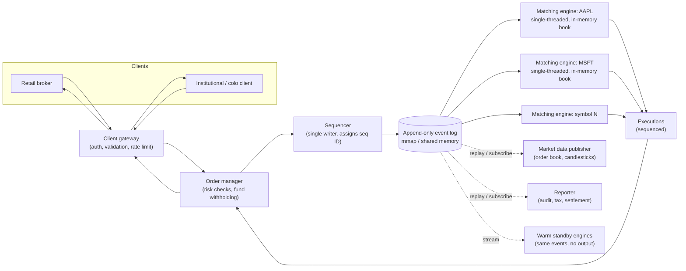

## Overview

An electronic exchange is the one system in this collection where **microsecond latency is the primary design constraint**, not throughput and not availability. Everywhere else, "slow" means a degraded experience; here, slow means *unfair* — because the order in which orders arrive determines who gets filled first at a given price, any jitter in the path from the wire to the matching engine silently reallocates money between participants. That single fact drives every unusual decision in the design: a single-threaded matching loop instead of a thread pool, an in-memory order book instead of a database, and an append-only event log instead of mutable state.

## Functional Requirements

Scope an exchange design down to the trading core before touching anything else. A workable MVP:

- **Place a limit order** — a buy or sell at a fixed price, which may match immediately, partially, or sit in the book unfilled.
- **Cancel a resting order** — before it's matched; a cancel that races a fill must resolve deterministically to one outcome, never both.
- **Receive executions in real time** — a match produces two *executions* (fills), one for each side, pushed back to both participants.
- **View the live order book** — the aggregated resting buy and sell interest per price level (L1 best bid/ask, L2 several price levels, L3 per-order depth).
- **Risk and funds checks** — a participant can't exceed a position limit or spend funds they don't have; funds backing a resting order are *withheld*, not merely checked once at submission.

Deliberately out of scope for a first pass: market orders, conditional/stop orders, after-hours sessions, options and futures, and settlement.

## Non-Functional Requirements

These are what actually make the design strange:

- **Deterministic, in-order matching.** Given the same input sequence of orders, the engine must produce byte-identical output executions, in the same order, every time it's replayed. Determinism isn't a nice property here — it's the mechanism that makes recovery, replication, and audit possible at all.
- **Fairness.** Matching follows a published, mechanical rule (price-time priority), and participants must not be able to gain priority through anything other than a better price or an earlier arrival.
- **Extreme low latency.** Round-trip from order arrival to execution is budgeted in **tens of microseconds** on modern designs, and the number that matters is the 99th (often 99.99th) percentile, not the mean. A stable 50µs is worth more than an average of 20µs with a 5ms tail — a tail spike is a participant who got filled at the wrong price.
- **Strict correctness.** A trade can never be lost, duplicated, or matched against the wrong resting order. There's no eventual-consistency escape hatch: a duplicated fill is a real position that someone owes real money on.
- **Regulatory auditability.** Every order, amendment, cancel, and execution must be reconstructable after the fact, with its exact position in the sequence — regulators ask "why did *this* order fill before *that* one," and the answer must come from a record, not a reconstruction.
- **Availability.** Four nines is table stakes (~8.6 seconds of downtime per trading day), with automatic failover measured in seconds and an RPO of effectively zero.

At 1 billion orders per day over a 6.5-hour session, that's ~43,000 orders/second sustained and ~215,000/second at the open and close — high, but nowhere near the volume that would force a distributed design on throughput grounds alone. **The scale problem here is latency, not volume.**

## The Order Book and Price-Time Priority

The order book is the entire state of the matching engine: all resting buy orders (bids) and sell orders (asks) for one symbol, organized by price level. Matching follows **price-time priority**:

1. **Price first** — the most aggressive price wins. An incoming buy matches against the *lowest* ask available; an incoming sell matches against the *highest* bid.
2. **Time second** — among orders resting at the same price, the one that arrived first is filled first. This is why arrival ordering is a fairness property, not an implementation detail.

That maps directly onto a structure keyed by price level, with a **FIFO queue per level**:

```
class PriceLevel {
    Price limitPrice;
    long totalVolume;
    DoublyLinkedList<Order> orders;   // FIFO: head fills first, new orders append at tail
}

class Book<Side> {
    Side side;
    Map<Price, PriceLevel> limitMap;  // price -> level
}

class OrderBook {
    Book<Buy> buyBook;
    Book<Sell> sellBook;
    PriceLevel bestBid;               // cached pointers to the top of book
    PriceLevel bestOffer;
    Map<OrderId, Order> orderMap;     // for O(1) cancel
}
```

Every hot operation is O(1) by construction, and each of the three is worth naming:

- **Place** — append to the tail of the price level's list. O(1).
- **Match** — pop from the head of the best level. O(1), and it's the head *because* time priority says so.
- **Cancel** — look the order up in `orderMap` to get a direct pointer, then unlink it. This is the operation that forces a **doubly**-linked list: with a singly-linked list you'd have to walk the level to find the predecessor node, turning a cancel into O(n) — and cancels vastly outnumber fills in real markets, so an O(n) cancel is the difference between a working engine and one that stalls whenever a market maker repositions.

Best bid and best offer are kept as cached pointers rather than recomputed, because "what's the top of book" is asked on essentially every incoming order.

## Why the Matching Engine Is Single-Threaded

Almost every other concept in this collection answers "it's too slow" with *scale out* — shard it, parallelize it, add replicas. **A matching engine for a given symbol does the opposite: it runs as a single-threaded, in-memory, sequential process, and that's the optimization, not a limitation waiting to be fixed.** It's worth naming the inversion explicitly, because the instinct to parallelize is the wrong one here.

The reasoning:

- **Locks would be the bottleneck, not the parallelism.** The order book is one shared mutable structure that every operation touches. Concurrent access means locks on the book (or on price levels), and under contention, lock acquisition — plus the cache-line ping-pong between cores that comes with it — costs more than the matching work itself. One thread that owns the data structure outright needs no locks at all.
- **Concurrency destroys determinism.** With multiple threads, the interleaving of two orders arriving microseconds apart depends on scheduler decisions, cache state, and luck. That makes the output non-reproducible, which breaks replay-based recovery, breaks hot-warm replication, and breaks the audit story — you can no longer answer "why did this fill happen" with a deterministic function of the input log.
- **Predictable tail latency beats peak throughput.** A single thread pinned to a dedicated CPU core, spinning in an application loop polling for work, eliminates context switches and scheduler jitter. The result is a *narrow* latency distribution, which is what the 99.99th-percentile requirement is actually asking for. Threads that migrate between cores, contend on locks, or get descheduled produce exactly the multi-millisecond tail spikes that matter most.

The same discipline extends to everything the loop touches: no allocation in the hot path (pre-allocated ring buffers and object pools instead), no logging on the critical path, no disk I/O, no network hop that can be avoided. In a JVM implementation, garbage collection pauses and safepoints become a first-class latency concern — a stop-the-world pause is indistinguishable, from the market's point of view, from the exchange going down for the duration.

The honest cost: a single thread means one core's worth of work is the hard ceiling for a symbol, and every task on that loop must be short. If any handler takes too long, it blocks every order behind it. Engineers have to budget the per-event execution time explicitly, which makes the code harder to write than a naively concurrent version.

## Scaling Across Symbols: Partition, Don't Parallelize

The escape hatch from the single-thread ceiling is that **order books for different symbols are completely independent** — an AAPL order can never match against an MSFT order. So the system scales by *partitioning by symbol*, not by parallelizing a single book:

- Each symbol (or a group of symbols) is assigned to a matching engine instance with its own thread, its own book, and its own sequence.
- Adding symbols is a horizontal scaling problem with no cross-partition coordination, because there are no cross-symbol transactions in the matching layer.
- Load is uneven — a handful of high-volume names may each warrant a dedicated core while hundreds of thin ones share one — so partition assignment is a capacity-planning decision, not a hash.

This is the same partitioning instinct used everywhere else in distributed systems, but applied at a level of granularity chosen so that the *inside* of each partition can stay strictly sequential. Anything that genuinely spans symbols — cross-symbol risk limits, a client's overall wallet balance — is deliberately pushed *off* the matching path into the order manager and risk checks upstream, where a few extra microseconds are affordable.

## The Sequencer and the Append-Only Event Log

Between the gateway and the matching engine sits the **sequencer**: a single writer that stamps every inbound order with a monotonically increasing sequence ID and appends it to an event log. Executions coming back out are sequenced the same way. This one component does a surprising amount of work:

- **It defines fairness.** The sequence ID *is* the arrival time as far as the exchange is concerned. Whatever order the sequencer assigns is the order the book sees, so wall-clock timestamps from gateways with slightly different clocks never enter the matching decision.
- **It makes recovery a replay.** Because the matching engine is a deterministic function of the sequenced input, restoring state after a crash is just "replay the log from the last snapshot." No state is persisted from the engine itself — the log is the source of truth, and the book is a projection of it. This is event sourcing with the strictest possible ordering guarantee.
- **It gives exactly-once semantics.** Gaps in a strictly sequential ID stream are trivially detectable, so a lost or duplicated message is caught rather than silently mismatched.
- **It satisfies the audit requirement for free.** The regulatory record and the recovery mechanism are the same artifact.

There must be exactly **one** sequencer per event store. Multiple sequencers would contend for the right to append and would reintroduce the ambiguity the sequencer exists to remove.

Replaying deterministically after a crash is precisely the property that makes a partial failure survivable — see [The Trouble with Distributed Systems](distributed-systems-partial-failures) for why you can't reason about a crashed process's state from the outside, and why "reconstruct from an ordered log" beats "ask the failed node what it had done." A process that crashed mid-match, a process that's merely paused by a long GC, and a process that's unreachable across a network look identical to everyone else; the log means you don't have to tell them apart to recover correctly.

In a low-latency implementation, this log isn't Kafka — Kafka's latency is neither low enough nor predictable enough for a critical path budgeted in microseconds. Instead, components are colocated on one machine and communicate through a memory-mapped file (`mmap` over `/dev/shm`, a memory-backed filesystem), which turns "append to the log and hand off to the next component" into a sub-microsecond memory write with no syscall and no disk seek on the hot path. Structurally it's the same pub/sub design Kafka provides — just implemented at a latency Kafka can't reach.

## The Full Order Path



The critical path is the solid line — gateway, order manager, sequencer, engine, and back. Everything hanging off the log with a dotted line (market data, reporting, standbys) is a *subscriber* to the same sequenced stream and has a completely different latency budget. That separation is the point: reporting and analytics get the identical event history without ever adding a microsecond to a match.

## Replication and Failover Without Breaking the Single Writer

A single-threaded engine sounds like a single point of failure, and it would be — except that determinism makes replication almost free. The standard arrangement is **hot-warm**: the primary engine and one or more standbys consume the *same sequenced event stream* and apply it to their own in-memory books, so their state is identical at every sequence number. The difference is that only the primary emits executions; the warm instances compute the same results and discard them. On failover, a warm instance is already at the current sequence number and starts emitting immediately — no state transfer, no catch-up window.

The remaining question is the hard one: **who decides that the primary is down, and who becomes primary next?** This is exactly leader election, and it's a solved problem — see [Consensus and Coordination Services](consensus-and-coordination-services) for the mechanics. A Raft group over the engine replicas both replicates the event log to a quorum and elects the new leader, with the term number serving as a fencing token so a "recovered" old primary can't resume emitting executions into a stream that has moved on without it. Crucially, consensus here protects the *single-writer property* rather than replacing it: at most one node holds leadership at a time, so the sequential, deterministic model inside each engine is never violated — the cluster is agreeing on *which* single writer is authoritative, not letting several write at once.

Two practical caveats that consensus doesn't solve:

- **A false failover is worse than a brief pause.** An over-eager failure detector triggers unnecessary leader changes, each of which costs availability while the election runs. Many exchanges start with *manual* failover and only automate once they've built operational confidence.
- **A correctness bug replicates perfectly.** Determinism means every replica processes the same event identically — including the one that crashes the primary. A bug that kills the leader will kill the new leader the moment it replays the same event. Redundancy defends against hardware and network failure, not against the engine's own logic.

Beyond a single machine, the whole server becomes the unit of hot/warm, and the event store is replicated across machines and data centers — typically over reliable multicast/UDP rather than TCP, because broadcasting the same stream to many replicas at once is both faster and fairer than a fan of point-to-point connections.

## Fairness Beyond the Match

Fairness doesn't stop at the matching rule. Market data distribution has the same property: if the publisher pushes updates to subscribers in connection order, the first client to connect at the open sees every price change first — a real, exploitable edge. The fixes are **multicast** (all subscribers in a group receive the same datagram at the same time, with NACK-based retransmission handling UDP's unreliability) and randomizing subscriber order where multicast isn't available.

**Colocation** — renting rack space in the exchange's own data center — is the interesting edge case. It gives some participants a measurably shorter cable and therefore lower latency, which sounds like a fairness violation, but it's treated as a published, purchasable service available to anyone on equal terms rather than a hidden advantage. The line the design defends is *undisclosed* asymmetry, not the existence of any asymmetry at all.

## Trade-offs

- **Single-threaded matching buys determinism and tail-latency stability at the cost of a hard per-symbol throughput ceiling** — one core is the limit for one book, and the only way past it is to split symbols across engines; a symbol whose volume genuinely exceeds one core has no clean answer within this architecture.
- **Colocating every critical-path component on one machine and talking over shared memory eliminates network hops, but trades away the isolation and independent scaling that separate services provide** — a design that hits tens of microseconds end-to-end is also a design where one process's memory corruption or one machine's failure takes the whole trading path with it, which is why the fault-tolerance story has to be so strong.
- **Event sourcing gives perfect auditability and replay-based recovery, but the log grows without bound and replay time grows with it** — periodic snapshots are mandatory, and a snapshot is itself a consistency problem (it must correspond to an exact sequence number, not "roughly now").
- **Hot-warm replication makes failover nearly instantaneous, but the standbys are pure cost** — they consume the full event stream and do all the matching work to produce output that's thrown away, so redundancy here means paying for N copies of the compute, not spreading load across N nodes.
- **Determinism protects against machine failure but amplifies logic bugs** — every replica reproduces the same bad state transition faithfully, so replication provides zero defense against a poison event; that failure mode needs versioned engine binaries and the ability to replay a corrected log, not more replicas.
- **Pushing risk checks and wallet holds off the matching path keeps the engine fast, but means the engine trusts orders it was handed** — anything the upstream risk layer misses is matched into a real, binding trade, so the correctness boundary has moved to a component that's easier to get wrong precisely because it's less latency-constrained and therefore more complex.

## Interview Questions

- Every other system in this collection scales by adding concurrency. Why does the matching engine deliberately do the opposite, and what specifically would break if you protected the order book with a lock and ran eight threads against it?
- The order book uses a doubly-linked list per price level rather than a singly-linked one. Which operation forces that choice, and why does it matter more than it first appears given real market behavior?
- The engine persists no state of its own — only the sequenced input log is durable. What has to be true about the engine for that to be a safe design, and what breaks if it isn't?
- Consensus normally lets a group of nodes make progress together. Here it's used to elect a leader whose whole value is that it's the *only* writer. Reconcile those two things — what exactly is the cluster agreeing on?
- Two clients submit orders at the same price within a microsecond of each other from different gateways whose clocks disagree by 200µs. Which one gets filled first, and which component made that decision?

## References

- [Alex Xu and Sahn Lam, "System Design Interview – An Insider's Guide, Volume 2" (ByteByteGo, 2022) — Chapter 13, "Stock Exchange"](https://bytebytego.com)
- Martin Fowler, ["The LMAX Architecture"](https://martinfowler.com/articles/lmax.html) — a real exchange built around a single-threaded business logic processor and event sourcing
- Martin Thompson, Dave Farley, Michael Barker, Patricia Gee, Andrew Stewart, ["Disruptor: High Performance Alternative to Bounded Queues for Exchanging Data Between Concurrent Threads"](https://lmax-exchange.github.io/disruptor/disruptor.html) (LMAX, 2011)
- [Aeron — Design Overview](https://github.com/real-logic/aeron/wiki/Design-Overview) — low-latency reliable UDP/multicast messaging used for replicating event streams across machines
