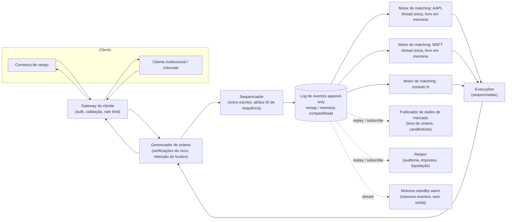

## Visão Geral

Uma bolsa eletrônica é o único sistema nesta coleção onde **latência de microssegundos é a restrição de design primária**, não throughput e não disponibilidade. Em todo o resto, "lento" significa uma experiência degradada; aqui, lento significa *injusto* — porque a ordem em que as ordens chegam determina quem é executado primeiro em um determinado preço, qualquer jitter no caminho do fio até o motor de matching realoca silenciosamente dinheiro entre participantes. Esse único fato conduz toda decisão incomum no design: um loop de matching de thread única em vez de um pool de threads, um livro de ordens em memória em vez de um banco de dados, e um log de eventos append-only em vez de estado mutável.

## Requisitos Funcionais

Delimite o design de uma bolsa ao núcleo de negociação antes de tocar em qualquer outra coisa. Um MVP viável:

- **Colocar uma ordem limitada** — uma compra ou venda a um preço fixo, que pode ser executada imediatamente, parcialmente, ou ficar no livro sem execução.
- **Cancelar uma ordem em aberto** — antes de ser executada; um cancelamento que corre contra uma execução deve resolver deterministicamente para um resultado, nunca ambos.
- **Receber execuções em tempo real** — um match produz duas *execuções* (fills), uma para cada lado, enviadas de volta para ambos os participantes.
- **Ver o livro de ordens ao vivo** — o interesse agregado de compra e venda em aberto por nível de preço (L1 melhor bid/ask, L2 vários níveis de preço, L3 profundidade por ordem).
- **Verificações de risco e fundos** — um participante não pode exceder um limite de posição ou gastar fundos que não tem; fundos que respaldam uma ordem em aberto são *retidos*, não apenas verificados uma vez na submissão.

Deliberadamente fora de escopo para uma primeira passagem: ordens a mercado, ordens condicionais/stop, sessões fora do horário, opções e futuros, e liquidação.

## Requisitos Não Funcionais

Estes são os que realmente tornam o design estranho:

- **Matching determinístico e em ordem.** Dada a mesma sequência de entrada de ordens, o motor deve produzir execuções de saída idênticas byte a byte, na mesma ordem, toda vez que for reproduzido. Determinismo não é uma propriedade legal aqui — é o mecanismo que torna recuperação, replicação e auditoria possíveis.
- **Justiça.** O matching segue uma regra publicada e mecânica (prioridade preço-tempo), e participantes não podem ganhar prioridade através de nada além de um preço melhor ou uma chegada anterior.
- **Latência extremamente baixa.** O round-trip da chegada da ordem até a execução é orçado em **dezenas de microssegundos** em designs modernos, e o número que importa é o percentil 99 (frequentemente 99,99), não a média. Um estável 50µs vale mais que uma média de 20µs com uma cauda de 5ms — um pico de cauda é um participante que foi executado no preço errado.
- **Correção estrita.** Uma negociação nunca pode ser perdida, duplicada, ou casada contra a ordem em aberto errada. Não há escape de consistência eventual: um fill duplicado é uma posição real pela qual alguém deve dinheiro real.
- **Auditabilidade regulatória.** Cada ordem, alteração, cancelamento e execução deve ser reconstruível depois do fato, com sua posição exata na sequência — reguladores perguntam "por que *esta* ordem foi executada antes daquela," e a resposta precisa vir de um registro, não de uma reconstrução.
- **Disponibilidade.** Quatro noves é o mínimo aceitável (~8,6 segundos de downtime por dia de negociação), com failover automático medido em segundos e um RPO efetivamente zero.

Com 1 bilhão de ordens por dia ao longo de uma sessão de 6,5 horas, isso dá ~43.000 ordens/segundo sustentado e ~215.000/segundo na abertura e fechamento — alto, mas longe do volume que forçaria um design distribuído apenas por motivos de throughput. **O problema de escala aqui é latência, não volume.**

## O Livro de Ordens e a Prioridade Preço-Tempo

O livro de ordens é todo o estado do motor de matching: todas as ordens de compra (bids) e venda (asks) em aberto para um símbolo, organizadas por nível de preço. O matching segue **prioridade preço-tempo**:

1. **Preço primeiro** — o preço mais agressivo vence. Uma compra recebida casa contra o *menor* ask disponível; uma venda recebida casa contra o *maior* bid.
2. **Tempo em segundo** — entre ordens em aberto no mesmo preço, a que chegou primeiro é executada primeiro. É por isso que a ordem de chegada é uma propriedade de justiça, não um detalhe de implementação.

Isso mapeia diretamente para uma estrutura chaveada por nível de preço, com uma **fila FIFO por nível**:

```
class PriceLevel {
    Price limitPrice;
    long totalVolume;
    DoublyLinkedList<Order> orders;   // FIFO: cabeça é executada primeiro, novas ordens anexadas na cauda
}

class Book<Side> {
    Side side;
    Map<Price, PriceLevel> limitMap;  // preço -> nível
}

class OrderBook {
    Book<Buy> buyBook;
    Book<Sell> sellBook;
    PriceLevel bestBid;               // ponteiros cacheados para o topo do livro
    PriceLevel bestOffer;
    Map<OrderId, Order> orderMap;     // para cancelamento O(1)
}
```

Cada operação quente é O(1) por construção, e cada uma das três vale a pena nomear:

- **Colocar (Place)** — anexar à cauda da lista do nível de preço. O(1).
- **Casar (Match)** — remover da cabeça do melhor nível. O(1), e é a cabeça *porque* a prioridade de tempo diz isso.
- **Cancelar** — buscar a ordem em `orderMap` para obter um ponteiro direto, então desvinculá-la. Essa é a operação que força uma lista **duplamente**-ligada: com uma lista simplesmente ligada você teria que percorrer o nível para encontrar o nó predecessor, transformando um cancelamento em O(n) — e cancelamentos superam vastamente execuções em mercados reais, então um cancelamento O(n) é a diferença entre um motor funcional e um que trava sempre que um formador de mercado se reposiciona.

O melhor bid e a melhor oferta são mantidos como ponteiros cacheados em vez de recomputados, porque "qual é o topo do livro" é perguntado em essencialmente toda ordem recebida.

## Por Que o Motor de Matching É de Thread Única

Quase todo outro conceito nesta coleção responde a "está lento demais" com *escalar horizontalmente* — particionar, paralelizar, adicionar réplicas. **Um motor de matching para um determinado símbolo faz o oposto: ele roda como um processo sequencial, em memória, de thread única, e essa é a otimização, não uma limitação esperando ser corrigida.** Vale a pena nomear a inversão explicitamente, porque o instinto de paralelizar é o errado aqui.

O raciocínio:

- **Locks seriam o gargalo, não o paralelismo.** O livro de ordens é uma estrutura mutável compartilhada que toda operação toca. Acesso concorrente significa locks no livro (ou nos níveis de preço), e sob contenção, a aquisição de lock — mais o ping-pong de linha de cache entre núcleos que vem junto — custa mais do que o próprio trabalho de matching. Uma thread que possui a estrutura de dados por completo não precisa de nenhum lock.
- **Concorrência destrói determinismo.** Com várias threads, o intercalamento de duas ordens chegando com microssegundos de diferença depende de decisões do scheduler, estado de cache e sorte. Isso torna a saída não reproduzível, o que quebra a recuperação baseada em replay, quebra a replicação hot-warm, e quebra a história de auditoria — você não consegue mais responder "por que essa execução aconteceu" com uma função determinística do log de entrada.
- **Latência de cauda previsível vence throughput de pico.** Uma única thread fixada em um núcleo de CPU dedicado, girando em um loop de aplicação sondando por trabalho, elimina trocas de contexto e jitter do scheduler. O resultado é uma distribuição de latência *estreita*, que é o que o requisito de percentil 99,99 realmente está pedindo. Threads que migram entre núcleos, disputam locks, ou são desalocadas produzem exatamente os picos de cauda de vários milissegundos que mais importam.

A mesma disciplina se estende a tudo que o loop toca: nenhuma alocação no caminho quente (ring buffers pré-alocados e object pools em vez disso), nenhum log no caminho crítico, nenhum I/O de disco, nenhum salto de rede que possa ser evitado. Em uma implementação JVM, pausas de garbage collection e safepoints se tornam uma preocupação de latência de primeira classe — uma pausa stop-the-world é indistinguível, do ponto de vista do mercado, de a bolsa cair pela duração dela.

O custo honesto: uma única thread significa que o trabalho de um núcleo é o teto rígido para um símbolo, e toda tarefa nesse loop precisa ser curta. Se qualquer handler demorar demais, ele bloqueia toda ordem atrás dele. Engenheiros precisam orçar o tempo de execução por evento explicitamente, o que torna o código mais difícil de escrever do que uma versão ingenuamente concorrente.

## Escalando Entre Símbolos: Particionar, Não Paralelizar

A saída de emergência do teto de thread única é que **livros de ordens para símbolos diferentes são completamente independentes** — uma ordem de AAPL nunca pode casar contra uma de MSFT. Então o sistema escala **particionando por símbolo**, não paralelizando um único livro:

- Cada símbolo (ou um grupo de símbolos) é atribuído a uma instância de motor de matching com sua própria thread, seu próprio livro, e sua própria sequência.
- Adicionar símbolos é um problema de escalabilidade horizontal sem coordenação entre partições, porque não há transações entre símbolos na camada de matching.
- A carga é desigual — um punhado de nomes de alto volume pode cada um justificar um núcleo dedicado enquanto centenas de nomes de baixo volume compartilham um — então a atribuição de partições é uma decisão de planejamento de capacidade, não um hash.

Esse é o mesmo instinto de particionamento usado em todo lugar em sistemas distribuídos, mas aplicado em um nível de granularidade escolhido para que o *interior* de cada partição possa permanecer estritamente sequencial. Qualquer coisa que genuinamente atravesse símbolos — limites de risco entre símbolos, o saldo geral da carteira de um cliente — é deliberadamente empurrada *para fora* do caminho de matching, para o gerenciador de ordens e verificações de risco a montante, onde alguns microssegundos extras são pagáveis.

## O Sequenciador e o Log de Eventos Append-Only

Entre o gateway e o motor de matching fica o **sequenciador**: um único escritor que carimba cada ordem recebida com um ID de sequência monotonicamente crescente e a anexa a um log de eventos. Execuções que voltam são sequenciadas da mesma forma. Esse único componente faz uma quantidade surpreendente de trabalho:

- **Ele define justiça.** O ID de sequência *é* o horário de chegada no que diz respeito à bolsa. Qualquer que seja a ordem que o sequenciador atribua é a ordem que o livro vê, então timestamps de relógio de parede de gateways com relógios ligeiramente diferentes nunca entram na decisão de matching.
- **Ele torna a recuperação um replay.** Porque o motor de matching é uma função determinística da entrada sequenciada, restaurar o estado após uma queda é apenas "reproduzir o log a partir do último snapshot." Nenhum estado é persistido pelo próprio motor — o log é a fonte da verdade, e o livro é uma projeção dele. Isso é event sourcing com a garantia de ordenação mais estrita possível.
- **Ele dá semântica exactly-once.** Lacunas em um fluxo de ID estritamente sequencial são trivialmente detectáveis, então uma mensagem perdida ou duplicada é capturada em vez de silenciosamente descasada.
- **Ele satisfaz o requisito de auditoria de graça.** O registro regulatório e o mecanismo de recuperação são o mesmo artefato.

Deve haver exatamente **um** sequenciador por armazenamento de eventos. Múltiplos sequenciadores disputariam o direito de anexar e reintroduziriam a ambiguidade que o sequenciador existe para remover.

Reproduzir deterministicamente após uma queda é precisamente a propriedade que torna uma falha parcial sobrevivível — veja [The Trouble with Distributed Systems](distributed-systems-partial-failures) para saber por que você não pode raciocinar sobre o estado de um processo que caiu de fora, e por que "reconstruir a partir de um log ordenado" vence "perguntar ao nó falho o que ele tinha feito." Um processo que caiu no meio de um match, um processo que está apenas pausado por um GC longo, e um processo que está inacessível através de uma rede parecem idênticos para todos os outros; o log significa que você não precisa distingui-los para se recuperar corretamente.

Em uma implementação de baixa latência, esse log não é Kafka — a latência do Kafka não é nem baixa nem previsível o suficiente para um caminho crítico orçado em microssegundos. Em vez disso, componentes são colocados em uma única máquina e se comunicam através de um arquivo mapeado em memória (`mmap` sobre `/dev/shm`, um sistema de arquivos apoiado em memória), o que transforma "anexar ao log e repassar para o próximo componente" em uma escrita de memória de sub-microssegundo sem syscall e sem busca em disco no caminho quente. Estruturalmente é o mesmo design pub/sub que o Kafka oferece — apenas implementado em uma latência que o Kafka não consegue alcançar.

## O Caminho Completo da Ordem



O caminho crítico é a linha sólida — gateway, gerenciador de ordens, sequenciador, motor, e de volta. Tudo que sai do log com uma linha pontilhada (dados de mercado, relatórios, standbys) é um *assinante* do mesmo fluxo sequenciado e tem um orçamento de latência completamente diferente. Essa separação é o ponto: relatórios e análises recebem o histórico de eventos idêntico sem nunca adicionar um microssegundo a um match.

## Replicação e Failover Sem Quebrar o Escritor Único

Um motor de thread única soa como um ponto único de falha, e seria — exceto que o determinismo torna a replicação quase gratuita. O arranjo padrão é **hot-warm**: o motor primário e um ou mais standbys consomem o *mesmo fluxo de eventos sequenciado* e o aplicam aos seus próprios livros em memória, então seus estados são idênticos em cada número de sequência. A diferença é que apenas o primário emite execuções; as instâncias warm computam os mesmos resultados e os descartam. No failover, uma instância warm já está no número de sequência atual e começa a emitir imediatamente — sem transferência de estado, sem janela de recuperação.

A pergunta restante é a difícil: **quem decide que o primário está fora do ar, e quem se torna o próximo primário?** Isso é exatamente eleição de líder, e é um problema resolvido — veja [Consensus and Coordination Services](consensus-and-coordination-services) para a mecânica. Um grupo Raft sobre as réplicas do motor tanto replica o log de eventos para um quórum quanto elege o novo líder, com o número de termo servindo como um token de fencing para que um "primário recuperado" não possa retomar a emissão de execuções em um fluxo que avançou sem ele. Crucialmente, o consenso aqui protege a *propriedade de escritor único* em vez de substituí-la: no máximo um nó detém a liderança por vez, então o modelo sequencial e determinístico dentro de cada motor nunca é violado — o cluster está concordando sobre *qual* escritor único é autoritativo, não deixando vários escreverem ao mesmo tempo.

Duas ressalvas práticas que o consenso não resolve:

- **Um failover falso é pior que uma pausa breve.** Um detector de falha excessivamente ansioso dispara mudanças de líder desnecessárias, cada uma custando disponibilidade enquanto a eleição roda. Muitas bolsas começam com failover *manual* e só automatizam depois de construir confiança operacional.
- **Um bug de correção se replica perfeitamente.** Determinismo significa que toda réplica processa o mesmo evento de forma idêntica — incluindo aquele que derruba o primário. Um bug que mata o líder vai matar o novo líder no momento em que ele reproduzir o mesmo evento. Redundância defende contra falha de hardware e rede, não contra a própria lógica do motor.

Além de uma única máquina, o servidor inteiro se torna a unidade de hot/warm, e o armazenamento de eventos é replicado entre máquinas e data centers — tipicamente sobre multicast/UDP confiável em vez de TCP, porque transmitir o mesmo fluxo para muitas réplicas de uma vez é tanto mais rápido quanto mais justo do que um leque de conexões ponto a ponto.

## Justiça Além do Match

Justiça não para na regra de matching. A distribuição de dados de mercado tem a mesma propriedade: se o publicador envia atualizações aos assinantes na ordem de conexão, o primeiro cliente a se conectar na abertura vê cada mudança de preço primeiro — uma vantagem real e explorável. As correções são **multicast** (todos os assinantes em um grupo recebem o mesmo datagrama ao mesmo tempo, com retransmissão baseada em NACK lidando com a não confiabilidade do UDP) e randomizar a ordem dos assinantes onde multicast não está disponível.

**Colocation** — alugar espaço em rack no próprio data center da bolsa — é o caso de borda interessante. Ele dá a alguns participantes um cabo mensuravelmente mais curto e, portanto, latência mais baixa, o que soa como uma violação de justiça, mas é tratado como um serviço publicado e comprável disponível para qualquer um em termos iguais em vez de uma vantagem oculta. A linha que o design defende é a assimetria *não divulgada*, não a existência de qualquer assimetria.

## Trade-offs

- **Matching de thread única compra determinismo e estabilidade de latência de cauda ao custo de um teto rígido de throughput por símbolo** — um núcleo é o limite para um livro, e a única forma de superá-lo é dividir símbolos entre motores; um símbolo cujo volume genuinamente exceda um núcleo não tem resposta limpa dentro dessa arquitetura.
- **Colocar todos os componentes de caminho crítico em uma única máquina e conversar por memória compartilhada elimina saltos de rede, mas troca o isolamento e a escalabilidade independente que serviços separados fornecem** — um design que atinge dezenas de microssegundos ponta a ponta também é um design onde a corrupção de memória de um processo ou a falha de uma máquina derruba todo o caminho de negociação, que é por isso que a história de tolerância a falhas tem que ser tão forte.
- **Event sourcing dá auditabilidade perfeita e recuperação baseada em replay, mas o log cresce sem limite e o tempo de replay cresce com ele** — snapshots periódicos são obrigatórios, e um snapshot é em si um problema de consistência (precisa corresponder a um número de sequência exato, não "aproximadamente agora").
- **Replicação hot-warm torna o failover quase instantâneo, mas os standbys são custo puro** — eles consomem o fluxo de eventos completo e fazem todo o trabalho de matching para produzir uma saída que é descartada, então redundância aqui significa pagar por N cópias da computação, não distribuir carga entre N nós.
- **Determinismo protege contra falha de máquina mas amplifica bugs de lógica** — toda réplica reproduz fielmente a mesma transição de estado ruim, então replicação fornece zero defesa contra um evento venenoso; esse modo de falha precisa de binários de motor versionados e a capacidade de reproduzir um log corrigido, não mais réplicas.
- **Empurrar verificações de risco e retenções de carteira para fora do caminho de matching mantém o motor rápido, mas significa que o motor confia nas ordens que recebeu** — qualquer coisa que a camada de risco upstream deixe passar é casada em uma negociação real e vinculante, então a fronteira de correção se moveu para um componente que é mais fácil de errar precisamente porque é menos limitado por latência e, portanto, mais complexo.

## Perguntas de Entrevista

- Todo outro sistema nesta coleção escala adicionando concorrência. Por que o motor de matching deliberadamente faz o oposto, e o que especificamente quebraria se você protegesse o livro de ordens com um lock e rodasse oito threads contra ele?
- O livro de ordens usa uma lista duplamente ligada por nível de preço em vez de uma simplesmente ligada. Qual operação força essa escolha, e por que importa mais do que parece à primeira vista dado o comportamento real do mercado?
- O motor não persiste nenhum estado próprio — apenas o log de entrada sequenciado é durável. O que precisa ser verdade sobre o motor para que isso seja um design seguro, e o que quebra se não for?
- Consenso normalmente permite que um grupo de nós avance junto. Aqui é usado para eleger um líder cujo valor inteiro é que ele é o *único* escritor. Reconcilie essas duas coisas — o que exatamente o cluster está concordando?
- Dois clientes submetem ordens no mesmo preço com um microssegundo de diferença a partir de gateways diferentes cujos relógios discordam por 200µs. Qual é executada primeiro, e qual componente tomou essa decisão?

## Referências

- [Alex Xu e Sahn Lam, "System Design Interview – An Insider's Guide, Volume 2" (ByteByteGo, 2022) — Capítulo 13, "Stock Exchange"](https://bytebytego.com)
- Martin Fowler, ["The LMAX Architecture"](https://martinfowler.com/articles/lmax.html) — uma bolsa real construída em torno de um processador de lógica de negócio de thread única e event sourcing
- Martin Thompson, Dave Farley, Michael Barker, Patricia Gee, Andrew Stewart, ["Disruptor: High Performance Alternative to Bounded Queues for Exchanging Data Between Concurrent Threads"](https://lmax-exchange.github.io/disruptor/disruptor.html) (LMAX, 2011)
- [Aeron — Design Overview](https://github.com/real-logic/aeron/wiki/Design-Overview) — mensageria UDP/multicast confiável de baixa latência usada para replicar fluxos de eventos entre máquinas
