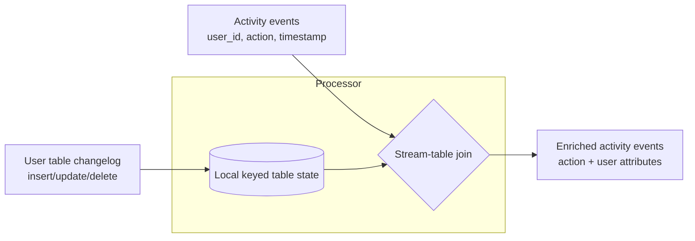
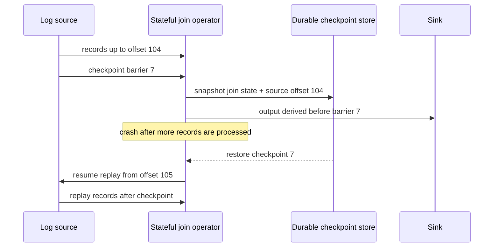

## Overview

Batch joins assume the inputs are bounded: read two files, group records by key, produce the joined result, and stop. Stream joins remove that comfort. New events may arrive forever, one input may be a fast activity stream while the other is a slowly changing table, and a crash may happen after the processor has updated local state but before it has safely recorded the input offset that caused the update. The result is not just "SQL joins, but faster"; it is a design problem about state, time, replay, and external side effects.

The core idea is that a stream processor joins by keeping **state** from one or both inputs and consulting that state when the next event arrives. In a stream-stream join the state is a bounded window of recent events. In a stream-table join the state is a local copy of a table, usually kept current by [change data capture](change-data-capture). In a table-table join both inputs are changelogs, and the output is itself a changelog for a materialized view. Those joins sit on top of the guarantees provided by [message brokers: queues vs logs](message-brokers-queues-vs-logs): if the processor can replay a deterministic log from a known offset, it can rebuild or restore the state that makes the join possible.

Exactly-once processing is the second half of the story. A stream is unbounded, so after a failure you cannot simply restart the whole job from the beginning and publish output only at the end. Systems instead use microbatches, checkpoints, barriers, replayable logs, idempotent writes, and transactions to make the *visible effect* look as if each input record was processed once. That is why "effectively once" is the more honest phrase: the code may run twice during recovery, but duplicate effects are suppressed or atomically rolled back.

## The Three Stream Joins

Stream joins differ mainly in what kind of state the operator must retain and what kind of output it emits. The SQL word "join" hides three operationally different cases.

### Stream-stream join: events meet inside a window

A stream-stream join has two event streams as inputs. Imagine one stream containing search queries and another containing clicks on search results. To measure click-through rate, you need to join the query and click events by session ID and URL, but only if they occurred close enough together to plausibly belong to the same search interaction. The click may arrive seconds later, days later, never, or even before the query event because of network delay and ingestion disorder.

The processor therefore keeps windowed state keyed by the join key: recent query events in one index, recent click events in another. When a query arrives, it is inserted into the query-side state and the click-side state is checked for matching clicks. When a click arrives, the reverse happens. When a query ages out without a click, the processor can emit a "no click" result. The exact choice of event time, processing time, allowed lateness, and watermarks belongs to [stream processing: time and windows](stream-processing-time-and-windows); the important point here is that the join cannot exist without retaining keyed, expiring state.

### Stream-table join: enrichment from a changing table

A stream-table join enriches each event in an activity stream with the current or applicable row from a table. A page-view event might contain only `user_id`, while downstream analytics need the user's plan, region, or account status. Querying a remote database for every event is often too slow and can overload the database at exactly the moment the stream is busiest.

The usual design is to place a local copy of the table inside the stream processor. That copy is not a static dump; it is kept up-to-date from the table's changelog, typically via [change data capture](change-data-capture). Each profile update mutates the local keyed state, and each activity event performs a local lookup against that state. Conceptually, the table side is a stream with a window reaching back to the beginning of time, where newer versions overwrite older versions. The event side may not need to be retained at all.

### Table-table join: materialized view maintenance

A table-table join has changelogs on both sides. The output is not a final table but a stream of changes to a derived table. A social network home timeline is the canonical example: one input is the posts table changelog, and the other is the follows table changelog. When Alice posts, her post is added to the timelines of all followers. When Bob follows Alice, Alice's recent posts are added to Bob's timeline. When Bob unfollows Alice, those posts are removed.

This is materialized view maintenance. Every change on one side must be joined with the latest retained state from the other side, and the emitted result updates the view. If posts are `u` and follows are `v`, the intuition is the product rule: a change in posts joins with current follows, and current posts join with a change in follows. Unlike a one-off query, the join result is continuously maintained as a cache that serves reads cheaply.

## Time-Dependence of Joins

Joins over changing state are not timeless. If a user changes from the free plan to the enterprise plan at noon, should an event at 11:59 join against the old plan or the new one? If an invoice is reprocessed next month, should it use today's tax rate or the tax rate on the date of sale? In most business cases the correct answer is **as of the event's timestamp**, not "whatever row happens to be current when the processor sees the event."

This is the slowly changing dimension problem from data warehousing, now made live. In a log with multiple partitions or multiple input streams, there is usually no total order across all relevant changes. A profile update and an activity event may be interleaved differently during a replay, producing a different enrichment result unless the join rule is explicit. That nondeterminism matters because fault tolerance depends on rerunning the same input and getting the same output.

Common fixes are to version the table rows and carry the version ID in the event, retain historical versions and perform an as-of join by event timestamp, or denormalize the necessary attribute directly into the event when it is produced. Each option has a cost. Keeping all versions weakens log compaction and increases state size; denormalization makes events larger and can duplicate stale facts; version IDs push responsibility onto the producer. What you should not do is accidentally join historical events against whatever dimension row is newest today and call the result correct.

## Fault Tolerance with Microbatches and Checkpoints

A batch job can hide a failed task by rerunning it and making only the successful attempt's output visible. A stream processor cannot wait until the job ends, because the job is meant never to end. It needs smaller recovery boundaries.

Microbatching, as in Spark Streaming, cuts the stream into small batches and processes each batch like a miniature batch job. The batch size is both a performance knob and an implicit processing-time tumbling window: smaller batches reduce latency but increase scheduling overhead; larger batches improve amortization but delay visible results. State that spans a larger logical window must be carried from one microbatch to the next.

Checkpointing, as in Apache Flink, avoids forcing the processing model into fixed-size batches. The runtime periodically injects checkpoint barriers into the streams. Operators snapshot their state after all records before the barrier have affected that state and before records after the barrier are mixed in. The snapshot, plus source offsets, is written to durable storage. After a crash, the job restores the latest completed checkpoint and asks the sources to resume from the recorded offsets.

Within the framework boundary, microbatches and checkpoints can give the same visible guarantee as batch processing: after recovery, state and downstream framework-managed output reflect each input once. The guarantee relies on replayable logs, deterministic processing, and captured operator state.

## Exactly-Once Is Really Effectively-Once

The hard part begins when output leaves the framework. Sending an email, charging a card, updating an external database, or publishing to a broker that is not coordinated with the stream runtime cannot be made invisible merely because a checkpoint later fails. If the task crashes after performing the side effect but before recording progress, replay will execute the side effect again.

That is why exactly-once is usually implemented as effectively-once. The processor may re-execute work, but the external world observes one effect because duplicates are identified or commits are atomic.

- **Idempotent writes** attach a stable operation ID, message offset, or `(topic, partition, offset)` tuple to the effect. The sink records the last applied operation, or stores each operation under a unique key, so retrying the same operation is a no-op. This works well for upserts and ledger-style records, but not for blind increments or one-off side effects unless you redesign them.
- **Atomic commit and transactions** make input offsets, output records, and state changes commit together or not at all. Kafka transactions, for example, can atomically publish output records and commit consumed offsets for Kafka-to-Kafka stream processing. This is the same family of problem as [distributed transactions and two-phase commit](distributed-transactions-and-two-phase-commit), but systems such as Kafka and Flink narrow the scope so the cost is manageable.
- **Fencing** prevents an old worker that was presumed dead from continuing to write after a replacement has taken over. Without fencing, two instances may both believe they own the same partitions and produce duplicate or conflicting output.

The boundary of the guarantee is the boundary of coordination. Kafka Streams can provide strong exactly-once semantics for state and output written back to Kafka, but an arbitrary RPC to a remote service is outside that transaction unless the service participates through idempotency or its own atomic protocol.

## Rebuilding Operator State from the Log

Every useful stream join has state: windows of recent events, local table replicas, materialized view indexes, aggregation buckets, deduplication sets, and pending timers. After a crash, that state must either be restored quickly from a checkpoint or rebuilt by replaying a log.

For short windows, replaying the relevant slice of the input log may be cheap enough. For a stream-table join, a local table replica can often be rebuilt from a compacted changelog: read the table's changes from the beginning, keep only the latest value per key, and then resume the activity stream from the correct offset. Kafka Streams uses changelog topics for local state stores in this style; Flink snapshots state to durable storage so recovery can restore from the latest checkpoint rather than rebuilding from scratch.

The trade is operational as much as theoretical. Checkpoints speed recovery but consume storage and I/O. Rebuilding from logs is simpler and auditable, but recovery time grows with the amount of history that must be replayed. Large joins often use both: periodic durable snapshots for fast restart, plus retained logs for replay, audit, and backfill.

## Trade-offs

- **Stream-stream joins preserve event-level relationships at the cost of windowed state** — they can measure searches that did and did not produce clicks, but every join key needs retained state until the window and allowed lateness expire. Wider windows improve recall and increase memory, disk, and recovery cost.
- **Stream-table joins remove remote lookup latency by turning the table into local state** — enrichment becomes a fast keyed lookup, but correctness now depends on the quality, ordering, retention, and replayability of the table changelog. If the table is time-dependent, the join must say which version is valid for each event.
- **Table-table joins make reads cheap by continuously paying the write-side maintenance cost** — a materialized timeline or dashboard can be served by lookup, but every post, follow, delete, or dimension update may fan out into many view changes.
- **As-of joins are more correct and more expensive than current-value joins** — retaining historical versions gives deterministic replay for invoices, profiles, and tax rates, but it increases state size and may prevent simple log compaction. Denormalizing facts into events makes replay simple but duplicates data.
- **Checkpoints reduce recovery work and add steady-state overhead** — frequent checkpoints reduce replay after failure but increase storage writes, coordination, and sometimes latency. Infrequent checkpoints make the happy path cheaper and the failure path slower.
- **Exactly-once stops at the system boundary unless the sink cooperates** — a framework can roll back its own state and replay its own input, but emails, external APIs, and uncoordinated databases need idempotency keys, transactions, or a redesign to avoid duplicate effects.

## Interview Questions

- You are joining search events to click events by session ID. What state does the processor need to keep, when can it safely evict that state, and what result should it emit for a search with no click?
- A stream-table enrichment job reprocesses last month's purchases after the tax-rate table changed yesterday. Which tax rate should the output contain, and what data model makes that answer deterministic?
- Why is a CDC-fed local table usually preferable to querying a remote database for each event in a high-volume stream-table join?
- A Flink job crashes after writing output to an external database but before completing its next checkpoint. Why can checkpointing alone still produce duplicate external effects?
- Kafka Streams advertises exactly-once processing. What does that guarantee cover, and what changes if the application also calls an external HTTP service?
- When would you rebuild stream processor state from a log instead of restoring it from a snapshot, and what makes that practical?

## References

- [Martin Kleppmann, "Designing Data-Intensive Applications", 2nd Edition (O'Reilly) — Chapter 12, "Stream Processing", sections "Stream Joins" and "Fault Tolerance"](https://www.oreilly.com/library/view/designing-data-intensive-applications/9781098119058/)
- [Apache Flink Documentation — "Stateful Stream Processing"](https://nightlies.apache.org/flink/flink-docs-master/docs/concepts/stateful-stream-processing/)
- [Paris Carbone, Gyula Fóra, Stephan Ewen, Seif Haridi, and Kostas Tzoumas — "Lightweight Asynchronous Snapshots for Distributed Dataflows"](https://arxiv.org/abs/1506.08603)
- [Neha Narkhede and Guozhang Wang — "Exactly-Once Semantics Are Possible: Here's How Kafka Does It"](https://www.confluent.io/blog/exactly-once-semantics-are-possible-heres-how-apache-kafka-does-it/)
- [Apurva Mehta — "Transactions in Apache Kafka"](https://www.confluent.io/blog/transactions-apache-kafka/)
- [Jay Kreps — "Why Local State Is a Fundamental Primitive in Stream Processing"](https://www.oreilly.com/radar/why-local-state-is-a-fundamental-primitive-in-stream-processing/)
