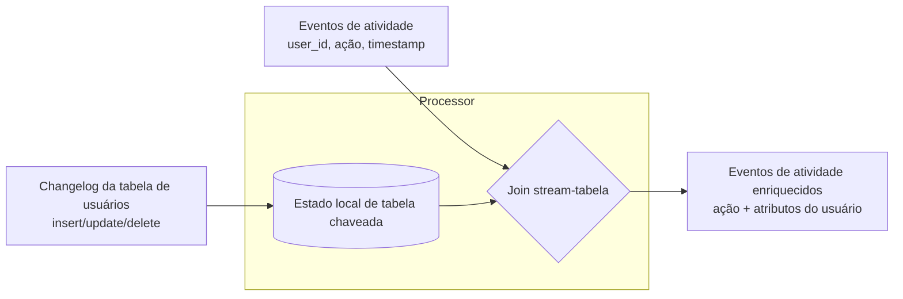
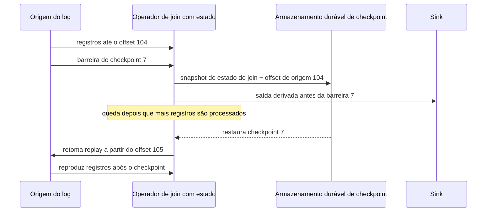

## Visão Geral

Joins em batch assumem que as entradas são limitadas: leia dois arquivos, agrupe registros por chave, produza o resultado unido, e pare. Joins de stream removem esse conforto. Novos eventos podem chegar para sempre, uma entrada pode ser um stream de atividade rápido enquanto a outra é uma tabela em mudança lenta, e uma queda pode acontecer depois que o processador atualizou o estado local mas antes de registrar com segurança o offset de entrada que causou a atualização. O resultado não é apenas "joins de SQL, mas mais rápidos"; é um problema de design sobre estado, tempo, replay e efeitos colaterais externos.

A ideia central é que um processador de stream faz join mantendo **estado** de uma ou ambas as entradas e consultando esse estado quando o próximo evento chega. Em um join stream-stream o estado é uma janela limitada de eventos recentes. Em um join stream-tabela o estado é uma cópia local de uma tabela, geralmente mantida atual por [change data capture](change-data-capture). Em um join tabela-tabela ambas as entradas são changelogs, e a saída é ela mesma um changelog para uma visão materializada. Esses joins ficam em cima das garantias fornecidas por [message brokers: filas vs. logs](message-brokers-queues-vs-logs): se o processador puder reproduzir um log determinístico a partir de um offset conhecido, ele pode reconstruir ou restaurar o estado que torna o join possível.

Processamento exactly-once é a segunda metade da história. Um stream é não limitado, então após uma falha você não pode simplesmente reiniciar o job inteiro do começo e publicar a saída apenas no final. Em vez disso, os sistemas usam microbatches, checkpoints, barreiras, logs replayáveis, escritas idempotentes e transações para fazer o *efeito visível* parecer como se cada registro de entrada tivesse sido processado uma vez. É por isso que "efetivamente uma vez" é a frase mais honesta: o código pode rodar duas vezes durante a recuperação, mas efeitos duplicados são suprimidos ou revertidos atomicamente.

## Os Três Joins de Stream

Joins de stream diferem principalmente no tipo de estado que o operador precisa reter e no tipo de saída que emite. A palavra SQL "join" esconde três casos operacionalmente diferentes.

### Join stream-stream: eventos se encontram dentro de uma janela

Um join stream-stream tem dois streams de eventos como entradas. Imagine um stream contendo consultas de busca e outro contendo cliques em resultados de busca. Para medir a taxa de cliques, você precisa unir os eventos de consulta e clique por ID de sessão e URL, mas apenas se ocorreram próximos o suficiente no tempo para plausivelmente pertencer à mesma interação de busca. O clique pode chegar segundos depois, dias depois, nunca, ou até antes do evento de consulta por causa de atraso de rede e desordem de ingestão.

O processador, portanto, mantém estado em janela chaveado pela chave de join: eventos de consulta recentes em um índice, eventos de clique recentes em outro. Quando uma consulta chega, ela é inserida no estado do lado da consulta e o estado do lado do clique é verificado por cliques correspondentes. Quando um clique chega, o inverso acontece. Quando uma consulta expira sem um clique, o processador pode emitir um resultado de "sem clique". A escolha exata de tempo de evento, tempo de processamento, atraso permitido e watermarks pertence a [stream processing: time and windows](stream-processing-time-and-windows); o ponto importante aqui é que o join não pode existir sem reter estado chaveado e expirável.

### Join stream-tabela: enriquecimento a partir de uma tabela em mudança

Um join stream-tabela enriquece cada evento em um stream de atividade com a linha atual ou aplicável de uma tabela. Um evento de visualização de página pode conter apenas `user_id`, enquanto análises downstream precisam do plano, região ou status de conta do usuário. Consultar um banco de dados remoto para cada evento é frequentemente lento demais e pode sobrecarregar o banco exatamente no momento em que o stream está mais ocupado.

O design usual é colocar uma cópia local da tabela dentro do processador de stream. Essa cópia não é um dump estático; ela é mantida atualizada a partir do changelog da tabela, tipicamente via [change data capture](change-data-capture). Cada atualização de perfil muta o estado chaveado local, e cada evento de atividade realiza uma busca local contra esse estado. Conceitualmente, o lado da tabela é um stream com uma janela alcançando de volta até o início dos tempos, onde versões mais novas sobrescrevem versões mais antigas. O lado do evento pode nem precisar ser retido.

### Join tabela-tabela: manutenção de visão materializada

Um join tabela-tabela tem changelogs em ambos os lados. A saída não é uma tabela final, mas um stream de mudanças para uma tabela derivada. Uma timeline de rede social é o exemplo canônico: uma entrada é o changelog da tabela de posts, e a outra é o changelog da tabela de seguidores. Quando Alice posta, seu post é adicionado às timelines de todos os seguidores. Quando Bob segue Alice, os posts recentes de Alice são adicionados à timeline de Bob. Quando Bob deixa de seguir Alice, esses posts são removidos.

Isso é manutenção de visão materializada. Toda mudança em um lado precisa ser unida com o estado mais recente retido do outro lado, e o resultado emitido atualiza a visão. Se posts são `u` e seguidores são `v`, a intuição é a regra do produto: uma mudança em posts se une com seguidores atuais, e posts atuais se unem com uma mudança em seguidores. Ao contrário de uma consulta única, o resultado do join é continuamente mantido como um cache que serve leituras de forma barata.

## Dependência de Tempo dos Joins

Joins sobre estado em mudança não são atemporais. Se um usuário muda do plano gratuito para o plano corporativo ao meio-dia, um evento às 11:59 deveria se unir com o plano antigo ou o novo? Se uma fatura é reprocessada no mês que vem, deveria usar a taxa de imposto de hoje ou a taxa de imposto na data da venda? Na maioria dos casos de negócio, a resposta correta é **na data do timestamp do evento**, não "qualquer linha que acontece de estar atual quando o processador vê o evento."

Esse é o problema de dimensão de mudança lenta do data warehousing, agora feito ao vivo. Em um log com múltiplas partições ou múltiplos streams de entrada, geralmente não há uma ordem total entre todas as mudanças relevantes. Uma atualização de perfil e um evento de atividade podem ser intercalados de forma diferente durante um replay, produzindo um resultado de enriquecimento diferente a menos que a regra de join seja explícita. Esse não-determinismo importa porque a tolerância a falhas depende de rodar novamente a mesma entrada e obter a mesma saída.

Correções comuns são versionar as linhas da tabela e carregar o ID de versão no evento, reter versões históricas e realizar um join "as-of" pelo timestamp do evento, ou desnormalizar o atributo necessário diretamente no evento quando ele é produzido. Cada opção tem um custo. Manter todas as versões enfraquece a compactação de log e aumenta o tamanho do estado; desnormalização torna os eventos maiores e pode duplicar fatos obsoletos; IDs de versão empurram a responsabilidade para o produtor. O que você não deveria fazer é unir acidentalmente eventos históricos contra qualquer linha de dimensão que seja mais nova hoje e chamar o resultado de correto.

## Tolerância a Falhas com Microbatches e Checkpoints

Um job em batch pode esconder uma tarefa falha rodando-a novamente e tornando visível apenas a saída da tentativa bem-sucedida. Um processador de stream não pode esperar até o job terminar, porque o job é feito para nunca terminar. Ele precisa de fronteiras de recuperação menores.

Microbatching, como no Spark Streaming, corta o stream em pequenos lotes e processa cada lote como um mini job em batch. O tamanho do lote é tanto um botão de performance quanto uma janela tumbling implícita de tempo de processamento: lotes menores reduzem latência mas aumentam overhead de agendamento; lotes maiores melhoram amortização mas atrasam resultados visíveis. Estado que abrange uma janela lógica maior precisa ser carregado de um microbatch para o próximo.

Checkpointing, como no Apache Flink, evita forçar o modelo de processamento em lotes de tamanho fixo. O runtime injeta periodicamente barreiras de checkpoint nos streams. Operadores tiram um snapshot de seu estado depois que todos os registros antes da barreira afetaram esse estado e antes que registros após a barreira sejam misturados. O snapshot, mais os offsets de origem, é escrito em armazenamento durável. Após uma queda, o job restaura o último checkpoint completo e pede às origens que retomem a partir dos offsets registrados.

Dentro da fronteira do framework, microbatches e checkpoints podem dar a mesma garantia visível que o processamento em batch: após a recuperação, o estado e a saída gerenciada pelo framework a jusante refletem cada entrada uma vez. A garantia depende de logs replayáveis, processamento determinístico e estado de operador capturado.

## Exactly-Once É Na Verdade Efetivamente-Once

A parte difícil começa quando a saída sai do framework. Enviar um e-mail, cobrar um cartão, atualizar um banco de dados externo, ou publicar em um broker que não é coordenado com o runtime de stream não pode ser tornado invisível apenas porque um checkpoint falha depois. Se a tarefa cair depois de executar o efeito colateral mas antes de registrar progresso, o replay executará o efeito colateral novamente.

É por isso que exactly-once é geralmente implementado como efetivamente-once. O processador pode reexecutar trabalho, mas o mundo externo observa um efeito porque duplicatas são identificadas ou commits são atômicos.

- **Escritas idempotentes** anexam um ID de operação estável, offset de mensagem, ou tupla `(topic, partition, offset)` ao efeito. O sink registra a última operação aplicada, ou armazena cada operação sob uma chave única, então repetir a mesma operação é uma no-op. Isso funciona bem para upserts e registros estilo livro-razão, mas não para incrementos cegos ou efeitos colaterais únicos, a menos que você os redesenhe.
- **Commit atômico e transações** fazem os offsets de entrada, registros de saída e mudanças de estado serem commitados juntos ou nada. Transações do Kafka, por exemplo, podem publicar atomicamente registros de saída e commitar offsets consumidos para processamento de stream Kafka-para-Kafka. Essa é a mesma família de problema que [distributed transactions and two-phase commit](distributed-transactions-and-two-phase-commit), mas sistemas como Kafka e Flink estreitam o escopo para que o custo seja gerenciável.
- **Fencing** impede que um worker antigo, presumido morto, continue escrevendo depois que um substituto assumiu. Sem fencing, duas instâncias podem acreditar que possuem as mesmas partições e produzir saída duplicada ou conflitante.

A fronteira da garantia é a fronteira da coordenação. O Kafka Streams pode fornecer semântica exactly-once forte para estado e saída escritos de volta ao Kafka, mas uma chamada RPC arbitrária para um serviço remoto está fora dessa transação, a menos que o serviço participe através de idempotência ou seu próprio protocolo atômico.

## Reconstruindo Estado de Operador a Partir do Log

Todo join de stream útil tem estado: janelas de eventos recentes, réplicas locais de tabelas, índices de visão materializada, buckets de agregação, conjuntos de deduplicação e temporizadores pendentes. Após uma queda, esse estado precisa ser restaurado rapidamente a partir de um checkpoint ou reconstruído reproduzindo um log.

Para janelas curtas, reproduzir a fatia relevante do log de entrada pode ser barato o suficiente. Para um join stream-tabela, uma réplica local de tabela frequentemente pode ser reconstruída a partir de um changelog compactado: leia as mudanças da tabela desde o início, mantenha apenas o valor mais recente por chave, e então retome o stream de atividade a partir do offset correto. O Kafka Streams usa tópicos de changelog para armazenamentos de estado local nesse estilo; o Flink tira snapshots de estado para armazenamento durável para que a recuperação possa restaurar a partir do último checkpoint em vez de reconstruir do zero.

A troca é tanto operacional quanto teórica. Checkpoints aceleram a recuperação mas consomem armazenamento e I/O. Reconstruir a partir de logs é mais simples e auditável, mas o tempo de recuperação cresce com a quantidade de histórico que precisa ser reproduzida. Joins grandes frequentemente usam ambos: snapshots duráveis periódicos para reinício rápido, mais logs retidos para replay, auditoria e backfill.

## Trade-offs

- **Joins stream-stream preservam relações no nível de evento ao custo de estado em janela** — eles podem medir buscas que produziram e não produziram cliques, mas toda chave de join precisa de estado retido até que a janela e o atraso permitido expirem. Janelas mais largas melhoram o recall e aumentam o custo de memória, disco e recuperação.
- **Joins stream-tabela removem a latência de busca remota transformando a tabela em estado local** — o enriquecimento se torna uma busca chaveada rápida, mas a correção agora depende da qualidade, ordenação, retenção e replayabilidade do changelog da tabela. Se a tabela depende do tempo, o join precisa dizer qual versão é válida para cada evento.
- **Joins tabela-tabela tornam leituras baratas pagando continuamente o custo de manutenção do lado da escrita** — uma timeline materializada ou dashboard pode ser servida por busca, mas todo post, seguir, deletar ou atualização de dimensão pode se ramificar em muitas mudanças de visão.
- **Joins "as-of" são mais corretos e mais caros que joins de valor atual** — reter versões históricas dá replay determinístico para faturas, perfis e taxas de imposto, mas aumenta o tamanho do estado e pode impedir compactação de log simples. Desnormalizar fatos nos eventos torna o replay simples mas duplica dados.
- **Checkpoints reduzem trabalho de recuperação e adicionam overhead em regime permanente** — checkpoints frequentes reduzem o replay após falha mas aumentam escritas em disco, coordenação e às vezes latência. Checkpoints infrequentes tornam o caminho feliz mais barato e o caminho de falha mais lento.
- **Exactly-once para na fronteira do sistema a menos que o sink coopere** — um framework pode reverter seu próprio estado e reproduzir sua própria entrada, mas e-mails, APIs externas e bancos de dados não coordenados precisam de chaves de idempotência, transações, ou um redesign para evitar efeitos duplicados.

## Perguntas de Entrevista

- Você está unindo eventos de busca a eventos de clique por ID de sessão. Que estado o processador precisa manter, quando pode descartá-lo com segurança, e que resultado deveria emitir para uma busca sem clique?
- Um job de enriquecimento stream-tabela reprocessa as compras do mês passado após a tabela de taxas de imposto ter mudado ontem. Qual taxa de imposto a saída deveria conter, e qual modelo de dados torna essa resposta determinística?
- Por que uma tabela local alimentada por CDC é geralmente preferível a consultar um banco de dados remoto para cada evento em um join stream-tabela de alto volume?
- Um job do Flink cai depois de escrever a saída em um banco de dados externo mas antes de completar seu próximo checkpoint. Por que checkpointing sozinho ainda pode produzir efeitos externos duplicados?
- O Kafka Streams anuncia processamento exactly-once. O que essa garantia cobre, e o que muda se a aplicação também chama um serviço HTTP externo?
- Quando você reconstruiria o estado do processador de stream a partir de um log em vez de restaurá-lo de um snapshot, e o que torna isso prático?

## Referências

- [Martin Kleppmann, "Designing Data-Intensive Applications", 2ª Edição (O'Reilly) — Capítulo 12, "Stream Processing", seções "Stream Joins" e "Fault Tolerance"](https://www.oreilly.com/library/view/designing-data-intensive-applications/9781098119058/)
- [Apache Flink Documentation — "Stateful Stream Processing"](https://nightlies.apache.org/flink/flink-docs-master/docs/concepts/stateful-stream-processing/)
- [Paris Carbone, Gyula Fóra, Stephan Ewen, Seif Haridi, e Kostas Tzoumas — "Lightweight Asynchronous Snapshots for Distributed Dataflows"](https://arxiv.org/abs/1506.08603)
- [Neha Narkhede e Guozhang Wang — "Exactly-Once Semantics Are Possible: Here's How Kafka Does It"](https://www.confluent.io/blog/exactly-once-semantics-are-possible-heres-how-apache-kafka-does-it/)
- [Apurva Mehta — "Transactions in Apache Kafka"](https://www.confluent.io/blog/transactions-apache-kafka/)
- [Jay Kreps — "Why Local State Is a Fundamental Primitive in Stream Processing"](https://www.oreilly.com/radar/why-local-state-is-a-fundamental-primitive-in-stream-processing/)
