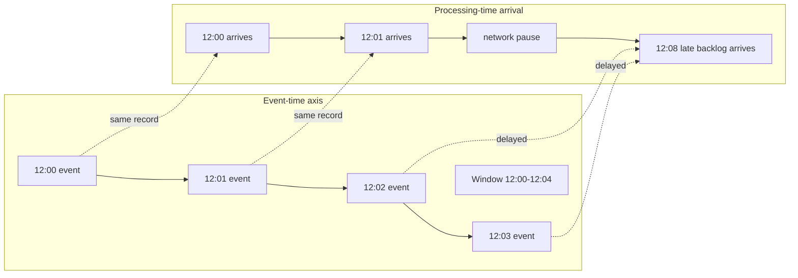

## Overview

A stream processor consumes an unbounded sequence of events and continuously derives answers from it. The input may arrive through [message brokers: queues vs logs](message-brokers-queues-vs-logs), a Kafka topic populated by application events, or a [change data capture](change-data-capture) feed that turns database updates into a stream. The important shift is that the system no longer waits for a complete file or daily batch. It updates its result as new facts arrive.

That makes stream processing useful in several recurring situations. **Complex event processing** looks for patterns: three failed logins followed by a success, a fraud signal that combines a card-present purchase with a distant online order, or a sequence of sensor readings that predicts machine failure. **Streaming analytics** maintains rolling counts, percentiles, rates, and top-k lists over recent activity. **Materialized views** keep a derived table, search index, cache, or denormalized read model current as source data changes. **Monitoring** turns logs, metrics, and traces into low-latency alerts before a human notices the outage.

All of those uses eventually run into the same question: *what time does this event belong to?* If you count requests per minute by the time your processor sees them, a network pause creates fake quiet minutes followed by a fake spike. If you count by the timestamp inside each request, you get a truer historical answer, but now events can arrive late, out of order, or with bad clocks. Windowing is the machinery that makes those choices explicit.

## Stream Processing Use Cases

Stream processing is not just “batch, but faster.” It is a different operational model: the output is a living result that changes whenever the input stream advances.

### Complex event processing and pattern matching

Complex event processing (CEP) searches for meaningful sequences in noisy event streams. The state is usually temporary and keyed by an entity such as user, account, device, host, or shopping session. A rule might say: if a host emits `disk_full`, then `service_restart`, then `healthcheck_failed` within five minutes, open an incident. A pattern engine needs time semantics because “within five minutes” should normally mean five minutes in the world being observed, not five minutes after the events happened to reach the processor.

### Streaming analytics and rolling aggregations

Dashboards, anomaly detectors, billing counters, and leaderboards often ask for continuously updated aggregates: requests per minute, purchases per region in the last hour, p95 latency over the most recent ten minutes, or active users in the current session. Since the input never ends, the processor creates finite slices of the stream called windows and emits one result per key per window.

### Maintaining materialized views

A stream can also be the write-ahead log for derived state. A CDC stream from an orders database can update a customer summary table, a search document, or a recommendation index. The view may not need a visible “window,” but it still depends on ordering, timestamps, and late updates if downstream readers ask time-bounded questions such as “revenue by minute.”

### Monitoring and alerting

Monitoring is the high-pressure version of streaming analytics. Alerts must be timely, but premature alerts are noisy. If one collector is briefly disconnected and uploads old metrics later, a processing-time alert may claim the system recovered with a huge burst of traffic. Event-time processing reduces that artifact, while watermarks decide how long the alerting pipeline waits for stragglers before judging a window.

## Event Time vs Processing Time

**Event time** is when the event actually occurred: the timestamp in the request, sensor reading, log line, transaction, or database row. **Processing time** is when a stream processor observes the event. They are equal only in toy systems. Real streams cross phones, browsers, brokers, queues, replicas, retry loops, and networks that delay or reorder records.

Processing time is tempting because it is easy. The processor’s local clock is available, monotonic enough for many operational tasks, and does not require trusting clients. It is also wrong for many analytics questions. Suppose a service has an outage from 12:03 to 12:07. During the outage, clients keep trying requests, but the events cannot reach the analytics pipeline. At 12:07 the network recovers and the backlog drains. A processing-time one-minute window may show four minutes of silence followed by a giant spike. The spike is a property of delivery, not user behavior.

The same problem appears with offline devices. A fitness tracker records heart-rate samples every second while disconnected, then uploads an hour of data when the phone reconnects. Processing-time windows put the entire workout in the upload minute. Event-time windows put each sample back where it belongs.

Event time gives better answers, but it moves complexity into the pipeline. The processor must extract timestamps, tolerate out-of-order arrivals, keep window state open for a while, and decide what to do after it has already emitted a result and an older event shows up.

## Watermarks and Late Events

For any event-time window, the processor wants to know when it is safe to close the window. In a distributed system it can never be perfectly certain. A record with timestamp 12:03 might be stuck behind a retry, sitting on a phone, delayed in one Kafka partition, or waiting behind a slow shard. If the processor waits forever, it never emits final answers. If it closes too early, it misses late data.

A **watermark** is the system’s progress estimate in event time: “I believe no more events earlier than time *t* will arrive.” Frameworks such as Flink, Beam, and Dataflow use watermarks to decide when event-time timers fire and when windows are eligible to produce output. The wording matters: a practical watermark is often a heuristic or contract, not a proof. It is a way to make a bounded bet about lateness.

Once a window’s watermark passes its end, the processor has two broad choices for events that still arrive late:

- **Drop or ignore late events** — this gives stable outputs and bounded state, but the result is knowingly incomplete. It can be acceptable for monitoring dashboards where old corrections are more confusing than useful.
- **Emit corrections** — the processor updates the previously emitted aggregate and sends a retraction, delta, or replacement. This gives more accurate analytics but requires downstream consumers to handle mutable results.

Watermarks therefore define a product decision as much as an implementation detail. A fraud detector may wait longer for accuracy; an incident alert may fire early and correct later; a billing job may require a long allowed-lateness period and auditable corrections.

## Whose Clock Should You Trust?

Event time is only as good as the clock that produced it. Server-side timestamps are often trustworthy for requests that reached the service immediately, but they still describe arrival at the server, not necessarily when the user acted. Client-side timestamps capture user action and device measurements, but phones, browsers, and embedded devices can have clocks that are wrong by seconds, hours, or years.

One practical mitigation is the three-timestamp technique. The device records:

1. the event timestamp according to the device clock;
2. the device clock value at upload time;
3. the server clock value when the upload is received.

The server estimates the device’s clock offset by comparing the upload-time device timestamp with the upload-time server timestamp. It then shifts the original event timestamps by that offset. This does not solve every problem — network delay and clock drift remain — but it is far better than blindly trusting a stale client clock or overwriting all event times with upload time.

Clock choice should be explicit in the schema. Events should carry the timestamp used for event-time processing, the source that assigned it, and sometimes the ingestion timestamp as a diagnostic. When analytics look strange, being able to distinguish “users did this then” from “we received it then” is essential.

## Tumbling Windows

A **tumbling window** has a fixed length and no overlap. With one-minute tumbling windows, the stream is split into `[12:00, 12:01)`, `[12:01, 12:02)`, `[12:02, 12:03)`, and so on. Each event belongs to exactly one window based on its event-time timestamp.

Tumbling windows are the simplest choice for reports such as “requests per minute,” “orders per hour,” or “bytes written per day.” They are easy to explain, cheap to compute, and produce a predictable number of results. Their downside is boundary sensitivity. Two events one second apart can land in different windows if they happen at 12:00:59 and 12:01:00, while two events 59 seconds apart can land in the same window.

Use tumbling windows when the business question already has natural bucket boundaries or when downstream systems expect one aggregate per fixed interval.

## Hopping Windows

A **hopping window** has a fixed length and a fixed hop interval smaller than the length, so windows overlap. For example, “a one-minute window every ten seconds” creates windows `[12:00:00, 12:01:00)`, `[12:00:10, 12:01:10)`, `[12:00:20, 12:01:20)`, and so on. An event at 12:00:45 contributes to several windows.

Hopping windows are useful when you want smoother rolling metrics but still want discrete result times. A dashboard can refresh every ten seconds with the count from the previous minute. Internally, many systems implement this efficiently by first aggregating small tumbling windows — for example, ten-second buckets — and then combining the last six buckets for each one-minute result.

The trade-off is duplication of work and output. The shorter the hop relative to the window length, the more windows each event updates.

## Sliding Windows

A **sliding window** groups events that occur within a duration of each other, often producing a continuously moving view rather than fixed buckets. With a one-minute sliding interval, an event at 12:00:30 can be grouped with events from 11:59:30 through 12:00:30, and an event at 12:00:31 shifts the interval forward by one second.

Sliding windows are useful for questions where every event can be a potential boundary: “did this user make five failed logins within any one-minute interval?” or “did latency exceed a threshold for any continuous minute?” They avoid the artificial boundary effects of tumbling windows, but they can be more expensive because the system may need to update results for many distinct event times or maintain ordered per-key state.

In practice, APIs differ in terminology. Some frameworks use “sliding” for fixed-length overlapping windows with a slide period, while others distinguish those as hopping windows. The design question is the same: do you need continuous interval semantics, or are periodic overlapping buckets good enough?

## Session Windows

A **session window** groups bursts of activity separated by inactivity gaps. It has variable length. For example, with a one-minute inactivity gap, user events at 12:00:05, 12:00:20, and 12:00:55 belong to one session. If the next event arrives at 12:02:10, the previous session closes because more than one minute of inactivity passed; the new event starts a new session.

Session windows match human and device behavior better than fixed buckets. Web visits, shopping journeys, mobile app usage, IoT device wakeups, and multiplayer game rounds rarely begin on a neat minute boundary. A session window says: keep extending the window while activity continues; close it after the stream has been quiet for the configured gap.

The difficulty is that late events can merge sessions. If a late event arrives inside the inactivity gap between two previously separate sessions, the processor may need to combine their state and emit a correction. That makes watermarks and late-event policy especially visible for session analytics.

## Trade-offs

- **Event time gives truthful analytics and forces you to manage disorder** — it puts offline uploads, retry backlogs, and delayed broker records back where they happened, but every event-time pipeline needs timestamp extraction, watermarking, retained state, and a late-data policy.
- **Processing time is operationally simple and semantically fragile** — it is fine for measuring the stream processor itself, but it turns outages, backfills, and client reconnects into fake user behavior.
- **Watermarks let windows finish by making lateness a bounded bet** — an aggressive watermark produces low-latency results and more corrections or drops; a conservative watermark improves completeness and increases state, memory, and alert latency.
- **Dropping late data simplifies consumers and bakes in inaccuracy** — immutable dashboards and alert streams are easier to operate, but a straggler can permanently disappear from an aggregate that users treat as fact.
- **Emitting corrections improves correctness and pushes complexity downstream** — every sink, cache, alert, and materialized view must understand that a previously published result can be revised.
- **Window type encodes the product question** — tumbling windows fit fixed reporting buckets, hopping windows smooth periodic dashboards, sliding windows find patterns across any interval, and session windows model bursts of activity with variable length.

## Interview Questions

- A stream processor counts requests per minute using processing time. During a four-minute network outage the service keeps accepting requests, then flushes the backlog when the connection recovers. What artifact appears in the dashboard, and how would event time change the result?
- Why can a stream processor never be absolutely certain that an event-time window is complete, and what promise does a watermark make?
- Your pipeline receives a mobile device upload containing one hour of sensor readings. Which timestamps would you store, and how can the three-timestamp technique estimate device clock skew?
- Compare one-minute tumbling, hopping, sliding, and session windows for a login-failure detector. Which one would you choose for “five failures within any minute,” and why?
- A late event arrives after a window has already emitted its aggregate. When should you drop it, and when should you emit a correction?

## References

- [Martin Kleppmann, "Designing Data-Intensive Applications", 2nd Edition (O'Reilly) — Chapter 12, "Stream Processing", sections "Uses of Stream Processing" and "Reasoning About Time"](https://www.oreilly.com/library/view/designing-data-intensive-applications/9781098119058/)
- [Tyler Akidau — "The world beyond batch: Streaming 101" (O'Reilly Radar)](https://www.oreilly.com/radar/the-world-beyond-batch-streaming-101/)
- [Tyler Akidau — "The world beyond batch: Streaming 102" (O'Reilly Radar)](https://www.oreilly.com/radar/the-world-beyond-batch-streaming-102/)
- [Akidau et al. — "The Dataflow Model: A Practical Approach to Balancing Correctness, Latency, and Cost in Massive-Scale, Unbounded, Out-of-Order Data Processing" (VLDB 2015)](https://www.vldb.org/pvldb/vol8/p1792-Akidau.pdf)
- [Apache Flink documentation — "Generating Watermarks"](https://nightlies.apache.org/flink/flink-docs-stable/docs/dev/datastream/event-time/generating_watermarks/)
- [Apache Beam Programming Guide — "Windowing"](https://beam.apache.org/documentation/programming-guide/#windowing)
- [Apache Kafka documentation — "Windowing" in the Kafka Streams DSL](https://kafka.apache.org/documentation/streams/developer-guide/dsl-api.html#windowing)
