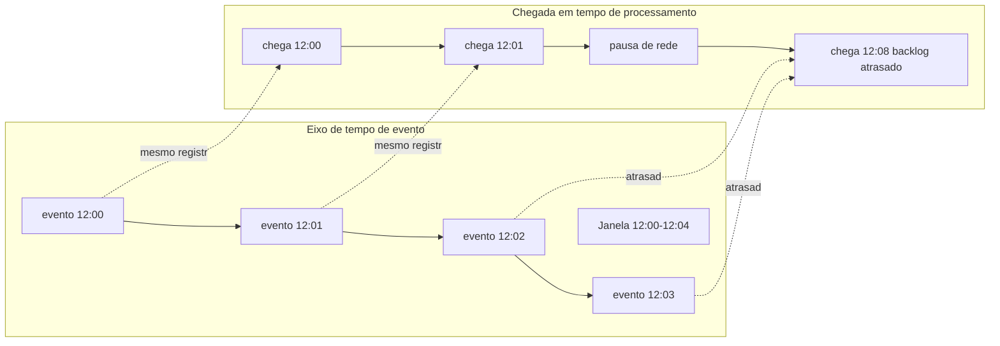

## Visão Geral

Um processador de stream consome uma sequência não limitada de eventos e deriva continuamente respostas a partir dela. A entrada pode chegar através de [message brokers: filas vs. logs](message-brokers-queues-vs-logs), um tópico do Kafka populado por eventos de aplicação, ou um feed de [change data capture](change-data-capture) que transforma atualizações de banco de dados em um stream. A mudança importante é que o sistema não espera mais por um arquivo completo ou um batch diário. Ele atualiza seu resultado conforme novos fatos chegam.

Isso torna o processamento de stream útil em várias situações recorrentes. **Processamento de eventos complexos** procura por padrões: três logins falhos seguidos por um sucesso, um sinal de fraude que combina uma compra presencial com um pedido online distante, ou uma sequência de leituras de sensor que prediz falha de máquina. **Análises de streaming** mantêm contagens contínuas, percentis, taxas e listas top-k sobre atividade recente. **Visões materializadas** mantêm uma tabela derivada, índice de busca, cache, ou modelo de leitura desnormalizado atual conforme os dados de origem mudam. **Monitoramento** transforma logs, métricas e traces em alertas de baixa latência antes que um humano perceba a interrupção.

Todos esses usos eventualmente esbarram na mesma pergunta: *a que tempo esse evento pertence?* Se você contar requisições por minuto pelo horário em que seu processador as vê, uma pausa de rede cria minutos silenciosos falsos seguidos por um pico falso. Se você contar pelo timestamp dentro de cada requisição, você obtém uma resposta histórica mais verdadeira, mas agora eventos podem chegar atrasados, fora de ordem, ou com relógios errados. Janelamento é a maquinaria que torna essas escolhas explícitas.

## Casos de Uso de Processamento de Stream

Processamento de stream não é apenas "batch, mas mais rápido." É um modelo operacional diferente: a saída é um resultado vivo que muda sempre que o stream de entrada avança.

### Processamento de eventos complexos e casamento de padrões

Processamento de eventos complexos (CEP) busca sequências significativas em streams de eventos ruidosos. O estado costuma ser temporário e chaveado por uma entidade como usuário, conta, dispositivo, host, ou sessão de compra. Uma regra pode dizer: se um host emite `disk_full`, então `service_restart`, então `healthcheck_failed` dentro de cinco minutos, abra um incidente. Um motor de padrões precisa de semântica de tempo porque "dentro de cinco minutos" normalmente deveria significar cinco minutos no mundo sendo observado, não cinco minutos depois que os eventos aconteceram de chegar ao processador.

### Análises de streaming e agregações contínuas

Dashboards, detectores de anomalias, contadores de faturamento e placares de líder frequentemente pedem agregados continuamente atualizados: requisições por minuto, compras por região na última hora, latência p95 nos últimos dez minutos, ou usuários ativos na sessão atual. Como a entrada nunca termina, o processador cria fatias finitas do stream chamadas janelas e emite um resultado por chave por janela.

### Mantendo visões materializadas

Um stream também pode ser o log de write-ahead para estado derivado. Um stream CDC de um banco de dados de pedidos pode atualizar uma tabela de resumo de clientes, um documento de busca, ou um índice de recomendação. A visão pode não precisar de uma "janela" visível, mas ainda depende de ordenação, timestamps e atualizações atrasadas se leitores downstream fazem perguntas limitadas por tempo como "receita por minuto."

### Monitoramento e alertas

Monitoramento é a versão de alta pressão de análises de streaming. Alertas precisam ser oportunos, mas alertas prematuros são ruidosos. Se um coletor é brevemente desconectado e envia métricas antigas depois, um alerta baseado em tempo de processamento pode alegar que o sistema se recuperou com uma rajada enorme de tráfego. Processamento baseado em tempo de evento reduz esse artefato, enquanto watermarks decidem quanto tempo o pipeline de alertas espera por retardatários antes de julgar uma janela.

## Tempo de Evento vs. Tempo de Processamento

**Tempo de evento** é quando o evento realmente ocorreu: o timestamp na requisição, leitura de sensor, linha de log, transação, ou linha de banco de dados. **Tempo de processamento** é quando um processador de stream observa o evento. Eles são iguais apenas em sistemas de brinquedo. Streams reais atravessam telefones, navegadores, brokers, filas, réplicas, loops de retry e redes que atrasam ou reordenam registros.

Tempo de processamento é tentador porque é fácil. O relógio local do processador está disponível, monotônico o suficiente para muitas tarefas operacionais, e não requer confiar em clientes. Também está errado para muitas perguntas de análise. Suponha que um serviço tenha uma interrupção de 12:03 a 12:07. Durante a interrupção, clientes continuam tentando requisições, mas os eventos não conseguem chegar ao pipeline de análises. Às 12:07 a rede se recupera e o backlog é drenado. Uma janela de um minuto em tempo de processamento pode mostrar quatro minutos de silêncio seguidos por um pico gigante. O pico é uma propriedade da entrega, não do comportamento do usuário.

O mesmo problema aparece com dispositivos offline. Um rastreador de fitness registra amostras de frequência cardíaca a cada segundo enquanto desconectado, depois envia uma hora de dados quando o telefone se reconecta. Janelas em tempo de processamento colocam o treino inteiro no minuto do upload. Janelas em tempo de evento colocam cada amostra de volta onde ela pertence.

Tempo de evento dá respostas melhores, mas move complexidade para dentro do pipeline. O processador precisa extrair timestamps, tolerar chegadas fora de ordem, manter o estado da janela aberto por um tempo, e decidir o que fazer depois de já ter emitido um resultado e um evento mais antigo aparecer.

## Watermarks e Eventos Atrasados

Para qualquer janela em tempo de evento, o processador quer saber quando é seguro fechar a janela. Em um sistema distribuído ele nunca pode ter certeza perfeita. Um registro com timestamp 12:03 pode estar preso atrás de um retry, sentado em um telefone, atrasado em uma partição do Kafka, ou esperando atrás de um shard lento. Se o processador esperar para sempre, ele nunca emite respostas finais. Se ele fecha cedo demais, perde dados atrasados.

Um **watermark** é a estimativa de progresso do sistema em tempo de evento: "acredito que nenhum evento anterior ao tempo *t* vai chegar." Frameworks como Flink, Beam e Dataflow usam watermarks para decidir quando temporizadores de tempo de evento disparam e quando janelas se tornam elegíveis para produzir saída. A redação importa: um watermark prático é frequentemente uma heurística ou contrato, não uma prova. É uma forma de fazer uma aposta limitada sobre atraso.

Uma vez que o watermark de uma janela passa seu fim, o processador tem duas escolhas amplas para eventos que ainda chegam atrasados:

- **Descartar ou ignorar eventos atrasados** — isso dá saídas estáveis e estado limitado, mas o resultado é conhecidamente incompleto. Pode ser aceitável para dashboards de monitoramento onde correções antigas são mais confusas do que úteis.
- **Emitir correções** — o processador atualiza o agregado previamente emitido e envia uma retração, delta, ou substituição. Isso dá análises mais precisas mas exige que consumidores downstream lidem com resultados mutáveis.

Watermarks, portanto, definem uma decisão de produto tanto quanto um detalhe de implementação. Um detector de fraude pode esperar mais por precisão; um alerta de incidente pode disparar cedo e corrigir depois; um job de faturamento pode exigir um período longo de atraso permitido e correções auditáveis.

## Em Qual Relógio Você Deveria Confiar?

Tempo de evento é tão bom quanto o relógio que o produziu. Timestamps do lado do servidor são frequentemente confiáveis para requisições que chegaram ao serviço imediatamente, mas ainda descrevem chegada no servidor, não necessariamente quando o usuário agiu. Timestamps do lado do cliente capturam a ação do usuário e medições do dispositivo, mas telefones, navegadores e dispositivos embarcados podem ter relógios errados por segundos, horas, ou anos.

Uma mitigação prática é a técnica de três timestamps. O dispositivo registra:

1. o timestamp do evento segundo o relógio do dispositivo;
2. o valor do relógio do dispositivo no momento do upload;
3. o valor do relógio do servidor quando o upload é recebido.

O servidor estima o desvio do relógio do dispositivo comparando o timestamp do dispositivo no momento do upload com o timestamp do servidor no momento do upload. Ele então desloca os timestamps originais do evento por esse desvio. Isso não resolve todos os problemas — atraso de rede e drift de relógio permanecem — mas é muito melhor do que confiar cegamente em um relógio de cliente obsoleto ou sobrescrever todos os tempos de evento com o tempo de upload.

A escolha de relógio deveria ser explícita no schema. Eventos deveriam carregar o timestamp usado para processamento em tempo de evento, a origem que o atribuiu, e às vezes o timestamp de ingestão como diagnóstico. Quando as análises parecem estranhas, ser capaz de distinguir "usuários fizeram isso então" de "recebemos isso então" é essencial.

## Janelas Tumbling

Uma **janela tumbling** tem um comprimento fixo e nenhuma sobreposição. Com janelas tumbling de um minuto, o stream é dividido em `[12:00, 12:01)`, `[12:01, 12:02)`, `[12:02, 12:03)`, e assim por diante. Cada evento pertence a exatamente uma janela com base em seu timestamp de tempo de evento.

Janelas tumbling são a escolha mais simples para relatórios como "requisições por minuto," "pedidos por hora," ou "bytes escritos por dia." São fáceis de explicar, baratas de computar, e produzem um número previsível de resultados. Sua desvantagem é sensibilidade a fronteiras. Dois eventos com um segundo de diferença podem cair em janelas diferentes se acontecerem às 12:00:59 e 12:01:00, enquanto dois eventos com 59 segundos de diferença podem cair na mesma janela.

Use janelas tumbling quando a pergunta de negócio já tem fronteiras de bucket naturais ou quando sistemas downstream esperam um agregado por intervalo fixo.

## Janelas Hopping

Uma **janela hopping** tem um comprimento fixo e um intervalo de salto fixo menor que o comprimento, então as janelas se sobrepõem. Por exemplo, "uma janela de um minuto a cada dez segundos" cria janelas `[12:00:00, 12:01:00)`, `[12:00:10, 12:01:10)`, `[12:00:20, 12:01:20)`, e assim por diante. Um evento às 12:00:45 contribui para várias janelas.

Janelas hopping são úteis quando você quer métricas contínuas mais suaves mas ainda quer momentos discretos de resultado. Um dashboard pode atualizar a cada dez segundos com a contagem do minuto anterior. Internamente, muitos sistemas implementam isso eficientemente agregando primeiro pequenas janelas tumbling — por exemplo, buckets de dez segundos — e depois combinando os últimos seis buckets para cada resultado de um minuto.

A troca é duplicação de trabalho e saída. Quanto menor o salto em relação ao comprimento da janela, mais janelas cada evento atualiza.

## Janelas Sliding

Uma **janela sliding** agrupa eventos que ocorrem dentro de uma duração um do outro, frequentemente produzindo uma visão continuamente móvel em vez de buckets fixos. Com um intervalo sliding de um minuto, um evento às 12:00:30 pode ser agrupado com eventos de 11:59:30 até 12:00:30, e um evento às 12:00:31 desloca o intervalo para frente por um segundo.

Janelas sliding são úteis para perguntas onde todo evento pode ser uma fronteira potencial: "esse usuário fez cinco logins falhos dentro de qualquer intervalo de um minuto?" ou "a latência excedeu um limiar por qualquer minuto contínuo?" Elas evitam os efeitos artificiais de fronteira das janelas tumbling, mas podem ser mais caras porque o sistema pode precisar atualizar resultados para muitos tempos de evento distintos ou manter estado ordenado por chave.

Na prática, APIs diferem em terminologia. Alguns frameworks usam "sliding" para janelas sobrepostas de comprimento fixo com um período de deslize, enquanto outros as distinguem como janelas hopping. A pergunta de design é a mesma: você precisa de semântica de intervalo contínuo, ou buckets sobrepostos periódicos são bons o suficiente?

## Janelas de Sessão

Uma **janela de sessão** agrupa rajadas de atividade separadas por lacunas de inatividade. Ela tem comprimento variável. Por exemplo, com uma lacuna de inatividade de um minuto, eventos de usuário às 12:00:05, 12:00:20, e 12:00:55 pertencem a uma sessão. Se o próximo evento chega às 12:02:10, a sessão anterior fecha porque mais de um minuto de inatividade passou; o novo evento inicia uma nova sessão.

Janelas de sessão casam melhor com comportamento humano e de dispositivo do que buckets fixos. Visitas web, jornadas de compra, uso de app mobile, wakeups de dispositivos IoT, e rodadas de jogos multiplayer raramente começam em uma fronteira de minuto limpa. Uma janela de sessão diz: continue estendendo a janela enquanto a atividade continua; feche-a depois que o stream ficou quieto pela lacuna configurada.

A dificuldade é que eventos atrasados podem mesclar sessões. Se um evento atrasado chega dentro da lacuna de inatividade entre duas sessões previamente separadas, o processador pode precisar combinar seus estados e emitir uma correção. Isso torna watermarks e política de eventos atrasados especialmente visíveis para análises de sessão.

## Trade-offs

- **Tempo de evento dá análises verdadeiras e força você a gerenciar desordem** — coloca uploads offline, backlogs de retry e registros de broker atrasados de volta onde aconteceram, mas todo pipeline em tempo de evento precisa de extração de timestamp, watermarking, estado retido, e uma política de dados atrasados.
- **Tempo de processamento é operacionalmente simples e semanticamente frágil** — é bom para medir o próprio processador de stream, mas transforma interrupções, backfills e reconexões de cliente em comportamento de usuário falso.
- **Watermarks permitem que janelas terminem transformando atraso em uma aposta limitada** — um watermark agressivo produz resultados de baixa latência e mais correções ou descartes; um watermark conservador melhora completude e aumenta estado, memória e latência de alerta.
- **Descartar dados atrasados simplifica consumidores e embute imprecisão** — dashboards imutáveis e streams de alerta são mais fáceis de operar, mas um retardatário pode desaparecer permanentemente de um agregado que usuários tratam como fato.
- **Emitir correções melhora a correção e empurra complexidade downstream** — todo sink, cache, alerta e visão materializada precisa entender que um resultado previamente publicado pode ser revisado.
- **O tipo de janela codifica a pergunta de produto** — janelas tumbling se encaixam em buckets de relatório fixos, janelas hopping suavizam dashboards periódicos, janelas sliding encontram padrões através de qualquer intervalo, e janelas de sessão modelam rajadas de atividade com comprimento variável.

## Perguntas de Entrevista

- Um processador de stream conta requisições por minuto usando tempo de processamento. Durante uma interrupção de rede de quatro minutos o serviço continua aceitando requisições, depois libera o backlog quando a conexão se recupera. Que artefato aparece no dashboard, e como o tempo de evento mudaria o resultado?
- Por que um processador de stream nunca pode ter certeza absoluta de que uma janela em tempo de evento está completa, e que promessa um watermark faz?
- Seu pipeline recebe um upload de dispositivo móvel contendo uma hora de leituras de sensor. Quais timestamps você armazenaria, e como a técnica de três timestamps pode estimar o desvio do relógio do dispositivo?
- Compare janelas tumbling, hopping, sliding e de sessão de um minuto para um detector de falhas de login. Qual você escolheria para "cinco falhas dentro de qualquer minuto," e por quê?
- Um evento atrasado chega depois que uma janela já emitiu seu agregado. Quando você deveria descartá-lo, e quando deveria emitir uma correção?

## Referências

- [Martin Kleppmann, "Designing Data-Intensive Applications", 2ª Edição (O'Reilly) — Capítulo 12, "Stream Processing", seções "Uses of Stream Processing" e "Reasoning About Time"](https://www.oreilly.com/library/view/designing-data-intensive-applications/9781098119058/)
- [Tyler Akidau — "The world beyond batch: Streaming 101" (O'Reilly Radar)](https://www.oreilly.com/radar/the-world-beyond-batch-streaming-101/)
- [Tyler Akidau — "The world beyond batch: Streaming 102" (O'Reilly Radar)](https://www.oreilly.com/radar/the-world-beyond-batch-streaming-102/)
- [Akidau et al. — "The Dataflow Model: A Practical Approach to Balancing Correctness, Latency, and Cost in Massive-Scale, Unbounded, Out-of-Order Data Processing" (VLDB 2015)](https://www.vldb.org/pvldb/vol8/p1792-Akidau.pdf)
- [Apache Flink documentation — "Generating Watermarks"](https://nightlies.apache.org/flink/flink-docs-stable/docs/dev/datastream/event-time/generating_watermarks/)
- [Apache Beam Programming Guide — "Windowing"](https://beam.apache.org/documentation/programming-guide/#windowing)
- [Apache Kafka documentation — "Windowing" in the Kafka Streams DSL](https://kafka.apache.org/documentation/streams/developer-guide/dsl-api.html#windowing)
