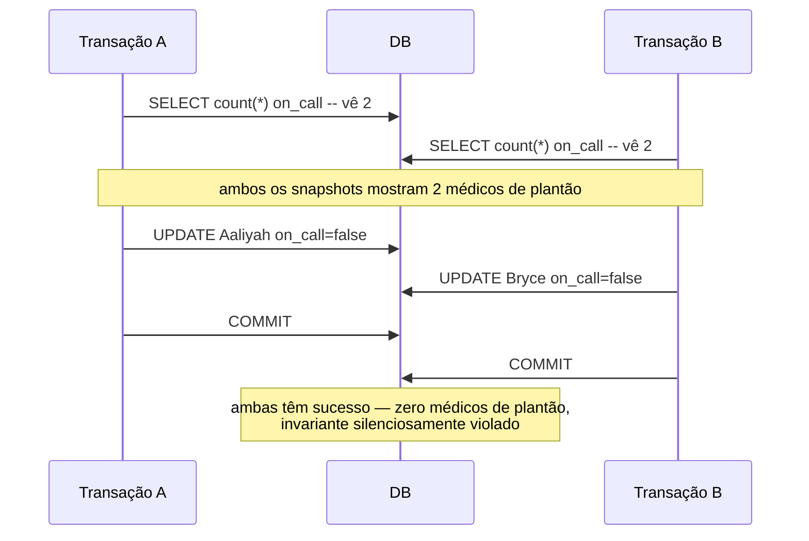

## Visão Geral

"ACID" é usado como um selo de aprovação, mas na prática é majoritariamente um termo de marketing — a implementação de atomicidade, consistência, isolamento e durabilidade de um banco de dados raramente coincide exatamente com a de outro, e *isolamento* em particular esconde um espectro de garantias, não uma coisa fixa. Um banco de dados alegando "serializable" ou "repeatable read" pode significar coisas genuinamente diferentes dependendo de qual produto você está falando. Conhecer as condições de corrida específicas que cada nível de isolamento previne e não previne é o que separa "eu sei que transações existem" de realmente conseguir raciocinar sobre um bug de concorrência.

## O Que ACID Realmente Promete

- **Atomicidade** — não é sobre concorrência de forma alguma, apesar do nome; é sobre falha parcial. Se uma transação é abortada no meio (um crash, uma violação de restrição), o banco de dados descarta toda escrita que fez — uma garantia tudo-ou-nada, não uma afirmação sobre visibilidade para outras transações.
- **Consistência** — a palavra mais sobrecarregada neste espaço. Em ACID significa que os próprios invariantes da aplicação (ex.: "a soma de todos os saldos de conta nunca muda") permanecem verdadeiros através de uma transação — mas o banco de dados só aplica os invariantes que você realmente declara como restrições. Um invariante não declarado pode ser silenciosamente violado; o "C" é na verdade uma propriedade da aplicação, não algo que um banco de dados pode garantir por si só.
- **Isolamento** — transações rodando concorrentemente não observam o trabalho em progresso uma da outra. A forma mais forte é *serializabilidade*: o resultado final é como se as transações tivessem rodado uma de cada vez, em alguma ordem, mesmo que na verdade tenham se sobreposto.
- **Durabilidade** — uma vez confirmada, uma escrita sobrevive a um crash. Na prática isso significa "em disco" (via `fsync` e um write-ahead log) para sistemas de nó único, ou "replicada para nós suficientes" para distribuídos — e mesmo assim, "durável" é uma alegação de redução de risco, não absoluta (falhas correlacionadas, bugs de firmware, e SSDs ruins ainda acontecem).

## Read Committed: A Linha de Base que Quase Todo Mundo Roda

O nível de isolamento mais comum em produção faz duas promessas estreitas: sem *leituras sujas* (você nunca vê as escritas não confirmadas de outra transação) e sem *escritas sujas* (você nunca sobrescreve a escrita não confirmada de outra transação). É isso — não diz nada sobre o que acontece entre duas leituras na *mesma* transação.

```
Transação A                    Transação B
--------------                   --------------
BEGIN
                                  BEGIN
                                  UPDATE accounts SET balance = 400 WHERE id = 1
SELECT balance FROM accounts
  WHERE id = 1        -- vê 500, NÃO 400 (sem leitura suja)
                                  COMMIT
SELECT balance FROM accounts
  WHERE id = 1        -- agora vê 400 — mesma transação, resposta diferente
COMMIT
```

Isso já é suficiente para um bug sutil: se A está lendo dois saldos relacionados para computar um total, pode ver um antes da transferência de B e um depois — os números parecem internamente inconsistentes mesmo que nenhuma leitura individual jamais tenha estado "errada".

## Snapshot Isolation: Corrigindo o Problema de Leitura Inconsistente

Snapshot isolation (o que o PostgreSQL chama de `REPEATABLE READ`) dá a toda transação uma visão consistente do banco de dados como era no momento em que a transação começou — implementado via *multi-version concurrency control* (MVCC), onde o banco de dados mantém múltiplas versões de uma linha e cada transação lê a versão que foi confirmada antes dela começar. Isso corrige o exemplo de read skew acima completamente: ambas as leituras dentro de uma transação veem o mesmo snapshot, então os números são sempre auto-consistentes.

O que ele **não** corrige são duas transações escrevendo em *linhas diferentes* baseadas em uma leitura do *mesmo* snapshot — que é exatamente o que torna atualizações perdidas e write skew possíveis.

## Atualizações Perdidas e Write Skew: As Anomalias que Snapshot Isolation Permite

Uma **atualização perdida** acontece quando duas transações ambas leem um valor, computam um novo valor, e o escrevem de volta — a segunda escrita atropela a primeira, e um dos dois incrementos efetivamente nunca aconteceu:

```
-- Ambas começam de balance = 100
A: lê balance (100) -> computa 100+50=150 -> escreve 150
B: lê balance (100) -> computa 100+30=130 -> escreve 130   -- a escrita de B vence, o +50 de A se perde
```

**Write skew** é a mesma causa raiz — duas transações lendo dados sobrepostos e escrevendo em *objetos diferentes* — generalizada para mais de uma linha:

```
-- Regra: pelo menos um médico de plantão por turno. Dois médicos, ambos de plantão.
A: SELECT count(*) FROM doctors WHERE on_call AND shift=1  -- vê 2
B: SELECT count(*) FROM doctors WHERE on_call AND shift=1  -- vê 2
A: UPDATE doctors SET on_call=false WHERE name='Aaliyah'   -- "2 de plantão, seguro sair"
B: UPDATE doctors SET on_call=false WHERE name='Bryce'     -- "2 de plantão, seguro sair"
-- ambas confirmam: zero médicos de plantão, invariante violado, nenhuma transação viu a escrita da outra
```



Write skew é fácil de perder precisamente porque nenhuma linha única foi escrita duas vezes — cada médico só atualizou sua *própria* linha. A anomalia está no invariante entre linhas, que snapshot isolation nunca foi projetado para proteger.

## Serializabilidade: Fazendo as Anomalias Realmente Desaparecerem

Três abordagens genuinamente eliminam write skew, atualizações perdidas, e fantasmas (uma escrita que muda o resultado de uma consulta de busca de outra transação) em vez de apenas reduzir sua probabilidade:

- **Execução serial real** — rodar transações uma de cada vez, single-threaded, em um dataset em memória (VoltDB, Redis, Datomic). Contorna bugs de concorrência removendo concorrência; a troca é throughput limitado por um único núcleo, então transações precisam ser pequenas e rápidas.
- **Two-phase locking (2PL)** — toda transação adquire um lock compartilhado para ler e um lock exclusivo para escrever, mantendo todos os locks até o commit. Correto e estabelecido há muito tempo (a única opção viável por décadas), mas escritores bloqueiam leitores *e* leitores bloqueiam escritores, o que produz latência instável, às vezes muito alta sob contenção.
- **Serializable snapshot isolation (SSI)** — uma técnica otimista: transações rodam contra um snapshot MVCC normal sem bloqueio, e o banco de dados verifica no momento do commit se a execução foi realmente serializável. Se não, uma das transações conflitantes aborta e tenta de novo. É isso que o nível `SERIALIZABLE` real do PostgreSQL (não seu `REPEATABLE READ`) usa, e obtém serializabilidade completa a um custo de performance pequeno em relação ao snapshot isolation puro.

## Trade-offs

- **Read Committed é o padrão amplamente implantado por uma razão: é barato e previne a anomalia mais obviamente perigosa (leituras sujas), mas não é remotamente suficiente para nada envolvendo dinheiro, estoque, ou qualquer invariante entre linhas** — read skew, atualizações perdidas, e write skew passam direto por ele.
- **O `REPEATABLE READ` (snapshot isolation) do PostgreSQL e o `REPEATABLE READ` do MySQL/InnoDB não são a mesma garantia**, apesar do nome idêntico do padrão SQL — o PostgreSQL detecta automaticamente atualizações perdidas neste nível via first-committer-wins (o segundo escritor conflitante é abortado), enquanto o InnoDB não: a escrita de uma segunda transação em uma linha já confirmada por outra prossegue silenciosamente, sem erro e sem verificação automática de first-committer-wins. O próprio padrão SQL nunca definiu snapshot isolation (é anterior ao conceito). Nunca assuma que uma string `SET TRANSACTION ISOLATION LEVEL` significa a mesma coisa entre dois bancos de dados diferentes sem verificar a documentação de cada um.
- **Isolamento serializável está disponível em quase todo lugar hoje (PostgreSQL, CockroachDB, FoundationDB, Db2 todos o oferecem), e a suposição antiga de que "serializable é lento demais para realmente usar" está desatualizada** — SSI em particular tem um overhead pequeno o suficiente sobre snapshot isolation que "apenas use serializable e pare de raciocinar sobre anomalias manualmente" é um padrão legítimo para qualquer coisa onde correção importa mais que espremer throughput máximo.
- **Um lock `SELECT ... FOR UPDATE` (locking explícito) é o fallback pragmático exatamente quando isolamento serializável não está disponível ou é caro demais para um caminho quente** — não generaliza tão limpamente quanto uma restrição imposta pelo banco de dados, e é fácil esquecer de adicionar o lock em algum lugar em uma base de código grande, silenciosamente reintroduzindo a anomalia que deveria prevenir.

## Perguntas de Entrevista

- O que especificamente "Consistência" significa em ACID, e por que é fundamentalmente diferente de consistência em CAP?
- Percorra um exemplo concreto de read skew sob isolamento Read Committed, e explique por que snapshot isolation o corrige.
- Qual é a diferença entre uma atualização perdida e write skew — e por que write skew sobrevive à detecção automática de atualização perdida?
- O PostgreSQL usa Read Committed por padrão; que bug específico você esperaria em um fluxo "verifique saldo, depois insira um registro de gasto" se a equipe assumiu que `REPEATABLE READ` já era o padrão?
- Por que controle de concorrência otimista (SSI) geralmente é um padrão melhor que 2PL quando a contenção é baixa, e por que isso se inverte sob alta contenção?

## Referências

- Martin Kleppmann, [*Designing Data-Intensive Applications*, 2ª Edição](https://www.oreilly.com/library/view/designing-data-intensive-applications/9781098119058/) (O'Reilly) — Capítulo 8, "Transactions"
- [PostgreSQL Documentation — Transaction Isolation](https://www.postgresql.org/docs/current/transaction-iso.html)
- [MySQL Reference Manual — InnoDB Transaction Isolation Levels](https://dev.mysql.com/doc/refman/8.4/en/innodb-transaction-isolation-levels.html)
- [Jepsen — Analyses](https://jepsen.io/analyses) (violações de nível de isolamento encontradas em bancos de dados reais sob teste)
