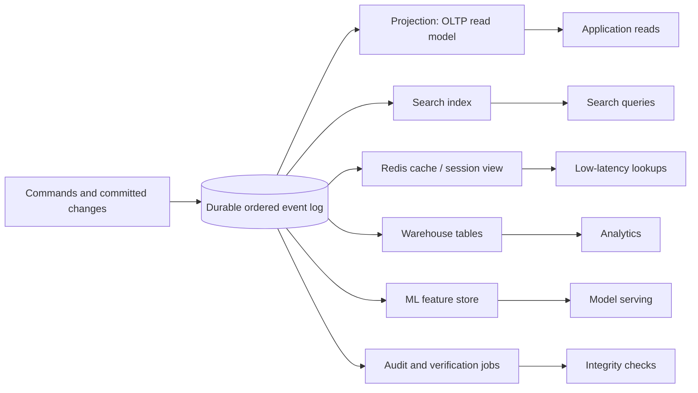

## Overview

A real production system almost never has "the database" in the singular. The order service writes to an OLTP database; the product page reads from Redis; the search box depends on Elasticsearch or OpenSearch; analytics lands in a warehouse; fraud detection consumes a stream; recommendation models need a feature store; support tools want a denormalized customer timeline. Each system is specialized for a different access pattern, and that specialization is useful. The problem is that every extra copy creates the same hard question: **what is the source of truth, and how do all the other copies stay correct?**

The philosophy in this chapter is to treat the ordered event log as the system's spine. Writes become immutable facts appended to a durable log, and every other store becomes **derived data**: a deterministic projection, index, cache, warehouse table, or feature set that can be rebuilt by replaying the same input. That idea connects [change data capture](change-data-capture), [event sourcing and CQRS](event-sourcing-and-cqrs), materialized views, stream processing, and database internals into one architecture: stop dual-writing to many systems, put the ordering decision in one log, and make every read-optimized structure a maintained view of that log.

The architectural bet is not that Kafka, Pulsar, or any other log magically solves distributed systems. The bet is narrower and more practical: if all derived systems see the same ordered facts, and if their transformations are deterministic and replayable, then inconsistency becomes observable lag or a projection bug rather than an unknowable disagreement between independent sources of truth.

## Data Integration: Deriving Data from a Log

Data integration is the everyday problem of keeping many specialized systems in sync. A common first attempt is a dual write: the application updates the database, then updates the cache, then publishes an event, then indexes the document. That looks simple until the process crashes after step two, the retry publishes the event twice, the cache update races with a concurrent write, or the search index accepts a document that the database transaction later rolls back. The failure mode is not merely stale reads; it is that different systems disagree about what happened.

A log-based design changes the shape of the problem. The application either writes events directly, as in [event sourcing and CQRS](event-sourcing-and-cqrs), or the primary database emits its committed changes through [change data capture](change-data-capture). Consumers then subscribe to the ordered stream and build their own representations. The search indexer is not told "please also update search" by request-handling code; it continuously derives the search index from committed facts. The cache is not a bag of values invalidated by scattered application branches; it is a materialized view maintained by a stream processor.

That distinction matters because derived data is allowed to be redundant. A secondary index in a database does not add new facts; it reorganizes existing facts for faster lookup. A cache, a denormalized read model, and a warehouse aggregate are the same kind of thing at system scale. If you can drop it and rebuild it from the log, it is derived. If you cannot rebuild it, it is no longer merely a cache or index — it has become another source of truth and must be protected like one.

Reprocessing is the operational superpower of this model. Business logic changes, bugs are found, schemas evolve, and teams discover that yesterday's projection left out a field needed tomorrow. With a retained input log, a new version of the projection can replay history into a new output store, catch up to the present, and then receive traffic. This is the same basic maneuver as creating a new secondary index concurrently in a database, but applied to whole application dataflows.

The Lambda Architecture named an important requirement: keep immutable input data and recompute results when necessary. Its weakness is that it often implements the same business logic twice, once in a batch system and once in a streaming system, then reconciles the two at query time. That duplication is expensive to test, debug, and operate. The critique is not "never batch process"; it is "do not maintain two semantic implementations unless you must." A healthier direction is to unify batch and stream around the same dataflow code and the same log: process new events continuously, and replay old events with more parallelism when you need a backfill.

## Unbundling the Database

A mature database is a bundle of features. It stores base records, maintains secondary indexes, updates materialized views, replicates changes to followers, caches pages, enforces some constraints, and exposes a query interface. Because those features live inside one product, they can be coordinated tightly: an index update can commit with the row update; a follower can replay the same log; a materialized view can be refreshed from a consistent snapshot.

Unbundling asks what happens if those internal mechanisms are lifted into the application architecture. The database's private replication log becomes a public, durable event log. Secondary indexes and materialized views become externally maintained projections. Caches become precomputed read models rather than values lazily filled on miss. Specialized systems still exist, but they are no longer independently mutated by application code; they subscribe to the same write stream.

This is sometimes described as **turning the database inside-out**. In the traditional shape, the database hides its log and exposes tables and queries. In the inside-out shape, the log is the shared commit point, and queryable stores are built around it. A Kafka topic, for example, may hold the ordered facts for a partition of the domain, while a stream processor maintains a key-value store for account lookups, a search index for documents, and an analytics table for reporting.

The key contrast is with federation. **Federation unifies the read path**: it gives clients one query layer that can reach into many systems. That can be useful for analytics or migrations, but it does not decide how writes are ordered or how derived copies remain consistent. **Unbundling unifies the write path**: every fact enters through one ordered stream, and read models are derived afterward. Federation asks, "How can I query several databases as if they were one?" Unbundling asks, "How can I make all these databases projections of the same history?"

This design does not eliminate databases. It changes their role. Instead of one monolith owning every access pattern, you compose storage engines around the dataflow: a relational store where transactions and constraints matter, a search engine where text ranking matters, a column store where scans matter, and a low-latency cache where predictable reads matter. The log gives those components a shared ordering and a rebuild path.

## Designing Applications Around Dataflow

In a dataflow architecture, application code is not just request handlers around a database. It is the transformation layer between input streams and derived streams or tables. A command handler validates a request and appends a fact. A projection consumes facts and updates a read model. A joiner combines orders with customer status. A notifier watches for state transitions and emits emails or webhooks. The important design unit becomes a pipeline with explicit inputs, outputs, ordering assumptions, and replay behavior.

This is where the stream-table duality becomes practical. A stream is a history of changes over time; a table is the latest value obtained by folding that stream by key. If you replay `CustomerEmailChanged` events into a table keyed by customer id, the table is a snapshot of current email addresses. If that table changes, its updates can themselves be represented as a stream. Streams and tables are therefore two views of the same information: one optimized for "what happened?", the other for "what is true now?"

That duality explains why [read-write splitting and CQRS-lite](read-write-splitting-and-cqrs-lite) often appears in these systems. The write side records facts in a form that preserves meaning and ordering; the read side serves precomputed views shaped around product screens and queries. The read model may be stale by milliseconds or minutes, but it is cheap to query and can be rebuilt. The design question is not whether every read must hit the log — it should not — but which materialized view should answer the read path and how much freshness the product needs.

Precomputed materialized views beat on-demand queries when access patterns are known and latency matters. A product page should not join orders, inventory, seller reputation, recommendations, and promotions from scratch for every request if those relationships can be maintained incrementally. On-demand queries still matter for exploratory analytics, debugging, and rare administrative operations. The point of [dataflow patterns: databases, services, events](dataflow-patterns-databases-services-events) is to make the boundary explicit: synchronous reads are a serving concern; asynchronous streams are the mechanism that keeps serving state ready.

The same replayability that helps data integration also changes deployments. A new read model can be built beside the old one. A bug fix can replay the same input into a corrected table. A schema migration can be a new projection rather than a stop-the-world rewrite. This is powerful, but only if transformations are deterministic enough that replaying the same facts produces the same output, or if any nondeterminism — time, random numbers, external API calls — is captured as explicit input.

## Aiming for Correctness

Streaming architecture is often sold with phrases like "exactly-once processing," but correctness cannot be bought from one layer. The end-to-end argument says that a correctness property must be enforced at the level where the application can actually know whether it holds. A message broker may avoid some duplicate deliveries, and a stream processor may commit offsets transactionally with output records, but a user's payment still needs an operation id, a deduplication rule, and an idempotent effect at the business boundary. Otherwise a retry can still charge twice or skip a necessary update.

The practical rule is to attach a stable operation or request id to every externally meaningful action and carry it through the log, projections, and side effects. Consumers store which operation ids they have applied, or design updates so applying the same operation twice has the same result as applying it once. This is the bridge to [stream joins and exactly-once processing](stream-joins-and-exactly-once): processing guarantees help, but the application must define what "same operation" means and where duplicates are rejected.

Some constraints can be enforced elegantly with a partitioned log. Suppose usernames must be unique. If all commands for usernames are routed to a log partition by normalized username, then one consumer can process that partition in order and accept only the first claim for each name. The ordering point is narrow — it does not require one global serial bottleneck for every write — but it must include all operations that contend for the same constraint. If two partitions can both accept `alice`, uniqueness is no longer guaranteed.

A major theme is the difference between **timeliness** and **integrity**. Timeliness is freshness: how soon a search index, cache, or warehouse reflects a committed fact. It is visible and important, but it can often be relaxed with product choices such as "your report is updating" or "search may take a few seconds." Integrity is the stronger property: no committed fact is lost, corrupted, duplicated as a business effect, or applied in an impossible order. Integrity is what makes later repair possible. A stale view can catch up; a lost event cannot be inferred reliably after the fact.

Correct systems also verify themselves. "Trust, but verify" means building audits that compare derived views against the log or against independently computed checks. A warehouse count can be reconciled with the event stream. A search index can be sampled and compared with the authoritative projection. A payments pipeline can maintain invariants over debits and credits. Instead of assuming that storage, brokers, and processors never lie, the system makes corruption detectable and repairable by replaying from the source of truth.

## Trade-offs

- **A log-centered architecture gives you one write history, not instant consistency everywhere** — derived stores still lag, consumers still fail, and users may observe stale read models. What improves is that the lag has a direction: every projection is trying to catch up to the same ordered facts instead of inventing its own truth.
- **Derived data is cheap only when it is truly rebuildable** — a search index, cache, or feature table can be dropped and replayed if all of its inputs are retained and its transformation is deterministic. If it embeds unrecorded calls to external services or wall-clock decisions, it has become state that needs its own recovery strategy.
- **Unbundling increases architectural flexibility and operational surface area at the same time** — teams can choose the right storage engine for each access pattern, but they must now operate logs, stream processors, schemas, backfills, consumer lag monitoring, and projection deployments.
- **Federation makes reads convenient; unbundling makes writes coherent** — a federated query layer can hide multiple stores from readers, but it does not solve dual writes or ordering. A shared log makes write ordering explicit, but every important read path still needs a designed projection.
- **End-to-end correctness beats layer-local exactly-once claims** — broker transactions and offset commits reduce duplicates, but business effects require operation ids, idempotent consumers, and constraint enforcement at the point where the domain meaning is known.
- **Timeliness is negotiable; integrity is not** — stale search results are usually acceptable for a short period, while lost events, double-applied payments, or broken uniqueness constraints can poison every derived view and make replay reproduce the wrong answer.

## Interview Questions

- Your company writes orders to PostgreSQL, updates Redis, publishes a Kafka event, and indexes Elasticsearch in the same request handler. Name three failure or race scenarios that can make those systems disagree, and redesign the flow around a single ordered log.
- Explain the difference between federation and unbundling. Which one unifies the read path, which one unifies the write path, and why does that distinction matter for consistency?
- A team proposes Lambda Architecture so it can compute both real-time and batch views. What problem is Lambda trying to solve, and why is maintaining two implementations of the same transformation risky?
- How would you enforce unique usernames with a partitioned event log? What key would you partition by, and what guarantee is lost if username claims can be processed in two partitions?
- A stream processor advertises exactly-once delivery. Why does an external payment API still need an operation id and idempotency record?
- Give an example where timeliness can be relaxed but integrity cannot. How would an audit or self-validating job detect that a derived store has drifted from the source log?

## References

- [Martin Kleppmann, "Designing Data-Intensive Applications", 2nd Edition (O'Reilly) — Chapter 13, "A Philosophy of Streaming Systems", sections "Data Integration", "Unbundling Databases", "Designing Applications Around Dataflow", and "Aiming for Correctness"](https://www.oreilly.com/library/view/designing-data-intensive-applications/9781098119058/)
- [Martin Kleppmann — "Turning the Database Inside-Out with Apache Samza" (Confluent)](https://www.confluent.io/blog/turning-the-database-inside-out-with-apache-samza/)
- [Jay Kreps — "Questioning the Lambda Architecture" (O'Reilly Radar)](https://www.oreilly.com/radar/questioning-the-lambda-architecture/)
- [J. H. Saltzer, D. P. Reed, and D. D. Clark — "End-to-End Arguments in System Design" (ACM Transactions on Computer Systems, 1984)](https://dl.acm.org/doi/10.1145/357401.357402)
- [Jay Kreps — "The Log: What every software engineer should know about real-time data's unifying abstraction" (LinkedIn Engineering)](https://engineering.linkedin.com/blog/2013/12/the-log--what-every-software-engineer-should-know-about-real-time-data-s-unifying-abstraction)
