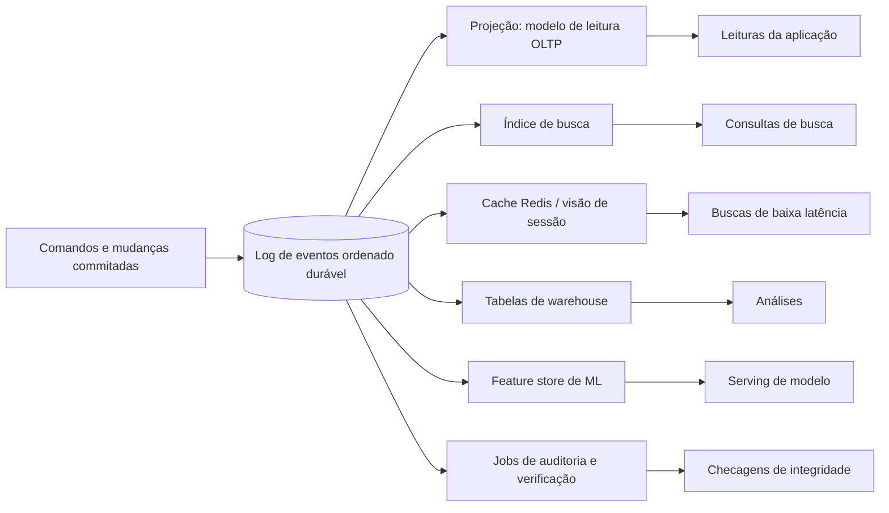

## Visão Geral

Um sistema de produção real quase nunca tem "o banco de dados" no singular. O serviço de pedidos escreve em um banco de dados OLTP; a página de produto lê do Redis; a caixa de busca depende de Elasticsearch ou OpenSearch; análises vão para um warehouse; detecção de fraude consome um stream; modelos de recomendação precisam de um feature store; ferramentas de suporte querem uma timeline de cliente desnormalizada. Cada sistema é especializado para um padrão de acesso diferente, e essa especialização é útil. O problema é que cada cópia extra cria a mesma pergunta difícil: **qual é a fonte da verdade, e como todas as outras cópias permanecem corretas?**

A filosofia neste capítulo é tratar o log de eventos ordenado como a espinha dorsal do sistema. Escritas se tornam fatos imutáveis anexados a um log durável, e todo outro armazenamento se torna **dado derivado**: uma projeção determinística, índice, cache, tabela de warehouse, ou conjunto de features que pode ser reconstruído reproduzindo a mesma entrada. Essa ideia conecta [change data capture](change-data-capture), [event sourcing and CQRS](event-sourcing-and-cqrs), visões materializadas, processamento de stream, e internals de banco de dados em uma arquitetura só: pare de fazer escritas duplas em muitos sistemas, coloque a decisão de ordenação em um log, e transforme toda estrutura otimizada para leitura em uma visão mantida daquele log.

A aposta arquitetural não é que Kafka, Pulsar, ou qualquer outro log resolva magicamente sistemas distribuídos. A aposta é mais estreita e prática: se todos os sistemas derivados veem os mesmos fatos ordenados, e se suas transformações são determinísticas e replayáveis, então inconsistência se torna atraso observável ou um bug de projeção em vez de um desacordo desconhecível entre fontes de verdade independentes.

## Integração de Dados: Derivando Dados de um Log

Integração de dados é o problema cotidiano de manter muitos sistemas especializados sincronizados. Uma primeira tentativa comum é uma escrita dupla: a aplicação atualiza o banco de dados, depois atualiza o cache, depois publica um evento, depois indexa o documento. Isso parece simples até o processo cair depois do segundo passo, o retry publicar o evento duas vezes, a atualização do cache correr contra uma escrita concorrente, ou o índice de busca aceitar um documento que a transação de banco de dados depois reverte. O modo de falha não é apenas leituras obsoletas; é que sistemas diferentes discordam sobre o que aconteceu.

Um design baseado em log muda a forma do problema. A aplicação escreve eventos diretamente, como em [event sourcing and CQRS](event-sourcing-and-cqrs), ou o banco de dados primário emite suas mudanças commitadas através de [change data capture](change-data-capture). Consumidores então assinam o stream ordenado e constroem suas próprias representações. O indexador de busca não recebe a instrução "por favor, atualize a busca também" do código de tratamento de requisição; ele deriva continuamente o índice de busca a partir de fatos commitados. O cache não é uma sacola de valores invalidados por ramificações espalhadas da aplicação; é uma visão materializada mantida por um processador de stream.

Essa distinção importa porque dado derivado tem permissão para ser redundante. Um índice secundário em um banco de dados não adiciona novos fatos; ele reorganiza fatos existentes para busca mais rápida. Um cache, um modelo de leitura desnormalizado, e um agregado de warehouse são o mesmo tipo de coisa em escala de sistema. Se você pode descartá-lo e reconstruí-lo do log, ele é derivado. Se você não pode reconstruí-lo, ele deixou de ser meramente um cache ou índice — se tornou outra fonte de verdade e precisa ser protegido como uma.

Reprocessamento é o superpoder operacional desse modelo. Lógica de negócio muda, bugs são encontrados, schemas evoluem, e equipes descobrem que a projeção de ontem deixou de fora um campo necessário amanhã. Com um log de entrada retido, uma nova versão da projeção pode reproduzir o histórico em um novo armazenamento de saída, alcançar o presente, e então receber tráfego. Essa é a mesma manobra básica de criar um novo índice secundário concorrentemente em um banco de dados, mas aplicada a fluxos de dados de aplicação inteiros.

A Lambda Architecture nomeou um requisito importante: manter dados de entrada imutáveis e recomputar resultados quando necessário. Sua fraqueza é que frequentemente implementa a mesma lógica de negócio duas vezes, uma vez em um sistema batch e uma vez em um sistema de streaming, depois reconcilia os dois no momento da consulta. Essa duplicação é cara de testar, depurar e operar. A crítica não é "nunca processe em batch"; é "não mantenha duas implementações semânticas a menos que precise." Uma direção mais saudável é unificar batch e stream em torno do mesmo código de dataflow e do mesmo log: processe novos eventos continuamente, e reproduza eventos antigos com mais paralelismo quando você precisar de um backfill.

## Desmembrando o Banco de Dados

Um banco de dados maduro é um pacote de funcionalidades. Ele armazena registros base, mantém índices secundários, atualiza visões materializadas, replica mudanças para seguidores, cacheia páginas, aplica algumas restrições, e expõe uma interface de consulta. Como essas funcionalidades vivem em um produto só, elas podem ser coordenadas de perto: uma atualização de índice pode ser commitada junto com a atualização da linha; um seguidor pode reproduzir o mesmo log; uma visão materializada pode ser atualizada a partir de um snapshot consistente.

Desmembrar pergunta o que acontece se esses mecanismos internos forem elevados para a arquitetura da aplicação. O log de replicação privado do banco de dados se torna um log de eventos público e durável. Índices secundários e visões materializadas se tornam projeções mantidas externamente. Caches se tornam modelos de leitura precomputados em vez de valores preenchidos preguiçosamente em um miss. Sistemas especializados ainda existem, mas não são mais independentemente mutados pelo código da aplicação; eles assinam o mesmo stream de escrita.

Isso é às vezes descrito como **virar o banco de dados do avesso**. Na forma tradicional, o banco de dados esconde seu log e expõe tabelas e consultas. Na forma virada do avesso, o log é o ponto de commit compartilhado, e stores consultáveis são construídos ao redor dele. Um tópico do Kafka, por exemplo, pode guardar os fatos ordenados para uma partição do domínio, enquanto um processador de stream mantém um key-value store para buscas de conta, um índice de busca para documentos, e uma tabela de análises para relatórios.

O contraste principal é com a federação. **Federação unifica o caminho de leitura**: ela dá aos clientes uma camada de consulta única que pode alcançar muitos sistemas. Isso pode ser útil para análises ou migrações, mas não decide como escritas são ordenadas ou como cópias derivadas permanecem consistentes. **Desmembrar unifica o caminho de escrita**: todo fato entra através de um stream ordenado, e modelos de leitura são derivados depois. Federação pergunta: "Como posso consultar vários bancos de dados como se fossem um só?" Desmembrar pergunta: "Como posso fazer todos esses bancos de dados serem projeções da mesma história?"

Esse design não elimina bancos de dados. Ele muda seu papel. Em vez de um monólito possuindo cada padrão de acesso, você compõe engines de armazenamento ao redor do dataflow: um armazenamento relacional onde transações e restrições importam, um motor de busca onde ranqueamento de texto importa, um column store onde varreduras importam, e um cache de baixa latência onde leituras previsíveis importam. O log dá a esses componentes uma ordenação compartilhada e um caminho de reconstrução.

## Projetando Aplicações em Torno do Dataflow

Em uma arquitetura de dataflow, o código de aplicação não é apenas manipuladores de requisição em torno de um banco de dados. É a camada de transformação entre streams de entrada e streams ou tabelas derivadas. Um manipulador de comando valida uma requisição e anexa um fato. Uma projeção consome fatos e atualiza um modelo de leitura. Um joiner combina pedidos com status de cliente. Um notificador observa transições de estado e emite e-mails ou webhooks. A unidade de design importante se torna um pipeline com entradas, saídas, suposições de ordenação, e comportamento de replay explícitos.

É aqui que a dualidade stream-tabela se torna prática. Um stream é um histórico de mudanças ao longo do tempo; uma tabela é o valor mais recente obtido dobrando esse stream por chave. Se você reproduzir eventos `CustomerEmailChanged` em uma tabela chaveada por id de cliente, a tabela é um snapshot de endereços de e-mail atuais. Se essa tabela muda, suas atualizações podem elas mesmas ser representadas como um stream. Streams e tabelas são, portanto, duas visões da mesma informação: uma otimizada para "o que aconteceu?", a outra para "o que é verdade agora?"

Essa dualidade explica por que [read-write splitting and CQRS-lite](read-write-splitting-and-cqrs-lite) frequentemente aparece nesses sistemas. O lado da escrita registra fatos em uma forma que preserva significado e ordenação; o lado da leitura serve visões precomputadas moldadas em torno de telas de produto e consultas. O modelo de leitura pode estar desatualizado por milissegundos ou minutos, mas é barato de consultar e pode ser reconstruído. A pergunta de design não é se toda leitura deve atingir o log — não deveria — mas qual visão materializada deveria responder ao caminho de leitura e quanto frescor o produto precisa.

Visões materializadas precomputadas vencem consultas sob demanda quando padrões de acesso são conhecidos e latência importa. Uma página de produto não deveria unir pedidos, estoque, reputação de vendedor, recomendações e promoções do zero para cada requisição se essas relações puderem ser mantidas incrementalmente. Consultas sob demanda ainda importam para análises exploratórias, depuração, e operações administrativas raras. O ponto de [dataflow patterns: databases, services, events](dataflow-patterns-databases-services-events) é tornar a fronteira explícita: leituras síncronas são uma preocupação de serving; streams assíncronos são o mecanismo que mantém o estado de serving pronto.

A mesma replayabilidade que ajuda a integração de dados também muda deploys. Um novo modelo de leitura pode ser construído ao lado do antigo. Uma correção de bug pode reproduzir a mesma entrada em uma tabela corrigida. Uma migração de schema pode ser uma nova projeção em vez de uma reescrita que para tudo. Isso é poderoso, mas apenas se as transformações forem determinísticas o suficiente para que reproduzir os mesmos fatos produza a mesma saída, ou se qualquer não-determinismo — tempo, números aleatórios, chamadas de API externas — for capturado como entrada explícita.

## Buscando a Correção

Arquitetura de streaming é frequentemente vendida com frases como "processamento exactly-once," mas correção não pode ser comprada de uma camada só. O argumento de ponta a ponta diz que uma propriedade de correção precisa ser aplicada no nível onde a aplicação pode realmente saber se ela se mantém. Um message broker pode evitar algumas entregas duplicadas, e um processador de stream pode commitar offsets transacionalmente com registros de saída, mas o pagamento de um usuário ainda precisa de um id de operação, uma regra de deduplicação, e um efeito idempotente na fronteira de negócio. Caso contrário, um retry ainda pode cobrar duas vezes ou pular uma atualização necessária.

A regra prática é anexar um id de operação ou requisição estável a cada ação externamente significativa e carregá-lo através do log, projeções, e efeitos colaterais. Consumidores armazenam quais ids de operação já aplicaram, ou projetam atualizações de forma que aplicar a mesma operação duas vezes tenha o mesmo resultado que aplicá-la uma vez. Essa é a ponte para [stream joins and exactly-once processing](stream-joins-and-exactly-once): garantias de processamento ajudam, mas a aplicação precisa definir o que "mesma operação" significa e onde duplicatas são rejeitadas.

Algumas restrições podem ser aplicadas elegantemente com um log particionado. Suponha que nomes de usuário precisem ser únicos. Se todos os comandos para nomes de usuário são roteados para uma partição de log por nome de usuário normalizado, então um consumidor pode processar essa partição em ordem e aceitar apenas a primeira reivindicação para cada nome. O ponto de ordenação é estreito — não requer um único gargalo serial global para cada escrita — mas precisa incluir todas as operações que disputam a mesma restrição. Se duas partições podem ambas aceitar `alice`, unicidade não é mais garantida.

Um tema importante é a diferença entre **atualidade (timeliness)** e **integridade**. Atualidade é frescor: quão cedo um índice de busca, cache, ou warehouse reflete um fato commitado. É visível e importante, mas frequentemente pode ser relaxada com decisões de produto como "seu relatório está atualizando." Integridade é a propriedade mais forte: nenhum fato commitado é perdido, corrompido, duplicado como efeito de negócio, ou aplicado em uma ordem impossível. Integridade é o que torna o reparo posterior possível. Uma visão obsoleta pode se atualizar; um evento perdido não pode ser inferido de forma confiável depois do fato.

Sistemas corretos também se verificam. "Confie, mas verifique" significa construir auditorias que comparam visões derivadas com o log ou com checagens computadas de forma independente. Uma contagem de warehouse pode ser reconciliada com o stream de eventos. Um índice de busca pode ser amostrado e comparado com a projeção autoritativa. Um pipeline de pagamentos pode manter invariantes sobre débitos e créditos. Em vez de assumir que armazenamento, brokers, e processadores nunca mentem, o sistema torna corrupção detectável e reparável reproduzindo a partir da fonte da verdade.

## Trade-offs

- **Uma arquitetura centrada em log dá a você um histórico de escrita único, não consistência instantânea em todo lugar** — armazenamentos derivados ainda atrasam, consumidores ainda falham, e usuários podem observar modelos de leitura obsoletos. O que melhora é que o atraso tem uma direção: toda projeção está tentando alcançar os mesmos fatos ordenados em vez de inventar sua própria verdade.
- **Dado derivado é barato apenas quando é verdadeiramente reconstruível** — um índice de busca, cache, ou tabela de features pode ser descartado e reproduzido se todas as suas entradas forem retidas e sua transformação for determinística. Se ele embute chamadas não registradas a serviços externos ou decisões de relógio de parede, ele se tornou estado que precisa de sua própria estratégia de recuperação.
- **Desmembrar aumenta flexibilidade arquitetural e superfície operacional ao mesmo tempo** — equipes podem escolher a engine de armazenamento certa para cada padrão de acesso, mas agora precisam operar logs, processadores de stream, schemas, backfills, monitoramento de atraso de consumidor, e deploys de projeção.
- **Federação torna leituras convenientes; desmembrar torna escritas coerentes** — uma camada de consulta federada pode esconder múltiplos armazenamentos dos leitores, mas não resolve escritas duplas ou ordenação. Um log compartilhado torna a ordenação de escrita explícita, mas todo caminho de leitura importante ainda precisa de uma projeção projetada.
- **Correção de ponta a ponta vence alegações de exactly-once locais a uma camada** — transações de broker e commits de offset reduzem duplicatas, mas efeitos de negócio exigem ids de operação, consumidores idempotentes, e aplicação de restrições no ponto onde o significado do domínio é conhecido.
- **Atualidade é negociável; integridade não é** — resultados de busca obsoletos são geralmente aceitáveis por um curto período, enquanto eventos perdidos, pagamentos aplicados duas vezes, ou restrições de unicidade quebradas podem envenenar toda visão derivada e fazer o replay reproduzir a resposta errada.

## Perguntas de Entrevista

- Sua empresa escreve pedidos no PostgreSQL, atualiza o Redis, publica um evento Kafka, e indexa no Elasticsearch no mesmo manipulador de requisição. Nomeie três cenários de falha ou corrida que podem fazer esses sistemas discordarem, e redesenhe o fluxo em torno de um único log ordenado.
- Explique a diferença entre federação e desmembrar. Qual unifica o caminho de leitura, qual unifica o caminho de escrita, e por que essa distinção importa para consistência?
- Uma equipe propõe a Lambda Architecture para poder computar visões em tempo real e em batch. Que problema a Lambda está tentando resolver, e por que manter duas implementações da mesma transformação é arriscado?
- Como você aplicaria unicidade de nomes de usuário com um log de eventos particionado? Por qual chave você particionaria, e que garantia é perdida se reivindicações de nome de usuário puderem ser processadas em duas partições?
- Um processador de stream anuncia entrega exactly-once. Por que uma API de pagamento externa ainda precisa de um id de operação e registro de idempotência?
- Dê um exemplo onde atualidade pode ser relaxada mas integridade não. Como um job de auditoria ou autovalidação detectaria que um armazenamento derivado divergiu do log de origem?

## Referências

- [Martin Kleppmann, "Designing Data-Intensive Applications", 2ª Edição (O'Reilly) — Capítulo 13, "A Philosophy of Streaming Systems", seções "Data Integration", "Unbundling Databases", "Designing Applications Around Dataflow", e "Aiming for Correctness"](https://www.oreilly.com/library/view/designing-data-intensive-applications/9781098119058/)
- [Martin Kleppmann — "Turning the Database Inside-Out with Apache Samza" (Confluent)](https://www.confluent.io/blog/turning-the-database-inside-out-with-apache-samza/)
- [Jay Kreps — "Questioning the Lambda Architecture" (O'Reilly Radar)](https://www.oreilly.com/radar/questioning-the-lambda-architecture/)
- [J. H. Saltzer, D. P. Reed, e D. D. Clark — "End-to-End Arguments in System Design" (ACM Transactions on Computer Systems, 1984)](https://dl.acm.org/doi/10.1145/357401.357402)
- [Jay Kreps — "The Log: What every software engineer should know about real-time data's unifying abstraction" (LinkedIn Engineering)](https://engineering.linkedin.com/blog/2013/12/the-log--what-every-software-engineer-should-know-about-real-time-data-s-unifying-abstraction)
