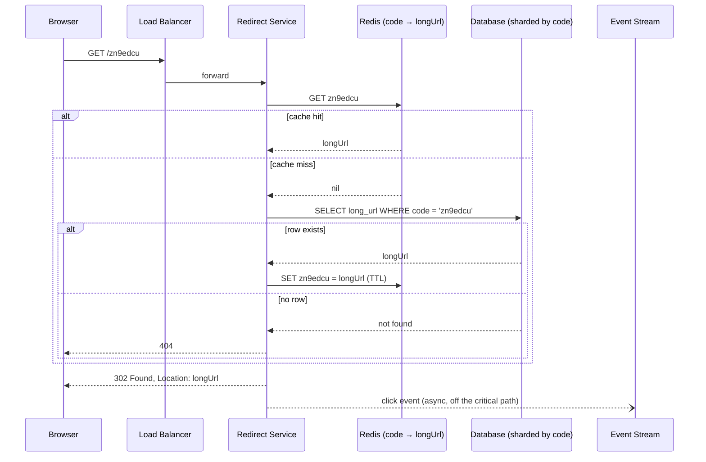

## Overview

"Design TinyURL" is the most common warm-up prompt in system design interviews, and it's deceptively simple: two endpoints, one table, a string transformation. The trap is spending forty minutes on how to squeeze a code into seven characters, which is a solved problem covered end-to-end in [Distributed ID Generation](distributed-id-generation) and explicitly out of scope here. The real signal is everywhere else — a read path that runs 10x hotter than the write path and therefore lives or dies on caching, a redirect status code whose choice silently determines whether you can measure your own product, and an open write endpoint that anyone on the internet can point a script at.

## Functional Requirements

- **Shorten** — given a long URL, return a short alias like `https://tiny.url/zn9edcu`.
- **Redirect** — given a short alias, send the client to the original long URL.
- **Analytics** (stretch) — count clicks per alias, with basic attribution (time, referrer, coarse geography).

Out of scope for the MVP: editing or deleting an existing alias, custom vanity codes, link expiry, and user accounts. Say this out loud — an alias that can never be updated is what makes the mapping table effectively append-only, and an append-only table is what makes the cache trivially safe (entries never go stale, so they never need invalidation).

## Non-Functional Requirements and Estimation

Anchor every quality on a number and walk the interviewer through the arithmetic:

- **Write volume** — 100 million new URLs per day → `100,000,000 / 86,400 ≈ 1,160 writes/sec`.
- **Read volume** — assume a 10:1 read:write ratio → `≈ 11,600 redirects/sec`. That ratio is the single most important number in the design; it's why the redirect path gets a cache and the shorten path doesn't.
- **Storage** — running for 10 years means `100M × 365 × 10 = 365 billion` records. At ~100 bytes per row (long URL plus code plus metadata), that's `365B × 100 B ≈ 36.5 TB`. Too big for one machine, comfortably shardable by code.
- **Keyspace** — 365 billion records need a code space bigger than that. Base62 (`[0-9a-zA-Z]`) gives `62^7 ≈ 3.5 trillion`, so **7 characters** is the answer; `62^6 ≈ 56 billion` is not enough. How that code gets generated collision-free is [Distributed ID Generation](distributed-id-generation)'s subject.
- **Latency and availability** — a redirect is on the critical path of someone clicking a link, so budget well under 100ms at p99 and target high availability. A shortener that's down doesn't degrade gracefully: every link that was ever shared through it is broken for as long as the outage lasts.

## API Design

Two endpoints, REST-style:

```
POST /api/v1/shorten
  body:   { "longUrl": "https://en.wikipedia.org/wiki/Systems_design" }
  201 →   { "shortUrl": "https://tiny.url/zn9edcu", "code": "zn9edcu" }

GET /{code}
  301 or 302 →  Location: https://en.wikipedia.org/wiki/Systems_design
```

Note that `GET /{code}` is deliberately *not* under `/api/v1/` — it's the public link surface, so every wasted character in the prefix is a character users pay for in every tweet and QR code. `POST /shorten` should be idempotent-ish for the same input: look up the long URL first and return the existing code rather than minting a second alias for a URL that already has one. That lookup needs an index on the long URL (or on a hash of it, since the URL itself can be far longer than a comfortable index key).

Validation on the shorten path matters more than it looks: reject non-HTTP(S) schemes (`javascript:`, `data:`) and reject aliases that point back at your own domain, or you've built a redirect loop generator and a phishing relay.

## Redirect Codes: 301 vs. 302

This is the trade-off the prompt actually exists to surface, and it's not about HTTP pedantry — it's about which of two things you want more.

**`301 Moved Permanently`** tells the browser the mapping will never change, so the browser caches it. Every repeat visit to that short link resolves locally and never touches your servers again. On a link that goes viral, this is an enormous load reduction: the first click from each browser hits you, the rest don't.

**`302 Found`** marks the redirect as temporary, so the browser comes back to your server every single time. That's more traffic — and it's exactly what you want if clicks are the product. Every redirect is an event you can record with a timestamp, referrer, and user agent, which is what makes per-link analytics possible at all.

So the trade-off is: **301 buys you server load reduction at the cost of blinding your analytics; 302 buys you complete click data at the cost of serving every single click yourself.** Most commercial shorteners — where the dashboard showing click counts *is* the paid feature — choose 302 and then invest in making the redirect path cheap enough that serving every click is fine. There's a second, nastier reason to prefer 302: a 301 is cached in browsers you don't control and can't purge, so if a link is later found to be malicious, or you decide to support editing destinations after all, you cannot take it back. 301 gives away control permanently in exchange for a load win that a cache in front of your database can largely deliver anyway.

## Database Schema

```sql
CREATE TABLE short_urls (
    id          BIGINT       PRIMARY KEY,        -- globally unique, from the ID generator
    code        VARCHAR(7)   NOT NULL UNIQUE,    -- base62, the public alias
    long_url    TEXT         NOT NULL,
    long_url_hash BYTEA      NOT NULL,           -- for dedupe lookups on shorten
    created_at  TIMESTAMPTZ  NOT NULL DEFAULT now(),
    created_by  BIGINT       NULL                -- owner, when there are accounts
);

CREATE INDEX idx_short_urls_long_url_hash ON short_urls (long_url_hash);
```

Every read in the hot path is a single point lookup by `code`, which means the table shards cleanly on `code` — no cross-shard queries, no joins, no range scans. Click events do **not** belong in this table: writing a counter update on every redirect turns a read-only path into a write-heavy one and puts row-level contention on the hottest links in the system. Analytics events go to an append-only log or event stream, aggregated offline.

## Caching the Hot Path

Link popularity follows a brutal power law — a handful of aliases account for most redirects while the long tail is read approximately never. That's the ideal shape for a cache, and combined with the append-only mapping it means a cache entry can be held with a long TTL and no invalidation logic at all.



This is a straightforward read-through / cache-aside pattern (see [Caching Strategies and CDNs](caching-strategies-and-cdns)) with LRU eviction, and at an 11,600 reads/sec baseline a high hit rate is the difference between a Redis-sized problem and a database-sized one. Two details make it work in practice: the click event is emitted **asynchronously** after the response is written, so analytics never adds latency to the redirect; and the negative case is cached too — bots enumerate short codes constantly, and without caching misses, every garbage code is a free database query aimed at your shards.

## Rate Limiting the Shorten Endpoint

`POST /shorten` is an unauthenticated write endpoint that permanently consumes keyspace and storage, which makes it a magnet for abuse: spammers generating disposable links to launder malicious destinations past email filters, and scripts burning through your code space for no reason. Cap it per IP and per API key — a token bucket is the right fit, since a legitimate user pasting a batch of links bursts and then goes quiet (see [Rate Limiting](rate-limiting)). Enforce it at the gateway, before a request touches the ID generator or the database.

The redirect path needs different treatment. You cannot rate limit it per IP the way you limit writes, because a genuinely viral link produces exactly the traffic pattern an abuse heuristic flags. Protect it instead with caching, negative caching for unknown codes, and per-IP limits loose enough to catch enumeration scanners (thousands of distinct *misses* from one address) rather than popularity.

## Analytics

Every 302 gives you one event: code, timestamp, referrer, user agent, IP-derived country. Write it to a message queue or append-only log and let a downstream consumer aggregate it — never increment a counter in the mapping table synchronously. This keeps the redirect path a pure read, lets the analytics pipeline fall behind or fail without breaking a single link, and gives you raw events to re-aggregate later when the product asks a question you didn't precompute.

## Trade-offs

- **302 over 301 costs you a request per click but is the only way to measure clicks** — if link analytics is the product, the extra load is the price of the feature, and it's a price a cache in front of the database mostly absorbs.
- **301's browser caching is unrevocable** — you cannot purge a redirect cached in browsers you don't control, so a link later found to be malicious, or a destination you want to change, is out of your reach forever.
- **Making the mapping immutable makes caching trivial** — no updates means no invalidation, which is why "URLs can't be edited or deleted" is worth negotiating into the requirements rather than treating as an arbitrary constraint.
- **Deduplicating identical long URLs saves keyspace but breaks per-campaign analytics** — two marketing teams shortening the same landing page get the same code and their click counts merge, so most real products dedupe only within a single owner, or not at all.
- **Keeping click counts out of the mapping table protects the read path from write contention** — a synchronous counter update on the hottest links turns a shardable point-lookup workload into a contended write workload exactly where traffic is highest.
- **Negative caching stops enumeration scans from reaching the database, but consumes cache space on garbage keys** — bounded with a short TTL (or a Bloom filter over known codes) it's still far cheaper than letting every invalid code become a shard query.

## Interview Questions

- Given a 10:1 read:write ratio, which path do you optimize first, and what specifically do you add to it?
- If the product team requires a per-link click dashboard, which redirect status code does that force, and what load does that decision impose?
- What can you no longer do after you've served a link as a 301 and browsers have cached it?
- Why do click counts belong in an event stream instead of a counter column on the mapping row?
- Why is per-IP rate limiting appropriate for `POST /shorten` but a poor fit for the redirect endpoint?

## References

- [Alex Xu, "System Design Interview – An Insider's Guide, Volume 1" (ByteByteGo, 2020) — Chapter 8, "Design A URL Shortener"](https://bytebytego.com)
- [MDN Web Docs — Redirections in HTTP](https://developer.mozilla.org/en-US/docs/Web/HTTP/Guides/Redirections)
- [IETF RFC 9110 — HTTP Semantics, §15.4 Redirection 3xx](https://www.rfc-editor.org/rfc/rfc9110#name-redirection-3xx)
- [Google Search Central — Redirects and Google Search](https://developers.google.com/search/docs/crawling-indexing/301-redirects)
