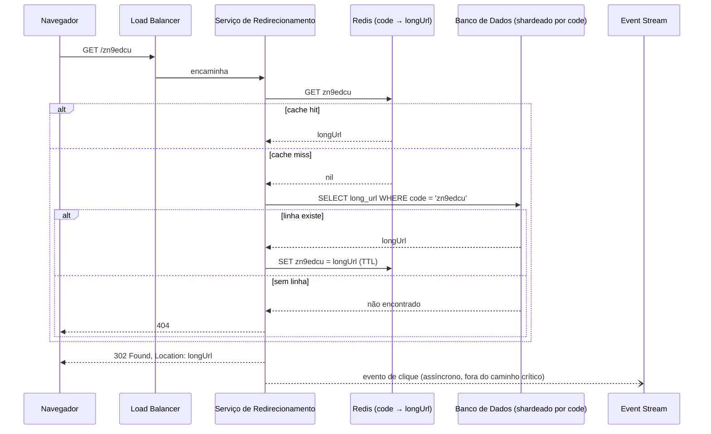

## Visão Geral

"Projete o TinyURL" é o prompt de aquecimento mais comum em entrevistas de system design, e é enganosamente simples: dois endpoints, uma tabela, uma transformação de string. A armadilha é gastar quarenta minutos em como comprimir um código em sete caracteres, o que é um problema resolvido e coberto de ponta a ponta em [Distributed ID Generation](distributed-id-generation) e explicitamente fora do escopo aqui. O sinal real está em todo o resto — um caminho de leitura que roda 10x mais quente que o caminho de escrita e que, por isso, vive ou morre pelo caching, um código de status de redirecionamento cuja escolha determina silenciosamente se você consegue medir seu próprio produto, e um endpoint de escrita aberto que qualquer um na internet pode apontar um script contra.

## Requisitos Funcionais

- **Encurtar** — dada uma URL longa, retornar um alias curto como `https://tiny.url/zn9edcu`.
- **Redirecionar** — dado um alias curto, enviar o cliente para a URL longa original.
- **Analytics** (extra) — contar cliques por alias, com atribuição básica (horário, referrer, geografia aproximada).

Fora do escopo do MVP: editar ou excluir um alias existente, códigos vanity personalizados, expiração de link e contas de usuário. Diga isso em voz alta — um alias que nunca pode ser atualizado é o que torna a tabela de mapeamento efetivamente somente-append, e uma tabela somente-append é o que torna o cache trivialmente seguro (entradas nunca ficam obsoletas, então nunca precisam de invalidação).

## Requisitos Não Funcionais e Estimativa

Ancore cada qualidade em um número e percorra a aritmética com o entrevistador:

- **Volume de escrita** — 100 milhões de novas URLs por dia → `100.000.000 / 86.400 ≈ 1.160 escritas/seg`.
- **Volume de leitura** — assumindo uma proporção leitura:escrita de 10:1 → `≈ 11.600 redirecionamentos/seg`. Essa proporção é o número mais importante do design; é por isso que o caminho de redirecionamento ganha um cache e o de encurtamento não.
- **Armazenamento** — rodando por 10 anos significa `100M × 365 × 10 = 365 bilhões` de registros. A ~100 bytes por linha (URL longa mais código mais metadados), isso é `365B × 100 B ≈ 36,5 TB`. Grande demais para uma máquina, facilmente shardável por código.
- **Espaço de chaves** — 365 bilhões de registros precisam de um espaço de códigos maior que isso. Base62 (`[0-9a-zA-Z]`) dá `62^7 ≈ 3,5 trilhões`, então **7 caracteres** é a resposta; `62^6 ≈ 56 bilhões` não é suficiente. Como esse código é gerado sem colisões é assunto de [Distributed ID Generation](distributed-id-generation).
- **Latência e disponibilidade** — um redirecionamento está no caminho crítico de alguém clicando em um link, então planeje bem abaixo de 100ms no p99 e almeje alta disponibilidade. Um encurtador que está fora do ar não degrada graciosamente: todo link que já foi compartilhado através dele fica quebrado enquanto durar a interrupção.

## Design da API

Dois endpoints, estilo REST:

```
POST /api/v1/shorten
  body:   { "longUrl": "https://en.wikipedia.org/wiki/Systems_design" }
  201 →   { "shortUrl": "https://tiny.url/zn9edcu", "code": "zn9edcu" }

GET /{code}
  301 ou 302 →  Location: https://en.wikipedia.org/wiki/Systems_design
```

Note que `GET /{code}` deliberadamente *não* fica sob `/api/v1/` — é a superfície pública do link, então todo caractere desperdiçado no prefixo é um caractere que os usuários pagam em cada tweet e QR code. `POST /shorten` deveria ser quase-idempotente para a mesma entrada: procure a URL longa primeiro e retorne o código existente em vez de cunhar um segundo alias para uma URL que já tem um. Essa busca precisa de um índice na URL longa (ou em um hash dela, já que a própria URL pode ser bem mais longa que uma chave de índice confortável).

Validação no caminho de encurtamento importa mais do que parece: rejeite esquemas não-HTTP(S) (`javascript:`, `data:`) e rejeite aliases que apontam de volta para o seu próprio domínio, ou você construiu um gerador de loop de redirecionamento e um relé de phishing.

## Códigos de Redirecionamento: 301 vs. 302

Este é o trade-off que o prompt realmente existe para expor, e não é sobre pedantismo de HTTP — é sobre qual das duas coisas você quer mais.

**`301 Moved Permanently`** diz ao navegador que o mapeamento nunca vai mudar, então o navegador o armazena em cache. Toda visita repetida a esse link curto resolve localmente e nunca mais toca seus servidores. Em um link que viraliza, isso é uma redução enorme de carga: o primeiro clique de cada navegador te atinge, o resto não.

**`302 Found`** marca o redirecionamento como temporário, então o navegador volta ao seu servidor toda vez. Isso é mais tráfego — e é exatamente o que você quer se cliques forem o produto. Todo redirecionamento é um evento que você pode registrar com timestamp, referrer e user agent, o que é o que torna possível analytics por link.

Então o trade-off é: **301 compra redução de carga do servidor ao custo de cegar seu analytics; 302 compra dados completos de clique ao custo de servir cada clique você mesmo.** A maioria dos encurtadores comerciais — onde o dashboard mostrando contagens de clique *é* o recurso pago — escolhe 302 e depois investe em tornar o caminho de redirecionamento barato o suficiente para que servir cada clique seja aceitável. Há uma segunda razão, mais perversa, para preferir 302: um 301 fica em cache em navegadores que você não controla e não pode limpar, então se um link mais tarde se revelar malicioso, ou você decidir suportar edição de destinos afinal, você não pode voltar atrás. 301 abre mão do controle permanentemente em troca de um ganho de carga que um cache na frente do seu banco de dados consegue entregar de qualquer forma.

## Esquema do Banco de Dados

```sql
CREATE TABLE short_urls (
    id          BIGINT       PRIMARY KEY,        -- globalmente único, do gerador de ID
    code        VARCHAR(7)   NOT NULL UNIQUE,    -- base62, o alias público
    long_url    TEXT         NOT NULL,
    long_url_hash BYTEA      NOT NULL,           -- para buscas de deduplicação no encurtamento
    created_at  TIMESTAMPTZ  NOT NULL DEFAULT now(),
    created_by  BIGINT       NULL                -- dono, quando há contas
);

CREATE INDEX idx_short_urls_long_url_hash ON short_urls (long_url_hash);
```

Toda leitura no caminho quente é uma única busca pontual por `code`, o que significa que a tabela shardeia de forma limpa por `code` — sem consultas entre shards, sem joins, sem varreduras de intervalo. Eventos de clique **não** pertencem a esta tabela: escrever uma atualização de contador a cada redirecionamento transforma um caminho somente-leitura em um caminho pesado em escrita e coloca contenção em nível de linha exatamente nos links mais quentes do sistema. Eventos de analytics vão para um log somente-append ou um event stream, agregados offline.

## Fazendo Cache do Caminho Quente

A popularidade de links segue uma lei de potência brutal — um punhado de aliases responde pela maioria dos redirecionamentos enquanto a cauda longa é lida quase nunca. Essa é a forma ideal para um cache, e combinada com o mapeamento somente-append significa que uma entrada de cache pode ser mantida com um TTL longo e nenhuma lógica de invalidação.



Isso é um padrão direto de read-through / cache-aside (veja [Caching Strategies and CDNs](caching-strategies-and-cdns)) com evicção LRU, e em uma linha de base de 11.600 leituras/seg uma alta taxa de acerto é a diferença entre um problema do tamanho de um Redis e um do tamanho de um banco de dados. Dois detalhes fazem funcionar na prática: o evento de clique é emitido **assincronamente** depois que a resposta é escrita, então analytics nunca adiciona latência ao redirecionamento; e o caso negativo também é cacheado — bots enumeram códigos curtos constantemente, e sem cachear misses, todo código inválido é uma consulta gratuita ao banco de dados mirando seus shards.

## Limitando a Taxa do Endpoint de Encurtamento

`POST /shorten` é um endpoint de escrita não autenticado que consome permanentemente espaço de chaves e armazenamento, o que o torna um ímã para abuso: spammers gerando links descartáveis para lavar destinos maliciosos através de filtros de e-mail, e scripts consumindo seu espaço de códigos sem motivo. Limite por IP e por chave de API — um token bucket é o encaixe certo, já que um usuário legítimo colando um lote de links tem picos e depois fica quieto (veja [Rate Limiting](rate-limiting)). Aplique no gateway, antes de uma requisição tocar o gerador de ID ou o banco de dados.

O caminho de redirecionamento precisa de tratamento diferente. Você não pode limitar a taxa por IP da mesma forma que limita escritas, porque um link genuinamente viral produz exatamente o padrão de tráfego que uma heurística de abuso sinalizaria. Proteja-o em vez disso com caching, cache negativo para códigos desconhecidos, e limites por IP frouxos o suficiente para capturar scanners de enumeração (milhares de *misses* distintos de um endereço) em vez de popularidade.

## Analytics

Todo 302 te dá um evento: código, timestamp, referrer, user agent, país derivado do IP. Escreva em uma fila de mensagens ou log somente-append e deixe um consumidor downstream agregar — nunca incremente um contador na tabela de mapeamento de forma síncrona. Isso mantém o caminho de redirecionamento uma leitura pura, permite que o pipeline de analytics fique atrasado ou falhe sem quebrar um único link, e te dá eventos brutos para reagregar depois quando o produto fizer uma pergunta que você não pré-computou.

## Trade-offs

- **302 sobre 301 custa uma requisição por clique mas é a única forma de medir cliques** — se analytics de link é o produto, a carga extra é o preço da funcionalidade, e é um preço que um cache na frente do banco de dados absorve na maior parte.
- **O caching de navegador do 301 é irrevogável** — você não pode limpar um redirecionamento cacheado em navegadores que não controla, então um link mais tarde revelado como malicioso, ou um destino que você quer mudar, fica fora do seu alcance para sempre.
- **Tornar o mapeamento imutável torna o caching trivial** — sem atualizações significa sem invalidação, o que é por que "URLs não podem ser editadas ou excluídas" vale a pena negociar nos requisitos em vez de tratar como uma restrição arbitrária.
- **Deduplicar URLs longas idênticas economiza espaço de chaves mas quebra analytics por campanha** — duas equipes de marketing encurtando a mesma landing page recebem o mesmo código e suas contagens de clique se fundem, então a maioria dos produtos reais deduplica apenas dentro de um único dono, ou não deduplica.
- **Manter contagens de clique fora da tabela de mapeamento protege o caminho de leitura de contenção de escrita** — uma atualização síncrona de contador nos links mais quentes transforma uma carga de trabalho de busca pontual shardável em uma carga de trabalho de escrita contenciosa exatamente onde o tráfego é maior.
- **Cache negativo impede que varreduras de enumeração alcancem o banco de dados, mas consome espaço de cache em chaves inválidas** — limitado com um TTL curto (ou um Bloom filter sobre códigos conhecidos) ainda é muito mais barato do que deixar todo código inválido virar uma consulta de shard.

## Perguntas de Entrevista

- Dada uma proporção leitura:escrita de 10:1, qual caminho você otimiza primeiro, e o que especificamente você adiciona a ele?
- Se a equipe de produto exige um dashboard de cliques por link, qual código de status de redirecionamento isso força, e qual carga essa decisão impõe?
- O que você não pode mais fazer depois de ter servido um link como 301 e os navegadores o terem armazenado em cache?
- Por que as contagens de clique pertencem a um event stream em vez de uma coluna de contador na linha de mapeamento?
- Por que rate limiting por IP é apropriado para `POST /shorten` mas um mau encaixe para o endpoint de redirecionamento?

## Referências

- [Alex Xu, "System Design Interview – An Insider's Guide, Volume 1" (ByteByteGo, 2020) — Capítulo 8, "Design A URL Shortener"](https://bytebytego.com)
- [MDN Web Docs — Redirections in HTTP](https://developer.mozilla.org/en-US/docs/Web/HTTP/Guides/Redirections)
- [IETF RFC 9110 — HTTP Semantics, §15.4 Redirection 3xx](https://www.rfc-editor.org/rfc/rfc9110#name-redirection-3xx)
- [Google Search Central — Redirects and Google Search](https://developers.google.com/search/docs/crawling-indexing/301-redirects)
