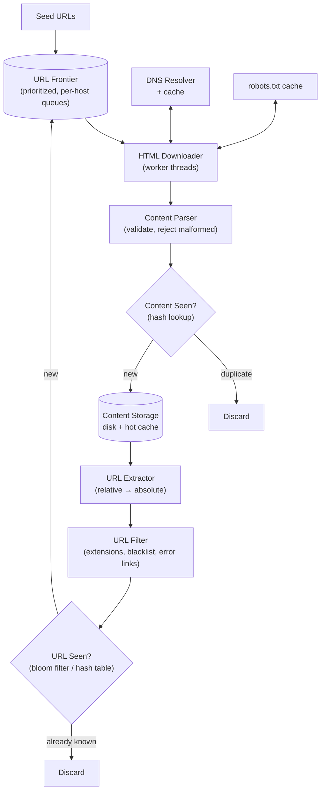
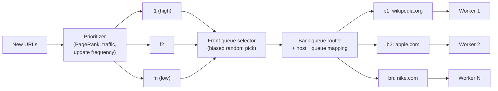

## Overview

The basic algorithm of a web crawler fits in three lines: download the pages at a set of URLs, extract the links from them, add the new links to the set, repeat. That description is also why it's such a good interview probe — the naive version is trivially correct and completely unbuildable at scale. The design work is entirely in the constraints wrapped around the loop: not hammering any single host into the ground (**politeness**), revisiting pages that change without re-downloading the whole web (**freshness**), surviving hostile and broken input (**robustness**), and adding a new content type without redesigning the pipeline (**extensibility**). Those constraints turn a graph traversal into a distributed system with a queue architecture, a dedup layer, a DNS cache, and durable crawl state.

## Requirements and Scope

Scope the prompt before designing. A crawler for search-engine indexing is a different machine than one for copyright monitoring or web archiving, and the answer changes what the pipeline stores and how often it revisits. A representative scope:

- **Purpose**: search engine indexing — the crawl feeds an index, so coverage and freshness both matter.
- **Volume**: 1 billion pages per month.
- **Content types**: HTML only *for now*, with the explicit requirement that adding PDFs or images later is a plug-in, not a rewrite.
- **Freshness**: newly added and edited pages must be picked up, which means recrawl, not a one-shot traversal.
- **Retention**: crawled HTML stored for 5 years.
- **Dedup**: pages with duplicate content are ignored — the same content served under many URLs is stored once.

The non-functional properties worth naming out loud, because each one drives a specific component:

- **Scalability** — the web is billions of pages; crawling must parallelize across machines and threads.
- **Robustness** — bad HTML, unresponsive servers, redirect loops, and deliberately hostile pages are the normal case, not the exception.
- **Politeness** — one host must never see the crawler's full parallelism aimed at it.
- **Extensibility** — new downloaders and analyzers plug into the pipeline.

### Back-of-the-envelope

1B pages / 30 days / 86,400 s ≈ **400 pages per second** sustained, so budget **~800/s peak**. At an average page size of 500 KB, that's 1B × 500 KB = **500 TB per month**, and at 5-year retention, 500 TB × 12 × 5 = **30 PB** of content storage. Those two numbers immediately rule out anything in-memory for content and force object storage plus a hot cache — and 400 fetches per second spread politely across hosts means the crawler is talking to a very large number of distinct hosts concurrently, which is the real source of the concurrency design.

## High-Level Design

The pipeline is a loop with a queue at its center. URLs come out of the frontier, pages come back, and the links inside those pages feed the frontier again:

Each box earns its place:

- **Seed URLs** bootstrap the traversal. For a single site, the domain root is enough; for the whole web, seeds are chosen to maximize reachable link space — partitioned by locality (different countries have different popular sites) or by topic (shopping, sports, healthcare). There's no single right answer, and the interviewer isn't looking for one.
- **URL Frontier** holds the "to be downloaded" half of crawl state. The "already downloaded" half lives in URL Storage. Splitting crawl state this way is what makes the crawl resumable.
- **HTML Downloader** is the only component that talks to the outside world. It fetches over HTTP, respects `robots.txt`, and enforces timeouts.
- **DNS Resolver** turns hostnames into IPs — and, as covered below, is a first-class bottleneck rather than an implementation detail.
- **Content Parser** validates and normalizes HTML. It's a separate component because parsing inside the crawl worker would tie up a thread that should be doing network I/O; separating them lets each scale on its own resource profile.
- **Content Seen?** rejects duplicate content by hash before it hits storage.
- **Content Storage** keeps the HTML: mostly on disk (30 PB doesn't fit in memory), with popular content cached in memory.
- **URL Extractor** pulls out `<a href>` targets and resolves relative paths against the page's base URL.
- **URL Filter** drops excluded file extensions, known error links, and blacklisted hosts before they cost anything downstream.
- **URL Seen?** prevents re-enqueueing a URL already visited or already in the frontier — without it, the crawl loops forever on cyclic link structures.

## Why BFS, and Why Plain BFS Isn't Enough

Model the web as a directed graph: pages are nodes, hyperlinks are edges. DFS is a poor fit because the depth of the web is effectively unbounded — a depth-first crawl disappears into one corner of one site and never comes back. BFS via a FIFO queue is the standard choice, but a single global FIFO breaks in two specific ways:

1. **Host clustering.** Most links on a page point back into the same host. A single FIFO queue drained by N parallel workers ends up with all N workers hitting `wikipedia.org` simultaneously — which is impolite at best and indistinguishable from a DoS attack at worst.
2. **No notion of importance.** A FIFO treats a forum post about an Apple product and Apple's home page as equals. Not every page deserves the same crawl budget or the same recrawl frequency.

The URL frontier exists to fix both.

## The URL Frontier Deep Dive

The frontier is not "a queue" — it's **two layers of queues**, front queues for prioritization and back queues for politeness, with a router between them. This is the same architectural instinct described in [Message Brokers: Queues vs. Log-Based Streaming](message-brokers-queues-vs-logs): the queue isn't incidental plumbing, it's where ordering policy, backpressure, and work distribution are actually expressed.

**Politeness** is enforced structurally, not by a runtime check. Each back queue `b1..bn` contains URLs from exactly one host, and each worker thread is bound to exactly one back queue. Because a worker downloads one page at a time from its queue with a configurable delay between fetches, the *maximum* concurrency any single host can experience is one thread — no matter how many thousands of workers the crawl runs in total. A mapping table (`host → queue`) keeps the invariant.

That per-host pacing is a rate limiter, and the algorithms in [Rate Limiting](rate-limiting) apply directly: a fixed delay between fetches is the crude version, while a per-host token bucket lets the crawler absorb a short burst on a large fast site and then settle back to a sustainable rate, which is both politer and faster in aggregate. The difference from an API rate limiter is who benefits — here the crawler is throttling *itself* to protect someone else's infrastructure, and the budget should be informed by observed host behavior (response times, 429s, `Crawl-delay` hints) rather than a single global constant.

**Priority** is handled by the front queues. A prioritizer scores each URL by usefulness — PageRank, measured traffic, historical update frequency — and drops it into one of `f1..fn`, each with an assigned priority. The queue selector picks randomly but biased toward high-priority queues, so important pages get crawled sooner and more often without starving the tail entirely.

**Freshness** is a recrawl policy layered on the same machinery. Recrawling all 1B pages on a fixed schedule burns the entire crawl budget on pages that never change; instead, recrawl intervals are derived from each page's observed update history, and high-priority pages are revisited more frequently. This makes the crawl look much more like a continuously running [batch pipeline](batch-processing-in-distributed-systems) over a set of URLs with per-item schedules than a one-shot traversal that terminates.

**Storage for the frontier** is a hybrid. Hundreds of millions of URLs won't fit in memory and shouldn't — losing the frontier means losing the crawl. But keeping it purely on disk makes enqueue/dequeue the crawl's bottleneck. The standard answer: URLs live on disk, with in-memory buffers on both ends of each queue, flushed to disk periodically.

## Content Deduplication by Hashing

Roughly 29% of the web is duplicate content — mirrors, syndication, print views, URLs that differ only by tracking parameters. Comparing documents byte-by-byte is out of the question at a billion pages a month, so the "Content Seen?" component compares **hashes**: compute a digest (a checksum or a Rabin fingerprint) of the normalized page body and look it up in a hash set of digests already stored. A hit means the same content arrived under a different URL and the page is discarded before it consumes storage or generates another round of link extraction.

The URL-level analogue is "URL Seen?", typically a **bloom filter** in front of a hash table. A bloom filter answers "definitely not seen" or "probably seen" in constant time and a few bits per URL, which is what makes tracking billions of URLs feasible in memory. The false-positive direction is the safe one for a crawler: occasionally skipping a URL that was never actually crawled costs a little coverage, whereas a false negative would cost correctness (infinite re-enqueueing).

## DNS Resolution as a Bottleneck

DNS looks like a solved problem until you're doing 400+ fetches per second across a long tail of distinct hosts. Resolution takes 10–200 ms, and many DNS client interfaces are synchronous — a thread that issues a lookup blocks, and with a shared resolver, other threads queue behind it. At crawler scale, DNS is routinely the single largest source of fetch latency.

The fixes are ordinary and effective: maintain a **local DNS cache** mapping hostname to IP, refreshed on a schedule by a background job rather than lazily on the request path; use an asynchronous or multi-threaded resolver so a slow lookup doesn't block unrelated work; and honor TTLs loosely enough that a hot host isn't re-resolved on every fetch. This pairs with two other locality optimizations: distribute crawl servers geographically so they're near the hosts they crawl, and partition the URL space across those servers (consistent hashing, so a downloader can join or leave without reshuffling the whole assignment).

Also on the downloader: **short timeouts**. Some servers respond in 30 seconds; some never respond. A maximum wait time, after which the worker abandons the fetch and moves on, is what keeps one pathological host from consuming a worker indefinitely.

## Robots.txt

Before crawling a host, the downloader fetches and honors its `/robots.txt` — the Robots Exclusion Protocol, standardized in RFC 9309. It declares which paths a given user agent may fetch. Refetching it for every URL would multiply request volume against exactly the hosts the crawler is trying to be polite to, so the parsed rules are **cached per host** and refreshed periodically, on the same cadence as the DNS cache. Treat a failure to fetch `robots.txt` conservatively: a 5xx should mean "back off", not "assume everything is allowed".

## Robustness

A crawler's input is the open web, which means the input is adversarial, malformed, and unreliable by default. Every failure mode described in [The Trouble with Distributed Systems](distributed-systems-partial-failures) shows up here, plus a category that mostly doesn't exist inside your own datacenter: content that is *deliberately* designed to break you.

- **Spider traps.** A page (or a generated directory structure like `/foo/bar/foo/bar/...`) that produces infinite unique URLs, each linking to more. There's no general algorithm to detect them. Practical defenses: cap maximum URL length, cap crawl depth and per-host page counts, and flag hosts whose discovered-URL count is wildly out of line with their apparent size for manual review and custom filters.
- **Malicious and low-value content.** Spam farms, cloaked pages, ad-only pages, and generated junk consume crawl budget and pollute the index. An anti-spam classifier in front of storage is a separate subsystem, but the hook belongs in the pipeline from the start.
- **Server crashes and partial failures — including your own.** Downloader nodes will die mid-fetch. Because a crawl runs for weeks, "restart from scratch on failure" is not an option: crawl state (frontier contents, URL-seen structures, in-flight assignments) must be checkpointed to durable storage so a disrupted crawl resumes from the last checkpoint. Consistent hashing over the downloader pool means losing a node redistributes only its share of the URL space rather than reshuffling everything.
- **Exception handling and data validation everywhere.** Malformed HTML, wrong `Content-Type`, truncated responses, and redirect loops are routine. Every one of them must produce a logged, skipped URL — never a crashed worker. The content parser exists partly so that a parse failure is contained in a component that can be restarted cheaply.

Note the timing subtlety: a downloader that hangs (GC pause, network partition) may be treated as dead and have its URLs reassigned, then wake up and finish its fetches. For a crawler this is benign — the worst case is a duplicate download, caught by the "Content Seen?" hash — which is exactly why crawls tolerate at-least-once semantics that would be unacceptable in a payment system.

## Extensibility

The pipeline's value is that new behavior arrives as a **plug-in module** at a defined point rather than as a redesign. A PNG downloader registers as another downloader type keyed off content type; a web monitor module subscribes to the parsed-content stream to look for copyright or trademark infringements; a server-side rendering step slots in between download and parse for JavaScript-generated pages whose links don't exist in the raw HTML. Each of these consumes an existing stage's output and produces into an existing stage's input, which only works because the stages are decoupled through queues in the first place.

## Trade-offs

- **BFS with a single global FIFO is simple and correct but impolite by construction** — the queue's ordering guarantees nothing about host distribution, so parallelism concentrates on whichever host the current wavefront came from. The two-layer frontier trades a much more complex data structure for a structural politeness guarantee that doesn't depend on runtime checks.
- **One worker thread per host bounds per-host load, but caps throughput on large hosts** — a site with millions of pages is drained by exactly one thread. Raising the per-host concurrency, or lowering the inter-fetch delay for hosts that demonstrably tolerate it, recovers throughput at the cost of a politeness guarantee that's now empirical rather than structural.
- **A bloom filter for "URL Seen?" buys constant-time membership at a few bits per URL, at the price of false positives** — some fraction of never-crawled URLs are silently skipped forever. That's an acceptable coverage loss for a web-scale crawl and an unacceptable one for a crawl that must be exhaustive over a known site, where an exact hash table (or a per-host bloom filter with a much lower error rate) is the right call.
- **Hashing content for dedup catches exact duplicates cheaply but misses near-duplicates** — a page differing only in an ad slot or a timestamp hashes differently and gets stored again. Similarity hashing (simhash/minhash) catches those, but costs more per page and introduces a threshold that can discard genuinely distinct pages.
- **Storing the frontier on disk with memory buffers makes the crawl durable and unbounded in size, but adds a flush window where enqueued URLs can be lost** — a crash between flushes loses recently discovered links. That's usually fine (they'll be rediscovered on the next crawl of the linking page) and would not be fine if the crawl had a completeness SLA.
- **Prioritizing by PageRank and traffic improves the value of what's crawled first, but entrenches what's already popular** — new and low-traffic pages sit in the low-priority queues and may be discovered slowly, which is precisely why the queue selector picks randomly with a bias rather than draining high-priority queues to empty.

## Interview Questions

- A single global FIFO frontier and a per-host-queue frontier both perform BFS. What specifically breaks in the first design at 800 fetches per second, and why can't it be fixed by just adding more worker threads?
- The "URL Seen?" bloom filter can produce false positives but not false negatives. Which of those two error directions would be catastrophic for a crawler, and why does that asymmetry make a bloom filter the right choice?
- DNS resolution is 10–200 ms and the crawler needs 400 pages per second. Explain why adding more downloader threads doesn't solve this, and what does.
- The crawler discovers 40 million URLs on a single host in an hour. What signals distinguish a legitimately huge site from a spider trap, and what do you do when you can't tell them apart?
- A downloader node pauses for 90 seconds, its assigned URLs are reassigned to another node, and then it wakes up and completes its fetches. Why is this acceptable for a crawler, and which component absorbs the resulting duplicate work?

## References

- [Alex Xu, "System Design Interview – An Insider's Guide, Volume 1" (ByteByteGo, 2020) — Chapter 9, "Design A Web Crawler"](https://bytebytego.com)
- [Allan Heydon and Marc Najork, "Mercator: A Scalable, Extensible Web Crawler" — World Wide Web 2(4), 1999](https://link.springer.com/article/10.1023/A:1019213109274)
- [Christopher Olston and Marc Najork, "Web Crawling" — Foundations and Trends in Information Retrieval 4(3), 2010](https://www.nowpublishers.com/article/Details/INR-017)
- [IETF, "RFC 9309 — Robots Exclusion Protocol"](https://www.rfc-editor.org/rfc/rfc9309.html)
