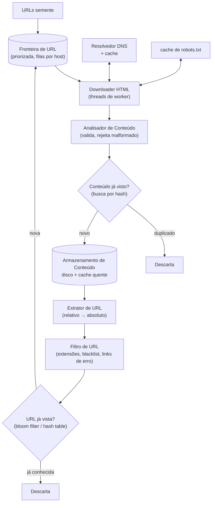
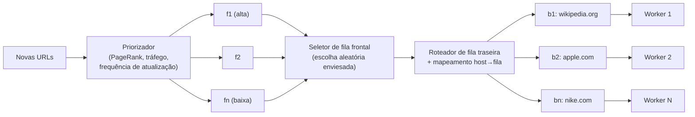

## Visão Geral

O algoritmo básico de um web crawler cabe em três linhas: baixe as páginas em um conjunto de URLs, extraia os links delas, adicione os novos links ao conjunto, repita. Essa descrição também é por que é uma boa sondagem de entrevista — a versão ingênua é trivialmente correta e completamente impossível de construir em escala. O trabalho de design está inteiramente nas restrições enroladas em torno do loop: não martelar nenhum host único até o chão (**educação/politeness**), revisitar páginas que mudam sem baixar a web inteira de novo (**frescor**), sobreviver a entrada hostil e quebrada (**robustez**), e adicionar um novo tipo de conteúdo sem redesenhar o pipeline (**extensibilidade**). Essas restrições transformam uma travessia de grafo em um sistema distribuído com uma arquitetura de filas, uma camada de dedup, um cache de DNS, e estado de crawl durável.

## Requisitos e Escopo

Delimite o prompt antes de projetar. Um crawler para indexação de motor de busca é uma máquina diferente de um para monitoramento de direitos autorais ou arquivamento web, e a resposta muda o que o pipeline armazena e com que frequência revisita. Um escopo representativo:

- **Propósito**: indexação de motor de busca — o crawl alimenta um índice, então cobertura e frescor importam.
- **Volume**: 1 bilhão de páginas por mês.
- **Tipos de conteúdo**: apenas HTML *por enquanto*, com o requisito explícito de que adicionar PDFs ou imagens depois é um plug-in, não uma reescrita.
- **Frescor**: páginas recém-adicionadas e editadas precisam ser detectadas, o que significa recrawl, não uma travessia única.
- **Retenção**: HTML rastreado armazenado por 5 anos.
- **Dedup**: páginas com conteúdo duplicado são ignoradas — o mesmo conteúdo servido sob muitas URLs é armazenado uma vez.

As propriedades não funcionais que vale a pena nomear em voz alta, porque cada uma conduz um componente específico:

- **Escalabilidade** — a web tem bilhões de páginas; o crawl precisa paralelizar entre máquinas e threads.
- **Robustez** — HTML ruim, servidores sem resposta, loops de redirecionamento, e páginas deliberadamente hostis são o caso normal, não a exceção.
- **Educação (politeness)** — um host nunca deve ver todo o paralelismo do crawler direcionado a ele.
- **Extensibilidade** — novos downloaders e analisadores se conectam ao pipeline.

### Estimativa de cabeça

1 bilhão de páginas / 30 dias / 86.400 s ≈ **400 páginas por segundo** sustentado, então orce **~800/s no pico**. Com um tamanho médio de página de 500 KB, isso é 1B × 500 KB = **500 TB por mês**, e com retenção de 5 anos, 500 TB × 12 × 5 = **30 PB** de armazenamento de conteúdo. Esses dois números imediatamente descartam qualquer coisa em memória para o conteúdo e forçam armazenamento de objetos mais um cache quente — e 400 buscas por segundo espalhadas educadamente entre hosts significa que o crawler está conversando com um número muito grande de hosts distintos simultaneamente, que é a fonte real do design de concorrência.

## Design de Alto Nível

O pipeline é um loop com uma fila em seu centro. URLs saem da fronteira, páginas voltam, e os links dentro dessas páginas alimentam a fronteira de novo:

Cada caixa ganha seu lugar:

- **URLs semente** inicializam a travessia. Para um único site, a raiz do domínio é suficiente; para a web inteira, sementes são escolhidas para maximizar o espaço de links alcançável — particionadas por localidade (países diferentes têm sites populares diferentes) ou por tópico (compras, esportes, saúde). Não há uma única resposta certa, e o entrevistador não está procurando uma.
- **Fronteira de URL** guarda a metade "a ser baixada" do estado do crawl. A metade "já baixada" vive no Armazenamento de URL. Dividir o estado do crawl dessa forma é o que torna o crawl retomável.
- **Downloader HTML** é o único componente que conversa com o mundo externo. Ele busca via HTTP, respeita o `robots.txt`, e aplica timeouts.
- **Resolvedor DNS** transforma nomes de host em IPs — e, como coberto abaixo, é um gargalo de primeira classe em vez de um detalhe de implementação.
- **Analisador de Conteúdo** valida e normaliza HTML. É um componente separado porque analisar dentro do worker de crawl amarraria uma thread que deveria estar fazendo I/O de rede; separá-los permite que cada um escale de acordo com seu próprio perfil de recursos.
- **Conteúdo já visto?** rejeita conteúdo duplicado por hash antes de chegar ao armazenamento.
- **Armazenamento de Conteúdo** guarda o HTML: majoritariamente em disco (30 PB não cabe em memória), com conteúdo popular cacheado em memória.
- **Extrator de URL** puxa os alvos de `<a href>` e resolve caminhos relativos contra a URL base da página.
- **Filtro de URL** descarta extensões de arquivo excluídas, links de erro conhecidos, e hosts em blacklist antes que custem qualquer coisa a jusante.
- **URL já vista?** impede reenfileirar uma URL já visitada ou já na fronteira — sem ele, o crawl entra em loop para sempre em estruturas de link cíclicas.

## Por Que BFS, e Por Que BFS Simples Não É Suficiente

Modele a web como um grafo direcionado: páginas são nós, hiperlinks são arestas. DFS é uma escolha ruim porque a profundidade da web é efetivamente ilimitada — um crawl em profundidade desaparece em um canto de um site e nunca volta. BFS via uma fila FIFO é a escolha padrão, mas uma única fila FIFO global quebra de duas formas específicas:

1. **Agrupamento por host.** A maioria dos links em uma página aponta de volta para o mesmo host. Uma única fila FIFO drenada por N workers paralelos acaba com todos os N workers atingindo `wikipedia.org` simultaneamente — o que é impolido na melhor das hipóteses e indistinguível de um ataque DoS na pior.
2. **Nenhuma noção de importância.** Uma FIFO trata um post de fórum sobre um produto Apple e a home page da Apple como iguais. Nem toda página merece o mesmo orçamento de crawl ou a mesma frequência de recrawl.

A fronteira de URL existe para corrigir ambos.

## Aprofundando na Fronteira de URL

A fronteira não é "uma fila" — são **duas camadas de filas**, filas frontais para priorização e filas traseiras para educação, com um roteador entre elas. Esse é o mesmo instinto arquitetural descrito em [Message Brokers: Queues vs. Log-Based Streaming](message-brokers-queues-vs-logs): a fila não é encanamento incidental, é onde política de ordenação, backpressure, e distribuição de trabalho são realmente expressas.

**Educação (politeness)** é aplicada estruturalmente, não por uma verificação em tempo de execução. Cada fila traseira `b1..bn` contém URLs de exatamente um host, e cada thread de worker é vinculada a exatamente uma fila traseira. Como um worker baixa uma página por vez de sua fila com um atraso configurável entre buscas, a concorrência *máxima* que qualquer host único pode experimentar é uma thread — não importa quantos milhares de workers o crawl rode no total. Uma tabela de mapeamento (`host → fila`) mantém o invariante.

Essa pacing por host é um rate limiter, e os algoritmos em [Rate Limiting](rate-limiting) se aplicam diretamente: um atraso fixo entre buscas é a versão crua, enquanto um token bucket por host permite que o crawler absorva uma rajada curta em um site grande e rápido e então se acomode de volta a uma taxa sustentável, o que é tanto mais educado quanto mais rápido em agregado. A diferença de um rate limiter de API é quem se beneficia — aqui o crawler está limitando a si mesmo para proteger a infraestrutura de outra pessoa, e o orçamento deveria ser informado pelo comportamento observado do host (tempos de resposta, 429s, dicas de `Crawl-delay`) em vez de uma única constante global.

**Prioridade** é tratada pelas filas frontais. Um priorizador pontua cada URL por utilidade — PageRank, tráfego medido, frequência histórica de atualização — e a coloca em uma de `f1..fn`, cada uma com uma prioridade atribuída. O seletor de fila escolhe aleatoriamente mas enviesado em direção a filas de alta prioridade, então páginas importantes são rastreadas mais cedo e com mais frequência sem esfomear totalmente a cauda.

**Frescor** é uma política de recrawl em camada sobre a mesma maquinaria. Recrawlear todas as 1B páginas em um cronograma fixo queima todo o orçamento de crawl em páginas que nunca mudam; em vez disso, intervalos de recrawl são derivados do histórico de atualização observado de cada página, e páginas de alta prioridade são revisitadas com mais frequência. Isso faz o crawl parecer muito mais com um [pipeline em batch](batch-processing-in-distributed-systems) continuamente em execução sobre um conjunto de URLs com cronogramas por item do que uma travessia única que termina.

**Armazenamento para a fronteira** é um híbrido. Centenas de milhões de URLs não cabem em memória e não deveriam — perder a fronteira significa perder o crawl. Mas manter apenas em disco torna enfileirar/desenfileirar o gargalo do crawl. A resposta padrão: URLs vivem em disco, com buffers em memória em ambas as pontas de cada fila, liberados para disco periodicamente.

## Deduplicação de Conteúdo por Hashing

Aproximadamente 29% da web é conteúdo duplicado — espelhos, sindicação, visualizações de impressão, URLs que diferem apenas por parâmetros de rastreamento. Comparar documentos byte a byte está fora de questão em um bilhão de páginas por mês, então o componente "Conteúdo já visto?" compara **hashes**: computa um digest (um checksum ou uma impressão digital de Rabin) do corpo da página normalizado e o busca em um conjunto de hash de digests já armazenados. Um acerto significa que o mesmo conteúdo chegou sob uma URL diferente e a página é descartada antes de consumir armazenamento ou gerar outra rodada de extração de links.

O análogo em nível de URL é "URL já vista?", tipicamente um **bloom filter** na frente de uma hash table. Um bloom filter responde "definitivamente não vista" ou "provavelmente vista" em tempo constante e alguns bits por URL, que é o que torna viável rastrear bilhões de URLs em memória. A direção de falso positivo é a segura para um crawler: ocasionalmente pular uma URL que nunca foi de fato rastreada custa um pouco de cobertura, enquanto um falso negativo custaria correção (reenfileiramento infinito).

## Resolução de DNS como Gargalo

DNS parece um problema resolvido até você fazer 400+ buscas por segundo através de uma longa cauda de hosts distintos. A resolução leva 10–200 ms, e muitas interfaces de cliente DNS são síncronas — uma thread que emite uma busca bloqueia, e com um resolvedor compartilhado, outras threads enfileiram atrás dela. Em escala de crawler, DNS é rotineiramente a maior fonte única de latência de busca.

As correções são comuns e eficazes: manter um **cache DNS local** mapeando hostname para IP, atualizado em um cronograma por um job em segundo plano em vez de preguiçosamente no caminho da requisição; usar um resolvedor assíncrono ou multi-thread para que uma busca lenta não bloqueie trabalho não relacionado; e honrar TTLs de forma frouxa o suficiente para que um host quente não seja re-resolvido a cada busca. Isso combina com duas outras otimizações de localidade: distribuir servidores de crawl geograficamente para que fiquem perto dos hosts que rastreiam, e particionar o espaço de URL entre esses servidores (hash consistente, para que um downloader possa entrar ou sair sem reembaralhar toda a atribuição).

Também no downloader: **timeouts curtos**. Alguns servidores respondem em 30 segundos; alguns nunca respondem. Um tempo máximo de espera, após o qual o worker abandona a busca e segue em frente, é o que impede um host patológico de consumir um worker indefinidamente.

## Robots.txt

Antes de rastrear um host, o downloader busca e honra seu `/robots.txt` — o Robots Exclusion Protocol, padronizado na RFC 9309. Ele declara quais caminhos um determinado user agent pode buscar. Rebuscá-lo para cada URL multiplicaria o volume de requisições exatamente contra os hosts que o crawler está tentando ser educado — então as regras analisadas são **cacheadas por host** e atualizadas periodicamente, no mesmo ritmo que o cache de DNS. Trate uma falha ao buscar `robots.txt` de forma conservadora: um 5xx deveria significar "recue," não "assuma que tudo é permitido".

## Robustez

A entrada de um crawler é a web aberta, o que significa que a entrada é adversária, malformada, e não confiável por padrão. Todo modo de falha descrito em [The Trouble with Distributed Systems](distributed-systems-partial-failures) aparece aqui, mais uma categoria que majoritariamente não existe dentro do seu próprio datacenter: conteúdo que é *deliberadamente* projetado para quebrar você.

- **Armadilhas de spider.** Uma página (ou uma estrutura de diretório gerada como `/foo/bar/foo/bar/...`) que produz URLs únicas infinitas, cada uma linkando para mais. Não há algoritmo geral para detectá-las. Defesas práticas: limitar o comprimento máximo de URL, limitar profundidade de crawl e contagens de páginas por host, e sinalizar hosts cuja contagem de URLs descobertas está muito fora de linha com seu tamanho aparente para revisão manual e filtros customizados.
- **Conteúdo malicioso e de baixo valor.** Fazendas de spam, páginas mascaradas, páginas só-anúncio, e lixo gerado consomem orçamento de crawl e poluem o índice. Um classificador anti-spam na frente do armazenamento é um subsistema separado, mas o gancho pertence ao pipeline desde o início.
- **Falhas de servidor e falhas parciais — incluindo as suas próprias.** Nós downloader vão morrer no meio de uma busca. Como um crawl roda por semanas, "reiniciar do zero em caso de falha" não é uma opção: o estado do crawl (conteúdo da fronteira, estruturas de URL já vistas, atribuições em andamento) precisa ser checkpointado em armazenamento durável para que um crawl interrompido retome do último checkpoint. Hash consistente sobre o pool de downloaders significa que perder um nó redistribui apenas sua parcela do espaço de URL em vez de reembaralhar tudo.
- **Tratamento de exceção e validação de dados em todo lugar.** HTML malformado, `Content-Type` errado, respostas truncadas, e loops de redirecionamento são rotina. Cada um deles precisa produzir uma URL logada e pulada — nunca um worker que cai. O analisador de conteúdo existe em parte para que uma falha de análise seja contida em um componente que pode ser reiniciado de forma barata.

Note a sutileza de tempo: um downloader que trava (pausa de GC, partição de rede) pode ser tratado como morto e ter suas URLs reatribuídas, depois acordar e terminar suas buscas. Para um crawler isso é benigno — o pior caso é um download duplicado, capturado pelo hash de "Conteúdo já visto?" — que é exatamente por que crawls toleram semântica de pelo menos uma vez que seria inaceitável em um sistema de pagamentos.

## Extensibilidade

O valor do pipeline é que novo comportamento chega como um **módulo plug-in** em um ponto definido em vez de como um redesign. Um downloader de PNG se registra como outro tipo de downloader chaveado pelo tipo de conteúdo; um módulo de monitoramento web assina o stream de conteúdo analisado para procurar violações de direitos autorais ou marca registrada; um passo de renderização server-side se encaixa entre download e análise para páginas geradas por JavaScript cujos links não existem no HTML bruto. Cada um desses consome a saída de um estágio existente e produz para a entrada de um estágio existente, o que só funciona porque os estágios são desacoplados através de filas desde o início.

## Trade-offs

- **BFS com uma única fila FIFO global é simples e correto mas impolido por construção** — as garantias de ordenação da fila não dizem nada sobre distribuição por host, então o paralelismo se concentra em qualquer host de onde veio a frente de onda atual. A fronteira de duas camadas troca por uma estrutura de dados muito mais complexa uma garantia estrutural de educação que não depende de verificações em tempo de execução.
- **Uma thread de worker por host limita a carga por host, mas limita o throughput em hosts grandes** — um site com milhões de páginas é drenado por exatamente uma thread. Aumentar a concorrência por host, ou diminuir o atraso entre buscas para hosts que demonstravelmente toleram isso, recupera throughput ao custo de uma garantia de educação que agora é empírica em vez de estrutural.
- **Um bloom filter para "URL já vista?" compra pertencimento em tempo constante a alguns bits por URL, ao preço de falsos positivos** — alguma fração de URLs nunca rastreadas é silenciosamente pulada para sempre. Essa é uma perda de cobertura aceitável para um crawl em escala web e uma inaceitável para um crawl que precisa ser exaustivo sobre um site conhecido, onde uma hash table exata (ou um bloom filter por host com uma taxa de erro muito menor) é a escolha certa.
- **Hashing de conteúdo para dedup captura duplicatas exatas de forma barata mas perde quase-duplicatas** — uma página diferindo apenas por um slot de anúncio ou um timestamp gera um hash diferente e é armazenada de novo. Hashing de similaridade (simhash/minhash) captura essas, mas custa mais por página e introduz um limiar que pode descartar páginas genuinamente distintas.
- **Armazenar a fronteira em disco com buffers de memória torna o crawl durável e ilimitado em tamanho, mas adiciona uma janela de flush onde URLs enfileiradas podem ser perdidas** — uma queda entre flushes perde links recém-descobertos. Isso geralmente é aceitável (serão redescobertos no próximo crawl da página que linka) e não seria aceitável se o crawl tivesse um SLA de completude.
- **Priorizar por PageRank e tráfego melhora o valor do que é rastreado primeiro, mas entrincheira o que já é popular** — páginas novas e de baixo tráfego ficam nas filas de baixa prioridade e podem ser descobertas lentamente, que é precisamente por que o seletor de fila escolhe aleatoriamente com um viés em vez de drenar filas de alta prioridade até o esgotamento.

## Perguntas de Entrevista

- Uma única fronteira FIFO global e uma fronteira com filas por host ambas fazem BFS. O que especificamente quebra no primeiro design a 800 buscas por segundo, e por que isso não pode ser corrigido apenas adicionando mais threads de worker?
- O bloom filter "URL já vista?" pode produzir falsos positivos mas não falsos negativos. Qual dessas duas direções de erro seria catastrófica para um crawler, e por que essa assimetria torna um bloom filter a escolha certa?
- A resolução de DNS leva 10–200 ms e o crawler precisa de 400 páginas por segundo. Explique por que adicionar mais threads de downloader não resolve isso, e o que resolve.
- O crawler descobre 40 milhões de URLs em um único host em uma hora. Quais sinais distinguem um site legitimamente enorme de uma armadilha de spider, e o que você faz quando não consegue distinguir?
- Um nó downloader pausa por 90 segundos, suas URLs atribuídas são reatribuídas a outro nó, e então ele acorda e completa suas buscas. Por que isso é aceitável para um crawler, e qual componente absorve o trabalho duplicado resultante?

## Referências

- [Alex Xu, "System Design Interview – An Insider's Guide, Volume 1" (ByteByteGo, 2020) — Capítulo 9, "Design A Web Crawler"](https://bytebytego.com)
- [Allan Heydon e Marc Najork, "Mercator: A Scalable, Extensible Web Crawler" — World Wide Web 2(4), 1999](https://link.springer.com/article/10.1023/A:1019213109274)
- [Christopher Olston e Marc Najork, "Web Crawling" — Foundations and Trends in Information Retrieval 4(3), 2010](https://www.nowpublishers.com/article/Details/INR-017)
- [IETF, "RFC 9309 — Robots Exclusion Protocol"](https://www.rfc-editor.org/rfc/rfc9309.html)
